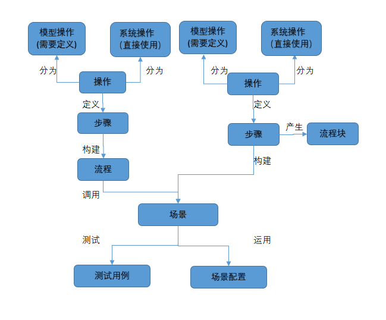
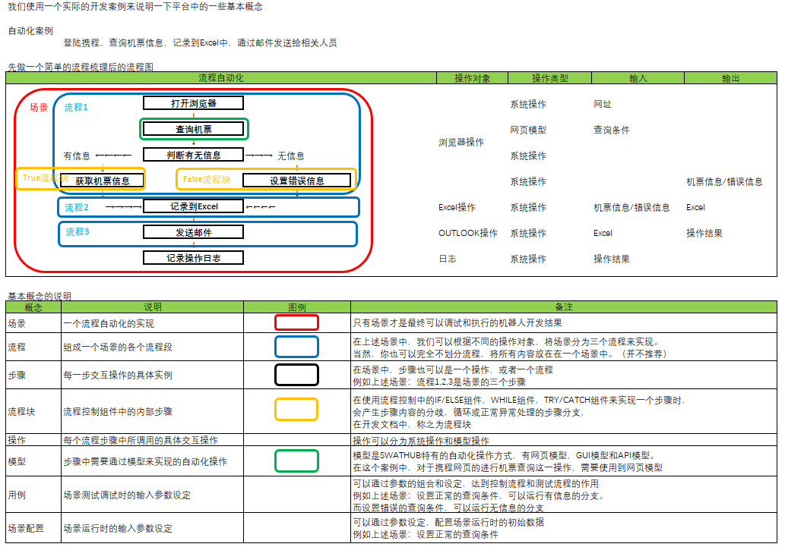
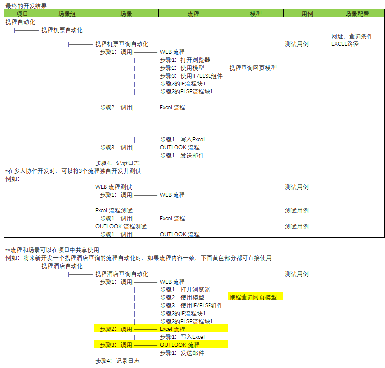

基本概念
===

在包括SWATHub在内的各种自动化平台中，自动化流程都是自动化中的核心，SWATHub中通常会按照以下步骤来搭建自动化流程。

1. 确定自动化所需的**操作**及其所属类型。如果涉及特定应用程序所需的**模型操作**，需要通过构建应用模型来定义该操作。
1. 使用各类**模型操作**或**系统操作**来定义**步骤**。最终完成**流程**或**场景**的搭建。
1. 当需要调试流程，或者进行自动化测试时，根据**场景**所需的数据，定义相应的**用例**。
1. 当需要将场景发布运行时，根据**场景**所需的数据，定义相应的**场景配置**。

以下其中出现的的几个基本概念的说明。

操作
---

SWATHub中操作是指每个流程步骤中所调用的具体交互操作。根据交互操作的类型，操作可以进一步划分为：

* 模型操作1：设计者对所需要进行操作的应用进行建模后所定义的的交互操作。根据不同的应用构架可以如下细分：
  * Web模型操作：定义对浏览器的HTML DOM进行交互操作。
  * APP模型操作：定义对手机APP界面进行的交互操作。
  * GUI模型操作：定义对图形化界面进行的交互操作。
  * API模型操作：定义对Web Service进行的交互操作。
* 系统操作：SWATHub提供的对浏览器，操作系统，应用程序等进行的操作。

?> 1. 四种模型操作是用户通过对实际应用进行建模来定义的操作。关于各种模型操作和系统操作请参见相关的开发文档。

步骤
---

流程步骤是流程或场景中每一步交互操作的具体实例，这个交互操作可以是之前讲的模型操作和系统操作，也可以是对一个流程的调用。

每一个步骤包含了以下几个元素：

* 组件：步骤所关联的操作或所调用的流程信息，每个步骤在定义时都是需要通过拖拉特定操作或流程来关联组件的。
* 数据：步骤运行所需的输入参数，以及运行后的输出参数。
* 运行设置和标题：除了数据外，每一个流程步骤上还可以定义[运行中的行为设置](flow_step_option)和一个标题。

流程
---

流程是对某个业务的操作过程或测试的操作过程的交互自动化流程的定义。
它无法直接被执行，但可以被场景和其他流程调用。

每一个流程包含了以下几个元素：

* 输入输出参数：流程运行所需的输入参数，以及运行后的输出参数。
* 流程步骤的序列：整个流程中顺序运行的交互操作的流程步骤。

除了普通的流程以外，还有一种特殊的流程被称为流程块，其是系统操作中某些[流程控制](sop_control)组件的内部步骤。在使用流程控制中的IF/ELSE组件，WHILE组件，TRY/CATCH组件来实现一个步骤时，会产生步骤内容的分歧，循环或正常异常处理的步骤分支。

场景
---

场景的定义和流程类似，但是只有场景才是最终可以被调试，测试，运行的流程自动化实现1。

每一个流程包含了以下几个元素：

* 输入输出参数：流程运行所需的输入参数，以及运行后的输出参数。
* 场景步骤的序列：整个流程中顺序运行的交互操作的流程步骤。

?> 1. 场景的运行除了所需的流程定义以外，还需要对场景中定义的输入参数提供外部数据源，比如测试或调试中的用例，部署中的场景配置。

用例和场景配置
---

用例是以测试或调试为目的的交互自动化流程运行所需的外部数据。用例的数据仅在SWATHub机器人在线设计运行时可以使用。当场景是部署在机器人上独立运行时，则无需使用用例，而使用同时部署的场景配置文件作为输入数据源。

实例说明
---

