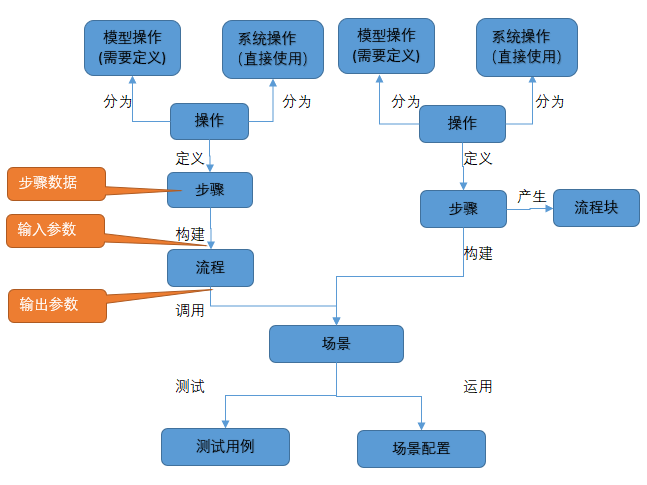

流程数据
===

流程的数据主要分为

* 输入数据：由流程或场景的输入参数定义的一组数据，来源于外部的数据源，例如用例。
* 输出数据：由流程或场景的输出参数定义的一组数据。
* 步骤数据：流程的各个步骤的参数中所使用到的数据。



流程参数
---

流程的参数分为输入参数和输出参数。

### 输入参数

输入参数是流程中所需外部给予的数据，其包括在流程的步骤数据中通过`@{变量名}`<sup>1</sup>的方式声明的局部可见变量，和显式定义的流程的输入参数。后者在流程中同样可以作为变量进行使用。在流程中可以通过上述的变量，来获取输入参数的值。

?> 1. 全局可见变量，脚本中定义的变量将不会自动作为参数，其数据只能是流程内自行产生。

### 输出参数

输出参数需要将流程的变量显式地定义在流程的输出参数中，当流程执行完成后，这些变量的值将作为一个JSON的Map按以下方式输出。

* 场景中，输出参数值将被用于生成输出数据文件<sup>1</sup>。
* 流程中，输出的参数值将会被赋给该调用该流程的流程步骤的输出变量，后续的流程步骤则可以通过这个变量来使用这个输出参数值。

?> 1. 仅在SWATHub的离线终端模式中有效。

步骤数据
---

步骤的输入数据是在步骤定义时指定的该步骤运行中所需要的数据，而运行后的输出数据则保存在该流程的输出变量里面。该数据的内容和类型是由该步骤关联的操作或者流程的参数来决定的。流程的参数可以参考[流程参数](#流程参数)，模型操作和系统操作则可以参考相关的文档。

### 输入数据

步骤的数据可以是任意的JS基本数据类型，包括`boolean`、`number`、`string`、`object`、`map`、`array`等，此外也支持`Date`、`null`、`undefined`、`NaN`、`infinity`，其存在两种不同的方式来定义：

* 文本数据：直接在参数的输入框内输入文本作为`string`类型的数据，其中可以使用`@{变量名}`的方式使用变量。
* 脚本数据：在参数的输入框内使用两个**\`**来引用一段标准JS的脚本。该脚本输出的各种类型的数据将作为输入数据赋予该步骤。脚本中可以用JS变量的方式直接使用外部定义的变量<sup>1</sup>，或该脚本中定义的变量。

下面是一个脚本数据的示例。
```javascript
`var obj={"username":"Alice","password":"123456"};obj;`
```

?> 1. 当脚本中改变了外部定义的变量的值时，这个值的改变会反应到后续的使用中。

变量
---

在整个流程定义的数据中，除了固定的数据以外，还能使用变量。这些变量不仅可以用来保存外部的输入以及内部步骤运行后的输出，也可以用来步骤间的数据传递。SWATHub中变量分为用户定义的[用户变量](#用户变量)和系统定义的[系统变量](#系统变量)。

### 用户变量

用户变量可以是脚本中用JS语法定义的变量，其方便的使用JS的语法定义和访问。也可以是`@{变量名}`的方式定义的变量，虽然无需了解JS的语法，但是存在以下限制和特殊用法。


* 变量名只能是由数字，罗马字，中日文和`_`构成，特殊字符不能使用。
* 由于`@{变量名}`的方式仅支持文本数据，所以如果变量的值是非`string`的类型的话，会做自动转为`string`。
* 为了快速的访问JSON的Map和Array中的数据，支持`@{变量[1].属性1}`这样的获取数据方法（变量数组的第二元素中的属性1的数值）。

#### 变量的可见范围

变量的可见范围分为以下三种：

* 脚本可见：该变量仅当前脚本中可见。
* 局部可见：该变量仅在不包含子流程的当前流程中可见。
* 全局可见：该变量在包含子流程在内的范围中可见。

脚本中定义的变量都是脚本可见。通过`@{变量名}`的方式定义的变量一般是局部可见，只有变量名的开头包含`_`的变量如`@{_变量名}`才会作为全局可见。

当需要将子流程的数据传递到上一级流程时，既可以使用全局可见的变量，也可以将该数据作为子流程的输出参数，传递给上一级流程的流程步骤中定义的输出变量中。

### 系统变量

在流程运行中系统会生成一些特殊的运行数据，流程中可以通过`${系统变量名}`<sup>1</sup>的方式来获取这些数据。当前SWATHub支持下述系统变量。

?> 1. 系统变量名区分大小写。

#### `${HTML}`

当前浏览器窗口中的HTML源码。其数据是如下的JSON的Map结构：

* `source`: 根文档的HTML源码。
* `frames`: 以Frame的`handle`为键值包含Frame信息的JSON的Map。
  * `handle`: Frame的编号，如`0`是第一个Frame，`0_1`是第一个Frame下的第二个Frame。
  * `name`: Frame的`name`活着`id`。
  * `source`: Frame文档的HTML源码。

#### `${prevStepPath}`

上一个流程步骤中保存的运行结果所在的绝对路径<sup>1</sup>，比如`C:\Users\<username>\AppData\Roaming\SWATHubRobot\tasks\160fd0162bc0464e8dda83ef8233fa95\result\2\`。在这个路径下可以获取运行中生成的包括截图在内的各种结果，例如：

* `${prevStepPath}snap001.png`: 第一张截图
* `${prevStepPath}src.html`: HTML源码
* `${prevStepPath}extra\data.zip`: 下载的数据

?> 1. 需要注意，macOS或Linux时的路径分隔符不同，如`/Users/<username>/Library/Application Support/SWATHubRobot/tasks/256fded1bc364bfe88f84fb39726ac66/result/2/`。

#### `${lastAlertText}`

最近的一个包含[警告对话框操作](flow_step_option.md#browseralert)的步骤中，保存的警告框文本。

#### `${scenarioID}`

当前执行任务的场景ID。

#### `${scenarioName}`

当前执行任务的场景名称。

#### `${caseID}`

当前执行任务的用例ID。

#### `${caseName}`

当前执行任务的用例名称。

#### `${taskCode}`

当前执行任务的代码。

#### `${os}`

当前执行任务使用的平台操作系统和版本信息，例如`Windows 10`。

#### `${browser}`

当前执行任务使用的平台浏览器和版本信息，例如`Chrome 86`。

#### `${env}`

流程运行时用户可以用JSON的方式，自定义多个环境变量，流程中可以通过`${env.环境变量名}`<sup>1</sup>或`${env[环境变量名]}`的方式来获取这些数据。环境变量可以通过多种方式定义：

* 场景组的缺省设置中定义。
* 执行场景用例时定义。
* 离线场景的输入数据中定义。

?> 1. 环境变量名只能是由数字，罗马字，中日文和`_`构成，特殊字符不能使用，并区分大小写。

#### `${errorMessage}`

CATCH流程块中的捕获的错误信息。
