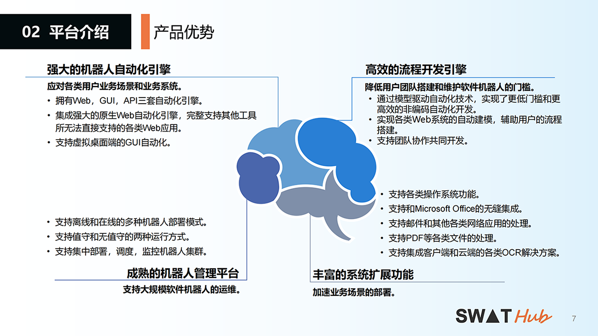

平台概述
===

SWATHub是一个企业级的自动化工具平台，它是基于人工智能和交互建模技术来构建含有高度业务价值的自动化方案，它可以部署在公有云或者私有化的平台上，以SaaS（Software as a Service）的方式提供服务。

SWATHub自动化平台的场景应用分为两种，分别是[业务流程自动化(RPA)](guide_rpa.md)和[测试自动化](guide_test_automation.md)。

SWATHub自动化平台通过灵活的场景/流程/模型三层架构的方式，允许用户自由将网页/移动端的界面交互操作、Windows/Office应用操作以及其他可以扩展的API操作构建起一个业务操作的知识库，并以此作为企业级自动化流程实现和运行的基础。

 <b>图1  SWATHub企业级的自动化平台</b> 

SWATHub将自动化构建、组件知识库和流程/机器人监控的功能都集成在统一的云服务平台中，用户无需安装任何服务端系统，也无需搭建任何测试环境，仅需一个浏览器就可以完成自动化设计、流程调试、结果验证等一系列完整的自动化工程，并且能够基于平台进行业务团队间的协作。

面对长久以来困扰着企业敏捷数字化的难题 - 快速变化的业务与响应缓慢的企业数字化进程，SWATHub进行了有效的应对。借助于云平台的 SaaS 服务方式能够显著降低用户的导入成本，而基于人工智能和交互建模技术的自动化流程构建方案，也让企业可以更快地面对瞬息万变的市场环境部署业务自动化方案。让更多的业务流程自动起来，智能起来，是SWATHub的愿景！