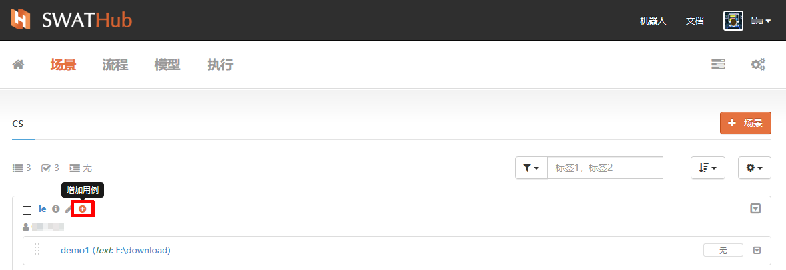
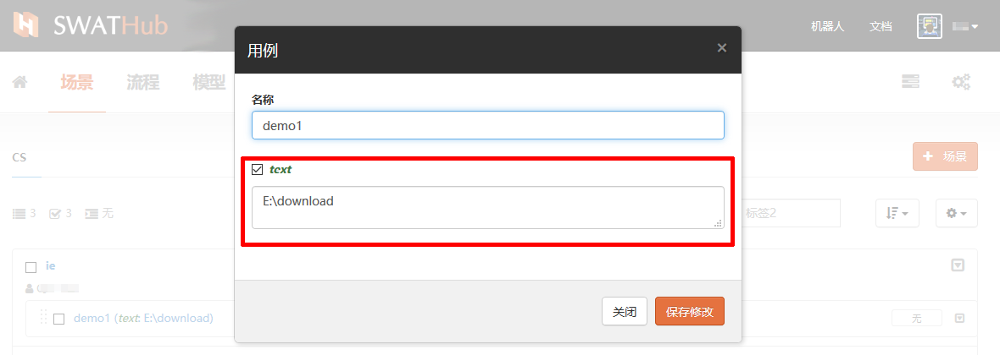
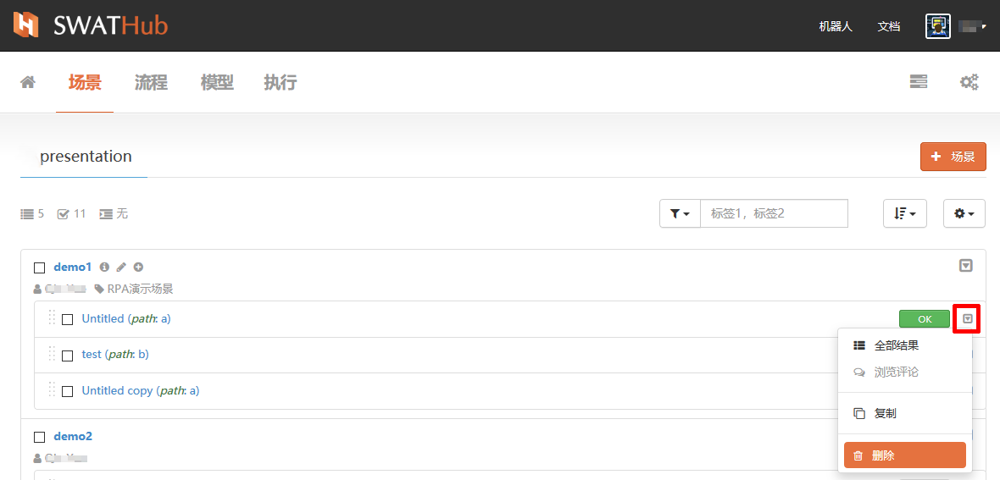
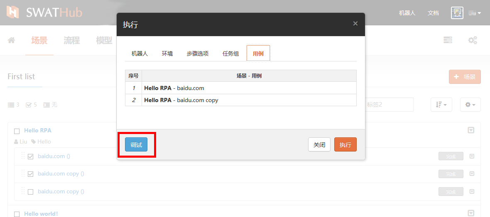

测试用例
===

设计者可以通过测试用例中参数的组合和设定，达到控制流程和测试流程的作用。

基本操作
---
### 新增用例

测试用例的应用对应特定的场景而设计，新增用例的操作需要在场景列表中进行，我们点击场景列表中场景名称旁边的   <i class = "fa fa-plus-circle"></i>  符号来为场景新增测试用例。

### 编辑用例

点击用例名称即可进入用例的编辑界面，用例名称、各场景输入参数均可根据需要编辑，参数名称左侧的  <i class = "fa fa-square-o"></i> 勾选框的勾选状态来设定用例中的参数值。

### 用例复制

测试用例支持复制粘贴操作，点击复制按钮即可一键完成用例的复制粘贴操作。复制后的用例名称默认为原用例名+copy，可以通过**编辑用例**来修改名称、参数值。用例的复制粘贴动作仅限于用例应用的场景，暂不支持跨场景粘贴用例。

### 用例删除

不再使用的测试用例可以直接删除。测试用例删除时，系统会将与该用例关联的执行结果同步删除，如需执行删除动作，请确认结果后再行删除。

用例维护
---
当场景因模型、流程的改变而被系统侦测到异常时，同步受到影响的测试用例也会出现  <i class = "fa fa-warning"></i> **该用例和场景不兼容，需要更新。** 的提示，点击用例名称，进入编辑用例的界面，查看警告和用例参数变化信息，按场景变化的需求重新编辑用例参数后，保存修改，完成用例维护。

用例执行
---

测试用例执行可以单独执行，也可以批量执行，设计者可以按照测试的目的选择执行用例进行执行测试。

### 执行设置

在开始执行前完成以上执行设置，即可点击**执行**按钮开始应用选定用例运行场景。

#### 选择机器人

SWATHub设计者账号支持本地机器人浮动订阅，当需要进行用例执行机器人设定时，可以默认选择设定为本账号浮动订阅的机器人终端，或本地已运行的其他机器人终端。

#### 选择环境

SWATHub支持多种浏览器平台，可根据当前终端配置或目标应用环境选择本机已安装的浏览器类型配置环境。` 网页基准URL `和` API基准URL `可单独设定，如未定义则使用场景组**默认设置**。

#### 选择步骤

步骤选项是一个JSON映射，它将控制执行行为。 您可以更改每次运行的设置，并在测试集中设置默认值。 您也可以选择通过**步骤高级设置**更改每个步骤的步骤选项。

#### 定义任务组

为本次执行设定组名、关键字标签等信息，如无特别设定，任务组名称默认格式为` EXEC YYYYMMDD HH:MM` （如图中所示）。

### 调试用例

调试功能不在设计平台执行，而是到任务执行的机器人端发起调试任务。调试执行可以单步执行或断点控制执行，详细说明请见机器人[流程运行](robot_execution.md)。

### 用例排序

勾选多用例执行时，系统会默认按用例在场景中的排序依次执行，SWATHub提供用例的拖动排序功能，用户可以用鼠标左键按住用例条目左侧的拖动条拖拽用例项到本场景用例列表中的目标位置。

### 查看用例执行结果

当任务开始执行时，界面会跳转到任务组列表，可以实时查看当前任务组的执行进度。当用例执行结果发生错误，则显示红色**错误**标签。

点击任意用例执行结果标签旁的  <i class="fa fa-caret-square-o-down"></i>  按键，选择**全部结果**显示当前任务组所有用例的执行概要和结果。

点击执行结果标签，进入当前用例执行结果的详细页面查看用例执行情况。

### 浏览评论

点击任意用例执行结果标签旁的  <i class="fa fa-caret-square-o-down"></i>  按键，选择**浏览评论**查看当前用例执行结果评论留言。

