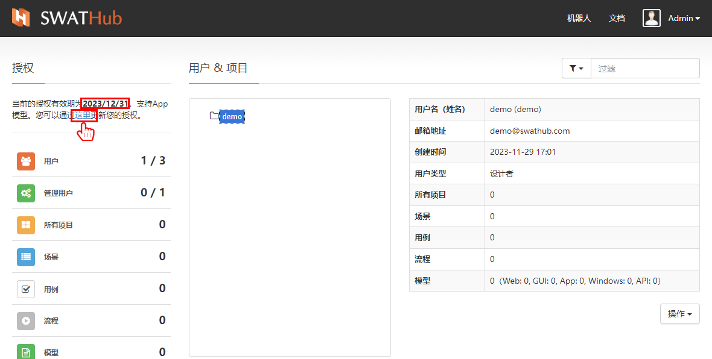
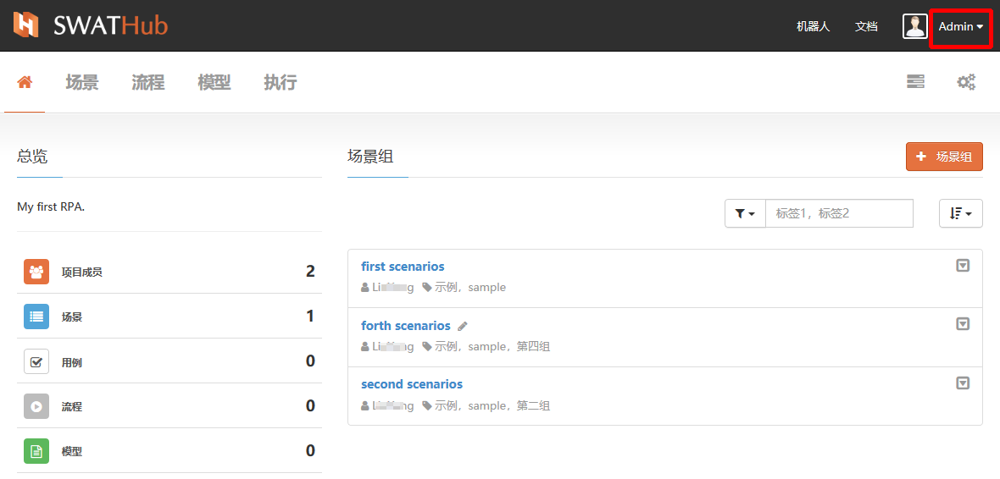
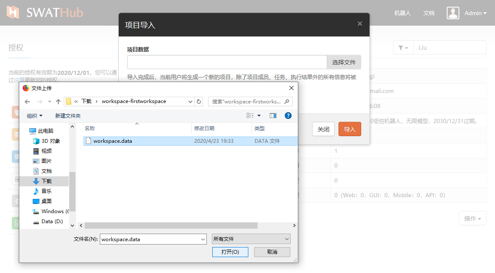
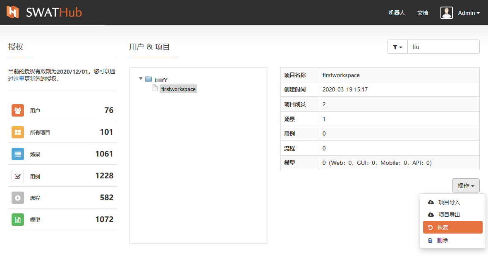

企业版管理
===

所有SWATHub用户都自行注册了相同的系统权限，除了一个**超级用户**名为 `admin`。此超级用户能够访问系统管理仪表板并执行以下任务：

* 订阅代码管理。
* 管理所有用户，如锁定用户、解锁用户、访问用户 Workspace、重置用户密码等。
* 实施workspace维护操作，包括导入/导出、禁用/启用等。

订阅管理
---

使用SWATHub企业版服务需要有效的订阅。如果订阅已超过限制，您将无法创建系统管理员以外的新用户。

1. 输入 `http://<HostIP>:<HostPort>` 以在浏览器中访问SWATHub企业服务（建议使用Firefox/Chrome）。
2. 使用 `admin` 登录（初始密码为`swathub.com`）。
3. 单击订阅更新链接，填写订阅代码，然后应用新订阅1。
4. 如果订阅代码已正确更新，则可以在管理仪表板上验证新订阅2。

?> 1. 如果用户已超过允许的订阅，请禁用用户并再次导入订阅代码。

?> 2. 在有效期信息说明下方的统计区，显示当前授权所包含的最大使用量和已使用量的统计数据，**超级用户**可以对使用状态进行实时关注。

用户&项目管理
---

### 用户角色

**超级用户**：可以对用户属性管理和用户所属的项目管理操作。

**Workspace用户**：是由**超级用户**所创建的可以使用本平台进行项目设计工作的平台用户。**Workspace用户**可以邀请用户作为团队在一个Workspace内进行协作。团队成员的四个角色分别描述如下

* `Owner`: workspace的创建者，可以执行此workspace中的所有任务。
* `Admin`: workspace的管理员，可以执行除workspace删除之外的所有任务。
* `User`: workspace的正常用户只能执行测试相关任务，如测试设计、执行和验证，但无法访问workspace设置。
* `Visitor`: 只能查看workspace和执行的当前状态，但不能进行任何修改的来宾用户。

### 用户功能：

当选中用户列表中的一个用户，我们可以对他的功能权限进行下列操作：

* 屏蔽/激活用户：通过屏蔽用户，关闭用户的可用状态。被屏蔽用户可以通过**过滤器**中`显示所有用户`选项找出，使用`激活用户`操作恢复用户有效状态。

* 重置密码：为用户重置密码时系统会随即生成一组8位字母数字组合字符串，用户可以使用新密码登录后自行修改，请参阅[用户](design_user.md)。

### 项目管理

* 访问项目：当**超级用户**选定用户的workspace使用`访问项目`操作，系统会自动打开该项目的场景组列表界面。

* 管理用户：**超级用户**可以通过此操作为当前项目快速添加项目成员、修改项目成员角色等。

* 项目导出：**超级用户**可以对平台内的workspace进行项目的导出，导出为 `workspace-项目名称.zip`的项目压缩包1，解压出`workspace.data`文件，即可为用户导入项目。

?> 1. 导出的项目文件中不包含项目中各个场景的执行结果记录数据。

* 项目导入：为当前workspace导入项目文件时，需要对导入模式进行选择，请注意根据实际情况选择`追加导入`或`覆盖导入`。

* 归档：**超级用户**可以直接为用户的workspace进行归档操作。归档后的项目可以进行导出、导入、恢复和删除操作。

