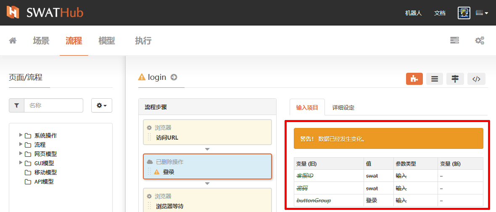

工作流程
===

基本操作
---
SWATHub设计平台推荐用户通过设计多个工作流程来完成场景的搭建，流程可以在项目的不同场景组、场景中作为操作组件使用。流程的基本操作包含新建、修改、复制、归档，在流程的操作中还可以查看流程摘要和关联场景。

### 新建

进入流程设计界面中，通过点击界面右侧 <i class = "fa fa-plus"></i> **流程** 按钮来新建流程1。

?> 1. 流程的输入参数和输出参数可以通过参数模式进行设定。

?> 2. 流程内部的步骤中通过`@{}`使用到的变量，如果没有被定义过变量，系统会自动将其创建为流程的输入参数。

### 流程概要

流程设计完成后可以通过流程名称旁边  <i class = "fa fa-info-circle"></i>  符号进入流程概要，快速浏览到流程的主要步骤和数据项。

### 修改

在流程列表中流程名称旁边的  <i class = "fa fa-pencil"></i>  入口进入**修改属性**，修改当前流程的**名称**、**标签**等基本属性。

### 复制/粘贴

复制功能可以快速将当前流程在本项目中进行复制粘贴，使流程中已完成的步骤可以迅速的在新流程中进行应用。

### 显示关联场景

流程在项目中经常遇到会在多个场景、场景组中使用的情况，我们可以通过**显示关联场景**快速查看到流程被场景使用的情况。

### 归档

对于不再继续使用的流程，我们可以通过**归档**功能来进行屏蔽，被**归档**后的流程，将不再显示在流程列表中1。如需恢复则需要通过过滤器**显示已归档**筛选出已归档流程列表，通过**恢复**功能进行恢复。

?> 流程归档后需要关注项目中是否有场景受到流程归档的影响。

流程维护
---

当项目中模型发生改变时，会引起使用该模型设计的项目流程发生变化，当完成了模型的修改后，我们可以在**流程**板块中通过流程列表中名称位置旁边显示   <i class = "fa fa-warning"></i>  的提示符号快速找到需要维护的流程。

我们进入到这些流程的设计界面中，在流程步骤搭建区中，也同样可以通过   <i class = "fa fa-warning"></i>   提示符号快速定位到需要根据模型变化而修改的流程步骤，从而根据模型的改变而对相关的流程步骤进行新的修改，快速完成流程的维护。当流程维护完成后，我们需要同步查看是否需要对场景、用例进行维护。

