对象模型
===
SWATHub平台是模型驱动方式的流程自动化流程设计工作平台。用户可以快速导入或构建设计流程所需要的对象模型，SWATHub提供多种模型类型的丰富操作库。根据自动化操作对象的不同，SWATHub平台可支持以下对象模型类型：

* Web模型
* Windows模型
* GUI模型
* APP模型
* API模型

基本操作
---
通过设计平台**模型**项目标签进入SWATHub用户的对象模型构建界面，模型的基本操作包括：

### 导入模型

点击  <i class = "fa fa-plus"></i> **模型**按钮选择要导入的对象模型类型。模型文件导入后，通过对模型的操作功能修改设定，完成不同类型对象模型的构建封装。

### 过滤器查询

模型库过滤器默认为**显示有效**选项，可以通过在输入框内输入模型名称关键字快速定位到目标模型对象。点击选择**显示已归档**时，模型库列表框中显示全部已归档模型，选中想要恢复的模型，则右侧操作区域内点击**恢复**按钮，即可将模型恢复至有效状态。

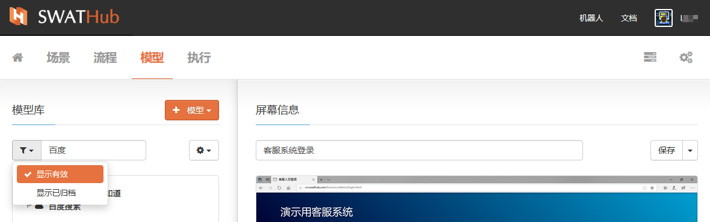

### 模型列表

我们在模型库的模型列表中，展开选定的模型页面包含的元素列表，进行模型元素的显示优化：

#### 操作选择

使用模型列表框上方右侧的 <i class = "fa fa-gear"></i> **操作动作** 对模型中的元素进行 <i class = "fa fa-check-square-o"></i> **选择全部**或 <i class = "fa fa-square-o"></i> **全不选择** 的选取，再对目标操作元素进行取消选定；

#### 操作隐藏

然后使用 <i class = "fa fa-gear"></i> **操作动作** 中的 <i class = "fa fa-toggle-off"></i> **隐藏操作** 对模型后期的应用中不涉及的元素进行隐藏，简化页面。当需要从页面已隐藏的元素中重新获取可操作元素，可以试用 <i class = "fa fa-gear"></i> **操作动作** 中的 <i class = "fa fa-toggle-on"></i> **显示操作** 解除被隐藏元素的隐藏状态，变为正常显示。

#### 列表刷新

当前显示未更新至最新操作状态时，使用**刷新**菜单更新当前模型库列表状态至最新状态。

### 操作功能

详细信息功能在不同模型的功能操作上有所不同，但下列功能为通用基础功能。

#### 重命名

当模型导入后，所有类型模型均可在被选中状态下，通过右侧信息区域的输入框进行重命名操作，点击**保存**按钮更新模型名称。

#### 归档/恢复

当模型不再需要使用时，在模型库的列表中选中该模型，如图所示，点击归档选项，将其归档，归档后的模型不再在模型库的模型列表中显示，但可通过模型库中的过滤器使用**显示已归档**来找出已归档的模型。通过**显示已归档**找出该模型时，可以通过右侧模型操作信息界面的**恢复**键，一键恢复模型为有效。

#### 撤销导入

已更新导入的Web模型可以进行撤销导入的操作，撤销导入的操作为**撤销最后一次导入**，执行的效果为撤销改模型的最后一次更新导入。

Web模型
---
Web页面是流程自动化应用中常用的用户交互界面。我们可以把Web页面文件封装成含有操作功能的模型，用于自动化流程的搭建应用。

### Web模型获取

当设计者需要设计相关Web页面的各种操作时，可以使用**模型获取器**来获取包含HTML代码的模型文件，用于在SWATHub中添加/更新Web模型的页面文件。 与Web浏览器的 **另存为HTML** 功能相比，**模型获取器**可以处理框架结构的Web应用程序，并支持实时呈现的HTML获取。 可以通过两种方式提供，即浏览器插件或客户端工具。

#### 浏览器插件获取

**模型获取器**插件相对不同浏览器提供不同的应用插件，可根据客户端电脑的实际安装情况下载不同的插件应用。

| 浏览器       | 下载信息           | 版本要求
| ---------- | -----------   | -----------
| Google Chrome | [Chrome Web Store](https://chrome.google.com/webstore/detail/swat-page-capture-tool/afipaojpjmlbclndicfpiaaancandbcm)  [离线安装包](tools/swat-chrome-capture.zip)| Google Chrome 31 以上
| Mozilla Firefox | [Firefox Add-ons Marketplace](https://addons.mozilla.org/addon/new-swathub-page-capture-tool/)  [离线安装包](tools/new-swat-firefox-capture.zip)| Mozilla Firefox 59 以上
| | [Firefox Add-ons Marketplace](https://addons.mozilla.org/firefox/addon/firefoxswatcapture/)  [离线安装包](tools/swat-firefox-capture.zip)| Mozilla Firefox 38 ~ 58
| | [离线安装包](tools/swat-firefox-capture_1.2.1.zip)| Mozilla Firefox 29 ~ 37
| Internet Explorer | [离线安装包](tools/swat-ie-capture.zip) | Internet Explorer 9 以上（仅适用32位）, [.NET Framework 4.0](http://www.microsoft.com/en-US/download/details.aspx?id=17718)

当插件自动安装后，会在浏览器上方工具条显示1，或可以通过浏览器菜单选择页面模板，然后将所有文件上传到SWATHub中的存储库。 请注意，每个需要交互或操作的Web页面均需获取为一个本地文件。

?> 1. 在使用Internet Explorer版本的模型获取器插件时，需要以管理员方式执行Internet Explorer。

##### Google Chrome 安装说明
1. 建议通过Chrome Web Store在线安装。 如果无法访问网上商店，请下载离线安装程序并按照以下步骤操作。
2. 解压缩脱机安装程序，将结果文件夹放置到您的工作目录中。 请不要移动或删除该文件夹，因为它将使插件无效并需要重新安装。
3. 在Chrome中，请点击 **Extensions > Load unpacked extension...**, 然后选择上面的文件夹。

##### Mozilla Firefox 安装说明
1. 建议通过Firefox Marketplace在线安装。 如果无法访问市场，请下载离线安装程序，然后按照以下步骤操作。
2. 解压缩离线安装程序，您将得到一个`xpi`文件。 在Firefox中，请点击**扩展名**，然后将解压后的`xpi`文件拖到Firefox中。
3. 对于 Firefox `29` ~ `37`, 仅离线安装可用。

##### Internet Explorer 安装说明
1. 在上表中下载安装包。
2. 将zip文件解压缩到目标计算机上的安装目录。
3. 以管理员身份运行`cmd.exe`以打开DOS提示符。
4. 在DOS提示符下，转到安装目录并运行`install.bat`。

在一些情况下，错误消息： `Could not load file or assembly or one of its dependencies. Operation is not supported. (Exception from HRESULT: 0x80131515)` 会出现。您需要按照以下步骤取消阻止DLL文件，然后从步骤3重新执行上述安装。

1. 在Windows资源管理器中打开安装文件夹。
2. 右键单击DLL文件之一，然后从上下文菜单中选择“属性”。
3. 单击结果对话框右下角的**Unblock**按钮。
4. 在另一个DLL文件上执行相同的操作。

#### 客户端工具获取

SWATHub Robot客户端工具集成了模型获取器，我们可以试用客户端工具实现Web页面的获取。具体步骤详见**SWATHub桌面端**[模型获取器](desktop_model_capture_tool.md)。

### Web模型导入

#### 新增导入
点击  <i class = "fa fa-plus"></i> **模型**按钮选择**Web模型**，上传被工具已获取的Web页面文件1，Web页面将被添加为新Web模型。导入Web页面文件时，需注意为导入的页面文件设置相应的页面模板格式，SWATHub平台支持以下格式页面模板的Web文件直接导入：

* html5 1.0.0
* openui5 1.0.0
* mdl 1.0.0
* bootstrap 1.0.0
* ionic 1.0.0

请根据Web页面的模板格式选择匹配的模板设置。

?> 1. 当需要建立多个Web模型时，可以试用工具连续获取页面文件，导入时将全部需要导入的页面文件选中，批量导入模型库。

当页面的模型成功导入后会显示在左侧模型库内。SWATHub系统可根据Web页面文件自动识别出Web上各个组件控键的操作类型。

#### 更新导入

当Web模型中封装的Web页面发生改变时，需要对Web模型进行更新维护，更新当前Web模型仅需通过重新获取Web页面文件1，重新导入，SWATHub平台可根据页面信息自动将本次导入模型操作类型识别为**更新**。

?> 1. 当Web模型已经进行了重命名操作，则需将新获取的页面文件重命名为与模型名相同的Web页面文件。

### Web模型功能

当Web模型成功导入系统后，我们可以点击模型库中的模型名称左边的 <i class = "fa fa-play"></i> 展开模型，查看模型中所包含的操作。当模型库中有多个Web模型时，模型不能同时展开到元素列表级。

SWATHub对Web模型中页面和操作均可修改设置。

#### 修改Web模型名称

当选中模型库中已导入的模型，则可在右侧**网页信息**区域中页面默认名称显示的编辑框内对其进行名称修改，然后使用保存按钮修改Web模型名称。

#### 页面设置

通过**保存**按钮旁边的下拉菜单，点击**设置**选项进入页面模型的模板设置界面。页面设置的对话框中会显示当前Web模型所应用的页面模板参数和设置预览项。

##### 页面模板

导入时所选择在网页模板信息会以代码形式显示在**页面模板**标签页中，可以选择是否收藏当前页面的模板和预览设置。

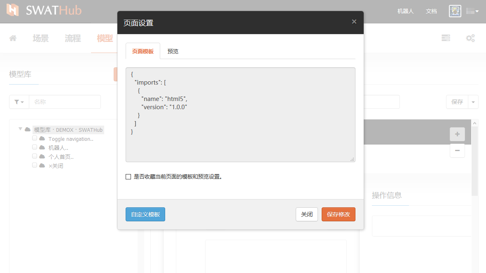

##### 预览

* HTML编码：默认为**自动侦测**，您可以根据实际情况选择**UTF-8**、**GBK**、**Shift_JIS**或**EUC-JP**四种类型中的一种。
* 预览的基础URL：所有相对URL都将根据您输入的URL进行计算。
* 预览的替换规则：可以根据替换规则在预览HTML中替换某些字符串。替换规则的详细说明请参考[开发文档](../dev/rule_web_template.md#模型预览规则)。

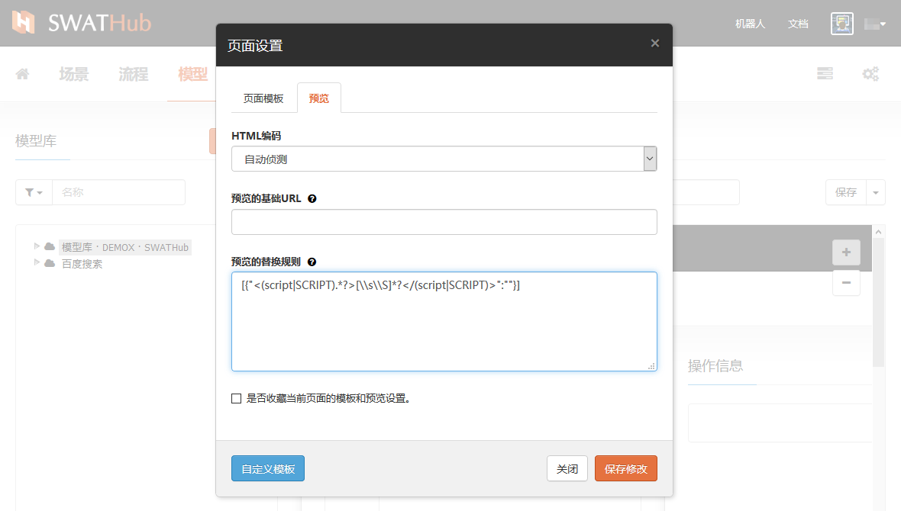

#### 模版自定义

当我们需要对Web模型导入时选择的Web模板进行修改时，点击**页面设置**对话框下方蓝色**自定义模板**按钮，即可进入模板修改的编辑界面。

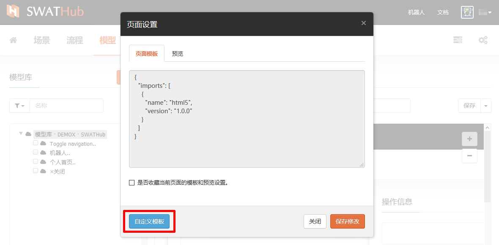

模板修改的页面中，我们提供模板修改工具来帮助用户更便捷的对页面模板进行修改：

 * <i class = "fa fa-book"></i>  **引用模板库**
 * <i class = "fa fa-undo"></i>  **恢复初始状态**
 * <i class = "fa fa-support"></i>  **请求模板定制服务**
 * <i class = "fa fa-question"></i>  **查看文档**

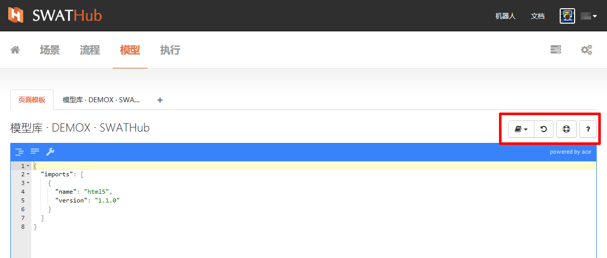

##### 引用模板库

SWATHub提供5中Web页面常用的标准模板，包括：

* html5 1.0.0
* openui5 1.0.0
* mdl 1.0.0
* bootstrap 1.0.0
* ionic 1.0.0

用户可根据实际需要快速选取改变代码中对应的模板及版本定义语句。

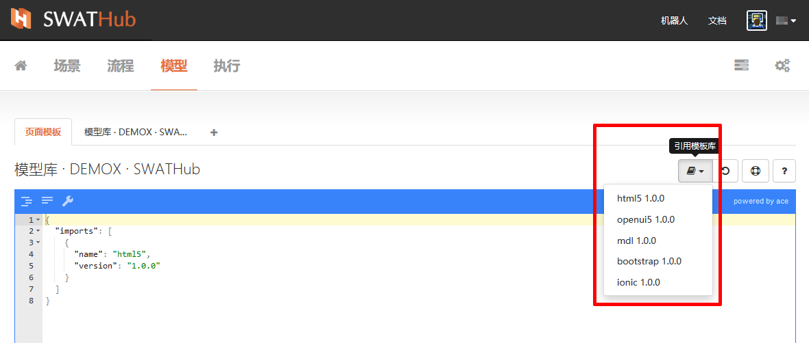

##### 恢复初始状态

在对当前模板进行自定义修改的过程中，如需放弃全部修改，可通过**恢复初始状态**按钮一键清除所有未保存的修改步骤，恢复到页面模板最后一次保存时的设置。

##### 请求模板定制服务

如遇页面模板复杂情况，无法选择模板库中提供的标准模板完成修改，则可以通过 <i class = "fa fa-support"></i> 打开服务支持申请页面，申请SWATHub技术人员协住定制页面模板。

在企业版中，用户可以通过 <i class = "fa fa-support"></i>  **请求模板定制服务**下载模型的诊断文件，用户可以把该文件发送到我们官方支持的联系邮箱来获取帮助。

##### 查看文档

打开SWATHub技术支持文档，查询相关详细操作说明。

##### 保存/应用模版

对页面模板的修改完成后，我们通过当前页面下部的**保存修改**按钮来保存对当前页面设置修改的更新，保存修改按钮的下拉选项为**应用到多页面**，使用**应用到多页面**选项，则弹出Web模型的选择对话框，可多选择本次修改的自定义模板所应用的Web模型，使用**保存修改**按钮对选中的多个模型进行页面模板修改。

对页面模板的修改，可以使用页面右下角蓝色**应用到预览**按钮同步操作模型页面设置页面的预览项。

### Web操作功能

Web模型构建的过程中，除了针对导入的页面进行修改设置等操作以外，SWATHub支持对页面中的每个元素进行与其属性相适应的操作。Web模型中的页面操作操作修改，主要在当前页面的右侧区域实现。本区域主要组件有名称输入框、操作按钮和页面元素显示区，可以对模型元素进行以下操作：

#### 元素名称修改

在模型库中目标模型的元素列表中选定元素，在右侧页面元素操作区的输入框中输入名称，点击右侧**保存**按钮，即可为元素修改名称。

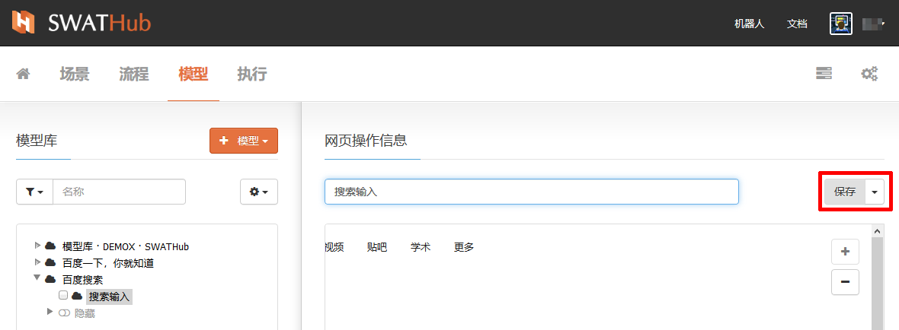

#### 修改元素

输入框右侧按钮下拉即可选择<i class = "fa fa-wrench"></i> **修改元素**操作。本区域下部的框内是页面模型的元素显示，选中元素如已被系统识别，则以绿色虚线框圈定选定的页面元素。进入**修改元素**操作后，进入**功能元素**的层级界面，功能元素区是当前页面元素的子元素列表，我们可以看到当前元素所包含的组件与全部子元素。我们可以按照需要来进入右侧**元素信息**操作区为组件或子元素进行名称修改保存。当元素内的组件和子元素修改全部完成后，点击左侧**操作元素**区下方**保存修改**按钮，保存本次对模型元素的全部修改。

#### 操作设置

输入框右侧按钮下拉即可选择 <i class = "fa fa-gears"></i> **设置** 操作。本操作的主要功能是设置在当前Web网站不同页面文件中具有标题和主体的元素，是否执行相同的功能设置。如果选定此选项，当导入当前Web站点其他具有相同元素的Web模型时，该元素自动执行与前模型中该元素相同的功能设置。

Windows模型
---
SWATHub可以对所要操作的Windows应用进行建模，在模型上定义操作来模拟对应用窗口内控件进行鼠标和键盘动作。当前SWATHub Windows模型和场景，可作为Windows应用自动化测试和流程自动化的对象。

### Windows模型获取

SWATHub桌面端工具集成了**模型获取器**，我们可以使用桌面端工具实现Windows应用界面模型的获取。获取Windows模型的模型获取器操作步骤详见**SWATHub桌面端**[模型获取器](desktop_model_capture_tool?id=windows模型的获取)。

点击  <i class = "fa fa-plus"></i> **模型**按钮选择**Windows模型**，导入已获取的Windows应用程序页面文件1，Windows应用程序页面将被添加为新Windows模型。当Windows模型成功导入后会显示在左侧模型库内。

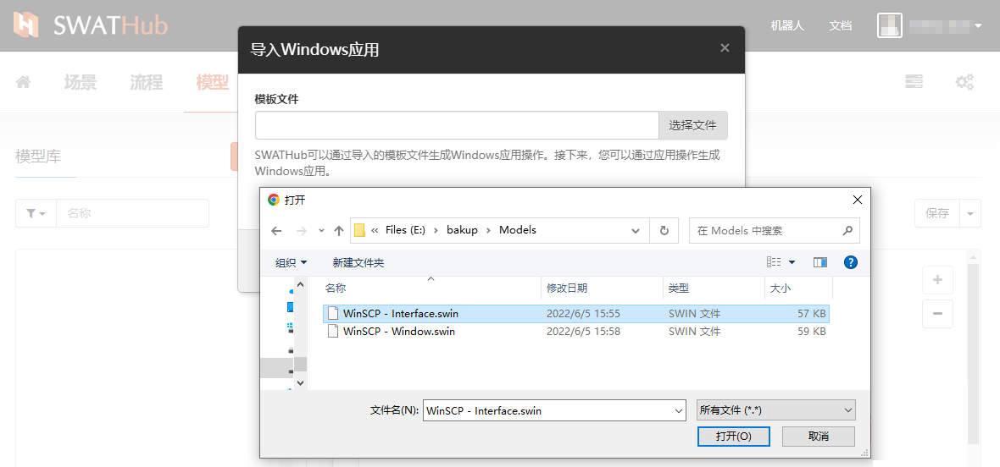

?> 1. 当需要建立多个Windows模型时，可以试用工具连续获取Windows程序页面文件，导入时将全部需要导入的Windows程序页面文件选中，批量导入模型库。

### Windows模型功能

#### 修改Windows模型名称
导入Windows模型时，系统默认文件名称为模型名称。我们可以在界面信息区域输入框内未模型重新命名，按**保存**将Windows模型名称更新至模型库。

#### 增加操作

通过**保存**菜单的下拉按钮，可以进入为APP模型增加操作步骤属性的界面。完成操作属性搭建后，点击左下角**保存修改**确认对模型操作的定义。模型操作定义可在 <i class = "fa fa-puzzle-piece"></i> **GUI模式**和 <i class = "fa fa-code"></i> **代码模式**两种编辑状态下操作。

##### GUI模式

在对Windows模型增加/修改操作的增加命令界面中，左侧为命令搭建区，点击命令区右上角 <i class = "fa fa-plus-circle"></i>  **Windows命令** 和**系统命令**来为Windows模型中选定的对象来封装操作属性，点击步骤数据区**选择器**右侧 <i class = "fa fa-dot-circle-o"></i>来打开模型，选择目标。完成命令搭建1后，点击左下角**保存修改**按钮完成对Windows模型操作属性的封装。

Windows模型中可封装的**Windows命令**包括：

 * <i class = "fa fa-mouse-pointer"></i>  鼠标点击
 * <i class = "fa fa-i-cursor"></i>    输入文本
 * <i class = "fa fa-hand-paper-o "></i>  鼠标悬停
 * <i class = "fa fa-hand-pointer-o"></i>  激活控键
 * <i class = "fa fa-font"></i>  获取文本

Windows模型中可封装的**系统命令**包括：

 * <i class = "fa fa-keyboard-o"></i>  键入热键
 * <i class = "fa fa-clipboard"></i>    获取剪贴板文本

为增加的命令选择目标对象：

?> 1. 当在命令搭建区增加命令时，该命令的步骤数据显示在步骤数据区域，对步骤数据的参数设置方式请参考[开发文档](../dev/model_windows.md)。

##### 代码模式

Windows模型支持在代码模式下进行操作命令编辑，尤其在大量复制操作命令步骤时，代码模式可实现模型命令属性的快速封装。修改后的模型代码通过左下角点击**保存修改**按钮完成修改确认。

### Windows模型操作功能

我们可以对已经为Windows模型封装的命令操作信息进行修改名称和修改操作。

#### 修改名称

选中模型所属的命令操作，在右侧**操作信息**区域的输入框中输入新的名称，点击右侧**保存**按钮。

#### 修改操作

选中模型所属的操作，点击**保存**按钮右边下拉菜单，即可进入**修改操作**，对已有命令操作修改的步骤和增加操作的步骤相同，也支持GUI模式和代码模式两种编辑方式。

GUI模型
---
图形用户界面（Graphical User Interface，简称 GUI，又称图形用户接口）是指采用图形方式显示的计算机操作用户界面。在SWATHub平台中的GUI模型，指导入用户操作界面的图形文件，作为流程自动化操作的对象。

### GUI模型获取

我们可以试用键盘的PrtSc对计算机屏幕进行获取，通过画板或其他制图软件，将获取的屏幕图像保存为.PNG格式（SWATHub平台GUI模型当前仅支持.PNG格式图片）。如果需要多步骤操作，请将各步骤的操作画面分别进行截屏保存操作。

### GUI模型导入

新建一个GUI模型通过点击  <i class = "fa fa-plus"></i> **模型**按钮选择**GUI模型**，进入GUI模型图片文件导入界面。

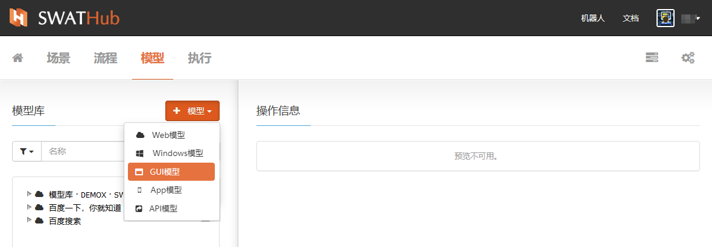

GUI模型的图片文件选定后，在确认**增加屏幕**前，可以通过选框旁边的**修改**和**移除**按钮进行重新选择。GUI模型导入支持截屏图片文件批量导入、

### GUI模型功能

#### 修改GUI模型名称

截屏图片导入为GUI模型时，系统默认图片名称为模型名称。我们可以在屏幕信息区域输入框内未模型重新命名，按**保存**将新的GUI模型名称更新至模型库。

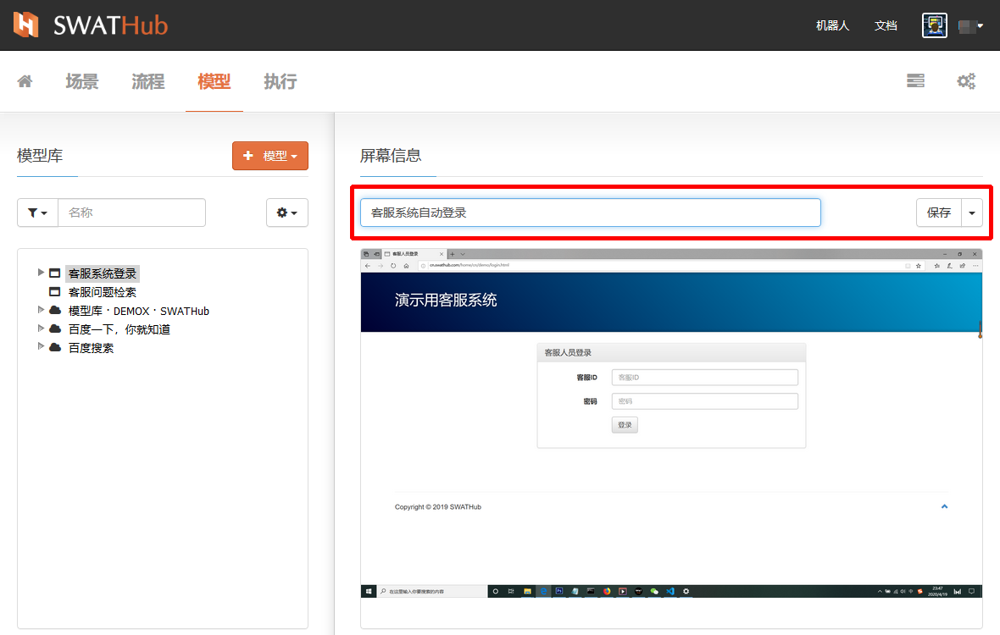

#### 增加操作

通过**保存**菜单的下拉按钮，可以进入为GUI模型增加操作步骤属性的界面。完成操作属性搭建后，点击左下角**保存修改**确认对模型操作的定义。

为GUI模型封装属性的操作方式可以使用<i class = "fa fa-puzzle-piece"></i> **GUI模式**和 <i class = "fa fa-code"></i> **代码模式**两种方式。

##### 命令搭建

GUI模型的属性封装方式与场景流程步骤的构建方式相似，通过命令搭建区上角的  <i class = "fa fa-plus-circle"></i>  **增加命令** 为图片添加**GUI命令**或**系统命令**组成对图形界面的操作步骤1 2。命令的参数和使用方式详见[开发文档](../dev/model_gui.md)。

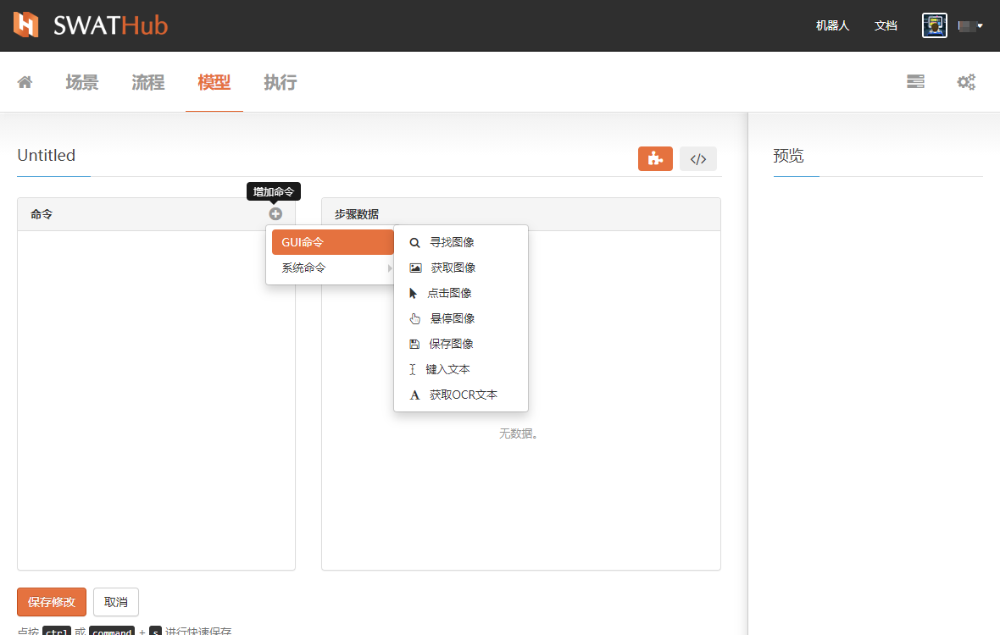

?> 1. 命令块左侧为移动条，当鼠标变为 <i class = "fa fa-arrows"></i> 时按下左键拖动命令块上下移动，快速修改命令排序。

?> 2. 可以通过命令块右上角的  <i class = "fa fa-clone"></i> （复制） 和  <i class = "fa fa-close"></i> （关闭） 快速复制或取消命令。

##### 代码模式

点击 <i class = "fa fa-code"></i> 按钮即可快速切换到代码模式界面。

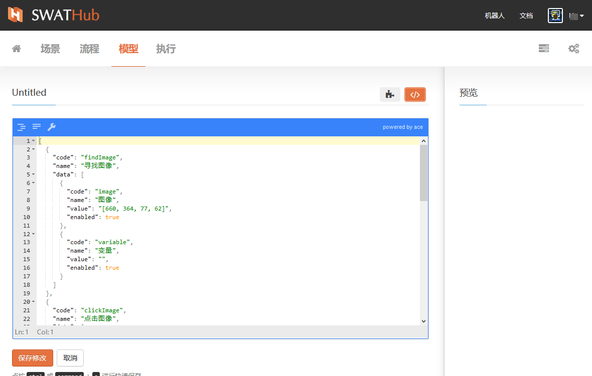

##### 预览

在当前编辑界面的右侧预览区域内，我们可以看到当前正在操作的GUI图像对象的预览图像。

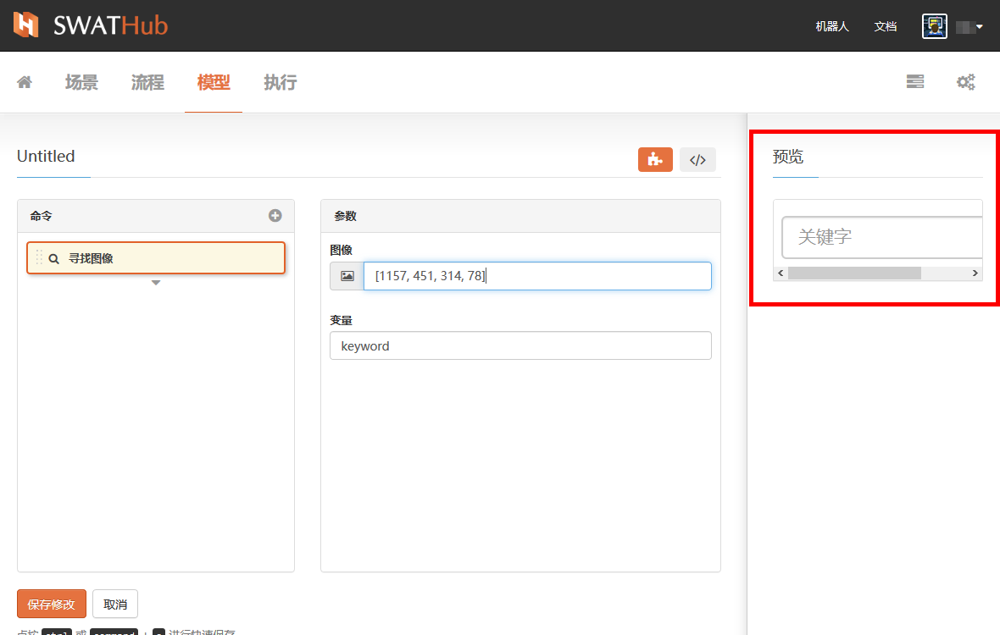

### GUI操作功能

在GUI操作信息的区域内，当完成了对GUI图像操作属性封装后，我们可以在下面的预览区域内看到图像上出现红色的“step1：……”、“step2：……”等相关GUI图像的操作步骤示意1。我们还可以在当前区域继续对GUI模型进行修改名称和修改操作。

?> 1. GUI图片上的step标识均为与图形操作有关的步骤，例如输入文本等命令步骤不会出现在图形step中。

#### 修改名称

可以通过GUI操作信息界面输入框直接输入新名称，按**保存**键更新。

#### 修改操作

可以通过GUI操作信息界面输入框直接输入新名称，按**保存**键更新。进入操作属性封装界面，完成修改后，点击左下角**保存修改**确认对模型操作的修改。

APP模型
---

SWATHub可以驱动移动仿真器和真实设备来测试移动 Web 应用程序。当前SWATHubAPP模型和场景，主要应用于移动端APP的自动化测试。

### APP模型获取

SWATHub桌面端工具集成了 模型获取器，我们可以使用桌面端工具实现移动Web程序页面的获取。开始获取APP模型之前，首先需要对移动端平台进行安装设置，详见**SWATHub机器人**[移动端平台](robot_mobile_setup.md)，APP模型获取器操作步骤详见**SWATHub桌面端**[模型获取器](desktop_model_capture_tool?id=app模型的获取)。

点击  <i class = "fa fa-plus"></i> **模型**按钮选择**APP模型**，导入已获取的移动Web程序页面文件1，移动Web程序页面将被添加为新APP模型。当APP模型成功导入后会显示在左侧模型库内。

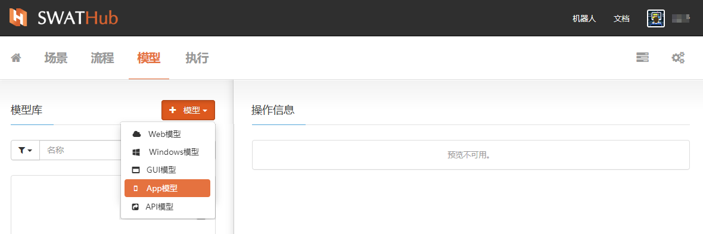

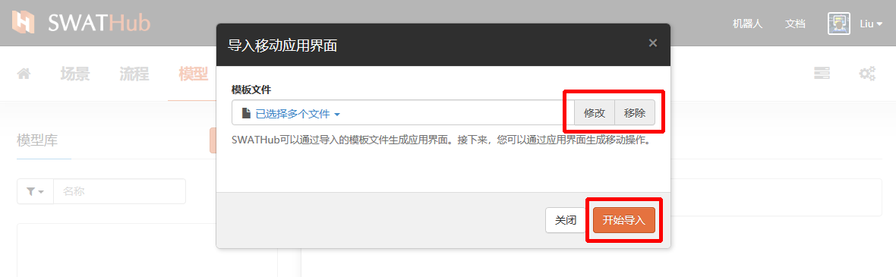

?> 1. 当需要建立多个APP模型时，可以试用工具连续获取移动Web程序页面文件，导入时将全部需要导入的移动Web程序页面文件选中，批量导入模型库。

### APP模型功能

#### 修改APP模型名称
导入APP模型时，系统默认文件名称为模型名称。我们可以在界面信息区域输入框内未模型重新命名，按**保存**将APP模型名称更新至模型库。

#### 增加操作

通过**保存**菜单的下拉按钮，可以进入为APP模型增加操作步骤属性的界面。完成操作属性搭建后，点击左下角**保存修改**确认对模型操作的定义。模型操作定义可在 <i class = "fa fa-puzzle-piece"></i> **GUI模式**和 <i class = "fa fa-code"></i> **代码模式**两种编辑状态下操作。

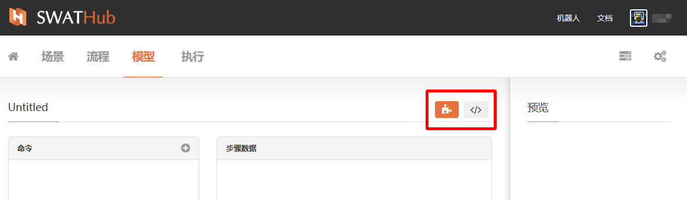

##### GUI模式

在对APP模型增加/修改操作的增加命令界面中，左侧为命令搭建区右上角 <i class = "fa fa-plus-circle"></i>  **移动应用命令** 来为APP模型封装操作属性，完成命令搭建后，点击左下角**保存修改**按钮完成对APP模型操作属性的封装。APP模型中可封装的移动应用命令1包括：

 * <i class = "fa fa-hand-pointer-o"></i>  点击
 * <i class = "fa fa-i-cursor"></i>   输入文字
 * <i class = "fa fa-exchange"></i>  滑动

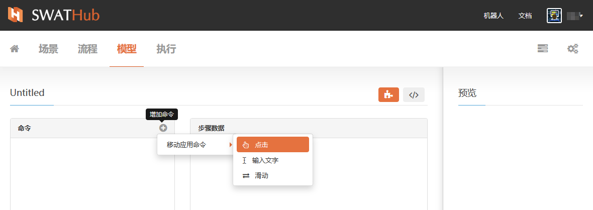

?> 1. 当在命令搭建区增加命令时，该命令的步骤数据显示在步骤数据区域，对步骤数据的参数设置方式请参考[开发文档](../dev/model_mobile.md)。

##### 代码模式

APP模型支持在代码模式下进行操作命令编辑，尤其在大量复制操作命令步骤时，代码模式可实现模型命令属性的快速封装。修改后的模型代码通过左下角点击**保存修改**按钮完成修改确认。

### APP操作功能

我们可以对已经为APP模型封装的移动操作信息进行修改名称和修改操作。

#### 修改名称

选中模型所属的移动操作，在右侧移动操作信息区域的输入框中输入新的名称，点击右侧**保存**按钮。

#### 修改操作

选中模型所属的移动操作，点击**保存**按钮右边下拉菜单，即可进入**修改操作**，对已有移动操作修改步骤和增加操作步骤相同，也支持GUI模式和代码模式两种编辑方式。

API模型
---

API模型是对所要操作的Web服务的API进行建模，API模型并不需要从特定位置获取，在SWATHub中，我们可以通过设置其参数轻松地创建API操作。 我们可以直接创建API后，就像其他操作一样，我们可以将其拖放到场景构建器中。

### API模型定义

1. 新建一个API模型通过点击  <i class = "fa fa-plus"></i> **模型**按钮选择**API模型**，进入API模型命名界面。

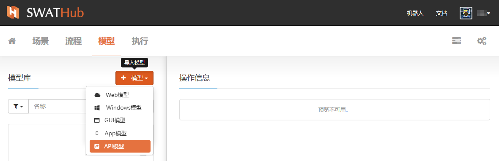

2. API定义包含设置API的参数，需要对三种属性1分别设置：

* 常规属性
* 数据属性
* 高级属性

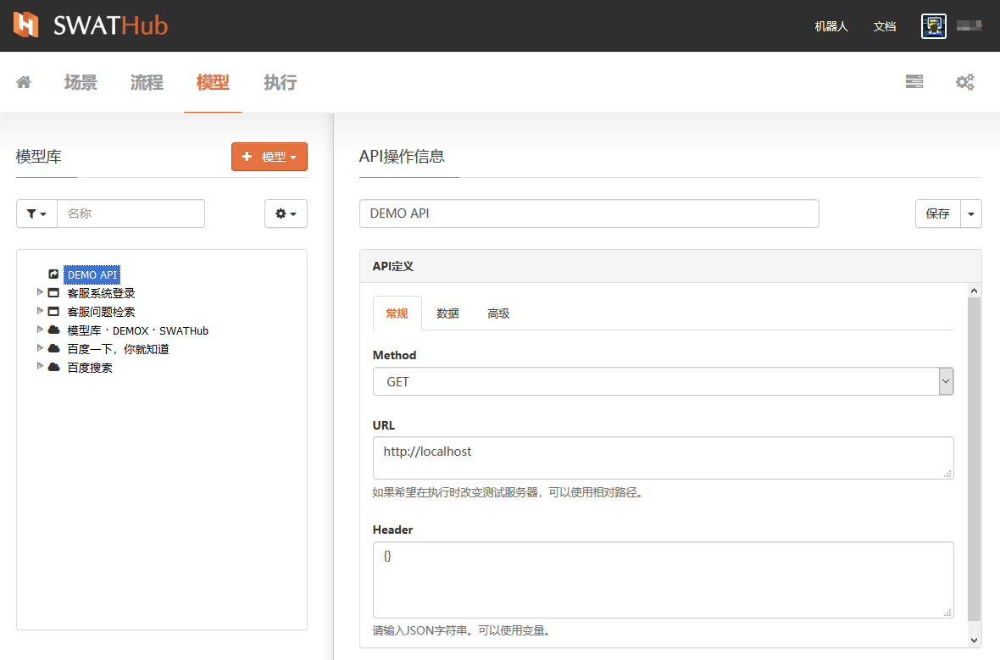

?> 1. 属性参数设置说明详见[开发文档](../dev/model_api.md)。