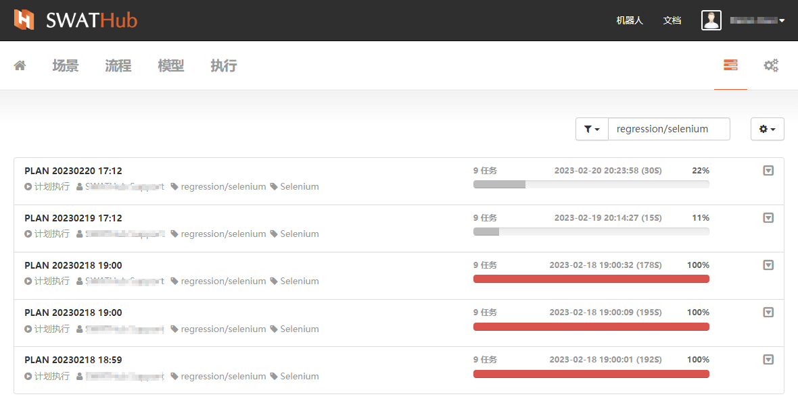

执行计划
===

基本操作
---
SWATHub设计平台提供执行计划设置功能，用户可以根据任务执行的需要，制定执行计划。计划执行的基本操作包含新建、复制、删除。

### 新建

进入执行计划界面中，通过点击界面右侧 <i class = "fa fa-plus"></i> **执行计划** 按钮来新建场景执行计划。

新建执行计划时，需要**编辑执行计划**来完成一个新执行计划的制定。

然后点击**保存修改**，完成新建一个执行计划的制定。

### 复制

当需要复制当前执行计划时，可以通过点击已有的执行计划条目右侧下拉按钮，弹出下拉菜单，点击**复制**选项，来快速复制执行计划。

点击已复制的执行计划的名称，可以进入**编辑执行计划**界面，可根据需要修改执行计划中的配置项。

### 删除

对于不再需要的执行计划，可以通过点击已有的执行计划条目右侧下拉按钮，弹出下拉菜单，点击**删除**选项，来快速删除执行计划。

执行和显示
---
### 执行

当执行计划制定完成后，可以通过执行计划条目右侧下拉按钮，弹出下拉菜单，点击**执行**选项，来启动该计划的执行。

点击**执行**后需再次确认执行该**执行计划**，点击对弹框中**执行**按钮，系统将跳转到任务执行列表，可以看到当前执行计划的执行状态。

在本次执行计划的执行过程中，我们可以通过右侧下拉菜单中的**停止**和**开始/恢复**按来对正在执行的计划进行控制。

执行计划在**停止**和完成后，都可以进行**删除**操作，删除操作将会对本次计划中所有的子任务进行删除。

### 显示相关任务

已经设定好的**执行计划**的执行记录，可以通过**显示相关任务**快速查看到该执行计划的执行情况。

当本次执行计划完成后，点击本条记录栏中空白位置，可以打开执行计划的详细列表，看到本次执行计划中的所有任务的执行情况。再次点击本条记录栏中的空白位置，则可收起任务明细。

### 显示相关报告

**执行计划**的详细报告可以通过**显示相关报告**按钮进入**执行报告**界面查看。

?> **执行计划**执行完成后，删除该次任务后，执行报告条目在执行报告列表中仍然存在。
