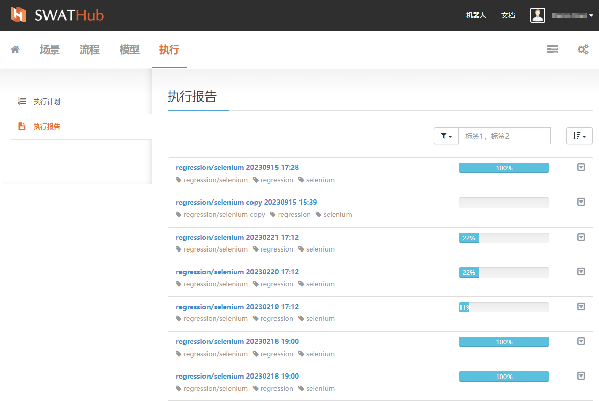
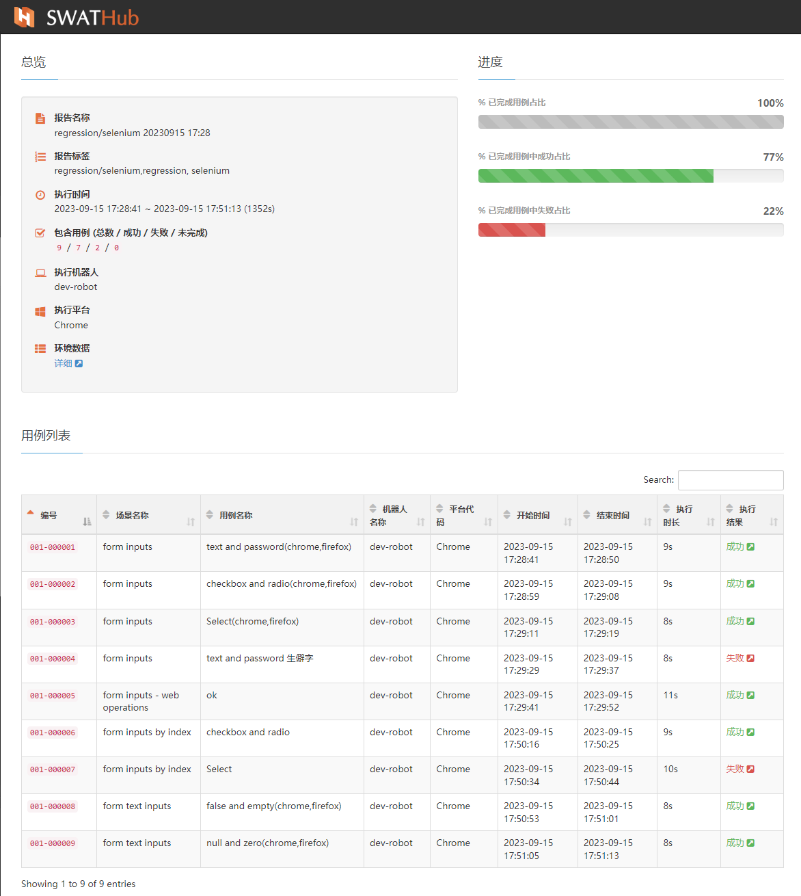
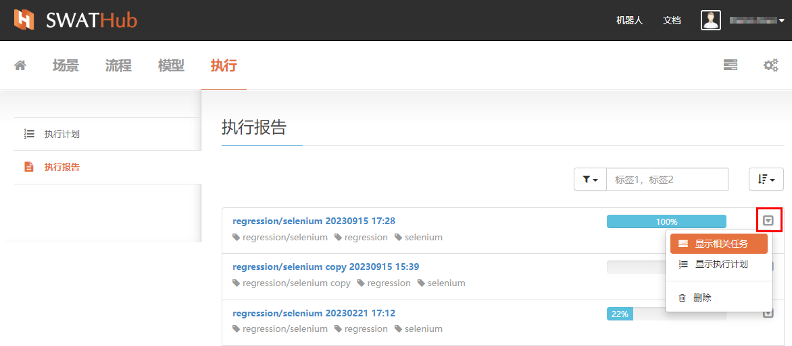
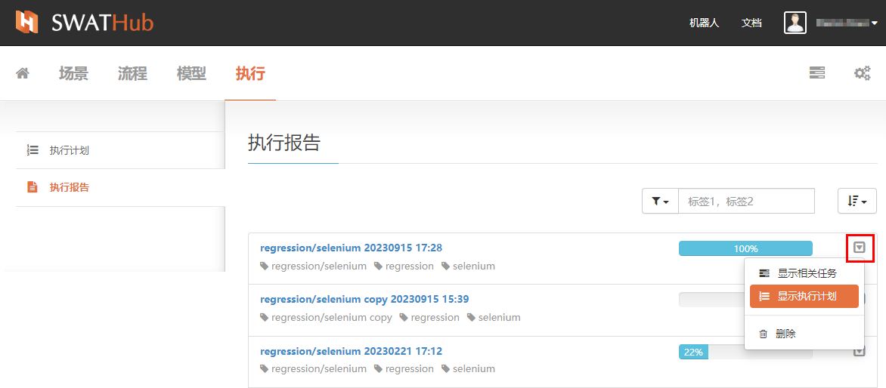
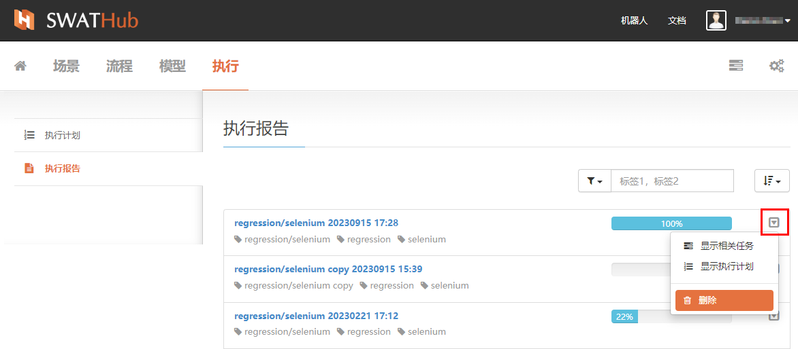
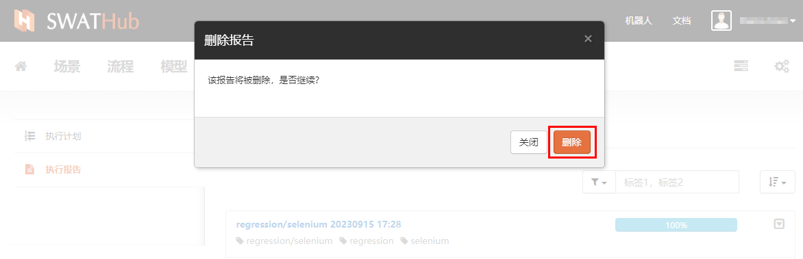

执行报告
===

进入**执行报告**界面可以看到全部**执行计划**结束后的执行报告列表，点击列表中的单个执行计划任务，则可进入详细报告页。

点击执行报告右侧列表中相应时间的执行计划标题，即可查看该批次执行计划执行结果的详细**执行报告**内容。

点击**执行报告**列表中报告条目右边的下拉按钮，选择**显示相关任务**，可以跳转到该报告中所有执行的任务列表。

点击**执行报告**列表中报告条目右边的下拉按钮，选择**显示相关计划**，可以跳转到该报告中所执行的**执行计划**。

点击**执行报告**列表中报告条目右边的下拉按钮，选择**删除**，则将删除该条执行报告记录以及其所包含的详细报告内容。

?> 请注意：报告删除后无法恢复，请谨慎操作。