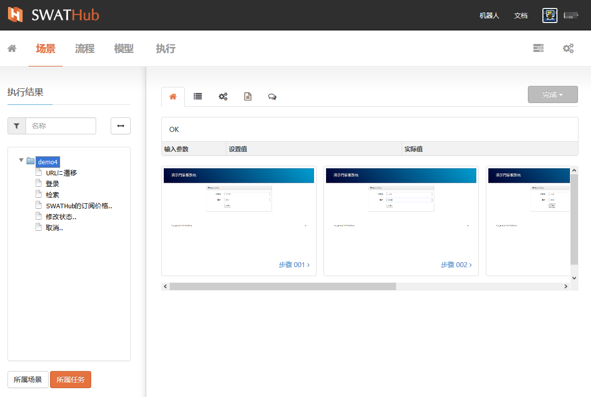
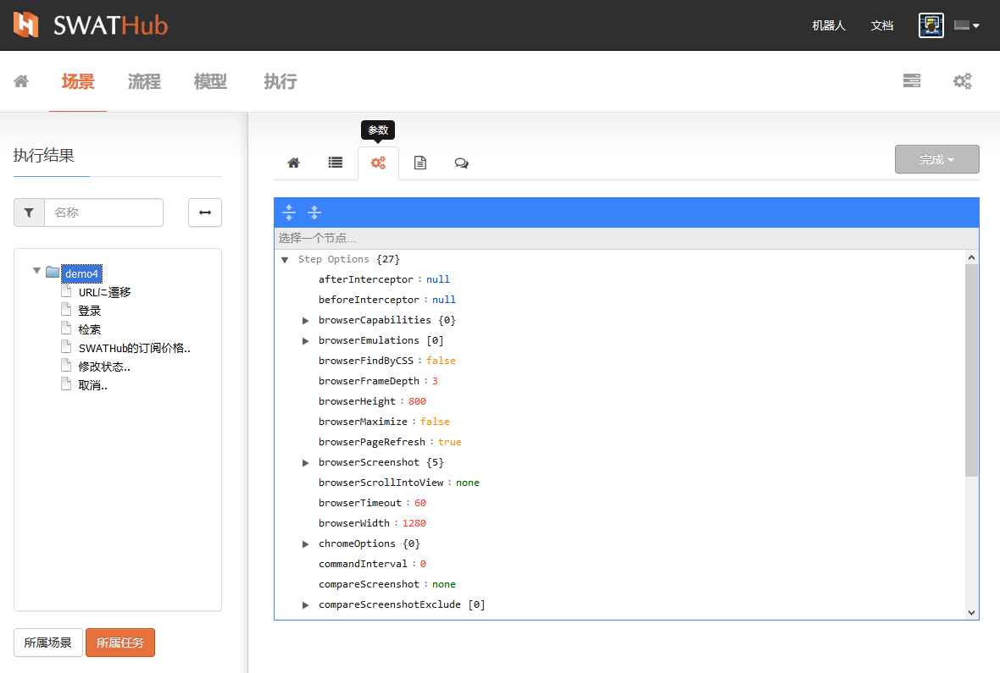
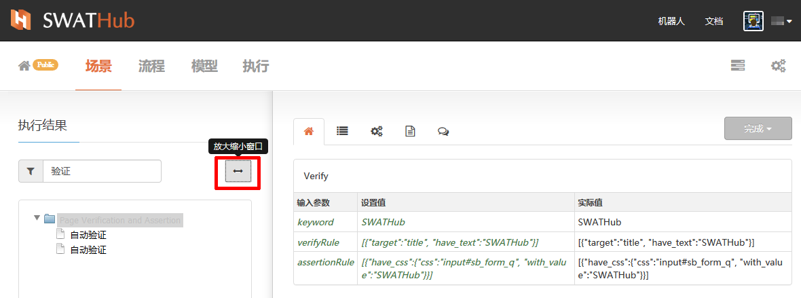
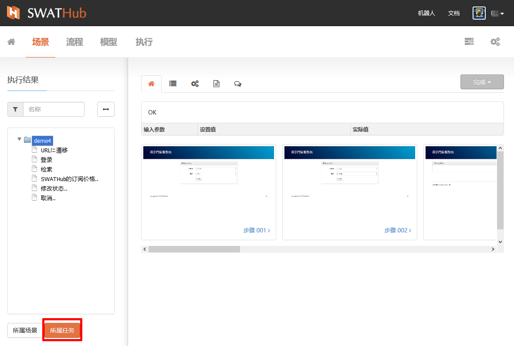
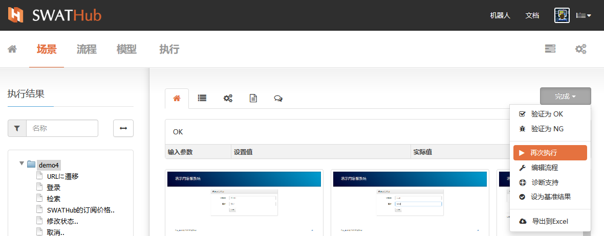
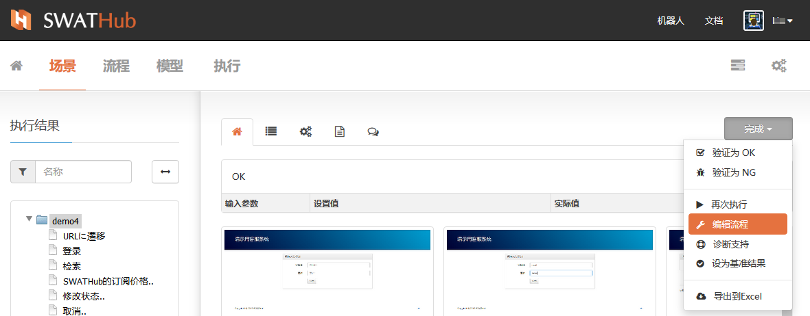
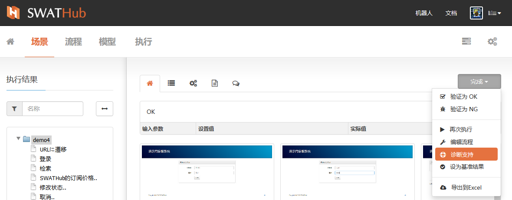
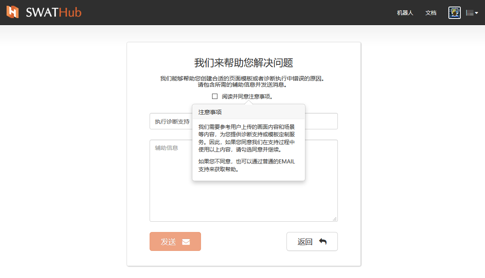
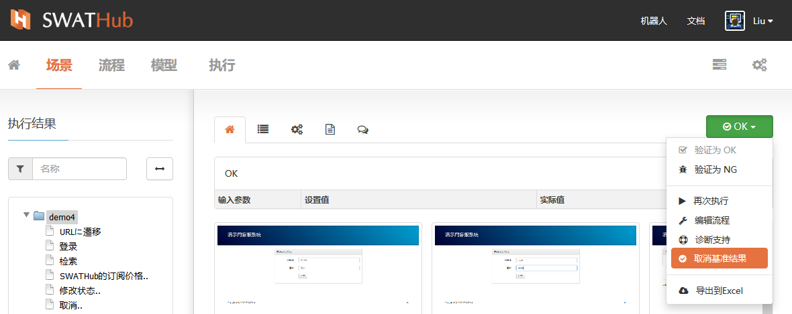
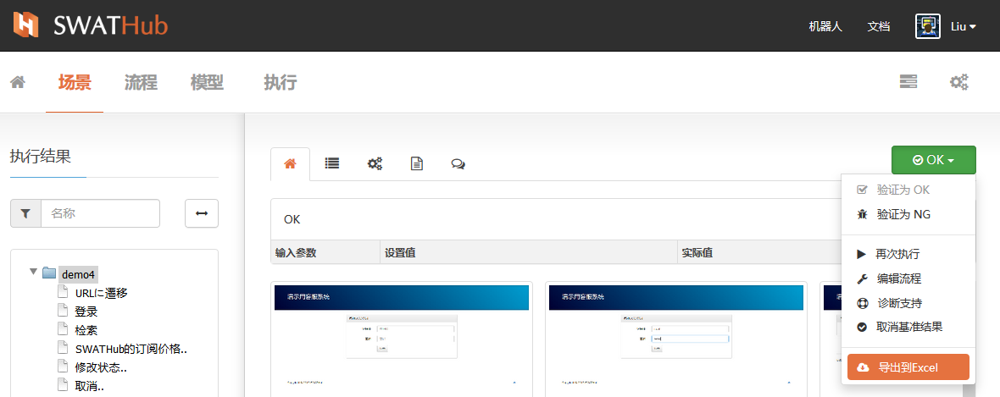

执行结果
===

每一件任务执行结束后（任务标签显示灰色完成标签或红色错误标签）会生成一套对应的执行结果，通过点击任务组中该任务条进入执行结果界面。当该任务处于**执行中**（蓝色进度标签）、**停止**（黑色停止标签）或**等待中**（黄色等待中标签）的状态时，不能进入执行结果页。

确认执行结果
---

当我们进入选定任务的执行结果，我们可以在页面的左侧看到任务所属的场景流程步骤以列表方式显示1，右侧区域是任务结果的多维度报告区2。报告包括以下维度：

* 概要
* 统计
* 参数
* 日志
* 评论

?> 1. 任务结果的报告可按左侧任务的层级显示。例如，选定对象为**场景**层级，右侧区域内的显示报告为该场景的相关多维度报告；而查看对象选定为场景中的某一个流程步骤时，则显示报告为该流程步骤的多维度报告。

?> 2. 当选定对象为**流程步骤**层级，右侧区域内的显示报告没有**统计**报告。

### 步骤执行结果

任务所属的场景流程步骤以列表方式显示执行结果区，当任务正常执行完成时，所有流程步骤的字体为黑色。当任务执行结果为错误时，在执行结果区域内我们可以看到发生错误的流程步骤以红色字体显示：

当**执行结果**标题旁边显示 <i class = "fa fa-exclamation-circle"></i> 提示时，表示当前执行结果对应的场景用例任务已修改，当前结果中显示的错误位置需要重新验证是否仍为错误步骤。

### 概要

在概要栏目中自上向下依次为：

* 名称（场景层级显示场景用例名称，流程步骤层级显示对象步骤名称）
* 参数列表（场景层级显示当前场景全局参数，流程步骤层级显示当前步骤参数）
* 关键步骤截图（场景层级显示当前场景全部关键步骤截图，流程步骤层级显示当前步骤关键截图）

当选定的流程步骤与WEB页面相关时，概要的最下方会显示该网页的WEB地址信息和执行后的HTML代码文件下载。

### 统计

统计结果显示当前任务执行的相关信息，仅相对于场景对象层级显示。

### 参数

当前报告中的参数即场景搭建时**详细设定**中的**步骤选项**中的内容。

### 日志

在日志维度中，当选定对象为场景时，显示区中为整个场景用例的系统级执行日志。当选定对象为某一流程步骤时，则显示该步骤的执行日志。如有执行错误，则在日志中以红色显示错误日志记录。

### 评论

评论功能可以由设计者自己发布，也可以由项目中其他user发布。评论的类型可以选择：

* <i class = "fa fa-question-circle"></i>  提一个问题
* <i class = "fa fa-lightbulb-o"></i>   提一个想法
* <i class = "fa fa-bug"></i>  提一个缺陷

无论针对场景层级还是步骤层级的评论均显示在评论区下方，每条评论的发布时间显示在该条评论的右下角。当您订购了集成服务时，评论结果会发布在服务平台的项目区。

基本操作
---

### 过滤器

执行结果过滤器的过滤功能针对当前场景的流程步骤，在输入框内输入关键字，即可自动过滤出关键字关联的流程步骤。

### 放大缩小

通过放大缩小按钮操作可以改变执行结果显示区域的尺寸，当显示内容较多或名称较长时，可以通过放大来扩大查看内容的显示区域。

### 所属场景

在当前任务执行结果页面中，可以通过点击**所属场景**按钮直接跳转到场景组列表页面的当前任务所属场景，并以展开方式显示当前任务所属用例。

### 所属任务

在当前任务执行结果页面中，可以通过点击**所属任务**按钮直接跳转到任务组列表页面的当前任务所属任务组，并以展开方式显示当前任务。

高级操作
---

点击执行结果界面右侧的结果状态标志可以进入对执行结果的高级操作菜单。

### 验证

任务的执行结果除了执行直接生成的**完成**和**错误**两种状态，我们还可以根据用例的设计目标，将执行结果标签验证为` OK `或` NG `状态：

* 验证为OK：当执行结果获得到预期的结果，则该任务的执行结果可以验证为` OK `，标签颜色变为绿色。

* 验证为NG：当执行结果未获得到预期的结果，则该任务的执行结果可以验证为` NG `，标签颜色变为红色。

### 再次执行

在当前的执行结果界面中，可以通过**再次执行**操作直接发起当前任务的重新执行，系统会自动生成当前时间下的新任务组，并自动发起执行动作，所使用的的执行相关设置沿用当前任务执行时的设置选项。

### 编辑流程

在当前的执行结果界面中，可以通过**编辑流程**操作直接跳转到场景流程的搭建界面，针对流程步骤设计进行修改或重新设定。

### 诊断支持

当执行中发生问题需要我们协助调查原因时可以使用这项功能来生成支持请求通知。我们会在收到通知后进行调查并联系您。当使用企业版时，此项功能会变成下载诊断文件，需要您手动将诊断文件发给我吗的支持邮箱。

### 设为基准结果

在当前任务的执行结果完全符合设计预期的情况下，我们可以将本次任务的执行结果设置为当前场景用例执行的基准结果。当此任务再次执行时，系统自动对比执行结果与被设为基准的执行结果，如果完全一致，则认为任务结果完成，如果发生不一致的结果，则认为任务结果错误。

当前执行结果使用**设为基准结果**时，标签改变为绿色，显示 <i class = "fa fa-check-circle-o"></i> **OK** ，而**取消基准结果**操作后，变为绿色标签显示文字为 **OK** 。

### 导出到Excel

SWATHub平台支持场景用例执行结果的导出，在当前执行结果界面中通过**导出到Excel**操作导出报告文件。导出文件的内容包括用例执行的详细信息，文件名格式为` 场景名-用例名-自动编号.xlsx `。

