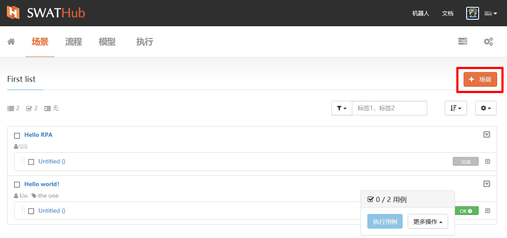
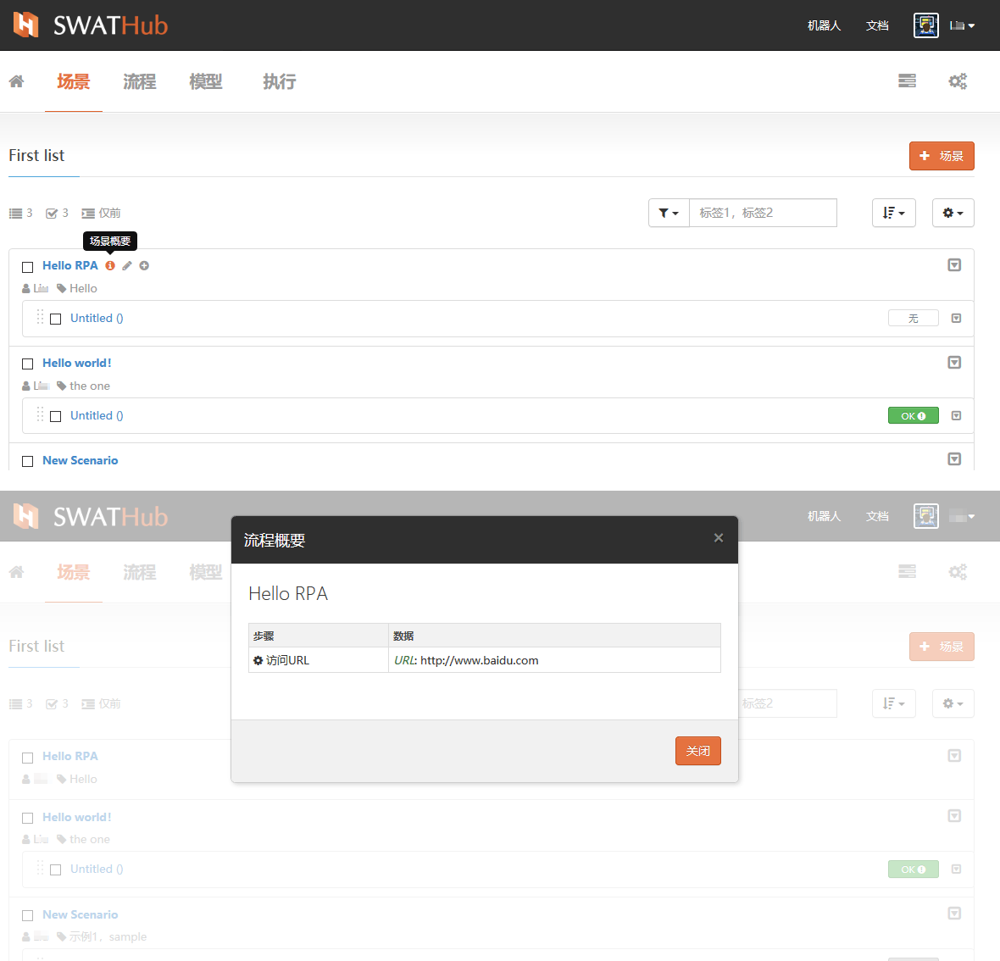
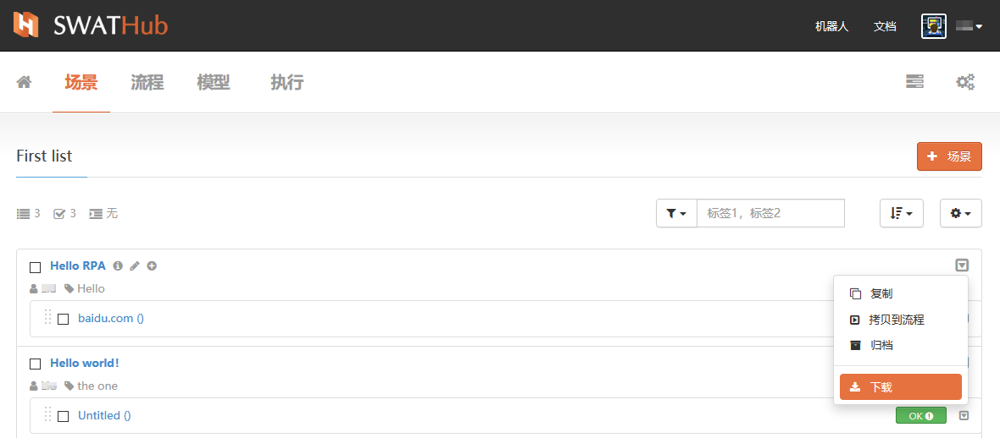
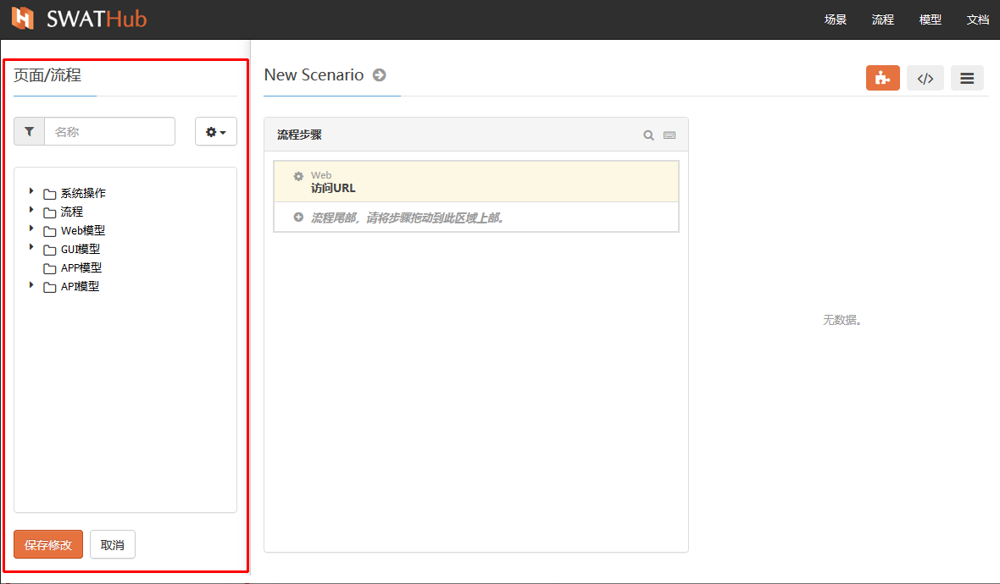
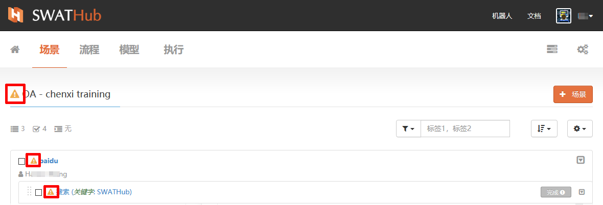
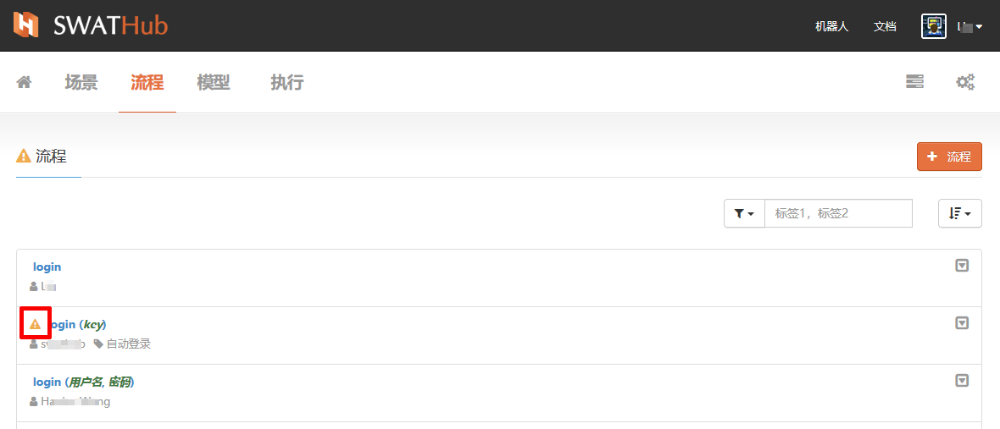

自动化场景
===

基本操作
---

### 新建

在进入场景组后，我们可以开始创建一个场景，从  <i class = "fa fa-plus"></i> **场景**按钮，在对话框中为新**场景**设定**名称**，定义**标签**关键字等属性。

### 场景概要

在场景列表中场景名称旁边的  <i class = "fa fa-info-circle"></i>  进入**场景概要**，浏览当前场景中的流程概要。

### 修改

在场景列表中场景名称旁边的  <i class = "fa fa-pencil"></i> 入口进入**修改属性**，修改当前场景的**名称**、**标签**等基本属性。

### 复制

SWATHub平台中，场景可以支持两种复制模式：
* 复制：复制功能可以快速将场景在本场景组进行复制粘贴，使场景中已完成的流程可以迅速的在新场景中进行应用。
* 拷贝到流程：SWATHub支持自定义流程，我们可以试用**拷贝到流程**的功能直接将既有场景封装成为一个流程，在其他的场景进行调用。

### 归档

对于不再继续使用的场景，我们可以通过**归档**功能来进行屏蔽，被**归档**后的场景，将不再显示在场景组的场景列表中。

?> 1. 被归档的后的场景可以通过过滤器**显示已归档**选项过滤显示，并可进行**恢复**操作。

### 下载

SWATHub提供场景包下载功能，用户可以下载保存场景文件包。

场景搭建
---
新建一个场景，完成**名称**和**标签**的设定后进入场景搭建的环境。场景搭建环境有**组件选择区**和**流程步骤搭建区**组成。

### 组件选择区

位于屏幕左侧的区域，为SWATHub场景搭建的**组件选择区**。在本区域内，有**过滤器**、**操作工具**和**操作组件**三组功能组件。

#### 过滤器

通过在过滤器的文本框内输入组件名称的关键字，可以快速在操作组件中定位到目标组件。

#### 操作工具

组件选择区的操作工具的**放大或缩小窗口**功能可以将本区域进行**放大**或**缩小**，**刷新**功能可以对**操作组件**列表进行刷新。

#### 操作组件

操作组件区内包含三种类型的操作组件：
* 系统操作：SWATHub平台提供多种系统操作，用户可以通过拖拽的方式，从系统操作组件中选取需要的操作，直接进行场景搭建。
* 流程：流程即实现业务自动化执行时所执行的各个对象操作。我们也可以把流程理解为一个子场景，我们通过对于多个场景中的高频发生的流程其封装成为流程后，可以在场景的设计中更方便的调用和维护。
* 模型：用户通过SWATHub服务平台模型工具操作，抓取关键步骤的界面导入平台，建立场景的操作界面库，当完成了所有步骤的界面抓取导入后，我们就建成了一个SWATHub的模型库。当前我们支持以下三种模型。
 * Web模型
 * GUI模型
 * APP模型
 * API模型

### 流程步骤搭建区：

SWATHub设计平台中，用户可以通过从**操作组件**中拖拽组件的方式将选定操作、流程、模型快速引入流程步骤搭建区，开始进行场景的搭建。通过**组件选择区**下方的**保存修改**按钮对已经搭建好的流程步骤进行确认保存。

### 属性区：

在流程步骤搭建区的右侧是属性区，每一个流程步骤搭建后，我们通过对流程步骤的属性区各参数进行编辑设定，来实现流程步骤的目标动作和输出结果。

#### 输入项目

设计者可以根据场景流程搭建所使用的操作组件属性设定输入项目中各个项目的参数。

#### 输出项目

根据操作组件属性输入项目的参数执行流程步骤后所要获得的输出内容。

#### 详细设定

对当前的流程步骤进行更加详细的设定，包括步骤名称设定，详细步骤设定等，支持使用JSON编辑器进行设定编辑。

### 工作模式：

SWATHub场景流程步骤搭建支持四种搭建模式：
* GUI模式
* 代码模式
* 参数模式

#### GUI模式

场景流程搭建的工作模式默认为GUI模式，在此工作模式下，设计者可以通过对操作组件区列表中所有对象使用拖拽的方式，快速的进行流程步骤搭建。

#### 代码模式：

以代码的方式显示项目流程，可以通过编辑代码快速对场景流程步骤进行编辑修改。

#### 参数模式：

在参数模式下，当前场景中所使用的输入/输出参数以列表形式排列在窗口内，可以快速找到需要修改的参数，直接点击参数名称进入参数修改界面。

场景维护
---

### 维护操作

当项目中模型、流程发生改变时，我们需要对场景同步进行维护操作。SWATHub平台提供对模型改变后关联流程、场景及场景用例实时侦测功能，并在相关的流程、场景和用例名称位置旁边显示   <i class = "fa fa-warning"></i>  的符号以提示存在需要更新的场景。我们可以快速进入场景的流程步骤中确认这些变化影响到的流程步骤及参数，作出相应的修改调整，保存修改后，再根据需要对场景用例同步作出相应维护。

