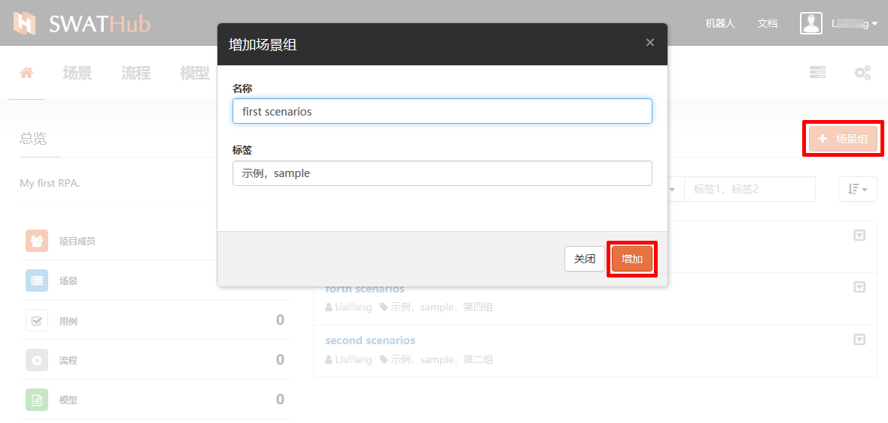
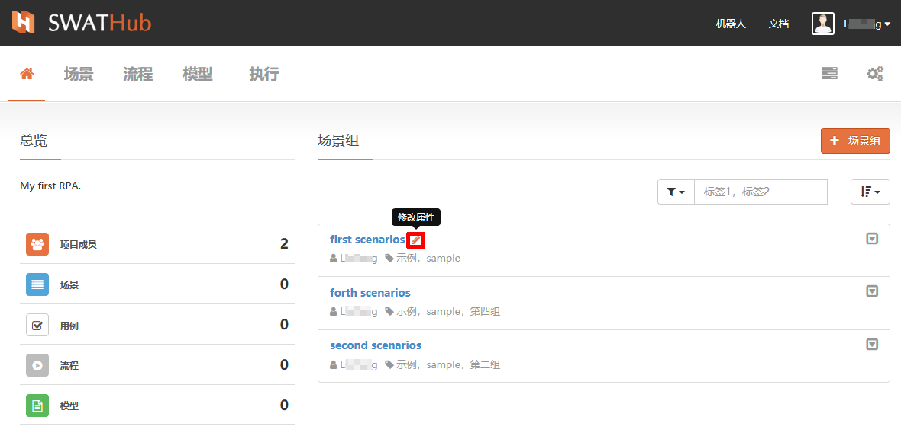
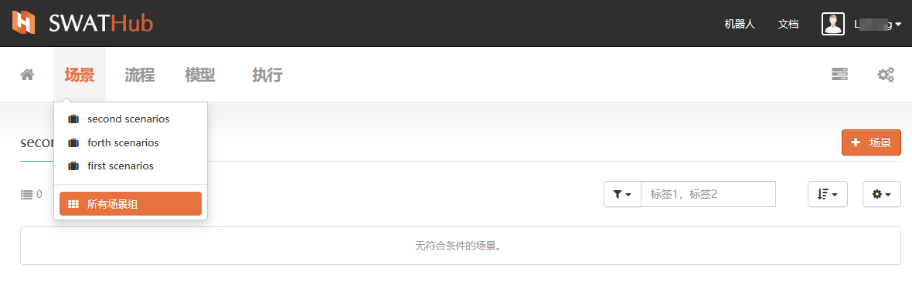
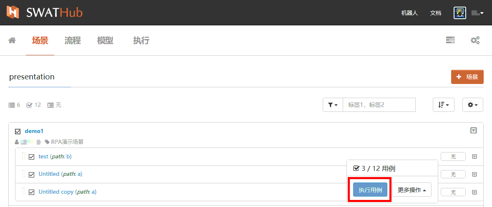
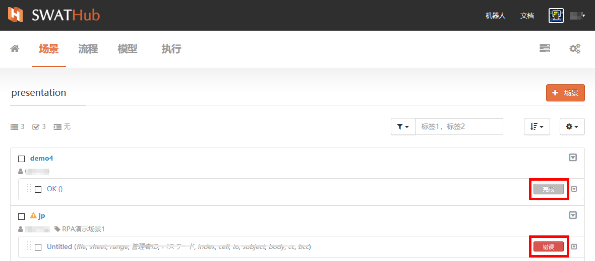

场景组
===

基本操作
---

### 创建场景组

创建一个新场景组，从个人首页点击  <i class = "fa fa-plus"></i> **场景组**按钮开始，为新**场景组**设定**名称**，定义**标签**关键字。

### 修改属性

场景组的名称和标签支持通过点击  <i class = "fa fa-pencil"></i> 进入 **修改属性**进行修改。

### 过滤器

场景组过滤器支持按属性条件过滤，条件可以设为：
* 通过标签过滤
* 通过名称过滤

场景组过滤器还支持按场景组状态条件过滤显示，状态条件分别为：
* 显示有效
* 显示已归档

### 排序选项

排序选项支持按不同条件调整排序：
* 按名称
* 按最后创建
* 按最后更新 

### 复制/归档
通过场景组目录中右上角下拉菜单可以快速对项目组进行**复制**或**归档**操作。
* 复制：完全复制场景组及场景组中所有内容，新复制的场景组支持修改属性及内部操作。
* 归档：SWATHub平台暂不提供场景组的物理删除功能，可以通过**归档**对已经不使用的项目进行逻辑删除操作，被归档的项目不再直接显示在场景组目录中，可以通过过滤器中**显示已归档**来找到已被归档的项目组。

### 恢复

如果需要恢复已经被归档的项目组，可以通过过滤器使用**显示已归档**选项和该项目的标签、名称来找出目标场景组，然后执行**恢复**操作，来恢复该场景组的状态。

高级设置
---

### 场景列表显示

通过**场景**栏目支持当前/全部显示的快速切换。

### 统计显示

在进入场景组的场景列表时，左上角的以图标+数量的形式，简单显示当前场景组中的构成组件概要， <i class = "fa fa-list"></i> 代表**场景**、  <i class = "fa fa-check-square-o"></i> 代表**用例**、 <i class = "fa fa-indent"></i> 代表拦截器，数字表示在本场景组中该项总计数量。

### 场景组设置

在场景组设置的菜单下，SWATHub提供了以下设置功能：
* 拦截器
* 默认设置
* 导出/同步
* 场景组中场景的全选选项
* 场景组显示设定

#### 拦截器

拦截器是SWATHub平台提供的快速设置场景组中位于场景组开始或结尾的通用流程的工具，拦截器调用的流程可以作用于整个场景组中的所有场景的开始和结尾1 2。

?> 1. 场景组中的前拦截器和后拦截器调用的流程范围为整个项目内的设计流程。

?> 2. SWATHub不推荐使用需要设置参数的流程作为场景组拦截器使用，当需要使用此类流程作为拦截器时，设计者需详细评估流程参数变化会带来的影响。

#### 默认设置

场景组中的默认设置对基准URL、API URL和步骤选项三个主要流程执行参数进行统一设置，当场景组的运行环境切换时，可以通过修改默认设置中这三个参数的值来改变场景流程中所有相关此参数的流程参数，而无需对各个流程逐一进行修改。更多**默认设置**的使用详情，请查阅[开发文档](/cn/dev/flow_step_option.md)。

#### 用例的导出和同步

在场景组的场景列表界面中，可以使用**场景组操作**对用例进行导出和同步的批量操作。用例的导出与同步功能在同类型场景跨场景组、跨项目应用时具有可以快速生成批量用例的操作便利性，可以大大提高测试效率。

* 导出用例：当使用**导出用例**功能时，场景组中被选中的用例会以` 场景组名称+cases.xlsx `为文件名生成可保存在设计者终端本地的用例文件1。设计者可以方便的通过修改用例文件的方式来批量编辑测试用例2。

?> 1. 导出的用例文件可以根据需要保存在特定位置，注意批量新增或删除用例如需同步到场景组，请不要修改文件名。

?> 2. 导出的用例文件中按场景排列用例，①区域列为场景的用例名称。②区域列为用例执行信息（无需修改）。③区域列为场景参数。

* 同步用例：对导出的用例文件进行修改保存后，我们可以使用**同步用例**功能上传文件名仍为` 场景组名称+cases.xlsx ` 的用例文件，SWATHub系统会按照用例文件所给出的用例数据，批量生成场景组中各场景用例。

#### 选择设置

* 选择全部：选择当前场景组下全部场景。
* 全不选择：取消当前场景组中所有已选中的场景。

#### 显示设置

* 全部展开：当前场景组中全部场景展开显示。
* 全部收起：当前场景组中全部场景已收齐的列表形式显示。

批量场景操作
---

### 场景组基本批量操作

场景组中的所有已勾选的场景支持批量操作，包括批量拷贝、粘贴、归档等操作。
1. 场景组中批量拷贝场景，可以跨场景组进行粘贴操作，对场景进行批量拷贝时可以对场景中包含的用例进行选择包含拷贝，仅被选中的用例会跟随场景一起粘贴到目标场景组位置。
2. 场景组中的场景可以进行批量归档，场景被归档时，所包含的用例会全部归档。
3. 通过过滤器选定已被归档的场景进行恢复操作时，不支持批量恢复。
4. 在场景组组中，可以对多个场景的用例进行批量选定，批量删除。

场景的详细操作请见[场景](design_scenario.md)章节。

### 场景组批量执行场景用例

在场景组列表中，我们可以选择多个场景及选择场景中的用例来批量执行1。对于一次选定的单个或多个场景（含用例）任务执行批次，我们称之为**任务组**，我们可以在场景组界面中通过右上方 <i class = "fa fa-tasks"></i> 进入任务组列表，查看当前账号下已执行的任务组和相关信息，详细说明请见[执行任务](design_task.md)。批量执行完成后正确的用例结果显示为灰色**完成**标签，如场景用例执行失败，则该用例右侧标签为红色**错误**状态。

?> 1. 执行用例前请保持本机SWATHub Robot启动，并于当前设计账号在线协同。SWATHub Robot与账号协同方法详见**SWATHub机器人**章节中[安装设置](robot_setup.md)。

### 执行结果导出到EXCEL

场景组中场景用例批量执行后可将执行结果以EXCEL格式导出，具体导出文件为名称为` 场景组名称+.report.zip `的压缩文件，解压后文件夹内按场景名称对应场景用例执行结果，每个用例生成一份结果文档。用例执行结果文档说明详见[执行结果](design_result.md)

