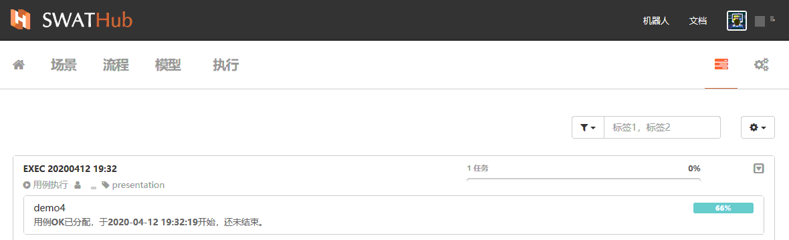
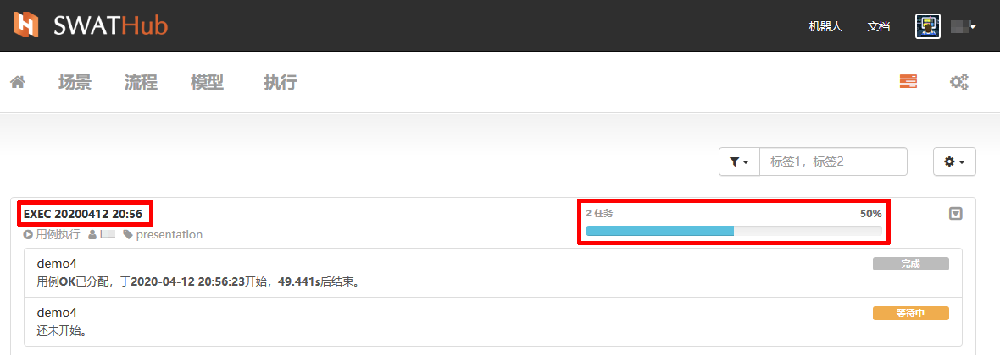
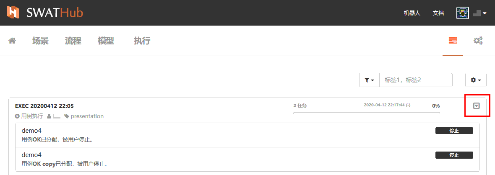

执行任务
===

当选定的单个或多个场景（含用例）任务执行开始，页面自动跳转到 <i class = "fa fa-tasks"></i> 任务组画面，当在其他画面中，显示正在执行的任务组及任务的进度和相关信息。

列表操作
---

当任务组执行时，在设计平台端的任务组执行界面和机器人客户端上同步显示任务组各任务的执行状态和进度。

任务组名称按用例执行时的设定显示，<i class = "fa fa-play-circle"></i> 标识当前动作为**用例执行**，<i class = "fa fa-user"></i> 本次任务组执行用户，<i class = "fa fa-tag"></i>当前任务组所属场景组。

右侧进度条为当前任务组中所包含的任务数量和执行进度。例如，本场景组中包含2个任务，则每个任务执行结束后，进度条推进50%，当全部任务执行完成后，进度数据统计显示100%，任务组的启动时间和全部执行耗时显示在进度条上方。

任务组内任务列表则以**场景-用例**为单位显示，每一条为一个用例在场景流程中的执行进度显示，场景任务的执行状态在左侧以文字描述形式显示，完成进度则在右侧标签中显示。

### 过滤器

任务组的过滤选项有按名称和按标签两种选择，用户可以根据名称中的关键字（例如，日期）或自定义的标签关键字过滤出需要查看的任务组。

### 任务动作

任务组操作界面的任务动作选项为**清空已完成任务组**，可以通过此操作清除无用记录，释放界面显示空间。

任务组操作
---

在任务组右侧的的  <i class = "fa fa-caret-square-o-down"></i>  下拉菜单中有三个操作选项，分别是：
*  <i class = "fa fa-stop"></i>  停止
*  <i class = "fa fa-play"></i>  开始/恢复
*  <i class = "fa fa-trash-o"></i>  删除

### 执行的停止

当任务组在执行状态下，未完成全部任务执行之前，均可使用停止操作来停止任务的执行。如任务组中有多个任务，已完成的任务保持灰色标签**完成**状态不变，未完成的任务则显示黑色**停止**标签。当 <i class = "fa fa-stop"></i> **停止**操作可用时， <i class = "fa fa-play"></i>  **开始/恢复**操作和 <i class = "fa fa-trash-o"></i>  **删除**操作均不可用。

* 当任务组使用了 <i class = "fa fa-stop"></i> **停止**操作后，任务标签显示为黑色标记**停止**状态，此时<i class = "fa fa-play"></i>  **开始/恢复**操作和 <i class = "fa fa-trash-o"></i>  **删除**为可用状态。
* 当任务组在**停止**状态，执行 <i class = "fa fa-trash-o"></i>  **删除**操作，则删除当前任务组，并不可恢复继续执行。
* 当任务组全部任务执行完毕后， <i class = "fa fa-stop"></i> **停止**操作不可用。

### 执行的开始/恢复

只有在任务组执行被 <i class = "fa fa-stop"></i> **停止**操作后方可使用 <i class = "fa fa-play"></i>  **开始/恢复**操作。**开始/恢复**操作从**停止**操作的任务开始从头执行，而已经完成的任务则不再重复执行。

* 当任务组全部任务执行完毕后， <i class = "fa fa-play"></i>  **开始/恢复**操作不可用。

### 执行的删除

当任务组执行被**停止**或全部执行完成后，用户均可使用  <i class = "fa fa-trash-o"></i> **删除**操作。

* 任务组 <i class = "fa fa-trash-o"></i> **删除**操作为不可恢复操作，请谨慎操作。

