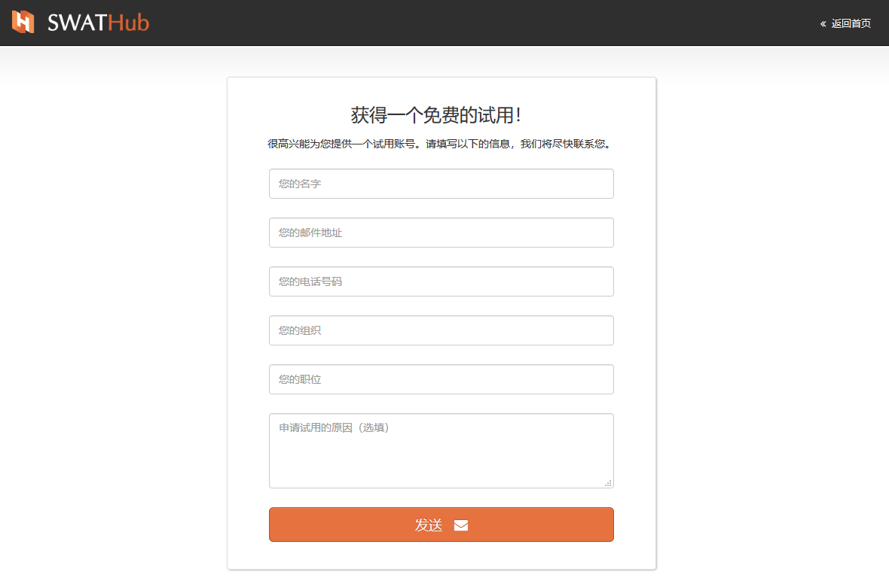
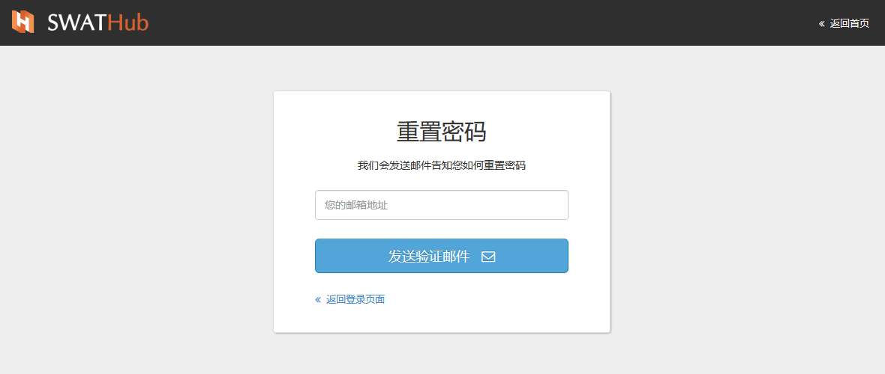
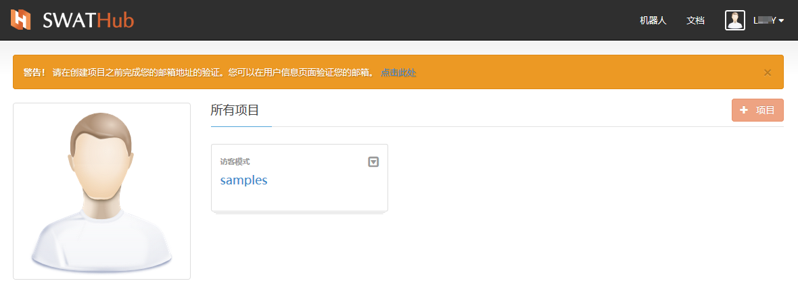
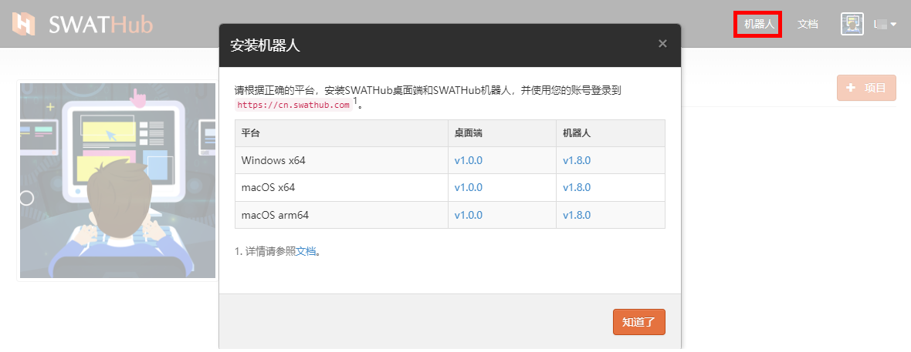
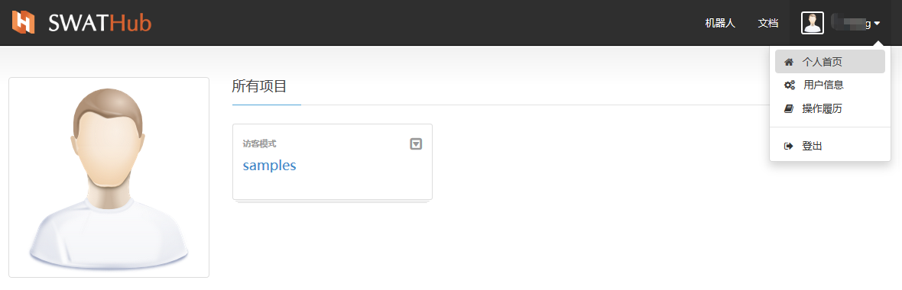
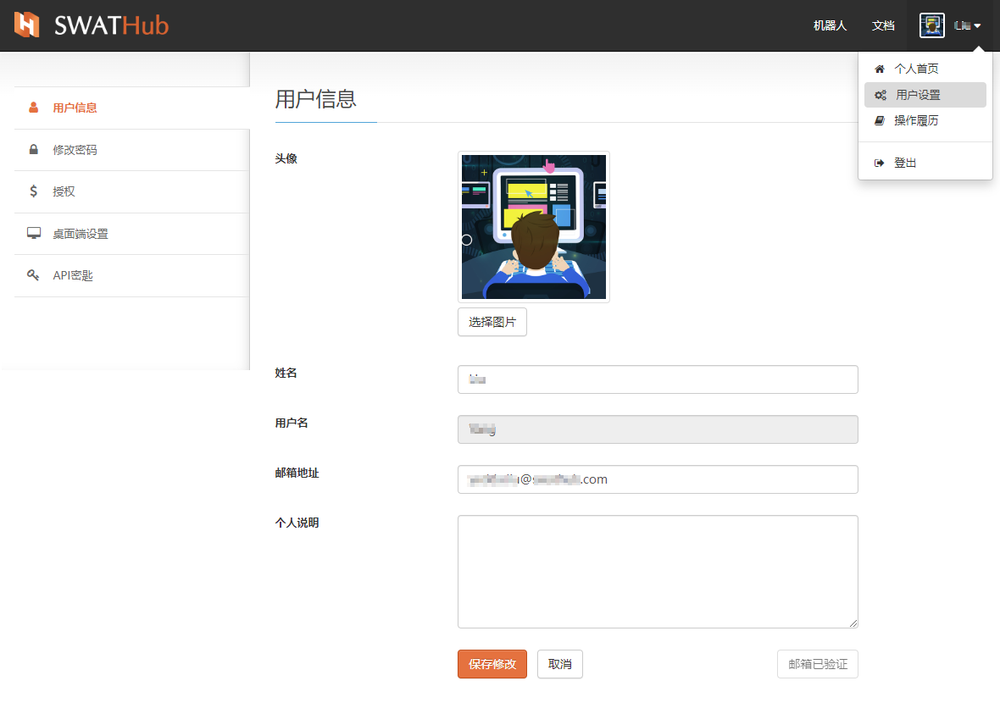
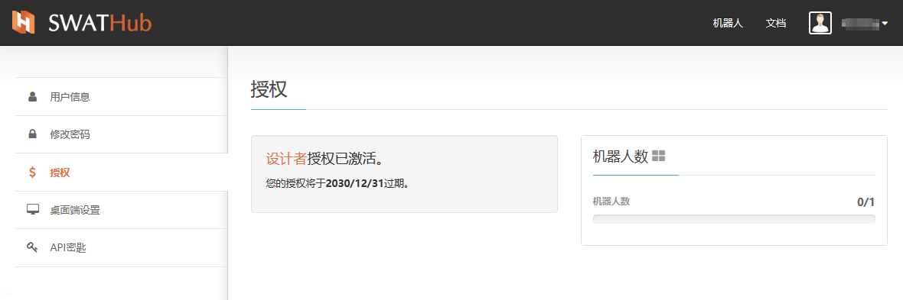

用户
===

基本功能
---

?> 以下为公有云版用户注册流程，企业版用户的注册流程请参考[企业版管理](design_enterprise_management)。

?> 推荐使用Chrome、Edge、Firefox、Safari等浏览器进行访问，IE系列浏览器在个别页面上可能无法正常显示。

### 注册

#### 账号申请入口：

访问 [SWATHub首页](http://cn.swathub.com)，点击**免费试用**按钮进入免费使用的设计账号申请页面：

#### 填写信息：

根据页面显示的内容填写一份简单的申请调查，然后点击**发送**后，请等待我们的邮件反馈。

#### 激活账号：

根据您填写的邮箱里收到的邮件中的激活链接，激活您的设计账号，开始SWATHub的试用。免费账号默认从注册之日起14天内有效，并开放全部公有云版功能供您体验试用。

### 登录/登出

#### 登录：

用户名或注册邮箱均可作为登录验证信息；

#### 忘记密码：

当您忘记了登录密码时，请点击**忘记密码**，按照页面的操作指引完成重置密码操作。

#### 用户激活：

账号需通过邮箱链接激活后，方可创建项目。如果您在收到含有试用账号和密码信息的邮件时，没有通过激活链接来激活账号，仅凭用户名和密码登录平台后，您会在个人首页的顶部看到**警告**信息，请在登录成功后继续完成账号的激活，以便可以开始正常的使用。

账号完成激活之后，您会在个人首页的顶部看到**成功**信息。

#### 桌面端流程编辑器和机器人下载安装

当您成功登录到SWATHub在线设计平台时，您可以点击**机器人**选择适合您电脑操作系统的**桌面端流程编辑器1**和**机器人客户端**版本下载并安装到您的电脑上，以便后续更完整的体验SWATHub流程自动化平台及终端的各种功能。

?> 1. SWATHub-Desktop桌面端流程编辑器仅支持版本号为**v1.8.0**及以上的**机器人客户端**进行项目设计。

#### 帮助入口

在个人首页的**文档**里，您可以找到中文、日文版的帮助文件。

#### 登出

点击**用户**位置的下拉菜单，可以看到**登出**选项，点击**登出**即可退出工作环境。

#### 个人首页

未来您所设计/参与的全部项目1，会展示在个人首页，并可以直接看到您在该项目中的用户身份模式，您可以从个人首页直接快速进入目标项目组。

?> 1. 当您第一次进入个人首页时，可以看到一个简单的项目示例，为您接下来的设计工作提供简单的参考和示范。

用户设置
---

### 用户信息

* 姓名：推荐用户使用全名，支持中文、日文、英文。
* 用户名：用户名注册成功后不可修改，且与申请注册时登记的邮箱绑定。
* 邮箱地址：支持修改，单修改后需要重新激活，方可与用户名重新绑定，继续使用。
* 个人说明（可选）：请简要介绍您自己的相关情况和试用目的。

修改邮箱信息后，请**保存修改**后，点击**验证邮箱**重新完成邮箱验证。

### 修改密码

用户自定义密码规则仅限使用英文大小写字母、数字和”-“，位数推荐设置6位以上。

### 授权

显示当前账号有效期及使用量信息。根据用户授权的类型不同，会显示不同种类的使用量信息。

### 桌面端设置

您可以选择使用SWATHub桌面端或者网页端应用来打开场景。如果当前系统中没有安装**桌面端设计器**，请选择**使用网页端应用**。

### API密匙

* API密匙：在SWATHub设计平台使用API时，需要使用账号专有的API密匙。
* 更改密匙：用户可以通过**更改密匙**功能来重新获取API密匙，更改后需将所有调用此API密匙的项目API密匙参数同步修改。

操作履历
---

设计账号的操作履历以时间顺序在**操作履历**中逐项记录，用以回溯查看；

