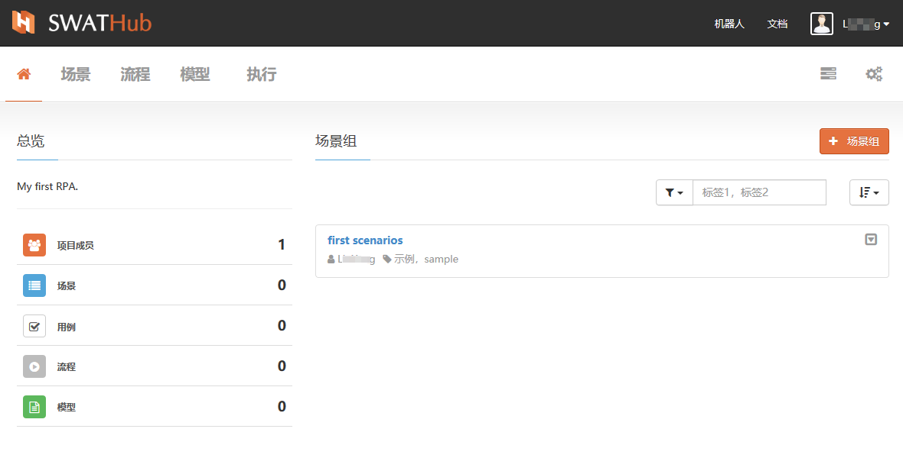
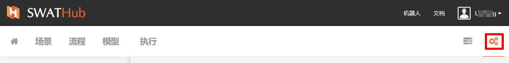
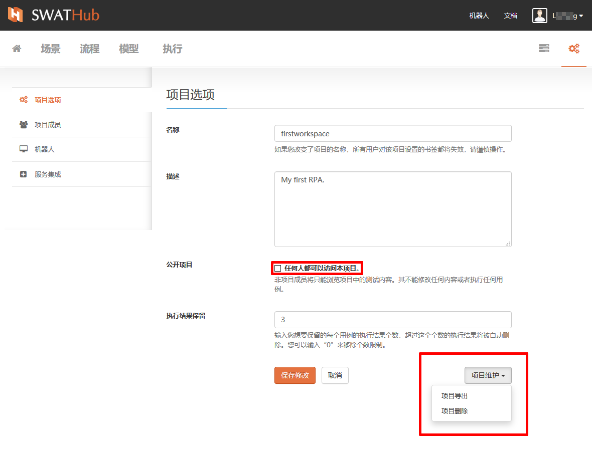
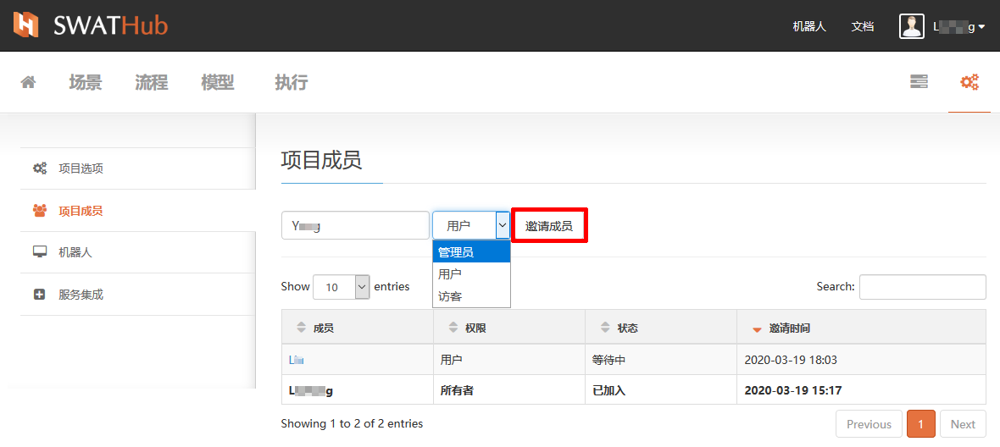
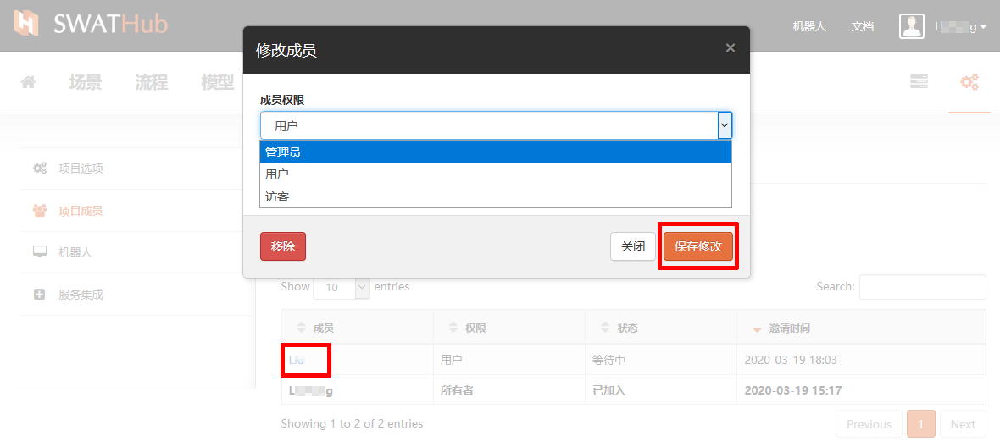
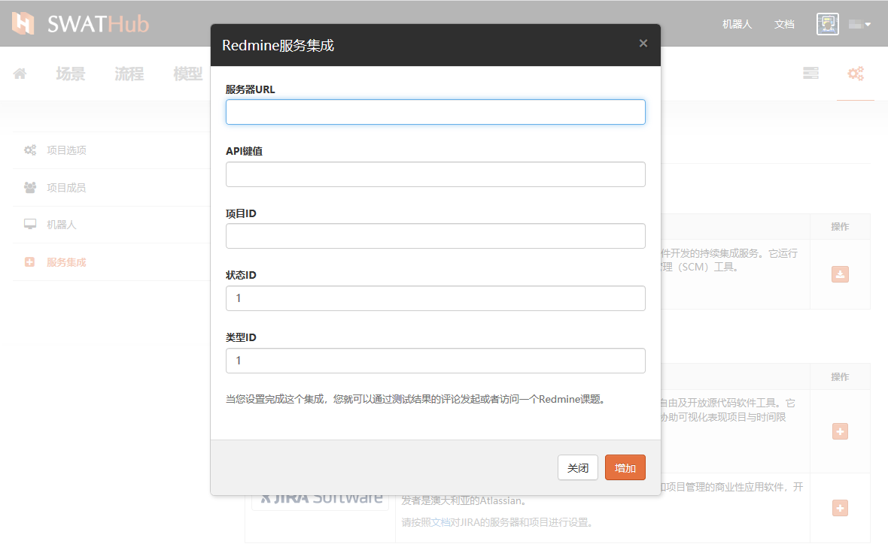
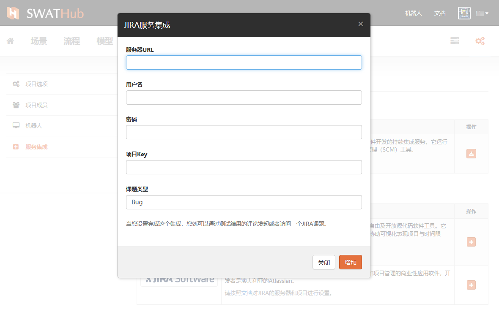

工作项目
===

基本功能
---

### 创建新项目：

当我们创建一个新的工作项目，首先我们要为项目设定一个名称，并添加对项目的描述。然后点击**创建**按钮，正式创建一个工作项目。

### 加入项目

普通用户不能主动加入他人创建的项目，但是可以通过项目的所有者邀请而加入项目，当您的SWATHub注册邮箱收到来自项目所有者的邀请邮件，点击 `接受` 按钮，即可成功以邀请者设定的成员权限加入该项目。

?> 企业版由项目管理员直接管理项目所有成员的添加和删除，以及项目中的成员权限设定。

### 退出项目

项目不支持直接关闭，作为项目的创建者，可以通过**设置**进入**项目选项**进行项目导出和删除，但不能直接**退出**项目；而作为成员身份则可以直接点击**退出**选项关闭个人首页中的此项目。

项目首页
---
进入项目的首页，您可以看到工作区域的两个部分，分别是**总览**和**场景组**，分别呈现用户的当前工作内容汇总和当前项目的场景组信息。

### 总览

项目总览中会包含以下统计信息：

* 项目成员：包含当前项目创建者及被邀请的其他设计者的总人数。当进入**非成员模式**的公开项目中，总览区中不显示本项信息。
* 场景：当前项目中全部的场景数量，包含多场景组共用或单个场景组使用的场景，场景操作的说明详见[场景](design_scenario.md)。
* 用例：当前项目中各场景所使用的用例的数量，用例操作的说明详见[用例](design_case.md)。
* 流程：当前项目中创建的全部流程数量，流程操作的说明详见[流程](design_flow.md)。
* 模型：当前项目中创建的全部模型数量，模型操作的说明详见[模型](design_model.md)。

### 场景组

项目场景组信息里包含本项目所有场景组的列表，列表信息中包括场景组名称、创建者、标签和场景组基本操作入口。关于场景组的详细操作说明请见[场景组](design_scenario_gorup.md)。

项目设置
---

通过项目首页中的**项目设置**按钮，可以进入项目设置页面，对项目中以下信息进行设置和查看。包括：

* 项目选项
* 项目成员
* 机器人
* 服务集成

### 项目选项

在选项中，设计用户可以对项目的以下信息进行修改和操作：

* 名称：项目名称支持重新命名。
* 描述：项目描述支持重新编写。
* 项目公开：默认为不公开，勾选后则项目为全平台用户可见项目（如个人首页展示的sample项目），但其他用户仅自动获得**访客模式**权限，不能对项目及其内容进行编辑、复制、删除等操作。
* 执行结果保留：系统默认[执行结果](design_result)自动保留3条，如需更改执行结果保留数量可自行更改。
* 项目维护：
  * 项目导出：包含模型、流程和项目设置的导出，不包含已执行的项目结果；企业版支持项目导入。 
  * 项目删除：仅有项目所有者可见，项目删除后，原项目中的所有成员会同时离开项目。

### 项目成员

#### 成员权限

SWATHub平台对项目成员的角色和权限做以下设定：
* 所有者：项目创建者即为项目所有者，拥有全部操作权限。
* 管理员：通过项目所有者以**管理员**权限邀请加入项目的用户，在完成认证后，即成为被邀请项目的管理员角色，拥有除项目删除外的所有权限。
* 用户：通过项目所有者或管理员以**用户**权限所邀请加入项目的用户，完成认证后即成为被邀请项目的协作用户，可以参与项目中所有开发相关工作，但无对本项目的项目选项、成员加入和服务集成的操作权限。
* 访客：通过项目所有者或管理员以**访客**权限所邀请加入项目的用户，如本项目为非公开项目，访客权限亦可对项目进行访问，但不拥有对项目的任何操作权限。

#### 成员操作

* 邀请成员：项目所有者可以通过输入用户名、定义用户身份，“邀请成员”来完成项目成员的邀请，被邀请人通过邮箱收到的邀请链接确认加入项目。

* 修改成员权限：项目所有者可以根据实际需要对已被邀请并成功加入项目的用户进行权限修改，修改成功后该用户在项目中的权限在该用户重新登录SWATHub设计平台后立即生效。

* 移除项目成员：项目所有者可以根据实际需要对已被邀请并成功加入项目的用户进行移除，修改成功后该用户在项目中的成员权限在该用户重新登录SWATHub设计平台后立即失效。

### 机器人：

此项目中的机器人列表中显示所有与本项目链接的机器人信息。

### 服务集成

SWATHub设计平台集成了包括批量执行、测评服务和错误管理的外部服务。

#### Jenkins

在标准CI（持续集成）周期中，每个构建都将触发测试动化步骤以验证应用程序。 SWATHub提供了与流行的CI平台-Jenkins的集成1。

?> 1. 需要Jenkins 1.580.1或更高版本才能启用集成。

##### 安装SWATHub插件

SWATHub执行插件 [SWATHub Execution Plugin](tools/swat-jenkins-execution-v2.0.zip)可以在Jenkins作业中生成一个步骤，该步骤能够在SWATHub上启动一批测试用例执行，然后生成测试报告。 这是托管在 [Github](https://github.com/SmartekWorks/swathub-execution-plugin)上的开源项目。

安装与其他Jenkins插件相同。 以Jenkins管理员身份登录，转到**系统管理>插件管理>高级**，选择插件文件并将其上传到Jenkins。插件安装完成后，将进行一些全局设置，这些设置可以在Jenkins作业中覆盖：

* `SWATHub Domain`： 例如，SWATHub服务器的根路径， `https://swathub.com` 。
* `Workspace Owner's Username`： 项目所有者的用户名（可以从您的项目的URL中找到）。
* `Workspace Name`： 项目的名称（可以从您的项目的URL中找到）。
* `Username`： 用户名。
* `API Key`： 用户的apiKey.
* `Proxy Server` (可选)： Jenkins可以通过其连接SWATHub的代理服务器的URL。 默认为空。
* `Proxy Port` (可选)： 代理服务器的端口。 默认为空。
* `Proxy Username` (可选)： 代理服务器的端口。 默认为空。
* `Proxy Password` (可选)： 代理服务器认证的密码。 默认为空。

##### 配置SWATHub构建步骤

在Jenkins作业中，您可以从构建步骤列表中添加 **SWATHub构建步骤**，并配置以下设置：

* `Test Set ID` (Optional): 测试集的ID（可以从测试集的URL中找到）。 使用空白在所有测试集中运行案例。 默认为空。
* `Robot Name` (Optional): 执行的机器人名称。 使用空白进行自动选择。
* `Browser Code` (Optional): 执行的浏览器代码。 可选浏览器包括：`IE`、`Chrome`、`Firefox`、`Edge`、`Edge Legacy`、`Safari`。 对于默认浏览器，请使用空白。 默认为空。
* `Run Cases Sequentially` (Optional): 是否允许案例按顺序运行。 使用 `true` 或 `false` 。 默认为 `false`。 
* `Test Server URL` (Optional): 测试服务器的URL。 使用空白继承测试集中的设置。 默认为空。
* `API Server URL` (Optional): API服务器的URL。 使用空白继承测试集中的设置。 默认为空。
* `Scenario Tags` (Optional): 用于过滤要执行的方案的标签，以逗号分隔。 默认为空。
* `Step Options` (Optional): 此执行的步骤选项。 使用空白json继承测试集中的设置。 默认值为`{}`.
* `Create Issue on Error` (Optional):是否在执行错误的情况下创建课题。使用 `true` 或 `false` 。 默认为 `false`。

如果展开该步骤的**高级**设置，则可以找到这些全局设置并仅针对此步骤进行更新。

?> 环境变量可以在上面的任何参数中使用，格式为 `$Var1` 或 `$my_var_2`。请注意，只有字母数字和下划线可用作变量名称。 可以混合使用纯文本和变量，例如 `http://$swathub_host:8080`。

##### 配置JUnit测试结果报告

为了以JUnit格式显示执行结果，在此Jenkins作业中，需要在发布后步骤中附加**发布JUnit测试结果报告**步骤。 请将测试报告（XML）的名称设置为`swat_result.xml`。
#### Redmine

[Redmine](http://www.redmine.org)是一个免费的开源基于Web的项目管理和问题跟踪工具。 测试人员可以在SWATHub上设计和执行场景用例，然后在SWATHub Redmine集成1的帮助下报告Redmine上的项目问题。

?> 1. 需要Redmine 2.0或更高版本才能启用集成。

##### 设置Redmine集成

SWATHub提供了与第三方服务的多种集成，以便利用您现有的IT基础架构并提高测试效率。 请转到您的工作区之一，选择**设置>集成**，单击Redmine旁边的 <i class = "fa fa-plus"></i> ，然后配置以下设置：

* `服务器URL`： Redmine服务器的URL。
* `API键值`： 报告问题的用户的API密匙。
* `项目ID`： 报告问题的项目的ID或项目代码（Redmine3.3以上版本）。
* `状态ID`： 可以在Redmine中定义的“打开”状态的ID。 默认值为“ 1”。
* `类型ID`： 可以在Redmine中定义的`issue`类型的ID。 默认值为“ 1”。

##### 报告测试问题

启用Redmine集成后，对于每个测试结果，您都可以向Redmine报告问题。

* 在测试结果页面上，单击 **<i class="fa fa-comments-o"></i> > <i class="fa fa-bug"></i>**，写下问题说明， 然后发布。 Redmine上将创建一个新期刊，其链接显示在评论项目上。
* 如果使用[Jenkins](#jenkins)触发执行并启用了`错误时创建问题`，则将为每个失败的测试结果创建一个新问题，并且该新问题还将同步到Redmine。
* 您可以通过单击此链接轻松导航至Redmine，并找到包含所有说明和链接的测试结果的新创建的问题。
* 如果要检查与一个测试用例有关的所有问题，请在测试集页面中选择该用例，单击 **<i class = "fa fa-comments-o"> </i> View Comments**，可以查找按日期排序的所有评论和问题。

#### JIRA

[JIRA](https://www.atlassian.com/software/jira) 是Atlassian开发的专有问题跟踪产品。 测试人员可以在SWATHub上设计和执行测试用例，然后借助SWATHub JIRA集成1报告JIRA上的测试问题。

?> 1. 需要JIRA 5.0或更高版本才能启用集成。

##### 设置JIRA集成

请转到您的工作区之一，选择**设置>集成**，单击JIRA旁边的 <i class = "fa fa-plus"></i> ，然后配置以下设置：

* `服务器URL`： JIRA服务器的URL。
* `用户名`： 访问JIRA服务器的用户名。
* `密码`： 访问JIRA服务器的用户的密码。
* `项目Key`： 测试项目用来报告问题的专有值。
* `课题类型`： 问题的类型，例如JIRA服务器中定义的`Bug`等。

##### 报告测试问题

启用JIRA集成后，对于每个测试结果，您都可以向JIRA报告问题。

* 在测试结果页面上，单击 **<i class="fa fa-comments-o"></i> > <i class="fa fa-bug"></i>**，写下问题描述 ，然后发布。 JIRA上将创建一个新期刊，其链接显示在评论项目上。
* 如果使用[Jenkins](#jenkins)触发执行并启用了`错误时创建问题`，则将为每个失败的测试结果创建一个新问题，并且该新问题还将同步到JIRA。
* 您可以通过单击此链接轻松导航至JIRA，并找到包含所有描述和链接的测试结果的新创建的问题。
* 如果要检查与一个测试用例相关的所有问题，请在测试集页面中选择该用例，单击 **<i class = "fa fa-comments-o"> </i> View Comments**，然后将按日期查找所有评论和问题。
