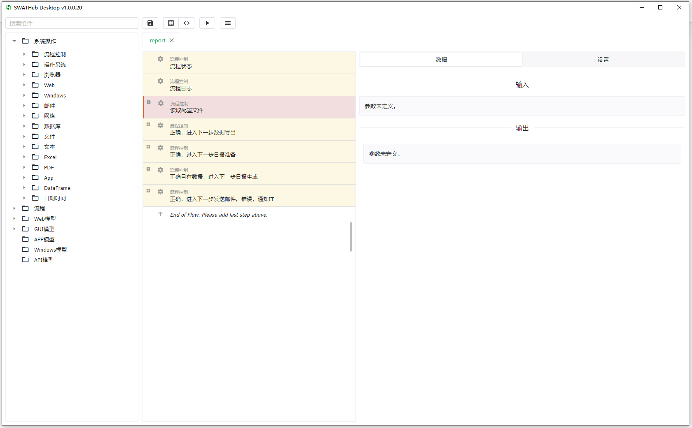
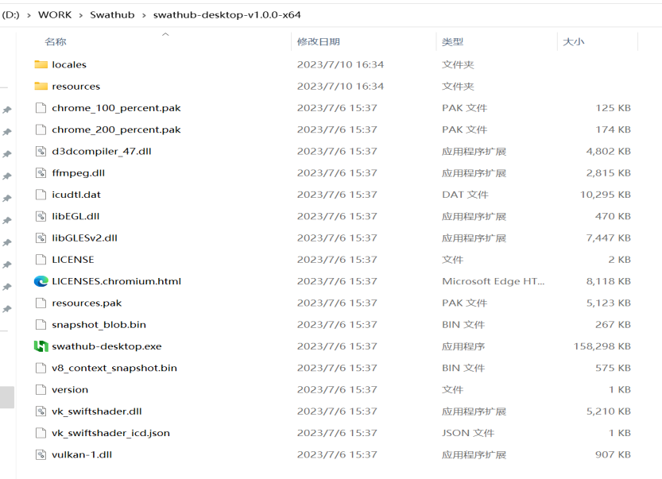
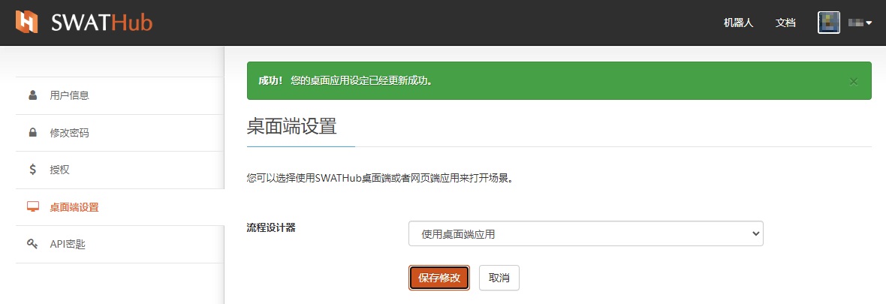
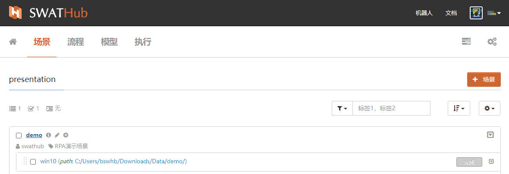
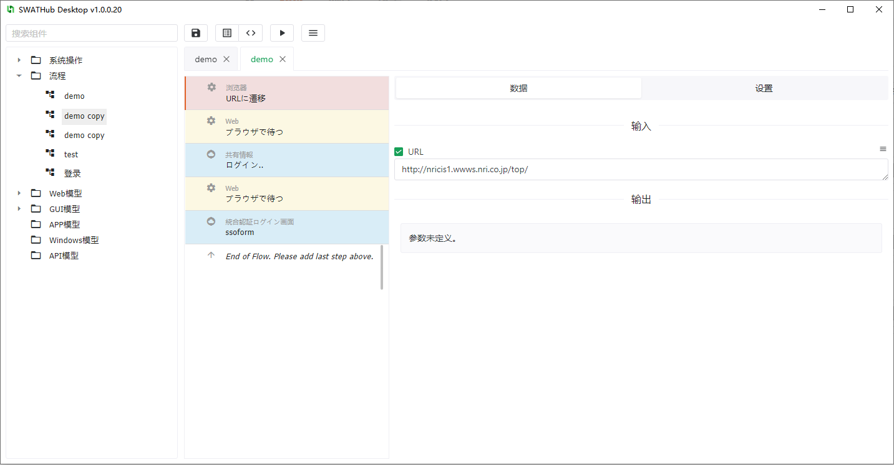
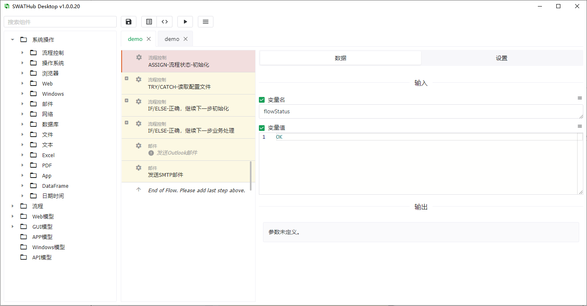
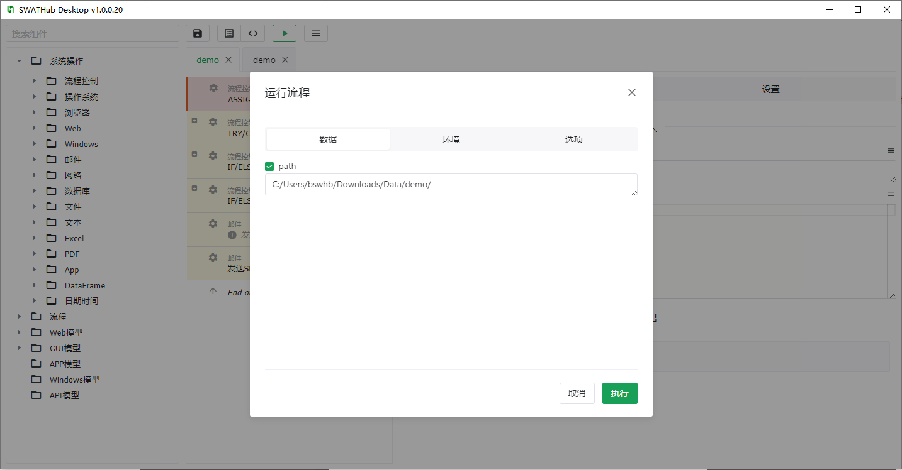
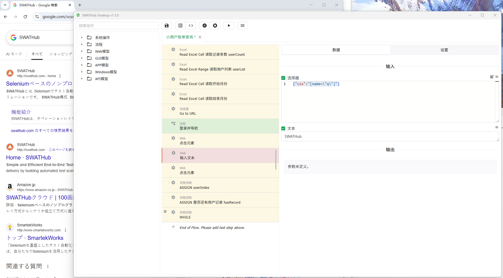

桌面端流程编辑器
===

SWATHub提供了桌面端的流程编辑工具，用户可以无需打开浏览器访问SWATHub服务器，直接在机器人端完成流程的设计、调试和执行。

安装设置
---

1. 下载SWATHub桌面端流程编辑器，安装包参考[机器人安装步骤](robot_setup#安装步骤)，如 `swathub-desktop-v1.0.0-x64.zip`。
2. 将SWATHub编辑器安装包解压缩到安装目录。

3. 登录SWATHub网页端**用户设置**界面，将**桌面端设置**修改为`使用桌面端应用`。

流程选择
---

1. 选择需要使用桌面端流程编辑器编辑的某个SWATHub工作项目的场景或流程，进入编辑器画面。

2. 打开**桌面端应用**后，即可进入该工作项目的场景或流程的编辑操作界面，桌面端应用支持同时打开同一个工作项目内的多个场景或流程。

流程搭建
---

桌面端流程编辑器的操作界面和 [Web端界面](design_scenario) 是基本一致的，用户可以从左侧的组件选择区域，将各类系统操作、流程操作和模型操作，用拖拽的方式加入到中间的流程搭建区域，并且在右侧的步骤属性区域，设置其所需的各类输入和输出参数。

用户也可以点击工具栏中的 <i class = "fa fa-save"></i> 按钮，对编辑的内容进行`保存`；点击工具栏中的 <i class = "fa fa-list"></i> 按钮或 <i class = "fa fa-code"></i> 按钮，来切换至`参数模式`或`代码模式` 。

流程运行
---

用户可以点击工具栏中的 <i class = "fa fa-play"></i> 按钮来运行当前设计的流程1，在弹出的运行对话框中，与Web端类似的，用户需要设置对应的输入参数，运行的平台环境，以及可能需要的步骤选项。需要指出的是，流程运行的时候同样会导入场景组中的前/后拦截器设置、缺省步骤选项和其他运行设置。

?> 1. 流程执行需要版本号为v1.8.0及以上的SWATHub机器人的支持，在桌面端流程编辑器中进行项目设计运行时，需确保对应版本的机器人客户端处于已开启状态。

流程录制
---

用户可以点击工具栏中的 <i class = "fa fa-plus"></i> 按钮进入Web录制模式1，此时用户在浏览器中的操作，将被自动保存为SWATHub的流程步骤。

1. 首次进入录制模式之后，需要先安装 [SWATHub Recorder](https://chrome.google.com/webstore/detail/swathub-recorder/gidimbkiadpbkmmikbibpgicnaomlaki) 浏览器插件，安装完毕之后关闭浏览器。
1. 其次需要下载 [Recorder Helper](tools/swathub-recorder-helper_v1.1.0.zip) 程序包，解压到用户的本地目录中去，如下所示：
    * Windows：`%appdata%\swathub-desktop\recorder`
    * macOS：`/Users/<username>/Library/Application Support/swathub-desktop/recorder`
1. 打开命令行工具，在上述目录中，执行相关批处理文件：
    * Windows：`setup.bat`
    * macOS：`./setup.sh`
1. 再次点击录制按钮，编辑器会自动打开一个新的浏览器窗口，即可进入Web录制模式，工具栏中出现 <i class = "fa fa-pause"></i> / <i class = "fa fa-stop"></i> 按钮。
1. 用户需要先在编辑器中点击某个步骤，此后在浏览器中的操作，会自动添加到选中的步骤后面。
1. 用户可以点击 <i class = "fa fa-pause"></i> / <i class = "fa fa-play"></i> 按钮，来选择需要录制的操作步骤。点击 <i class = "fa fa-stop"></i> 按钮，结束录制模式，浏览器自动关闭。

?> 1. 目前仅支持 Chrome 浏览器。