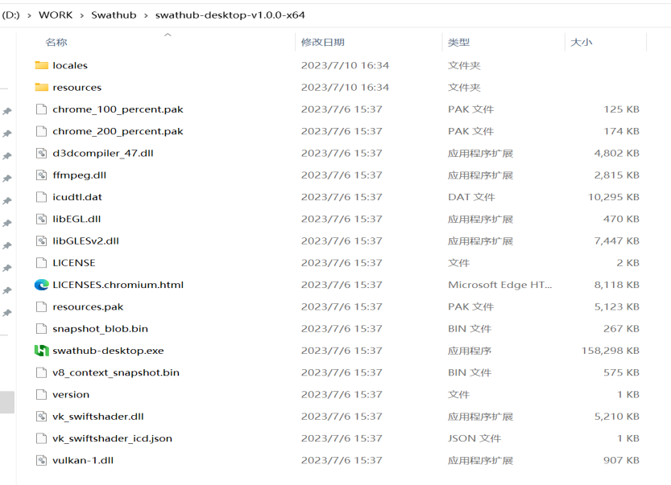
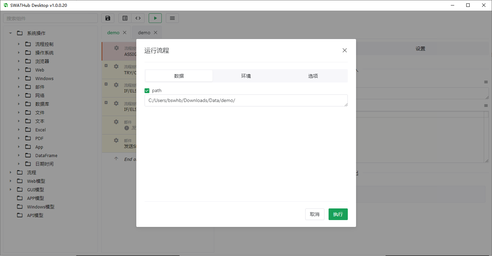

桌面端流程编辑器
===

SWATHub提供了桌面端的流程编辑工具，用户可以无需打开浏览器访问SWATHub服务器，直接在机器人端完成流程的设计、调试和执行。

安装设置
---

1. 下载SWATHub桌面端流程编辑器，安装包参考[机器人安装步骤](robot_setup#安装步骤)，如 `swathub-desktop-v1.0.0-x64.zip`。
2. 将SWATHub编辑器安装包解压缩到安装目录。

3. 登录SWATHub网页端**用户设置**界面，将**桌面端设置**修改为`使用桌面端应用`。

流程选择
---

1. 选择需要使用桌面端流程编辑器编辑的某个SWATHub工作项目的场景或流程，进入编辑器画面。

2. 打开**桌面端应用**后，即可进入该工作项目的场景或流程的编辑操作界面，桌面端应用支持同时打开同一个工作项目内的多个场景或流程。

流程搭建
---

桌面端流程编辑器的操作界面和 [Web端界面](design_scenario) 是基本一致的，用户可以从左侧的组件选择区域，将各类系统操作、流程操作和模型操作，用拖拽的方式加入到中间的流程搭建区域，并且在右侧的步骤属性区域，设置其所需的各类输入和输出参数。

用户也可以点击工具栏中的 <i class = "fa fa-save"></i> 按钮，对编辑的内容进行`保存`；点击工具栏中的 <i class = "fa fa-list"></i> 按钮或 <i class = "fa fa-code"></i> 按钮，来切换至`参数模式`或`代码模式` 。

流程运行
---

用户可以点击工具栏中的 <i class = "fa fa-play"></i> 按钮来运行当前设计的流程1，在弹出的运行对话框中，与Web端类似的，用户需要设置对应的输入参数，运行的平台环境，以及可能需要的步骤选项。需要指出的是，流程运行的时候同样会导入场景组中的前/后拦截器设置、缺省步骤选项和其他运行设置。

?> 1. 流程执行需要版本号为v1.8.0及以上的SWATHub机器人的支持，在桌面端流程编辑器中进行项目设计运行时，需确保对应版本的机器人客户端处于已开启状态。

