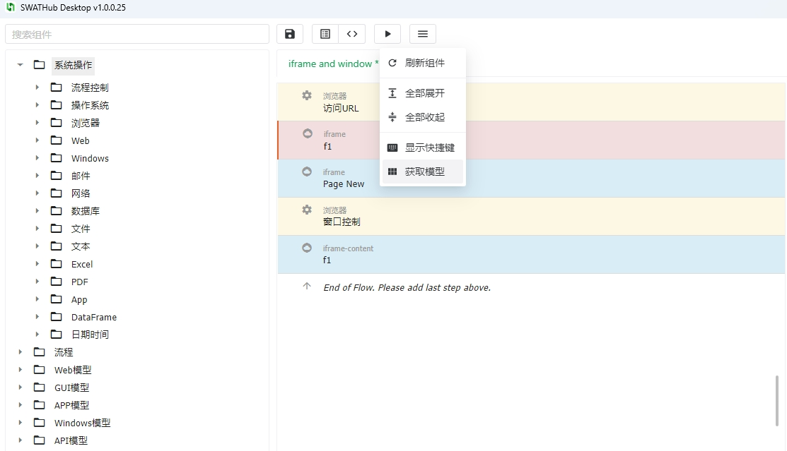
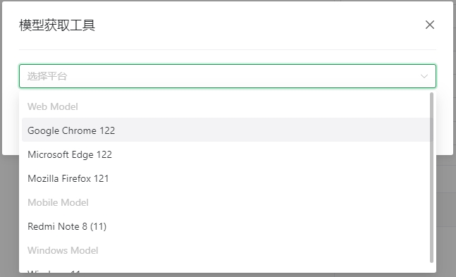
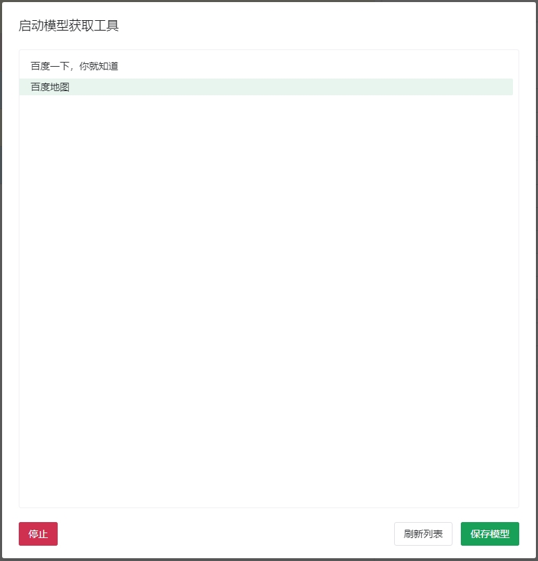
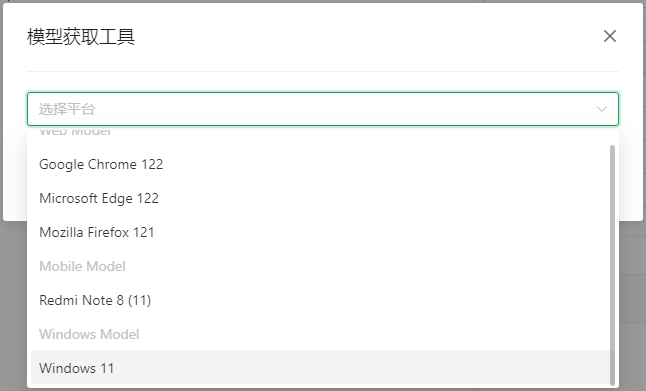
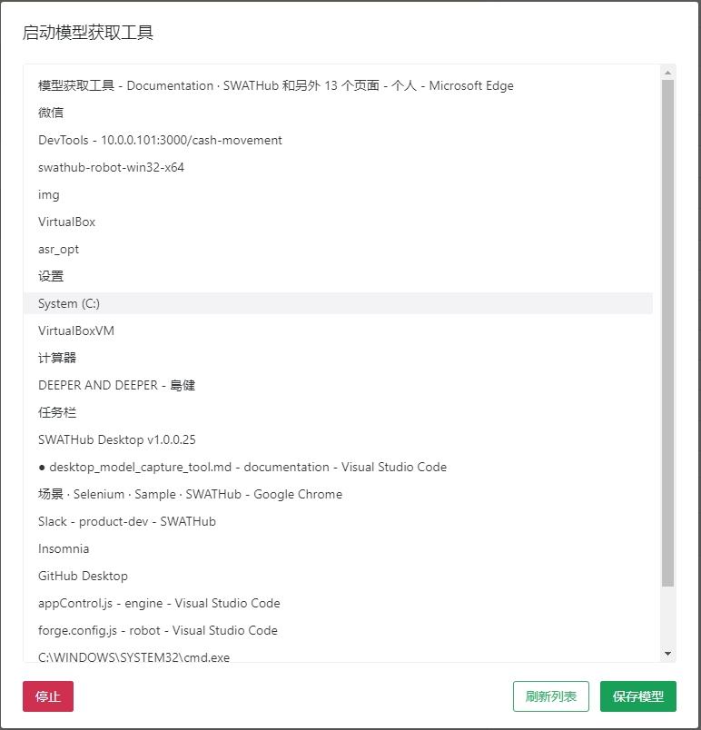
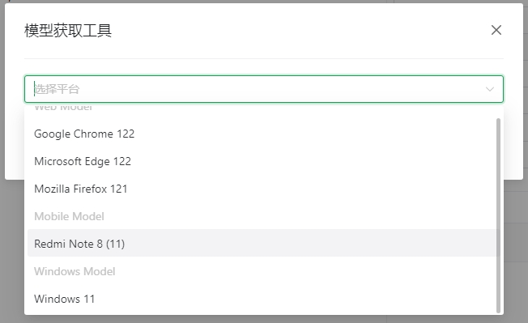
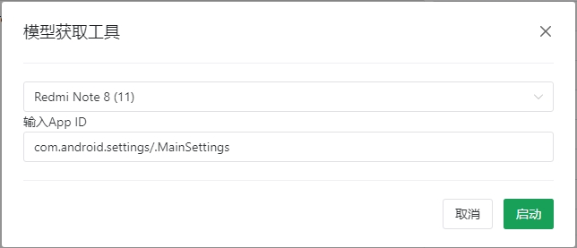
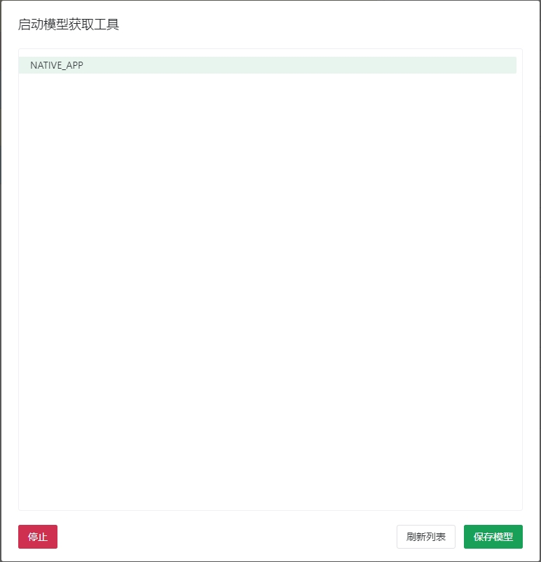

模型获取工具
===

SWATHub桌面端集成了「模型获取工具」，我们可以使用桌面端工具实现Web模型和APP模型的获取。通过桌面端 **工具** 菜单进入 **模型获取工具** 界面，选择模型文件获取类别，开始获取操作1。

?> 1. 启动模型获取工具之前，请确保 **SWATHub机器人** 已经启动。

网页模型的获取
---

Web模型的获取操作步骤如下：

1.  进入 **模型获取工具** 界面，选择获取网页文件所要使用的浏览器1。

2. 点击 **启动** 按钮后，选定的浏览器自动打开，我们可以输入目标Web站点的URL，打开网页。

3. 点击 **刷新** 按钮后，即可获取所有打开页面的列表，如下图所示：

4. 点击 **保存** 按钮后，保存后的网页文件即可按照[对象模型](design_model.md#Web模型)的操作方式进行模型功能操作了。

?> 1. SWATHub机器人自动获取当前机器安装的浏览器，并显示在列表中。

Windows模型的获取
---

1. 进入 **模型获取工具** 界面，选择当前Windows操作系统。

2. 点击 **刷新** 按钮后，即可获取所有打开应用的列表，如下图所示：

3. 点击 **保存** 按钮后，保存后的网页文件即可按照[对象模型](design_model.md#Windows模型)的操作方式进行模型功能操作了。

APP模型的获取
---

1. 进入 **模型获取工具** 界面，选择启动APP所需的设备名称。

2. 输入APP ID，点击 **启动** 按钮。

3. 等待APP启动成功之后，进入到模型页面，点击 **刷新** 按钮后，即可获取当前APP的列表，如下图所示：

4. 保存后的APP页面文件即可按照[对象模型](design_model.md#APP模型)的操作方式进行模型功能操作了。

* NATIVE_APP：保存为`sview`文件，代表了原生代码，作为移动模型导入。
* WebView_1：保存为`shtml`文件，代表了WebView的HTML代码，作为网页模型导入。