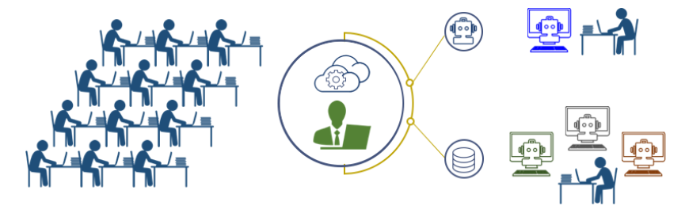
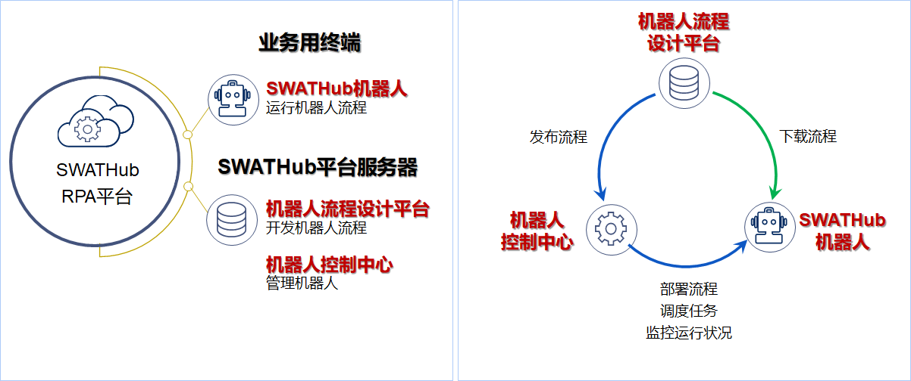
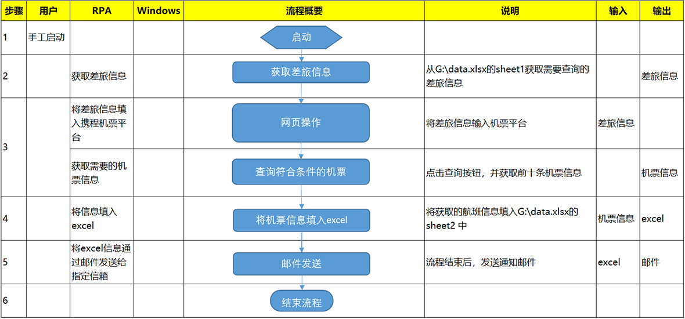

SWATHub的业务自动化（RPA）
===

SWATHub平台独特的建模技术和方便易用的实施方法，让RPA项目应用的难度大大降低。同时，SWATHub国际化的开发视角，对国内复杂的客户现场环境适配性更加稳定友好，并支持针对客户特殊环境的定制化开发。

那么什么是业务自动化呢？接下来，就让我们一起来了解业务自动化。

什么是业务自动化
---

业务自动化，即机器人流程自动化（Robotic Process Automation，简称RPA）。是指用软件机器人实现业务处理流程的自动化。软件机器人可以模仿人类，对多个应用程序或业务系统进行诸如显示内容的确认、内容的输入等一系列业务操作。



相比于人工执行，软件机器人的优势在于快速、准确、不知疲倦地做重复的业务操作，通常我们也把RPA软件机器人形容为“数字劳动力”。RPA让更多人从简单枯燥的重复工作中解放出来，以人机协作的方式，创造更多价值。

SWATHub的系统架构
---

SWATHub RPA平台分为SWATHub平台服务器和运行在业务终端上的SWATHub机器人两部分。



### SWATHub机器人

SWATHub机器人是安装在用户电脑上的RPA流程运行程序，其能够运行由SWATHub平台服务器设计的场景包或者安排的工作任务。

### SWATHub平台服务器

SWATHub平台服务器包含了机器人流程设计平台和机器人控制中心两个子平台，分别用来完成对机器人流程的设计和对机器人的管理。

现在就让我们开始走进SWATHub RPA，开启全新的信息自动化之路吧！


业务自动化（RPA）的快速上手
---

下面我们将通过一个简短的教程，介绍如何开始使用SWATHub，我们将在[携程机票订购平台](https://www.ctrip.com)的场景下，演示如何使用RPA工具通过一定的限制条件完成机票的查询以及机票的信息的获取。


### 准备

#### 用户
* 您首先需要一个SWATHub用户帐户，可以轻松地在[SWATHub 主页](http://cn.swathub.com/signup)上申请创建。
* 您会收到客服人员的电话或者邮件通知，协助您完成后续的的用户创建流程。

#### 项目
* 您需要创建一个项目<sup>1</sup>，存放项目相关的所有RPA流程和数据，可以让一个团队合作完成RPA的搭建工作。
* 您也可以被邀请作为成员访问现有项目，可以按照后续步骤创建RPA方案。

?> 1. 要创建自己的项目，需要验证您的电子邮件地址。

### 业务场景分析

1. 教程中的业务场景为行政人员为需要出差的同事安排机票的业务操作，需要在给定出差日期/出发/到达地的情况下给出符合条件的航班信息。
2. 业务场景操作的简介：
 * 进入到[携程航班页面](http://flights.ctrip.com)，选中国内机票的查询框。
 * 输入航程类型，出发地/目的地，以及出发日期，然后点击搜索机票。
 * 将前五条航班信息，包含出发时间/落地时间/航班公司/航班号/出发、到达机场等信息输入excel表格并保存在本地。
 * 将保存好的含有航班信息的excel通过邮件发送给指定邮箱。
3. 业务流程自动化流程解析：机器人按照行政人员的指示，在携程网获取机票信息并发送邮件到指定邮箱，主要的操作如视频所示。



在对业务自动化每一个子流程进行定义后，我们会进入到下一个步骤，也就是自动化流程的搭建。

<video width="720" controls>
	<source src="cn/assets/video/guide-rpa-01.mp4" type="video/mp4">
	The browser does not support video.</video>


### 自动化流程的搭建

1. 为了创建自动化业务流程的流程/场景，您需要首先添加场景组，并在已创建的场景组中添加业务场景。
2. SWATHub的RPA工具允许您按照组件的方式通过搭建子流程来分模块搭建自动化流程，您可以按照视频中的提示来搭建四个操作的子流程：**Excel Input**/**携程网页操作**/**Excel Output**/**邮件发送**，然后在场景页面把这四个子流程连接起来。
3. 在第二个子流程--**携程网页操作**的搭建过程中，您需要通过以下几个步骤完成:
	* 需要拖拽**访问URL**操作控件作为第一个流程步骤
	* 需要下载并启动[SWATHub机器人](robot_setup.md)，并通过其中的[模型获取器](robot_model_capture_tool.md)来捕获网页源文件，以便添加页面组件。
	* 您需要将捕捉后的页面文件保存在本地，并进入到已经创建的项目内的模型页面下，点击**+模型**按钮，然后选择**Web模型**进行导入模型的操作，在页面导入完成后，请按照视频中的步骤，将会在RPA流程中使用的**模型操作**的**操作名称**变更为合适的名称，并勾选不需要的**模型操作**，通过**操作动作**中的**隐藏操作**按钮从模型库中剔除掉。<sup>1</sup>
	* 在**网页数据抓取**的操作中输入以下通过页面解析获得的css命令来获取航班信息数据：

```json
{
  "opts": {
    "flights": {
      "listItem": ".searchresult_content .search_box",
      "data": {
        "info": ".flight_logo",
        "from_time": ".right .time",
        "from_airport": ".right .airport",
        "to_time": ".left .time",
        "to_airport": ".left .airport",
        "price": ".base_price02"
      }
    }
  }
}
```
4. 在第三个子流程--**Excel Output**的搭建过程中，您需要以下两个步骤完成：
	* 赋予一个计数变量`count`，并通过该变量让while语句运行五次`count<5`
	* 将在上一个流程中获取的数组类型变量`list`的值赋予到`data`中，并写入excel，其中赋予`data`的命令为：

```javascript
[
  [
    list.flights[count].info,
    list.flights[count].from_time,
    list.flights[count].from_airport,
    list.flights[count].to_time,
    list.flights[count].to_airport,
    list.flights[count].price
  ]
]
```

<video width="720" controls>
  <source src="cn/assets/video/guide-rpa-02.mp4" type="video/mp4">
	The browser does not support video.</video>

?> 1. 对于已经完成模型抓取的页面，在后续的业务系统升级后，系统会提示该页面操作元素已经变更，并建议用户进行更新操作。在按照提示操作完成后，此告警信息会消失。

### RPA在线流程调试

1. SWATHub提供了套完整的RPA业务机器人调试/运行以及维护的工具，首先在完成RPA流程搭建后，您可以在业务执行终端上进行在线调试，然后在完成在线调试后，您将会学到如何将流程部署到业务执行终端上，最后所有的运维日志会在业务执行终端的机器人log中，一旦部署好的机器人开始运作，所有的日志都会在上面记录。
2. 连接机器人到项目，首先您需要把之前下载的[SWATHub机器人](robot_setup)重新启动，并且将机器人连接到准备运行的业务自动化场景所属的项目下。
3. 在**调试/执行**完整流程之前，我们建议您先完成各个子流程的**调试**和**执行**，在对于子流程执行的过程中，需要逐步调整以下各个子流程的**输入**和**输出**：
	* **执行**模式是在线的对于某个场景的执行，在此模式下，您将会看到执行的进度以及完成后的**执行结果**；
	* **调试**模式是在线对于某个场景进行的调试，在此模式下，您不仅仅会看到该场景的执行，也能同步看到该场景当下进行的流程步骤；
	* **输入**和**输出**是在子流程中流转的变量，在子流程之中的衔接需要做好对应工作。

<video width="720" controls>
	<source src="cn/assets/video/guide-rpa-03.mp4" type="video/mp4">
	The browser does not support video.</video>

### RPA机器人的离线部署

1. 您可以点击流程页面右端的下拉菜单中的**下载**按钮，系统会自动下载一个pkg的文件，您只需要将该文件存放入机器人日志存放目录下的`spkg`目录下新建的场景文件，然后点击刷新按钮，就会自动生成一组机器人流程文件`input.json`和`scenario.json`。
2. 编辑`input.json`文件，将原来填写在场景用例中的输入项目，填入到该文件中，并保存修改。
3. 执行离线自动化流程，点击机器人窗口下的相关场景的运行按钮进行执行。

<video width="720" controls>
<source src="cn/assets/video/guide-rpa-04.mp4" type="video/mp4">
	The browser does not support video.</video>
