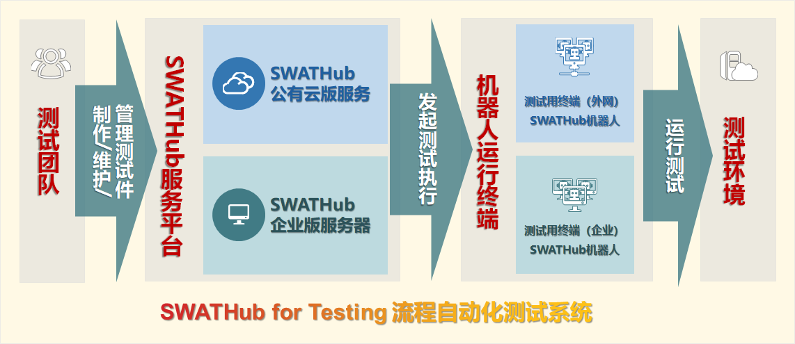

SWATHub的测试自动化
===

SWATHub平台独特的测试用例构建和多个机器人并发处理用例的实施方法，让自动化部署的性价比大大提升，可以让业务人员在无代码的情况下完成无影响测试。同时，SWATHub测试自动化平台的国际化视角以及方便的远端部署的方式，也让测试团队和开发团队之间的协作变得更为容易。

那么SWATHub的测试自动化平台又有哪些特点呢？下面就让我们一起来了解一下。

传统测试自动化的痛点
---

传统的自动化测试工具最主要的痛点如下：
1. 投入回报比较低：录制测试用例的方式成本较高，与人工方式比较下来并不节省时间。
2. 使用门槛高：商业版本较为昂贵，而开源版本对于测试工程师的要求较高。
3. 有代差：传统的自动化工具对于新的html支持较差，并且不支持手机和普通web页面操作的连通。

相比于人工测试，传统的自动化测试的普及率并不高，而用户也因为以上的问题无法将繁重的测试工作完全自动化。

SWATHub测试自动化的优势
---

我们产品的主要优势
1. 大大降低了使用门槛：业内领先的模型驱动的测试自动化技术+图形化的流程搭建平台。
2. 较低的使用费用：采用了SaaS的按需收费模式。
2. 提升了自动化测试的效率：采用了场景/流程/操作的三层结构模型方法论，优化了测试件的重复使用率和维护效率。

SWATHub测试自动化的平台构成
---

SWATHub测试自动化平台分为SWATHub流程平台服务器和运行在业务终端上的SWATHub机器人两部分。

### SWATHub测试机器人

SWATHub机器人是安装在用户电脑上的测试自动化的运行程序，其能够运行由SWATHub平台服务器设计的测试用例。

### SWATHub测试服务平台

SWATHub测试服务平台包含了场景/流程/模型三层架构，恰到好处地平衡了自动化构建用例与维护用例的效率，同时由于便捷的B/s架构与可共享的模型结构以及流程，提供了可协作的测试流程管理/设计平台。
SWATHub测试服务平台允许两种部署方式：公有云版及私有化部署的企业版。

现在就让我们开始走进SWATHub测试自动化，开启全新的无代码的测试自动化之路吧！

测试自动化的快速上手
---

区别于其他现有的测试自动化方案，SWATHub具备以下的优势和特点：

* 采用模型驱动的自动化技术，在无代码的环境下构建测试用例。
  * 基于业界先进的测试方法论，如[BDD](https://baike.baidu.com/item/行为驱动开发)和[MBT](https://baike.baidu.com/item/基于模型测试)等。
  * 实现Web系统的自动化建模和操作提取，适配各种新型前端框架，如Vue.js和AngularJS等。
  * 支持包括移动手机App，Windows桌面应用，远程终端应用等多种形式的测试系统。
* 支持多人协作的模式进行业务页面的建模/测试用例流程的搭建/测试用例的运行。
* 支持用户在本机或云端虚拟机上，并发和顺序运行设计自动化测试用例。

下面我们将通过一个简短的客服网站的自动化测试教程，介绍如何开始使用 SWATHub，我们将在[演示用客服系统](https://swathub.com/home/cn/demo/login.html)的场景下，演示如何从业务页面开始再到如何组装测试流程，并执行查询以及流程控制等自动化测试。

### 准备

#### 用户
* 您首先需要一个 SWATHub用户帐户，可以轻松地在[SWATHub主页](http://cn.swathub.com/signup)上申请创建。
* 您会收到客服人员的电话或者邮件通知，协助您完成后续的的用户创建流程。

#### 项目
* 您需要创建一个项目1，存放项目相关的所有测试用例和数据，可以让一个团队合作完成测试工作。
* 您也可以被邀请作为成员访问现有项目，可以按照后续步骤创建测试方案并运行测试用例。

?> 1. 要创建自己的项目，需要验证您的电子邮件地址。

###  模型抓取

1. 您首先需要下载并启动[SWATHub机器人](robot_setup)，并通过其中的[模型获取器](robot_model_capture_tool)来捕获网页源文件，以便添加页面组件。
2. 请使用**swat/swat**的用户名和密码，登录[演示用客服系统](https://swathub.com/home/cn/demo/login.html)，然后根据视频中的步骤来捕捉该系统内的四个业务操作画面，分别是**客服人员登录**、**咨询问题列表**、**咨询问题内容**以及**咨询问题内容**页面的**修改状态**的弹出框。
3. 您需要将捕捉后的页面文件保存在本地，并进入到已经创建的项目内的模型页面下，点击**+模型**按钮，然后选择**Web模型**进行导入模型的操作。
4. 在页面导入完成后，请按照视频中的步骤，将会在测试流程中使用的**模型操作**的**操作名称**变更为合适的名称，并勾选不需要的**模型操作**，通过**操作动作**中的**隐藏操作**按钮从模型库中剔除掉。1

<video width="720" controls>
	<source src="cn/assets/video/guide-test-01.mp4" type="video/mp4">
	浏览器不支持此视频。</video>

?> 1. 对于已经完成模型抓取的页面，在后续的业务系统升级后，系统会提示该页面操作元素已经变更，并建议用户进行更新操作。在按照提示操作完成后，此告警信息会消失。

### 第一个场景的搭建

1. 为了创建测试用的流程/用例，您需要首先添加场景组。
2. 您需要在已创建的场景组中添加测试场景，并点击进入到操作流程的设计页面。
3. 为了组装您期望的测试流程，您需要在操作流程设计页面下，通过拖拽**操作**到流程的方式来组建一个完整的测试流程，其中标准的操作动作如访问一个URL等操作都在**系统操作**标签下，需要操作的**模型操作**都在**Web模型**的操作标签下，子流程在**流程**标签下。
4. 您可以在每个流程步骤的**详细设定**标签下，变更每个流程步骤的**步骤标题**，这样可以帮助您或者您的团队成员更快地理解您编写的流程步骤。1
5. 为了让您设计的测试流程可以通过数据驱动的方式完成不同的测试用例，您可以把登陆用户名/密码/需要验证的信息等输入的信息定义为外部变量。2

<video width="720" controls>
	<source src="cn/assets/video/guide-test-02.mp4" type="video/mp4">
	The browser does not support video.</video>

?> 1. 在测试用例中需要验证系统反馈的信息的操作，需要通过简单的JSON格式语句写入内容验证模块。

?> 2. 您可以在视频中找到如何具体设置外部变量，以及SWATHub自动化工具中的数据驱动概念如何帮助您可以更好更便捷的完成您的测试任务。

### 简单测试用例的执行

1. 您需要再次打开[SWATHub机器人](robot_setup)，点击**登录**按钮，并且输入`https://cn.swathub.com`作为登录的SWATHub在中国地区的公有云平台1，并且在下方输入您在SWATHub公有云平台申请的账号。
2. 在开始执行测试用例之前，您必须按照视频中所展示的步骤进行机器人的配置确认。最重要的步骤是，您需要将机器人连接到准备运行的测试用例所属的项目下。
3. 您需要按照测试要求提示来建立合适的测试用例，并将测试用例中的数据填入到外部变量中。您也可以下载excel模板，并在模板中进行填写，再通过批量导入的方式，生成新的测试用例集。
4. 勾选用例并确认用例采用的测试数据为正确的测试数据，点击执行用例按钮，您将会看到机器人将会自动运行您之前搭建的测试流程步骤，直至完成测试。
5. 当测试用例完成到100%时，暨为测试用例完成，你可以通过点击完成按钮进入到测试结果展示页面，SWATHub的测试结果的默认展示将会把所有操作步骤的结果，并提供每一步的截屏。如果您希望导出一个测试结果，那么请点击在执行结果页面下的完成按钮下的导出到excel这个选项，就会将该用例的测试结果导出到excel中并下载到本地。

<video width="720" controls>
	<source src="cn/assets/video/guide-test-03.mp4" type="video/mp4">
	The browser does not support video.</video>

?> 1. SWATHub企业版或者其他地区版请选用相应的云平台服务器地址。

### 复杂测试用例的搭建及执行

1. 您可以将已经完成测试的测试场景**拷贝到流程**，然后形成的子流程就可以被不同的测试场景进行复用。
2. 您可以为不同的页面列表/下拉菜单等操作选择不同的输入模式，SWATHub提供三种输入模式：**静态选择**/**文本匹配**/**索引指定**。
3. **调试模式**的使用，调试模式是SWATHub强大的工具，允许用采用逐步执行的方式来查看负责测试用例的测试过程，在**调试模式**中，因为可以单步执行，可以看到每一个步骤的变量和日志，有助于找到场景中的问题。
4. SWATHub测试自动化工具允许多用例一起执行，您可以选择顺序执行/并发执行来选择相应的方式让机器人进行测试用例的允许，同时您也可以设置机器人的并发数量。

<video width="720" controls>
	<source src="cn/assets/video/guide-test-04.mp4" type="video/mp4">
	The browser does not support video.</video>
