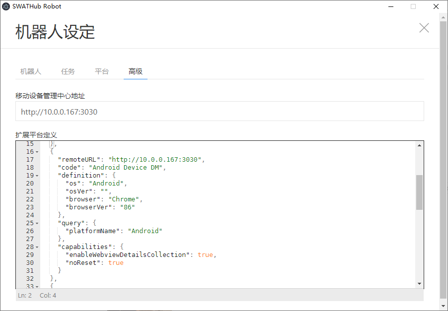
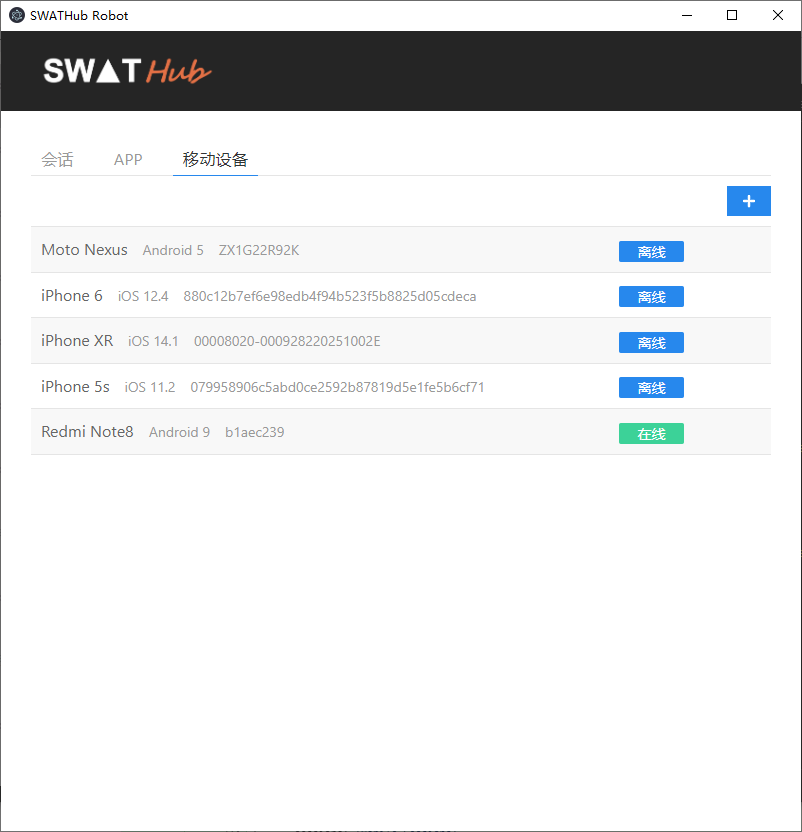
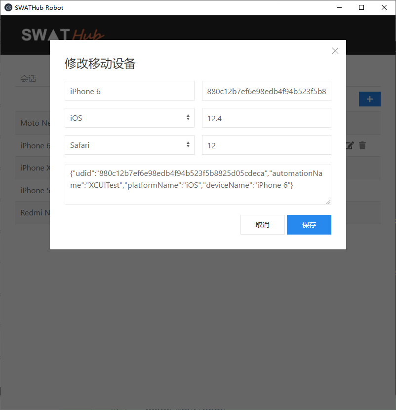
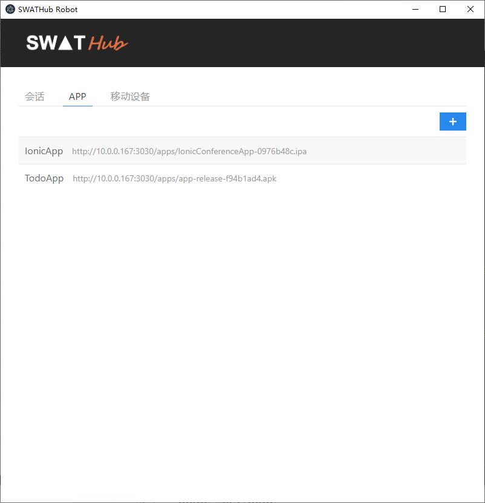
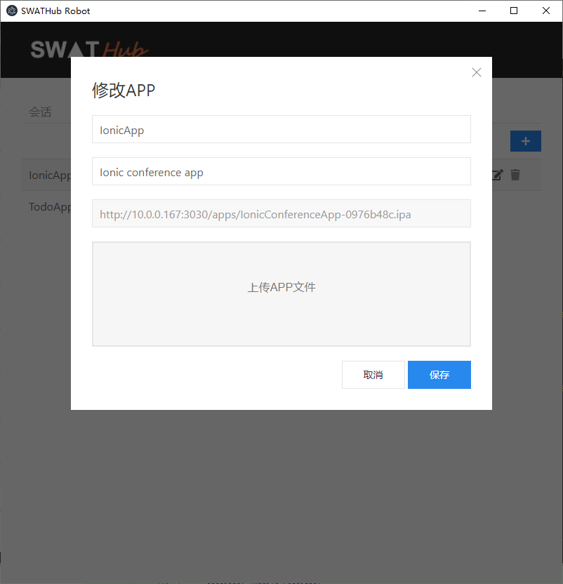
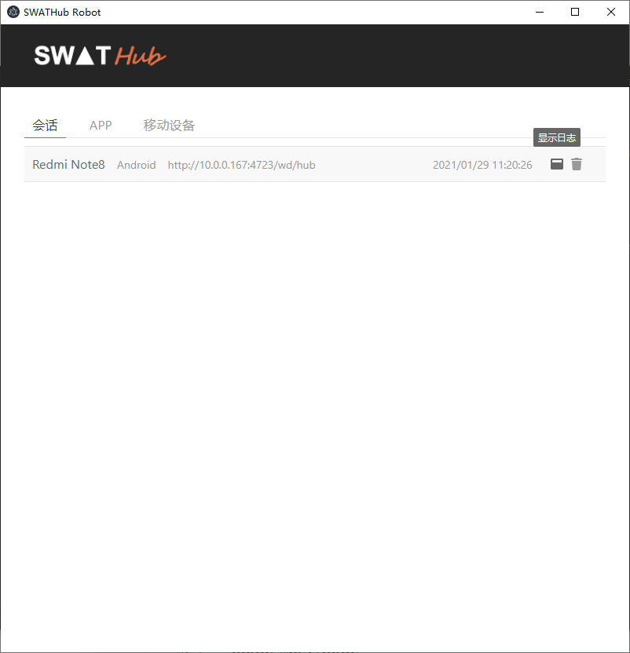
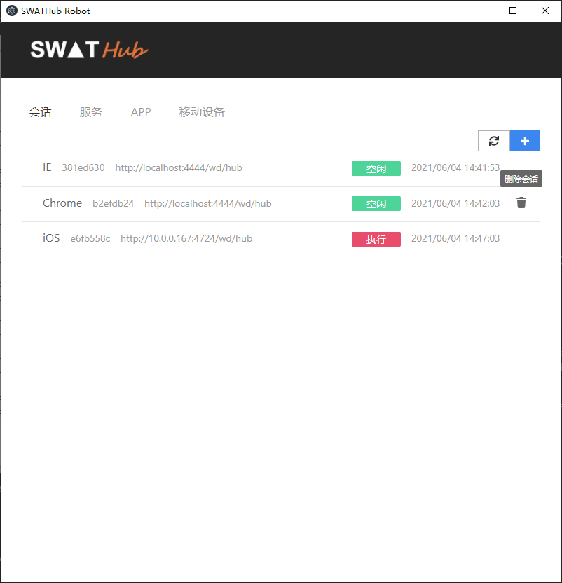
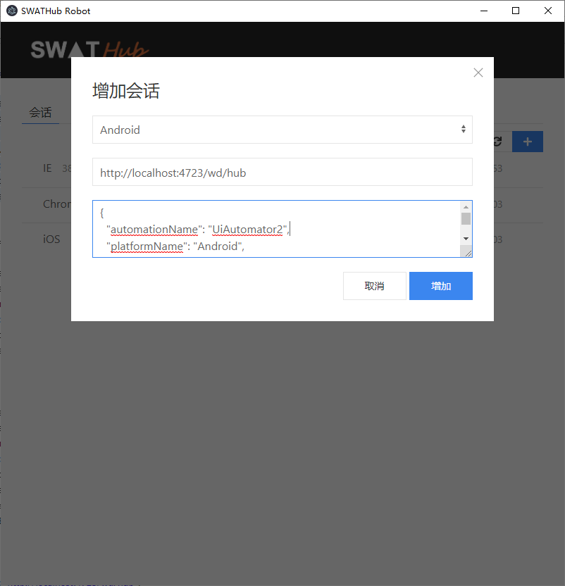

设备管理中心
===

SWATHub机器人可以通过USB线连接多台手机设备进行自动化操作，缺点在于需要对于机器人进行若干配置，同时必须保证手头有可用的设备。

为了解决这些问题，SWATHub设备管理中心提供了一个统一的终端设备管理系统，同时支持iOS和Android手机，机器人无需进行任何本地配置，只要通过扩展平台设置，即可远程驱动一台或多台设备管理中心的手机设备，顺序或者并发的执行自动化操作。

安装
---

### 系统要求

|         | 系统软硬件要求
| ------- | -----------
| CPU     | 2.2 GHz (Single Core) 或以上
| 内存    | 8GB（最小需求) 16GB (推荐)
| 操作系统    | Windows 7 以上各版本、Mac OS X 10.6 以上各版本 <sup>1</sup>
| 支持软件    | [Node.js](https://nodejs.org/) 14 以上各版本
| USB      | 推荐工业级USB Hub，配有独立电源，各USB口单独供电，具备过载保护功能
| 手机设备  | Android 5以上，iOS 9.3以上

?> 1. 安装在Windows操作系统上仅支持Android设备，安装在Mac OS X操作系统上同时支持Android和iOS设备。

### 安装步骤

1. 下载相应版本的SWATHub设备管理中心安装包，如`robot-manager-v1.0.0.zip`。
1. 将安装包解压缩到安装目录。
1. 修改`config/default.json`中的`host`和`port`，指定为服务器可供SWATHub机器人访问的IP地址和端口。
1. 打开命令行工具，进入安装目录下，执行：`npm start` 即可启动服务器。

服务器启动之后，需要接入终端设备，下面按照不同的操作系统分别加以说明。

### Windows设备配置

#### 软件安装

参考[机器人的Android平台设置](robot_mobile_setup.md#Android平台)，同样需要安装如下软件：

* [Android Studio](https://developer.android.com/studio)<sup>1</sup>
* [JDK8](https://www.oracle.com/java/technologies/javase/javase-jdk8-downloads.html)<sup>2</sup>
* [Chromedriver](http://chromedriver.chromium.org/downloads)<sup>3</sup>

?> 1. 设置环境变量`ANDROID_HOME`到SDK Tools对应的目录。

?> 2. 设置环境变量`JAVA_HOME`到JDK8的对应目录。

?> 3. 考虑到系统可能同时连接多个手机，其各自的Webview版本不同，需要在安装目录下根据版本创建不同目录，例如`chromedrivers/86`，`chromedrivers/87`，并将对应的文件复制到目录下。

#### 设备连接

1. 确保手机通过USB Hub连接到服务器，并且正确设置了开发者选项，执行如下命令，确认所有设备都已经正确连接：
```batch
adb devices
```
1. 同时，在设备管理中心的命令行输出中，也可以看到已经连接的设备的udid。

### Mac OS X设备配置

参考上述[Windows设备配置](#Windows设备配置)，为连接Android设备，同样需要安装上述软件并进行相应设置，此处不再赘述。下面仅就iOS设备配置进行说明。

#### 软件安装

为了支持iOS设备，参考[机器人的iOS平台设置](robot_mobile_setup.md#iOS平台)，还需要安装如下软件：

* XCode最新版
* [Homebrew](https://brew.sh/)
```batch
/usr/bin/ruby -e "$(curl -fsSL https://raw.githubusercontent.com/Homebrew/install/master/install)"
```
* [ios-webkit-debug-proxy最新版](https://github.com/google/ios-webkit-debug-proxy)
```batch
brew install --HEAD usbmuxd
brew install --HEAD libimobiledevice
brew install --HEAD ios-webkit-debug-proxy
brew install carthage
```

#### 设备连接

1. 确保手机通过USB Hub连接到服务器，并且正确设置了开发者选项，打开XCode，进入`Window - Devices and Simulators`即可看到所有连接的手机及其udid。
1. 参考[在线教程的Full manual configuration](http://appium.io/docs/en/drivers/ios-xcuitest-real-devices/)编译IWDP，确认配置无误。需要注意的是，WebDriverAgent的安装路径在设备管理中心的安装目录下面，如下所示：
```batch
cd path/to/install/DeviceManager/node_modules/appium/node_modules/appium-webdriveragent
```
1. 同时，在设备管理中心的命令行输出中，也可以看到已经连接的设备的udid。

管理功能
---

### 机器人设置

「移动设备管理中心」的客户端被集成在SWATHub机器人中，进行一站式的管理。使用之前，需要对于设备管理中心所在的服务器地址进行设置，如下图所示，点击机器人的菜单 `设置 - 高级`，将服务器的URL填入对应文本框。



正确设置之后，点击机器人的菜单 `工具 - 移动设备管理中心`，即可进入客户端管理界面，如下图所示，包括「会话」、「APP」和「移动设备」三个子模块。



### 设备管理

「设备管理」模块下面列举了所有管理中心连接的手机设备，及其当前的状态。用户可以点击 <i class = "fa fa-plus"></i> 添加新的设备，也可以修改或者删除现有设备。如下图所示，设备的主要属性包括：
* `设备名称`：设备的名称，一般命名为厂商名 + 型号名。
* `UDID`：设备的唯一标识。
* `设备平台`：目前仅支持 `Android` 和 `iOS`。
* `平台版本`：平台的版本号。
* `浏览器`：对应平台的浏览器，目前仅支持 `Chrome` 和 `Safari`。
* `浏览器版本`：浏览器的版本号。
* `移动设备设置（JSON）`：驱动设备运行的Appium Caps设置。如下所示，列举了必须要包含的一些属性。
```json
{
  "udid": "880c12b7ef6e98edb4f94b523f5b8825d05cdeca",
  "automationName": "XCUITest",
  "platformName": "iOS",
  "deviceName": "iPhone 6"
}
```



### APP管理

「APP管理」模块中列举了管理中心中的手机APP安装包，用户可以点击 <i class = "fa fa-plus"></i> 添加新的APP，也可以修改或者删除现有APP，如下图所示。



特别的，如下图所示，用户上传的APP安装文件，系统会自动生成一个URL，该URL可以作为系统操作 [启动应用](../dev/sop_mobileapp#启动应用) 的参数 `应用路径` 使用。



### 服务管理

「服务管理」模块中列举了当前活跃的Appium服务，如下图所示，每条服务信息显示了关联的移动设备，Appium服务的URL，用户也可以点击查看服务的日志。



### 会话管理

「会话管理」模块中列举了当前活跃的平台会话，如下图所示，每条会话信息显示了关联的平台，会话ID，Appium服务的URL，当前执行的状态，用户也可以删除该会话。



用户可以点击 <i class = "fa fa-sync"></i> 刷新当前会话的状态，也可以点击 <i class = "fa fa-plus"></i> 添加新的会话，如下图所示。



使用设备
---

用户需要在机器人菜单的 `设置 - 高级` 中添加扩展平台，来使用管理中心的移动设备。类似于机器人直连设备的 [APP扩展平台设置](robot_mobile_setup#APP扩展平台设置)，用户还需要关注以下两个属性：
* `remoteURL`: 移动设备管理中心的URL
* `query`：移动设备的选择条件，可使用的属性包括：
  * `deviceName`：设备名。
  * `udid`：设备标识。
  * `platformName`：平台名，`Android` 或 `iOS`。
  * `platformVersion`：平台版本。
  * `browserName`：浏览器名，`Chrome` 或 `Safari`。
  * `browserVersion`：浏览器版本。

以下是一个选择任意Android设备的例子：
```json
{
  "remoteURL": "http://10.0.0.167:3030",
  "code": "Ad-hoc Android Device",
  "definition": {
    "os": "Android",
    "osVer": "",
    "browser": "Chrome",
    "browserVer": ""
  },
  "query": {
    "platformName": "Android"
  },
  "capabilities": {
    "enableWebviewDetailsCollection": true,
    "noReset": true
  }
}
```