流程运行
===

SWATHub机器人存在三种不同的运行模式来运行流程。双击`swathub-robot.exe`启动SWATHub机器人，在状态栏中选中图标点击右键，在弹出菜单中选择**设置**选项，选择机器人运行模式。

* 开发模式
* 单机模式
* 节点模式

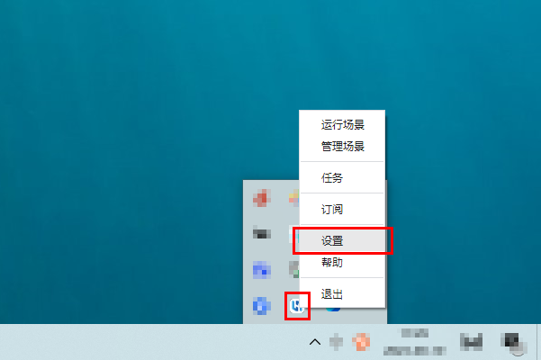

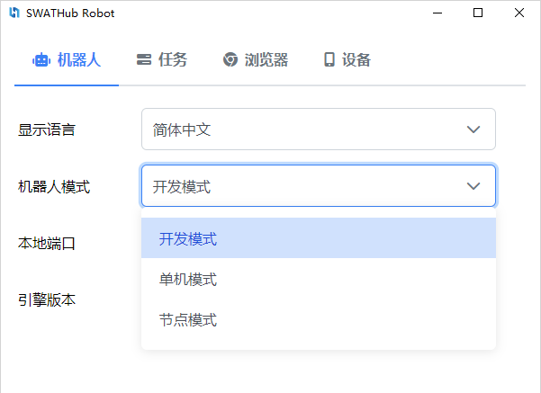

开发模式运行
---
在如上图的机器人设置界面中选择**开发模式**，即可使机器人进入**开发模式**。SWATHub机器人**开发模式**运行，无需额外的机器人订阅。

### 运行流程

**开发模式**在SWATHub-Desktop**桌面端流程编辑器**进行开发自动化流程或者进行自动化测试时应用。用户可以点击工具栏中的 <i class = "fa fa-play"></i> 按钮来运行当前设计的流程，在弹出的运行对话框中，设置对应的输入参数，运行的平台环境，以及可能需要的步骤选项后，点击**执行**按钮，则自动化任务会自动发送到SWATHub机器人客户端中运行。

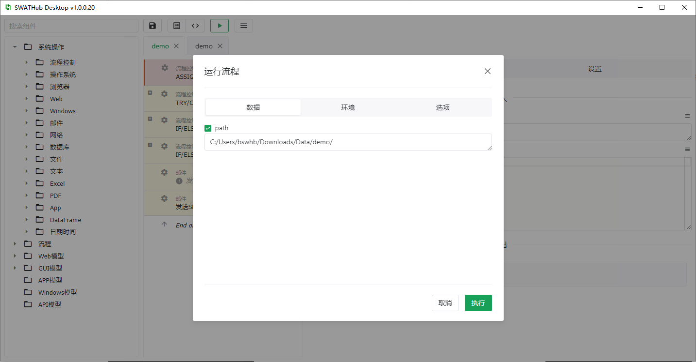

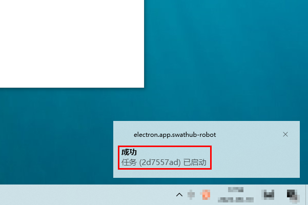

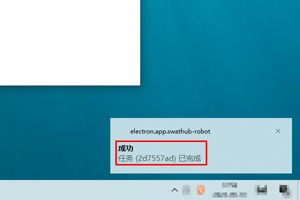

SWATHub机器人运行时默认为后台运行，如需查看任务列表、日志等信息，在状态栏中选中图标点击右键，在弹出菜单中选择**任务**，在SWATHub机器人客户端界面中查看。

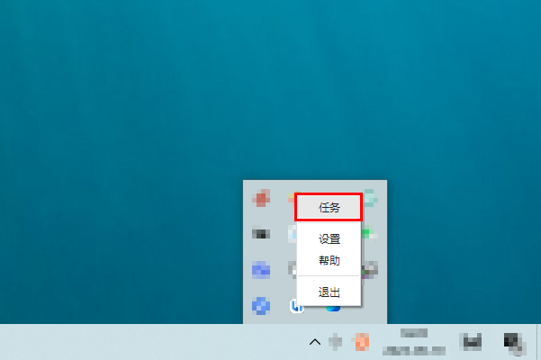

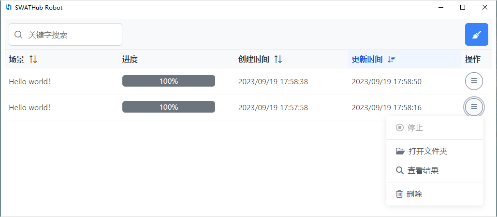

单机模式运行
---

当SWATHub机器人不连接任何**桌面端流程编辑器**、**SWATHub设计平台**、**机器人控制中心**时可以启用**单机模式**运行，此时SWATHub机器人需要成功激活**离线终端机器人订阅**。

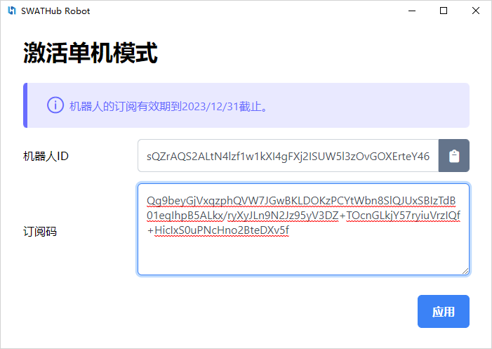

当前订阅到期后，右键点击系统状态栏中SWATHub机器人菜单中**订阅**选项，在订阅码输入框中输入新的授权订阅码，点击**应用**即可激活新的订阅有效期。

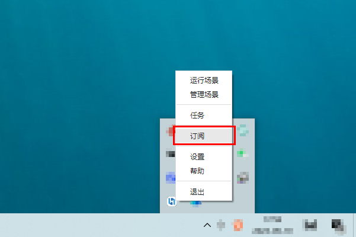

激活订阅后，在SWATHub机器人客户端所在的终端部署本地的流程。这种运行模式适合小规模的业务场景自动化中的实际使用。

### 部署本地场景包

当SWATHub机器人存在有效的订阅期，用户可以通过机器人的界面来运行部署在该机器人中的场景包。部署本地场景包需要按照以下步骤。

1. 右键点击系统状态栏中SWATHub机器人菜单中**管理场景**选项，打开本地机器人场景管理界面添加所需的场景包文件（后缀名`.spkg`）。

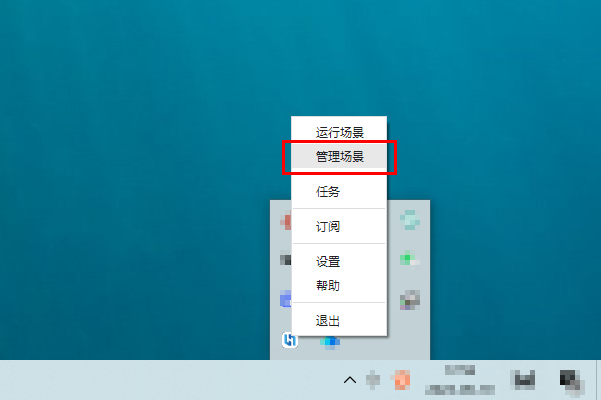

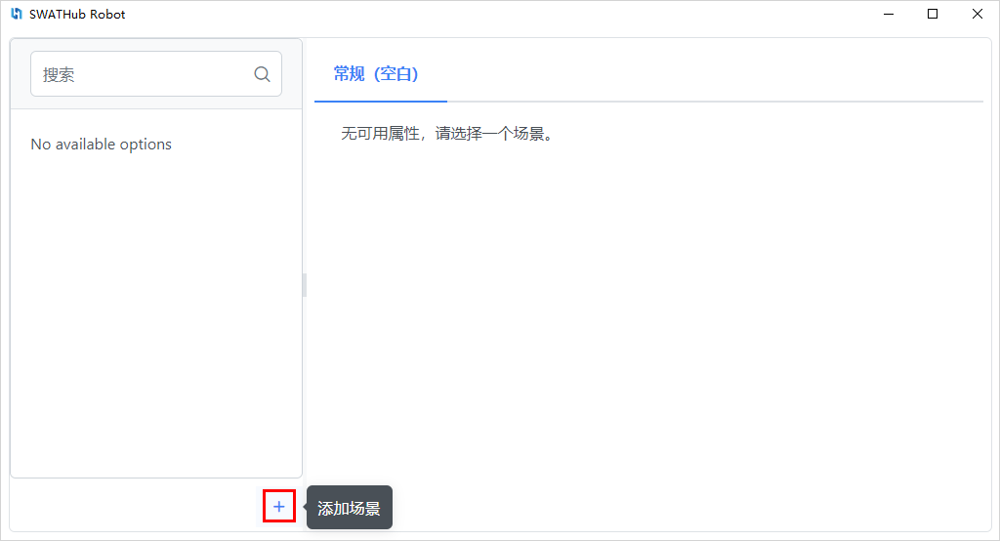

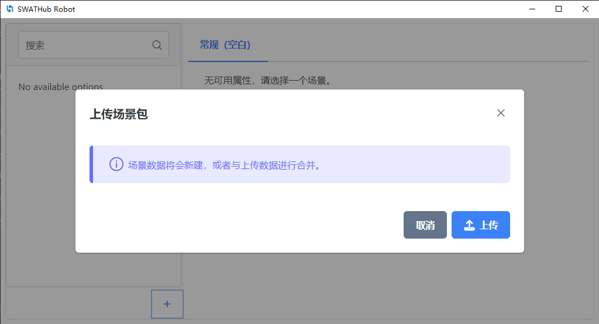

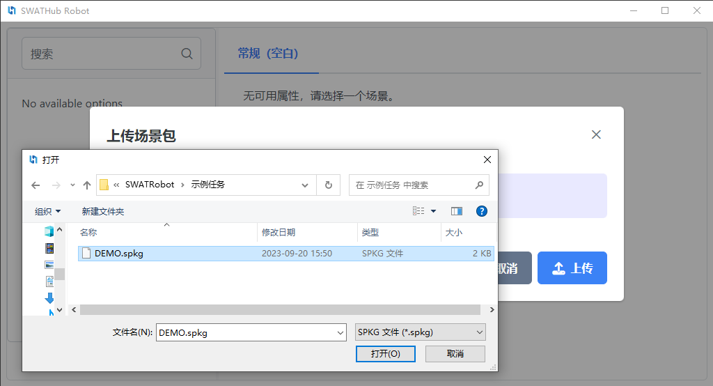

2. 上传成功的场景会显示在场景管理界面左侧的列表中，点击场景名称，可以在右边的**常规**和**高级**标签栏内修改该场景的设定，然后保存使其生效。

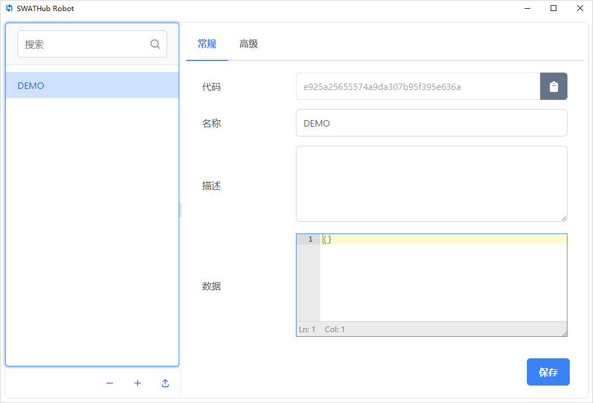

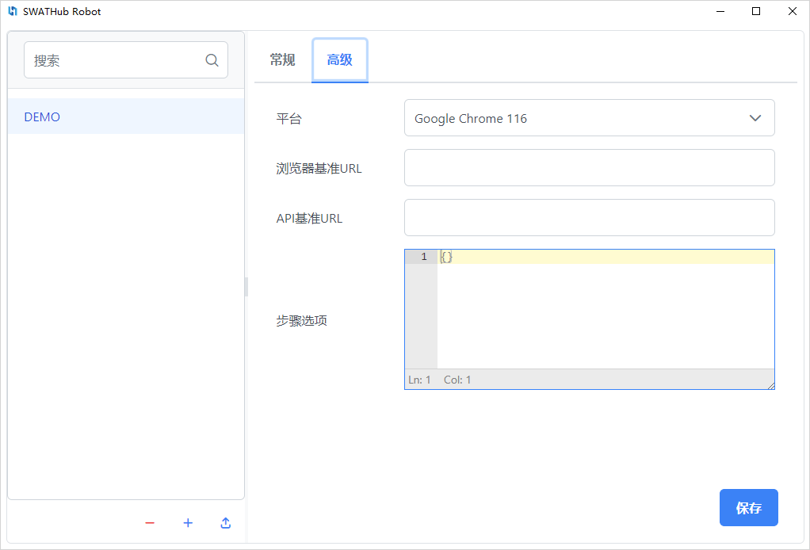

3. 场景管理界面右侧列表栏下方的按钮分别对应**删除场景**（卸载场景包）、**添加场景**和**更新场景**（升级场景包）功能操作。

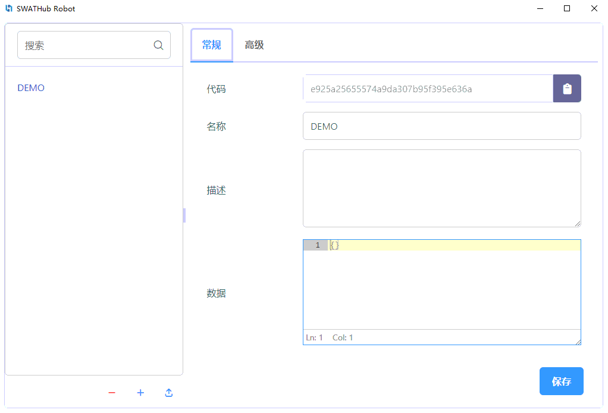

### 运行本地场景包

当SWATHub机器人存在有效的**离线终端机器人订阅**，右键点击状态栏中SWATHub机器人的图标，选择弹出菜单中的**运行场景**选项，即可进入场景运行界面，已部署的场景任务可以选择列表形式排列或模块形式排列，在排列顺序上可以选择**按场景名称排列**和**按执行时间排列**，手动点击场景条目中的**执行**按钮即可运行相应场景包任务。

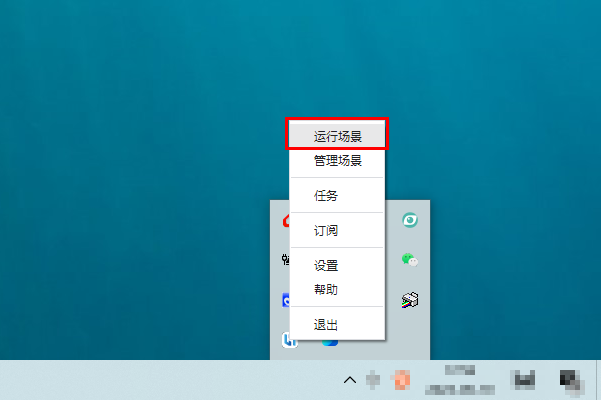

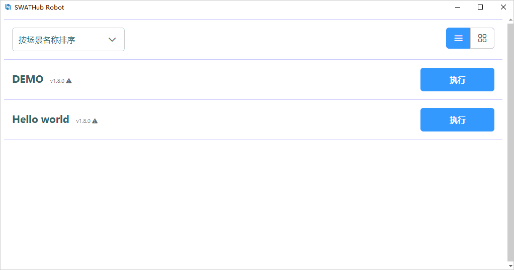

SWATHub机器人的**场景**标签中的场景包列表中会出现该场景包的名称和版本。当需要通过工具或系统来自动启动（比如定时启动）特定场景包时，可以使用我们提供的命令行工具。

### 无人值守执行
---

当任务需要通过无人值守的方式设置自动执行时，我们可以制作`start.bat` 文件添加到Windows任务计划中来完成无人值守情况下任务自动执行。

`start.bat` 文件的制作方法如下:

* 打开记事本，在下图蓝色线框位置输入客户端安装路径，红色线框位置输入场景任务代码。任务代码可以在任务列表中直接复制。

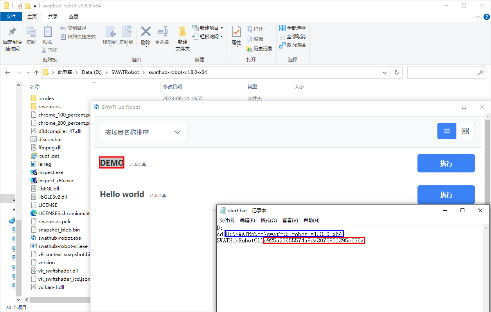

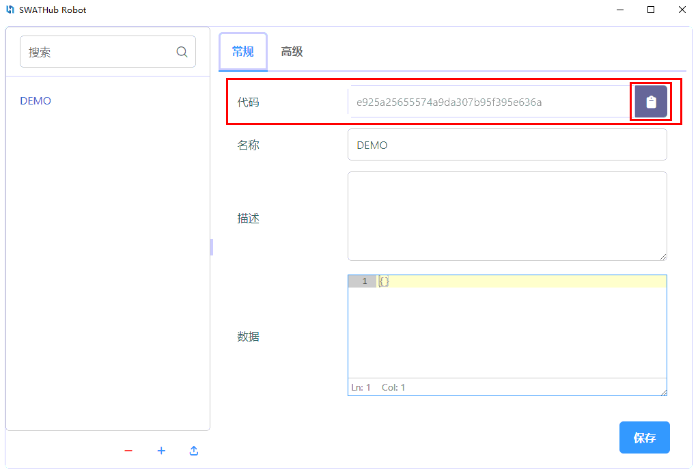

* 通过windows任务计划设定启动时间。

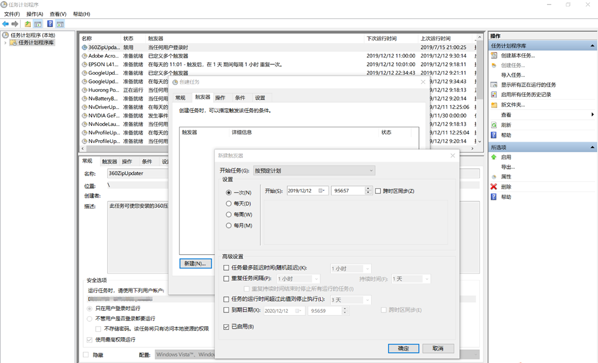

* 修改Windows操作系统任务计划设置项：

    ① 设定为唤醒计算机运行此任务；
    
    ② 不管用户是否登录都要运行；

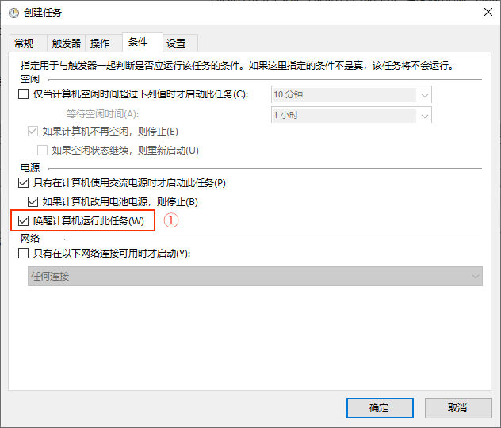

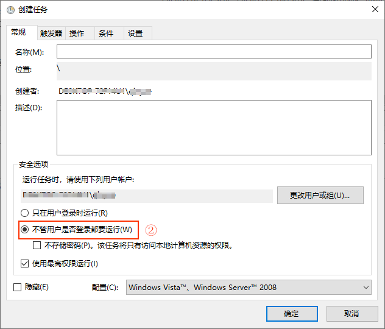

节点模式运行
---

当SWATHub机器人连接入**SWATHub设计平台**或**SWATHub管理平台**时，可以通过**设置**界面选择**节点模式**运行，此时SWATHub机器人占用**设计平台**或**管理平台**的受控机器人订阅，无需额外的机器人订阅。

### 连接设计平台

通过如下步骤，SWATHub机器人登录SWATHub设计平台1，并连接到特定流程设计项目。

1. 右键点击系统状态栏中SWATHub机器人的图标，选择弹出菜单中的**连接**菜单打开**连接至SWATHub**对话框。

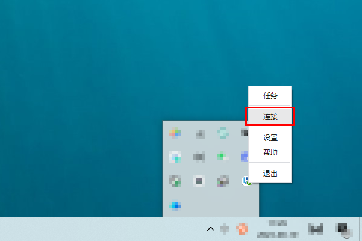

2. 输入需要登录的设计平台根URL，如`https://swathub.com`或者`http://10.0.0.2:8080`。
3. 输入设计平台中的设计账号1用户名，密码，点击**登录**按钮，登录服务器。

4. （可选）点击登录界面左下角的**设置**按钮，设置当前SWATHub机器人节点的相关参数；

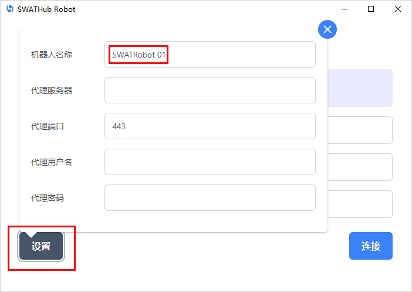

* **机器人名称**: 连接到SWATHub设计平台时该机器人所对应的名称，未填时使用当前IP作为名称。
* **代理服务器**: 通过HTTP代理服务器连接SWATHub设计平台时的服务器地址。
* **代理端口**: 通过HTTP代理服务器连接SWATHub设计平台时的服务器端口。
* **代理用户名**: 通过HTTP代理服务器连接SWATHub设计平台时的用户名。
* **代理密码**: 通过HTTP代理服务器连接SWATHub设计平台时的密码。
* **断线重连次数**: 当SWATHub机器人与SWATHub设计平台断开连接后，自动重连的次数。缺省不设置。`0`表示无限次数重连。

5. 登录成功后，自动弹出**连接至SWATHub**对话框。

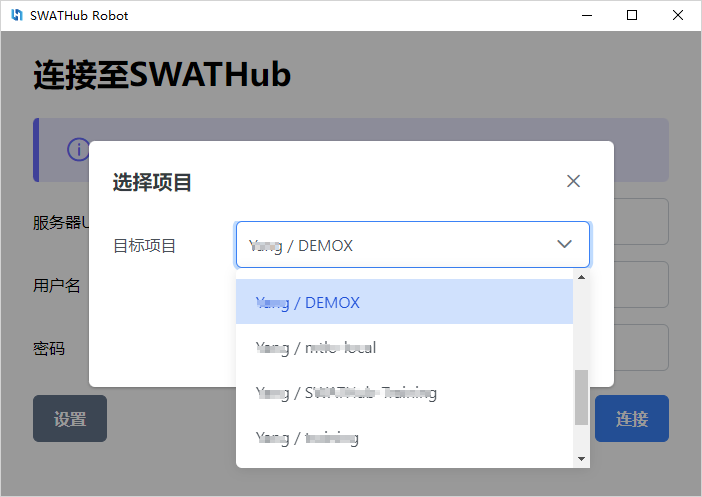

6. 选择`目标项目`和所需连接的项目名，点击**连接**按钮，连接项目。

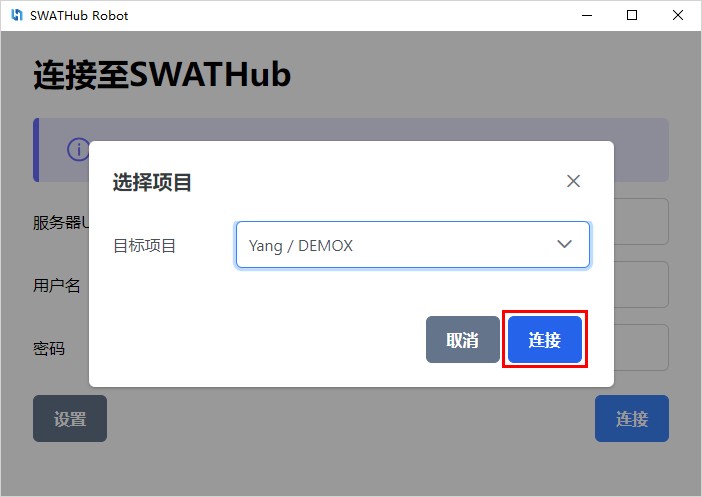

7. SWATHub机器人连接成功后，SWATHub设计平台中所连接的场景项目的**设置 > 机器人**页面中会显示该机器人的条目。

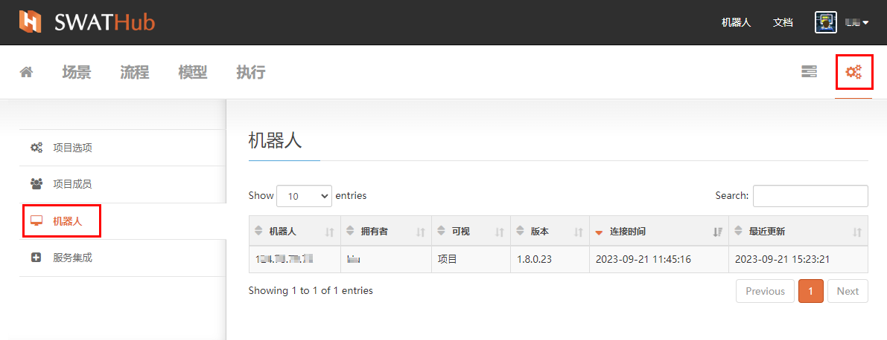

?> 1. SWATHub机器人登陆SWATHub设计平台时所使用的用户账号仅支持单台终端登录使用。

### 连接管理平台

通过如下步骤，SWATHub机器人登录SWATHub管理平台1，并连接到特定控制中心。可以通过管理平台直接调用运行自动化流程，这种运行模式适合大规模机器人的管理集群。

1. 右键点击系统状态栏中SWATHub机器人的图标，选择弹出菜单中的**连接**菜单打开**连接至SWATHub**对话框。

2. 输入需要登录的管理平台根URL，如`https://swathub.com`或者`http://10.0.0.2:8080`，以及SWATHub控制中心的管理账号1用户名，密码，点击**登录**按钮，登录服务器。

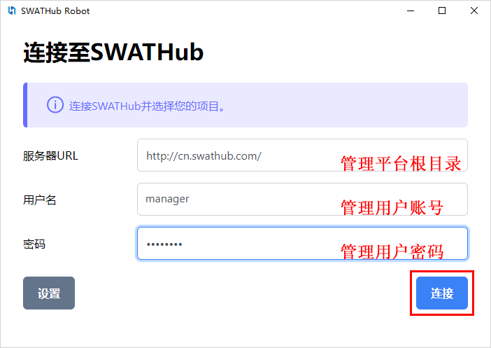

3. （可选）与连接设计平台类似，同样可以点击登录界面左下角的**设置**按钮，进行相关设置。

4. 登录成功后，自动弹出**连接至SWATHub**对话框。

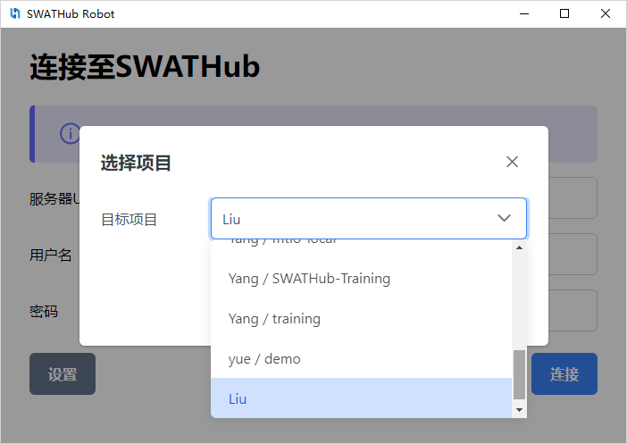

5. 选择`目标项目`和所需连接的管理平台名称，点击**连接**按钮，连接控制中心，连接成功后会收到系统提示。

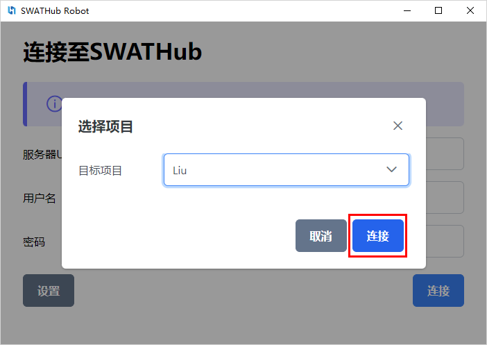

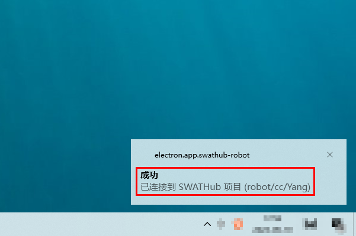

6. SWATHub机器人连接成功后，SWATHub控制中心的**设置 > 机器人**页面中会显示该机器人的条目。

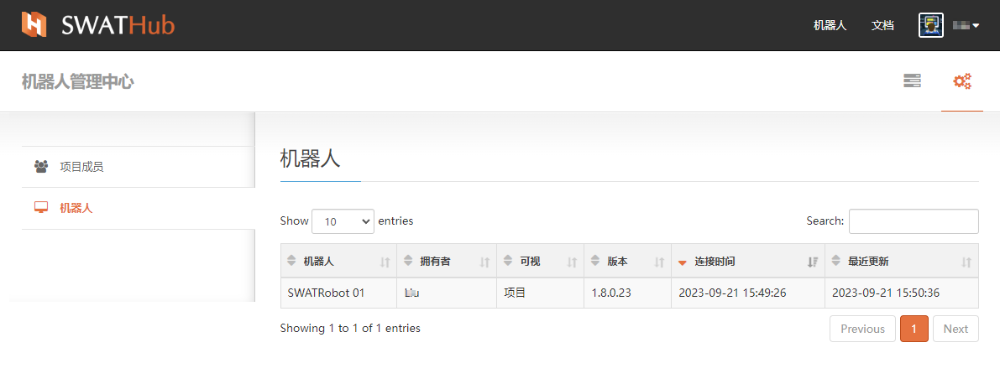

?> 1. SWATHub机器人登陆SWATHub管理平台时所使用的用户账号需要存在剩余的在线受控机器人额度。

### 运行流程

在线受控模式中，通过SWATHub服务平台中的控制中心的工作定义来自动调用SWATHub机器人运行任务。

任务列表
---

1. 在SWATHub机器人的**开发模式**、**单机模式**和**节点模式**运行时，均可右键点击系统状态栏中SWATHub机器人菜单中**任务**选项，打开本地机器人的**任务列表**，可以详细查看本地机器人所有场景包执行的任务完成情况。

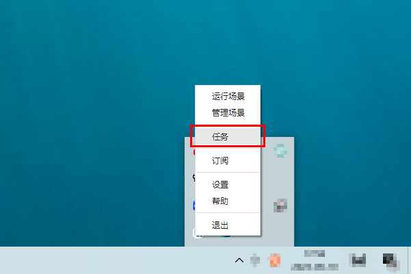

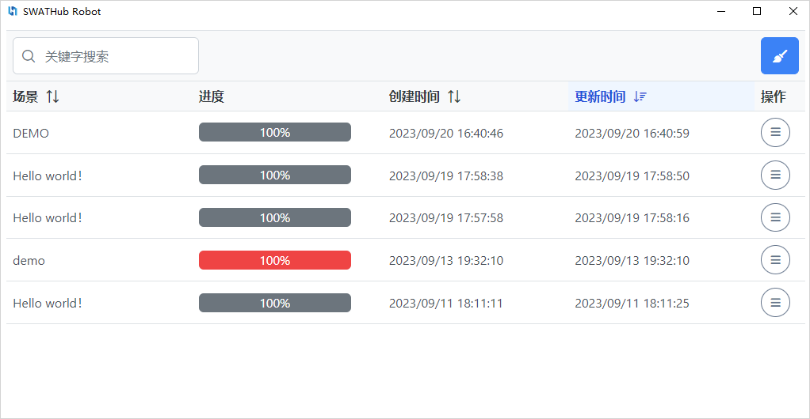

2. 运行在线场景或者本地场景包时，我们称之为**执行任务**。可以在**任务列表**中查看当前任务执行的进度、状态和结果。任务执行结束后，进度条为**灰色**为**完成**的任务，进度条为**红色**为执行有**错误**的任务。点击任务执行条目右侧**操作**栏按钮可以进行以下操作：

* 打开任务所在目录；
* 浏览任务执行结果；
* 删除本次任务。

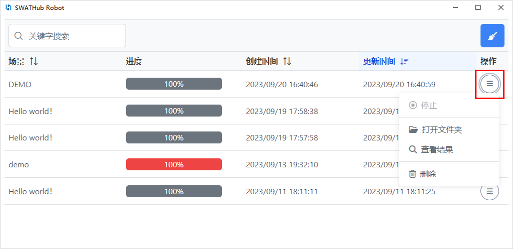

3. 点击界面右上角毛刷按钮可一键**删除所有已完成任务**。

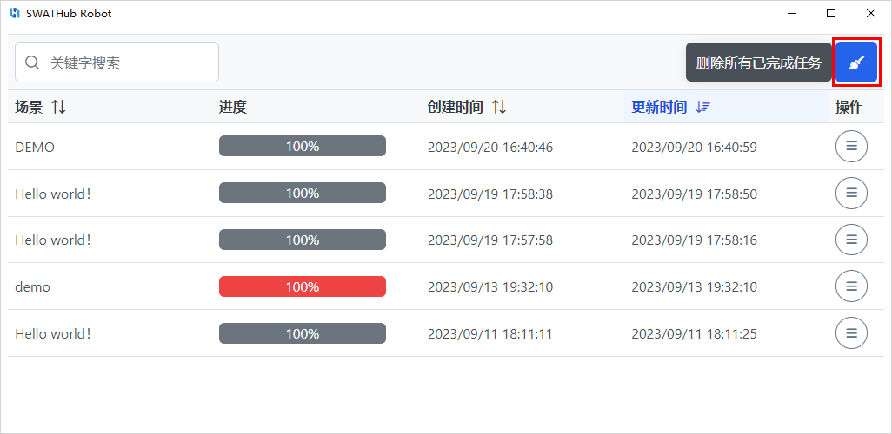

运行结果查看器
---

在任务列表的任务执行条目的**操作**按钮弹出菜单上，可以点击  <i class = "fa fa-search"></i> **查看结果**运行结果查看器浏览任务执行结果。任务执行过程中的步骤截图、执行结果等信息均可在此查看详细信息。相关任务执行结果说明可参考[执行结果](design_result.md)。

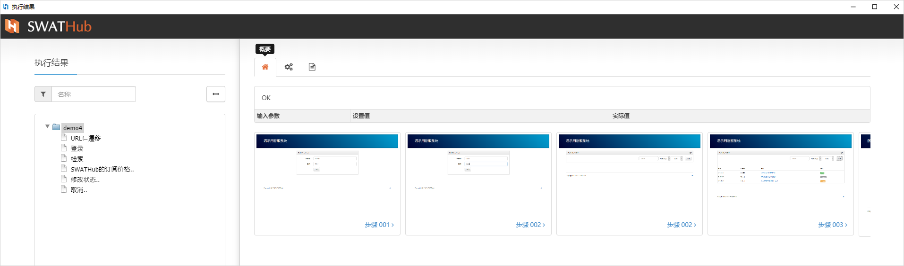