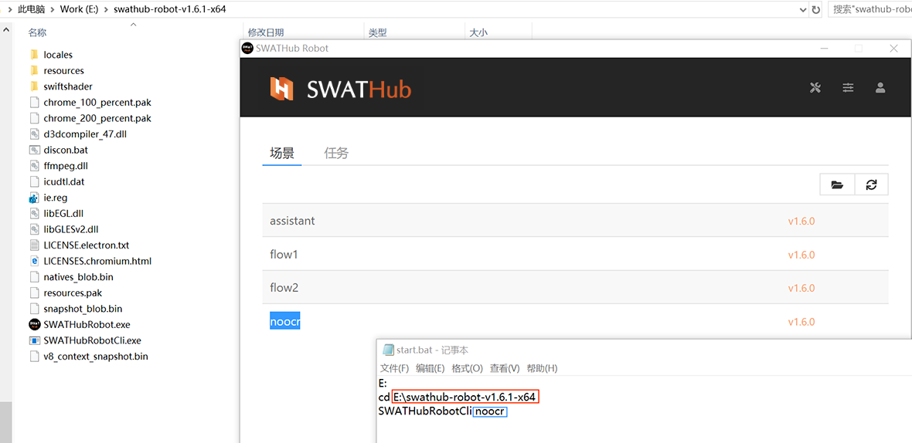

流程运行
===

SWATHub机器人存在三种不同的运行模式来运行流程。

* 在线设计模式
* 离线终端模式
* 在线受控模式

在线设计运行
---

当SWATHub机器人连接入SWATHub设计平台时，可以通过设计平台直接调用运行自动化用例，此时SWATHub机器人共享设计平台用户的订阅，无需额外的机器人订阅。这种运行模式适合开发自动化流程时调试流程，或者进行自动化测试。

### 连接设计平台

通过如下步骤，SWATHub机器人登录SWATHub设计平台<sup>1</sup>，并连接到特定流程设计项目。

1. 点击SWATHub机器人的**离线 > 登录**菜单打开**登录**对话框。
2. 输入需要登录的设计平台根URL，如`https://swathub.com`或者`http://10.0.0.2:8080`。
3. 输入设计平台中的设计账号<sup>1</sup>用户名，密码，点击**登录**按钮，登录服务器。


4. 登录成功后，自动弹出**连接流程设计项目/机器人控制中心**对话框。
5. 选择`流程设计项目`和所需连接的项目名，点击**连接**按钮，连接项目。


6. SWATHub机器人连接成功后，SWATHub流程设计项目的**设置 > 机器人**页面中会显示该机器人的条目。

?> 1. SWATHub机器人登陆SWATHub设计平台时所使用的用户账号需要存在剩余的在线设计机器人额度。

### 运行流程

在线设计模式中，可以通过SWATHub设计平台中的场景组中的用例执行来调用已连接的SWATHub机器人运行指定的场景用例。

离线终端运行
---

当SWATHub机器人没有连接任何SWATHub平台离线运行时，可以运行部署在本地的流程，此时SWATHub机器人需要成功激活**离线终端机器人订阅**。这种运行模式适合小规模的业务场景自动化中的实际使用。

### 部署本地场景包

当SWATHub机器人存在有效的**离线终端机器人订阅**时，用户可以通过机器人的界面来运行部署在该机器人中的场景包。部署本地场景包需要按照以下步骤。

1. 从SWATHub流程设计项目中发布并下载所需的场景包文件（后缀名`.spkg`）。
2. 点击SWATHub机器人的**场景**标签下的**打开场景目录**按钮打开用户场景目录。
3. 在用户场景目录中使用希望的场景名来创建场景包目录，并将场景包文件移动到该目录。
4. 点击SWATHub机器人的**场景**标签下的**刷新**按钮。
5. SWATHub机器人的**场景**标签下的场景包列表中会出现该场景包的名称和版本，可以通过点击运行按钮来启动该流程。
6. 场景包目录中会自动生成场景包数据文件`input.json`，根据需要可以修改<sup>1</sup>该文件中的数据。


?> 1. 当`input.json`文件中包含Unicode字符如中日韩文字时，建议使用支持Unicode的文本编辑器，Windows自带的notepad可能导致json格式错误。

### 运行本地场景包

当SWATHub机器人存在有效的**离线终端机器人订阅**，SWATHub机器人的**场景**标签下会显示所有已部署的本地场景包，点击场景包条目后的运行按钮就可以手动启动场景流程。当需要通过工具或系统来自动启动（比如定时启动）特定场景包时，可以使用我们提供的命令行工具。

例如，机器人已经部署了名为`示例任务`的本地场景包，那么点击 <i class = "fa fa-play-circle"></i>  执行该场景:


### 修改场景包数据文件

通过修改场景包目录下的数据文件`input.json`，可以定义场景的输入数据、步骤选项和环境平台参数。

`input.json`文件的例子如下：
```json
{
  "data": {
    "Firstname": "Alice",
    "Lastname": "Bob"
  },
  "stepOptions": {
    "operationInterval": 1000
  },
  "environment": {
    "apiURL": "http://api.com",
    "baseURL": "http://mysite.com",
    "browserCode": "IE",
  }
}
```

数据文件由一个JSON对象构成，其属性如下：

* `data`：任务的输入参数。
* `stepOptions`：任务的步骤选项。优先级高于场景组缺省设置中的步骤选项，低于每个步骤中分别设置的步骤选项。
* `environment`：任务的环境平台参数，包括如下属性：
  * `apiURL`：API相关操作中的缺省基础URL。
  * `baseURL`：浏览器访问URL操作中的缺省基础URL。
  * `browserCode`：任务执行时使用的浏览器。可选浏览器包括：`IE`、`Chrome`、`Firefox`、`Edge`、`Edge Legacy`、`Safari`。

### 升级本地场景包

在SWATHub服务平台的流程设计项目修改了场景后，需要升级本地场景包来让修改起作用。升级本地场景包需要按照以下步骤。

1. 从SWATHub流程设计项目中发布并下载修改过的场景包文件（后缀名`.spkg`）。
2. 点击SWATHub机器人的**场景**标签下的**打开场景目录**按钮打开用户场景目录。
3. 寻找到相应的场景包目录，并将新的场景包移动到该目录。
4. 点击SWATHub机器人的**场景**标签下的**刷新**按钮，场景包会进行自动升级。
5. 场景包目录中的场景包数据文件`input.json`会被自动升级，根据需要可以修改该文件中的数据。

### 卸载本地场景包

当不需要某个本地场景包时，只需删除该场景包目录，并点击SWATHub机器人的**场景**标签下的**刷新**按钮。

### 无人值守执行
---

当任务需要通过无人值守的方式设置自动执行时，我们可以制作`start.bat` 文件添加到Windows任务计划中来完成无人值守情况下任务自动执行。

`start.bat` 文件的制作方法如下:

* 打开记事本，在下图红色线框位置输入客户端安装路径，蓝色线框位置输入场景任务名称。



* 通过windows任务计划设定启动时间。


* 修改Windows操作系统任务计划设置项：

    ① 设定为唤醒计算机运行此任务；
    
    ② 不管用户是否登录都要运行；


在线受控运行
---

当SWATHub机器人连接入SWATHub管理平台时，可以通过管理平台直接调用运行自动化流程，此时SWATHub机器人占用管理平台的受控机器人订阅，无需额外的机器人订阅。这种运行模式适合大规模机器人的管理集群。

### 连接管理平台

通过如下步骤，SWATHub机器人登录SWATHub管理平台<sup>1</sup>，并连接到特定控制中心。

1. 点击SWATHub机器人的**离线 > 登录**菜单打开**登录**对话框。
1. 输入需要登录的服务平台根URL，如`https://swathub.com`或者`http://10.0.0.2:8080`。
1. 输入服务平台中的设计账号用户名，密码，点击**登录**按钮，登录服务器。
1. 登录成功后，自动弹出连接流程设计项目/机器人控制中心对话框。
1. 选择`控制中心`和所需连接的控制中心名，点击**连接**按钮，连接控制中心。
1. SWATHub机器人连接成功后，SWATHub控制中心的**设置 > 机器人**页面中会显示该机器人的条目。

?> 1. SWATHub机器人登陆SWATHub管理平台时所使用的用户账号需要存在剩余的在线受控机器人额度。

### 运行流程

在线受控模式中，通过SWATHub服务平台中的控制中心的工作定义来自动调用SWATHub机器人运行任务。

任务列表
---

运行在线场景或者本地场景包时，我们称之为**执行任务**。可以在**任务列表**中查看当前任务执行的进度、状态和结果。任务执行结束后，任务执行条目可以进行以下操作：

* 浏览任务执行结果；
* 打开任务所在目录；
* 删除本次任务。


右上角 <i class = "fa fa-trash"></i>  按钮功能为清空任务列表。

运行结果查看器
---

在任务列表的任务执行条目上，可以点击  <i class = "fa fa-search"></i> 运行结果查看器浏览任务执行结果。任务执行过程中的步骤截图、执行结果等信息均可在此查看详细信息。相关任务执行结果说明可参考[执行结果](design_result.md)。

