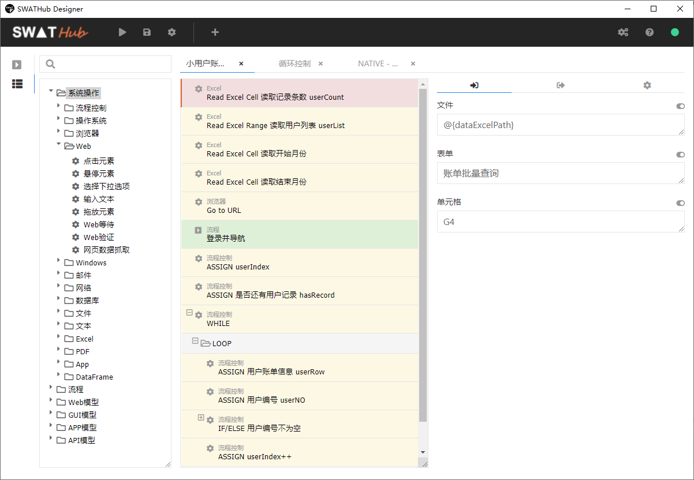
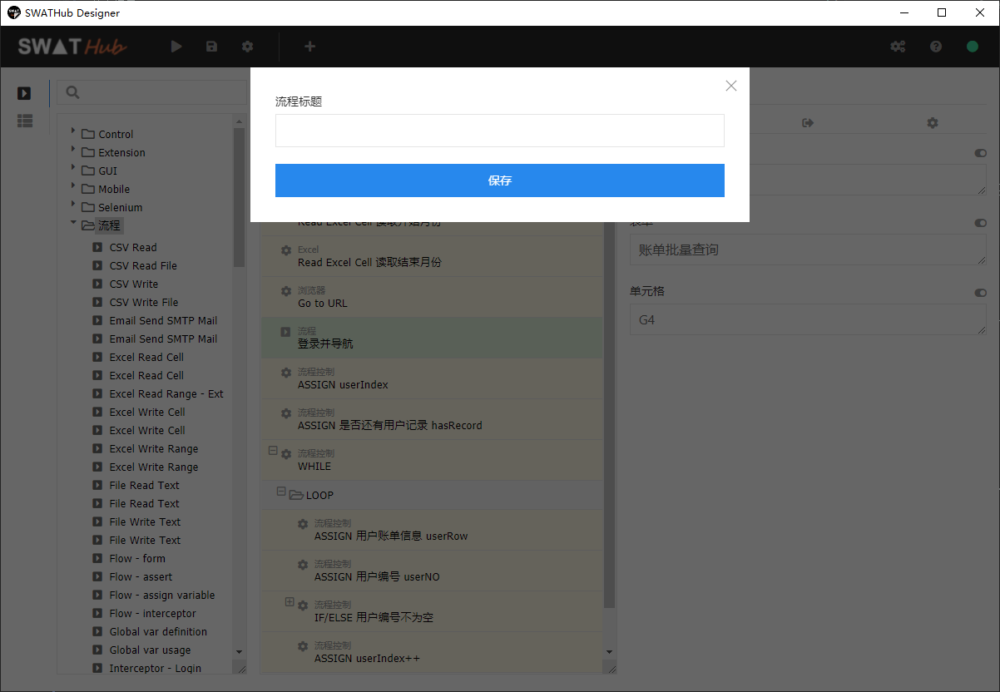
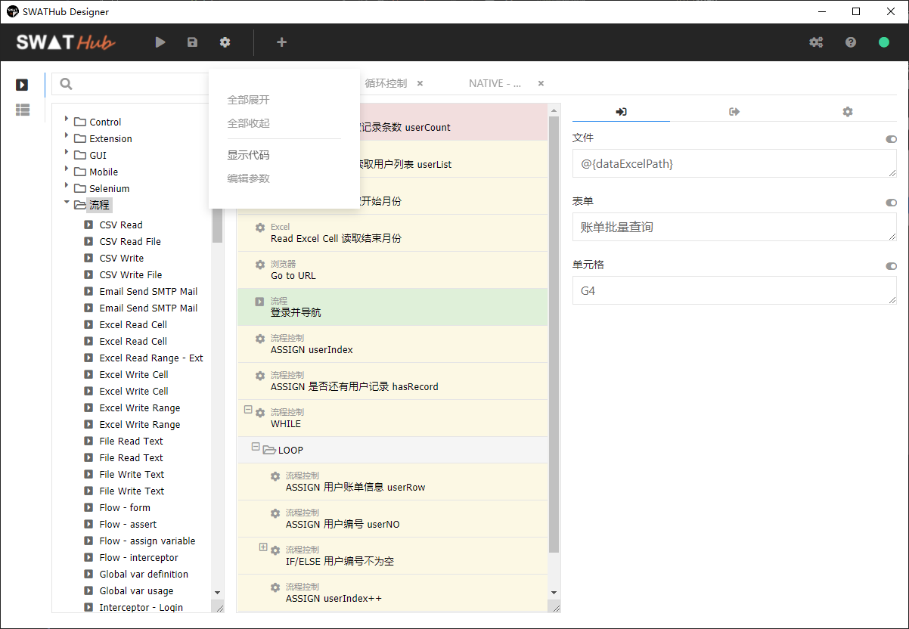
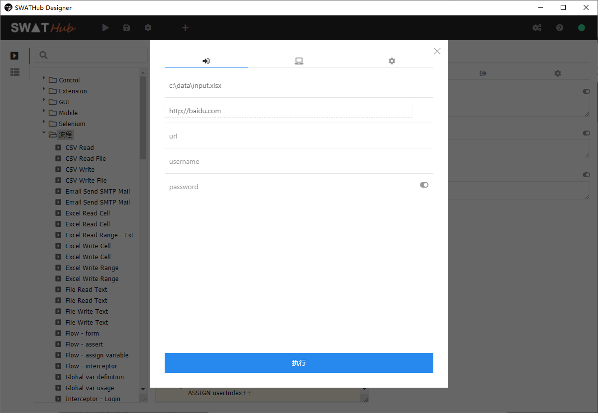
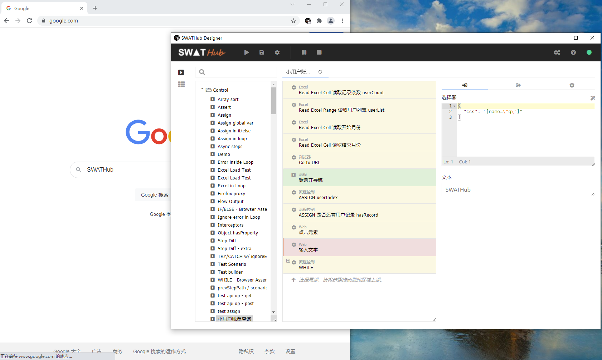

桌面流程编辑器
===

SWATHub提供了桌面端的流程编辑工具，用户可以无需打开浏览器访问SWATHub服务器，直接在机器人端完成流程的设计、调试和执行。

安装设置
---

1. 下载SWATHub流程编辑器安装包，如 `swathub-designer-v1.0.0-x64.zip`。
1. 将SWATHub编辑器安装包解压缩到安装目录。
1. 运行`SWATHubDesigner.exe`或`SWATHubDesigner`启动SWATHub流程编辑器。
1. 输入SWATHub服务器的URL，和相关的用户名及密码，进行登录操作。如需设置代理，则点击`网络设置`按钮。
1. 选择连接某个SWATHub工作项目，进入编辑器画面。

流程选择
---

用户点击菜单栏中的 <i class = "fa fa-caret-square-right "></i> 按钮，即可浏览工作项目下所有的场景组和流程。用户可以选择场景组中的某个场景进行编辑，也可以新建或重命名一个场景；同样的，用户也可以选择工作项目中的某个流程进行编辑，或者新建或重命名一个流程。

流程搭建
---

桌面端流程编辑器的操作界面和 [Web端界面](design_scenario) 是基本一致的，用户可以从左侧的组件选择区域，将各类系统操作、流程操作和模型操作，用拖拽的方式加入到中间的流程搭建区域，并且在右侧的步骤属性区域，设置其所需的各类输入和输出参数。

同样的，用户也可以点击工具栏中的 <i class = "fa fa-cog"></i> 按钮，在显示的下拉菜单中，点击相关按钮，来切换至 `代码模式` 和 `参数模式`。

流程运行
---

用户可以点击工具栏中的 <i class = "fa fa-play"></i> 按钮来运行当前设计的流程1，在弹出的运行对话框中，与Web端类似的，用户需要设置对应的输入参数，运行的平台环境，以及可能需要的步骤选项。需要指出的是，流程运行的时候同样会导入场景组中的前/后拦截器设置、缺省步骤选项和其他运行设置。

?> 1. 流程执行需要SWATHub机器人的支持，因而需确保机器人处于已开启状态。

流程录制
---

用户可以点击工具栏中的 <i class = "fa fa-plus"></i> 按钮进入Web录制模式1，此时用户在浏览器中的操作，将被自动保存为SWATHub的流程步骤。

1. 首次进入录制模式之后，需要先安装 [SWATHub Recorder](https://chrome.google.com/webstore/detail/swathub-recorder/gidimbkiadpbkmmikbibpgicnaomlaki) 浏览器插件，安装完毕之后关闭浏览器。
1. 其次需要下载 [Recorder Helper](tools/swathub-recorder-helper.zip) 程序包，解压到用户的本地目录中去，如下所示：
    * Windows：`%appdata%\SWATHubDesigner\recorder`
    * macOS：`/Users/<username>/Library/Application Support/SWATHubDesigner/recorder`
1. 打开命令行工具，在上述目录中，执行相关批处理文件：
    * Windows：`setup.bat`
    * macOS：`./setup.sh`
1. 再次点击录制按钮，即可进入Web录制模式。同时，用户可以选择点击暂停/恢复按钮，选择需要录制的操作步骤。

?> 1. 目前仅支持 Chrome 浏览器。