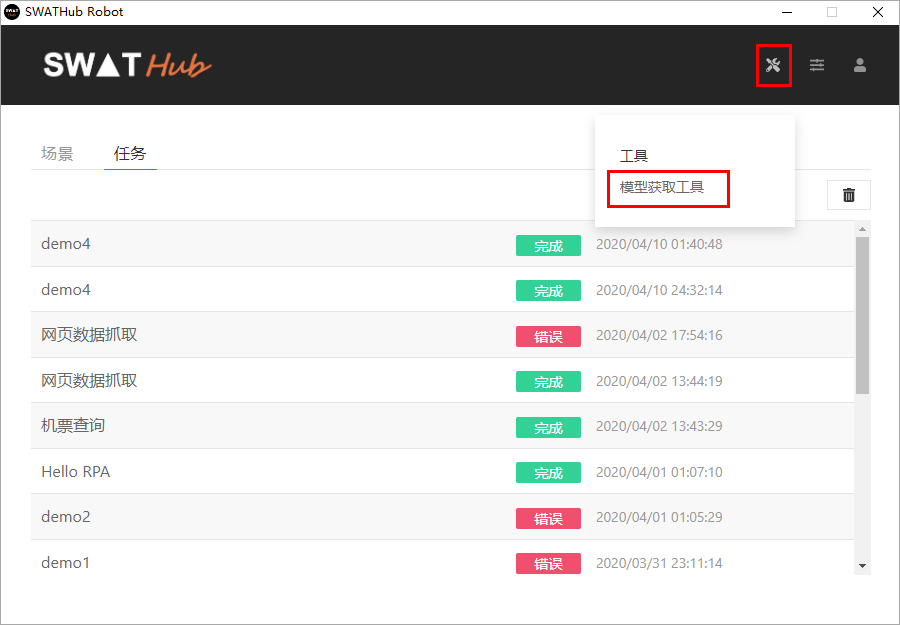
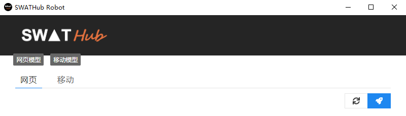
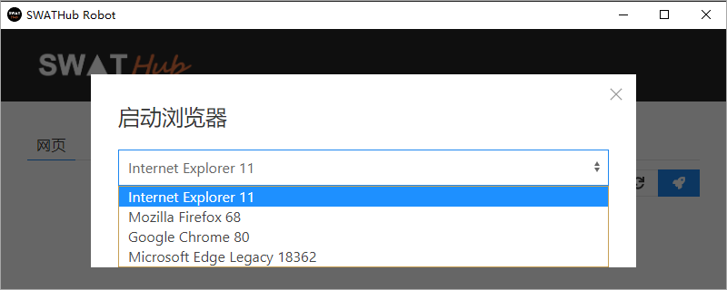
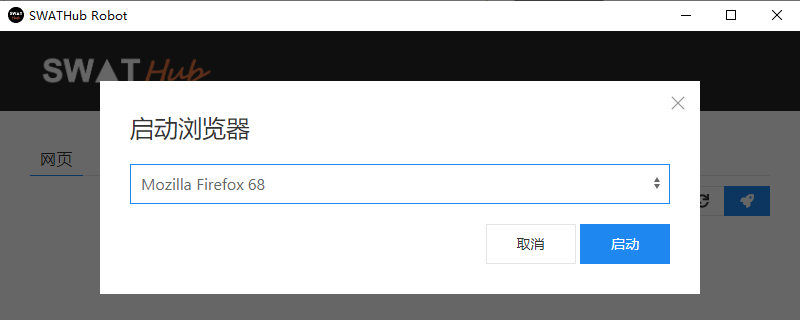
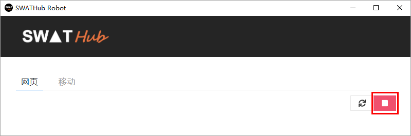
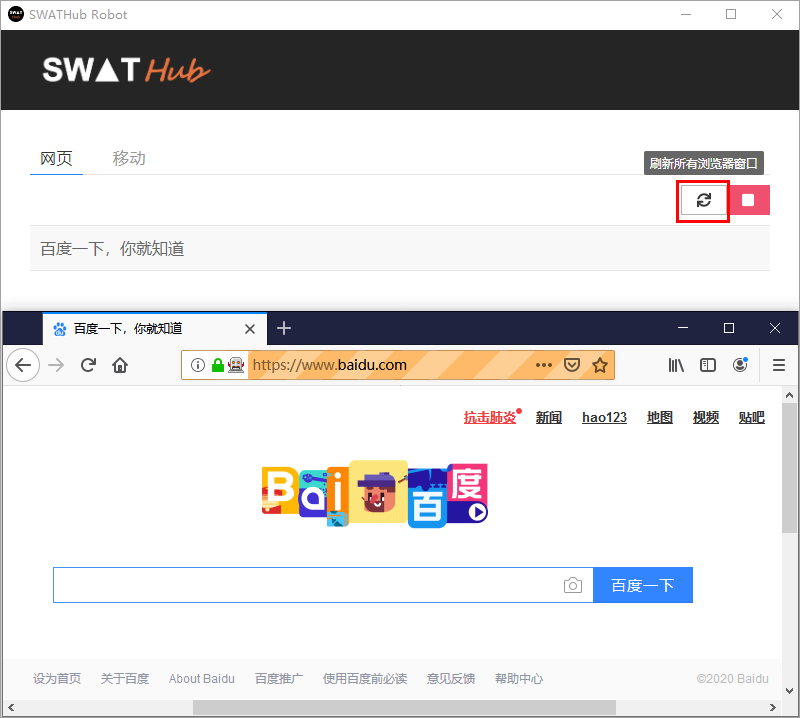
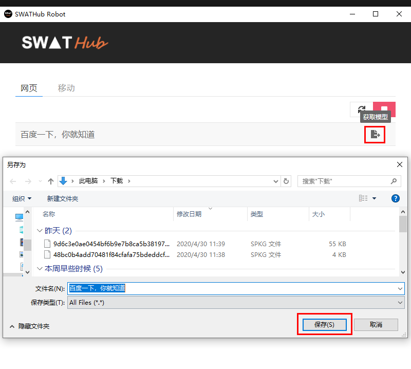
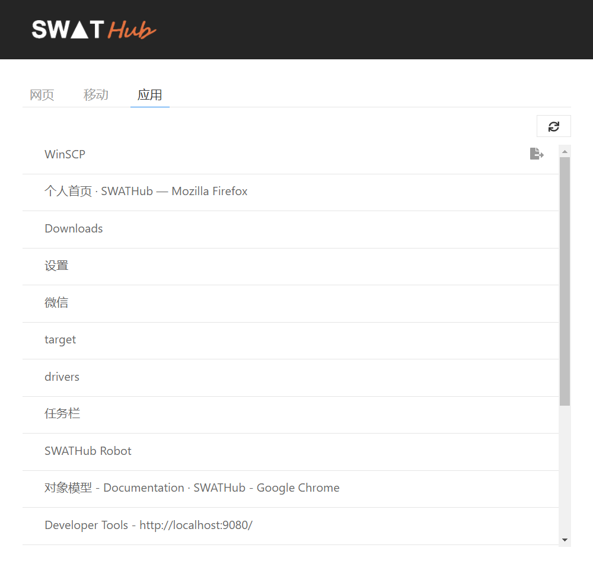
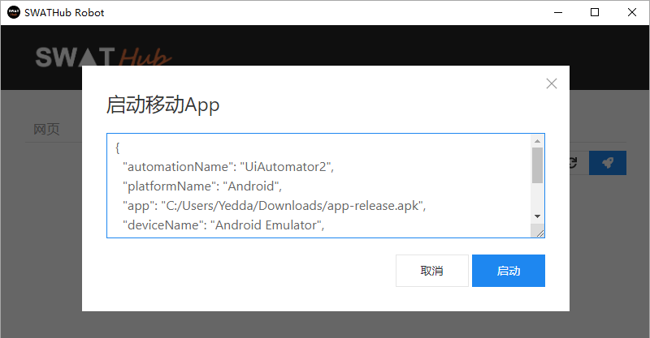
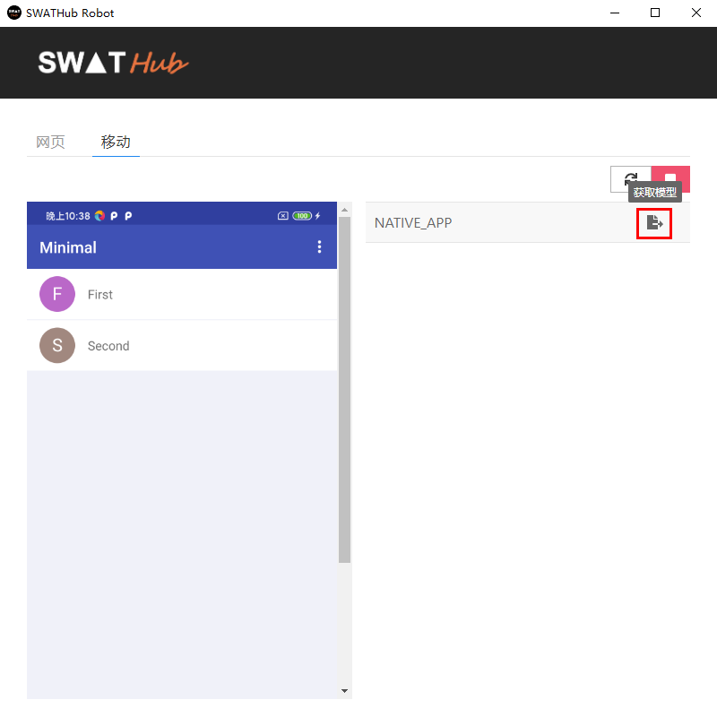

模型获取工具
===

SWATHub Robot客户端工具集成了「模型获取工具」，我们可以使用客户端工具实现Web模型和APP模型的获取。通过客户端**工具**菜单进入**模型获取工具**界面，选择**网页**或**移动**模型文件获取类别，开始获取操作。

网页模型的获取
---

Web模型的获取操作步骤如下：

1.  进入**模型获取工具**界面，选择Web标签，点击 <i class = " fa fa-rocket"></i> 启动浏览器，选择获取网页文件所要使用的浏览器1。

2. 点击**启动**按钮后，指定的浏览器打开，**模型获取工具**开始自动获取我们通过浏览器所打开Web页面的。此时选定的浏览器自动打开，获取器中的启动按钮变为录制状态，如下图所示：

3. 在已打开的浏览器中输入目标Web网页站点的URL，打开网站，开始捕获Web网页。当浏览器操作进行到需要保存的页面时，点击**模型获取工具**的刷新按钮，即可获取页面文件。如下图所示：

4. 保存后的网页文件即可按照[对象模型](design_model.md#Web模型)的操作方式进行模型功能操作了。

?> 1. 请注意选择浏览器时，首先确认当前计算机有安装相应浏览器。

Windows模型的获取
---

1. 进入 **模型获取工具** 界面，选择应用标签，点击 <i class = " fa fa-refresh"></i> 获取当前运行的所有应用窗口。
2. 点击条目右侧 <i class = " fa fa-sign-out"></i>，将Windows应用的模型文件保存到指定位置。

3. 保存后的网页文件即可按照[对象模型](design_model.md#Windows模型)的操作方式进行模型功能操作了。

APP模型的获取
---

开始进行APP模型的获取之前，需要先完成手机端执行环境的设置，请参考[移动端平台](robot_mobile_setup.md)。在SWATHub Robot**模型获取工具**中获取APP模型的操作步骤如下：

1. 启动电脑端相关配置服务，Android和iOS手机操作系统的手机驱动操作及JSON格式的capabilities设置，请参考[扩展平台定义](robot_setup.md#扩展平台定义)的说明
2. 进入 **模型获取工具** 界面，选择移动标签，点击 <i class = " fa fa-rocket"></i> 启动移动App，输入JSON格式的capabilities。

3. 连接到手机APP后，当前APP界面会同步显示在移动页面获取工具的左侧显示区，点击右上角 <i class = " fa fa-refresh"></i> 刷新APP当前视图按钮，当前APP页面的文件条目显示在右侧列表中，点击条目右侧 <i class = " fa fa-sign-out"></i> 另存为APP页面文件到指定位置。

4. 保存后的APP页面文件即可按照[对象模型](design_model.md#APP模型)的操作方式进行模型功能操作了。

* NATIVE_APP：保存为`sview`文件，代表了原生代码，作为移动模型导入。
* WebView_1：保存为`shtml`文件，代表了WebView的HTML代码，作为网页模型导入。