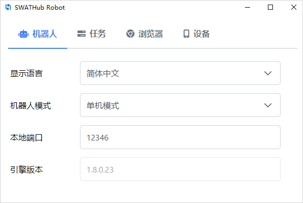
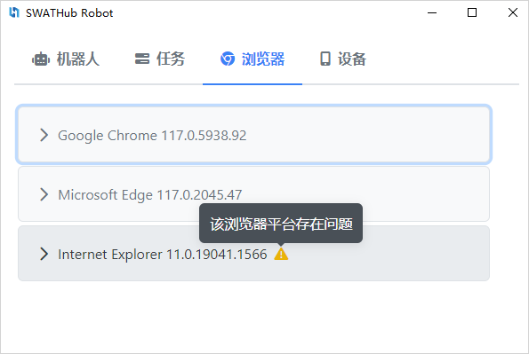

安装设置
===

机器人安装
---

### 配置要求

|        | 最低配置
| ------- | -----------
| CPU     | 2.2 GHz (单核)<sup>1</sup>
| 内存  | 4GB<sup>1</sup>
| 操作系统 | Windows 7 以上各版本、Mac OS X 10.6 以上各版本
| 浏览器 | Internet Explorer 8 以上各版本、Microsoft Edge、Firefox、Chrome、Safari
| 其他应用 | 调用外部应用的系统操作的运行需要安装相应软件，比如Outlook邮件发送功能需要安装Outlook。

?> 1. 当需要处理复杂应用或者开启平行任务时，机器人需要更强的CPU和更大的内存。

### 安装步骤

1. 从SWATHub设计平台上的**机器人**菜单中下载[相应平台](#平台版本)的SWATHub机器人安装包，比如`swathub-robot-v1.7.4-x64.zip`，请参考[平台用户](design_user.md) - **机器人下载安装** 。
1. 将SWATHub机器人安装包解压缩到安装目录<sup>1</sup> <sup>2</sup>。
1. 设置SWATHub机器人所在业务终端的操作系统和所使用到的浏览器<sup>3</sup> <sup>4</sup>。
1. 运行`SWATHubRobot.exe`或`SWATHubRobot`启动SWATHub机器人。
1. 激活SWATHub机器人的[订阅](#激活订阅)。

?> 1. 安装在远程的网络硬盘上SWATHub机器人可能无法正常工作。

?> 2. macOS版的机器人需要拷贝到Application目录。使用任意临时目录有可能会出现权限问题。

?> 3. 为了保证流程运行的稳定性和性能，请参考[运行环境设置](#运行环境设置)来完成相应的设置。

?> 4. 当需要连接手机端运行手机端浏览器或手机端APP时，需要额外[搭建移动端平台](robot_mobile_setup.md)。

### 平台版本

我们提供如下平台版本的SWATHub机器人。

* Windows 32位
* Windows 64位
* macOS

### 激活订阅

SWATHub机器人有**离线终端机器人订阅**和**在线用户机器人订阅**两种不同的订阅方式，其中，**离线终端机器人订阅**仅授权在特定终端上的SWATHub机器人的使用，需要按照如下步骤进行手动激活。**在线用户机器人订阅**则在机器人登录SWATHub设计平台时根据用户账号的订阅自动激活<sup>1</sup>。

1. 点击SWATHub机器人的**设置 > 订阅**菜单打开**订阅**对话框。
2. 使用订阅状态中的机器人ID<sup>2</sup>来申请相应的订阅码。
3. 获取到订阅码后，将订阅码输入到输入框，点击**验证**按钮，确认机器人的订阅状态。
4. 关闭**订阅**对话框。



?> 1. 根据用户账号的类型，使用同一用户账号可以登录的机器人数目会有限制。

?> 2. 机器人ID和SWATHub机器人所在终端一一对应，当终端发生改变时，该机器人ID也会发生改变从而导致订阅失效。

### 浏览器诊断

SWATHub机器人在连接SWATHub设计平台时会侦测当前系统浏览器版本和相关设置，请将提示内容，按**用户手册**指导修改浏览器设置。


### 升级

SWATHub机器人在连接SWATHub设计平台时会侦测当前机器人和设计平台的版本是否匹配，当出现版本不一致时会出现提示信息<sup>1</sup>。此时可以按照一下步骤来升级机器人。

1. 关闭正在运行的SWATHub机器人。
2. 下载所需版本的SWATHub机器人安装包。
3. 删除老版本的SWATHub机器人安装目录。
3. 将SWATHub机器人安装包解压缩到的安装目录。
4. 运行`SWATHubRobot.exe`或`SWATHubRobot`启动SWATHub机器人，用户数据将根据需要进行自动升级。

?> 1. 当SWATHub机器人和SWATHub设计平台版本不同时，虽然过去创建的场景仍有可能可以正常运行，但是使用到新版本特性的场景往往无法正常运行。

机器人设置
---

通过SWATHub机器人的**设置 > 设置**菜单可以打开机器人设置对话框，来进行如下设置。

### 机器人

* **名称**: 连接到SWATHub设计平台时该机器人所对应的名称，未填时使用当前IP作为名称。
* **语言**: 界面所使用的语言，当前支持英文，中文和日文。
* **可见范围**: 连接到SWATHub设计平台流程设计项目时该机器人可被看到的范围。选择**用户**时仅能够被该机器人登录所用的用户见到，选择**流程设计项目**时则能够被该流程设计项目中所有的用户见到。本选项仅在在线设计模式中有效。
* **任务并发数**: 可同时运行的任务数<sup>1</sup>。填写正整数。
* **代理服务器**: 通过HTTP代理服务器连接SWATHub设计平台时的服务器地址。
* **代理端口**: 通过HTTP代理服务器连接SWATHub设计平台时的服务器端口。
* **代理用户名**: 通过HTTP代理服务器连接SWATHub设计平台时的用户名。
* **代理密码**: 通过HTTP代理服务器连接SWATHub设计平台时的密码。


?> 1. 该选项仅允许多任务的并发运行，用户需要在终端环境上和流程设计中确保多个任务可同时在业务终端上运行。

### 任务

* **缺省浏览器**: 当任务中未指定使用何种浏览器平台时，运行中使用的浏览器平台。该平台列表中显示的是当前可用的平台。
* **任务超时**: 当任务在执行中无响应一段时间后自动终止任务执行。填写单位为秒的非负整数。为`0`时不设置超时时间。
* **任务保留天数**: 保留最近任务的执行结果的天数。填写单位为天的非负整数。为`0`时保留所有执行结果。
* **浏览器基准URL**: 当流程中的浏览器使用了相对URL并且任务中未指定浏览器基准URL时，运行中浏览器使用的基准URL。
* **API基准URL**: 当流程中的API使用了相对URL并且任务中未指定API基准URL时，运行中API使用的基准URL。



### 浏览器

* **下载目录**: 浏览器所使用的下载目录的路径。使用IE时需要和浏览器中的设置保持一致。
* **Chrome配置**: Chrome所使用的自定义配置的路径。参见[创建Chrome配置](#创建Chrome配置)。
* **Firefox配置**: Firefox所使用的自定义配置的路径。参见[创建Firefox配置](#创建Firefox配置)。
* **Edge配置**: Edge所使用的自定义配置的路径。
* **代理服务器**: 浏览器所使用的代理服务器的服务器地址。
* **代理端口**: 浏览器所使用的代理服务器的服务器端口。


#### 创建Chrome配置

1. 关闭执行中的Chrome。
2. 寻找到Chrome的可执行文件。根据不同平台，缺省安装的路径会有所不同。
  * (Windows) `%HOMEPATH%\Local Settings\Application Data\Google\Chrome\Application\chrome.exe`
  * (Windows) `%HOMEPATH%\AppData\Local\Google\Chrome\Application\chrome.exe`
  * (Windows) `C:\Program Files\Google\Chrome\Application\chrome.exe`
  * (Windows) `C:\Program Files (x86)\Google\Chrome\Application\chrome.exe`
  * (MacOS) `/Applications/Google Chrome.app/Contents/MacOS/Google Chrome`
3. 执行下述命令创建新的Chrome配置。
```batch
chrome.exe --user-data-dir=C:\Dev\chrome-profile
```
4. 在该配置下进行所需的浏览器设置以及扩展功能等<sup>1</sup>。

?> 1. 对于无法正常访问Google的环境，请务必将主页设置为`about:blank`。

#### 创建Firefox配置

1. 关闭执行中的Firefox。
2. 寻找到Firefox的可执行文件。根据不同平台，缺省安装的路径会有所不同。
  * (Windows) `"C:\Program Files (x86)\Mozilla Firefox\firefox.exe"`
  * (MacOS) `/Applications/Firefox.app/Contents/MacOS/firefox`
3. 执行下述命令启动Firefox的配置管理器，通过管理器界面设置新的配置。
```batch
firefox.exe -profilemanager
```
4. 执行下属命令在该配置（假设名为`firefox-profile`）下启动Firefox，进行所需的浏览器设置以及扩展功能等。
```batch
firefox.exe -P firefox-profile
```

### 高级

* **扩展平台定义**: SWATHub机器人可以连接使用的扩展平台（如手机平台）的JSON定义。


#### 扩展平台定义

SWATHub机器人除了可以使用所在业务终端的各种操作系统浏览器平台外，还可以连接兼容WebDriver标准的扩展平台，包括[Appium](http://appium.io/)，[Selenium Grid](https://github.com/SeleniumHQ/selenium/wiki/Grid-Platforms)，以及[BrowserStack](http://www.browserstack.com)或[Sauce Labs](https://saucelabs.com)等云服务。

为了连接并使用扩展平台，必须通过以下JSON语法来定义扩展平台的列表。

* `remoteURL` (必须): 扩展平台所在服务的Remote WebDriver API的URL。
* `code` (必须): 该平台的代码，使用自定义的文字列，将显示在浏览器列表中。
* `definition` (必须): 该平台的系统信息。
  * `os` (必须): 操作系统名。支持`Windows`、`macOS`、`Linux`、`iOS`、`Android`。
  * `osVer`: 操作系统版本。
  * `browser` (必须): 浏览器名。支持`IE`、`Edge`、`Edge Legacy`、`Firefox`、`Chrome`、`Safari`、`Browser`。
  * `browserVer`: 浏览器版本。
* `capabilities`: 该平台的驱动特性设置，使用该平台所支持的WebDriver Capabilities键名和键值。

以下是连接Appium手机平台的扩展平台定义的例子。

```json
[
  {
    "remoteURL": "http://localhost:4723/wd/hub",
    "code": "iOS 11 Safari",
    "definition": {
      "os":"iOS",
      "osVer":"9.1",
      "browser":"Safari",
      "browserVer":"9"
    },
    "capabilities":{
      "udid":"YOUR_DEVICE_UDID",
      "deviceName":"iPhone",
      "platformName":"iOS",
      "browserName":"Safari",
      "platformVersion":"9.1"
    }
  },
  {
    "remoteURL": "http://localhost:4723/wd/hub",
    "code": "Android Chrome",
    "definition": {
      "os": "Android",
      "osVer": "4.4",
      "browser": "Chrome",
      "browserVer": "66"
    },
    "capabilities": {
      "deviceName": "Android",
      "platformName": "Android",
      "browserName": "Chrome"
    }
  }
]
```

运行环境设置
---

在使用浏览器原生自动化引擎驱动Web应用时，为了减少浏览器驱动中可能发生的问题，需要对操作系统以及浏览器进行一定的设置。因此请务必确认下述设置是否正确。

### 操作系统

#### Windows

* Windows桌面的字体和显示大小**必须**设置为`100%`。
* Windows防火墙在启动状态时，需要对`IEDriverServer.exe`和`chromedriver.exe`放开通讯权限。
* 如果流程中涉及到一些非英语字符的输入，需要将英语输入法设置为缺省输入法。

#### MacOS

* 如果流程中涉及对浏览器中滚动条区域的截图的话，需要将系统滚动条设置成`始终显示`。

### 桌面浏览器

#### Internet Explorer

* IE的WebDriver的正常运行需要若干设置，比如各个区域的保护模式**必须**设置成相同才能正常驱动自动化流程。显示放大率也**必须**设置在`100％`等。请使用管理员权限，直接执行安装目录下的`ie.reg`文件进行设置。
* 第三方工具栏有可能会影响IE的正常执行，推荐将其无效化，或者删除。
* 如果之前执行中产生的Cookie导致后续执行中流程发生变化，可以在IE设置中设置关闭时自动清除数据。
* 如果流程需要访问无有效证明书的SSL网站，可以在流程中使用GUI操作，或者执行下述JavaScript代码来关闭警告。
```javascript
document.getElementById('overridelink').click();
```
* 通过RDP远程桌面使用虚拟机中的IE，手动关闭RDP有可能会出现RDP过程锁定导致IE无法正常截图，建议用管理员权限，执行安装目录下的`discon.bat`。使用VNC也可以避免上述情况发生。
* 驱动特性
  * 如同其他的GUI自动化，执行自动化操作时IE窗口必须在最前端。任何其他的键盘和鼠标操作都有可能影响自动化的正常运行。
  * 在一个Windows操作系统上同时只能运行一个IE的进程，因此无法支持自动化任务的并发运行。

#### Microsoft Edge

* 新版本的Edge基于开源的Chromium进行构建，内核与Chrome更加接近。SWATHub机器人会显示出用户所使用的Edge版本。如果所使用的SWATHub机器人版本无法提供更新的Edge驱动，请从[微软官网](https://developer.microsoft.com/en-us/microsoft-edge/tools/webdriver/)下载相应版本的驱动，并通过**设置**对话框**浏览器**标签下的**打开浏览器驱动目录**按钮 <i class="fa fa-folder-open"></i> 打开浏览器驱动目录，手动替换浏览器驱动目录下的Edge驱动，SWATHub机器人在启动时会自动读取。
* 如果流程需要访问无有效证明书的SSL网站，可以在流程中使用GUI操作，或者执行下述JavaScript代码来关闭警告。
```javascript
document.getElementById('proceed-link').click();
```
* 驱动特性
  * 为了消除日常使用设置的影响，Edge驱动每次启动都会使用空白配置的缺省设置。
  * Edge驱动支持多个Edge进程同时运行自动化任务，并且不受其他的键盘和鼠标操作的影响。

#### Microsoft Edge Legacy

* 由于Windows 10中没有缺省安装Edge Legacy驱动，请参考[微软官网](https://developer.microsoft.com/en-us/microsoft-edge/tools/webdriver/)的说明来安装驱动。对于老版本的Windows 10需要手动下载相应版本的`MicrosoftWebDriver.exe`并拷贝到`C:\Windows\System32\`。SWATHub机器人在启动时会自动侦测Edge驱动。
* 如果流程需要访问无有效证明书的SSL网站，可以在流程中使用GUI操作，或者执行下述JavaScript代码来关闭警告。
```javascript
document.getElementById('overridelink').click();
```
* 驱动特性
  * Edge Legacy无法通过`http://<username>:<password>@yourdomain`这种形式来跳过Basic认证。需要在流程中使用GUI操作来进行认证。
  * 如同其他设计GUI的自动化，执行自动化操作时Edge窗口必须在最前端。任何其他的键盘和鼠标操作都有可能影响自动化的正常运行。
  * 在一个Windows操作系统上同时只能运行一个Edge的进程，因此无法支持自动化任务的并发运行。

#### Google Chrome

* SWATHub机器人会显示出用户所使用的Chrome版本。如果所使用的SWATHub机器人版本无法提供更新的Chrome驱动，请从[Chrome官网](https://sites.google.com/a/chromium.org/chromedriver/downloads)下载相应版本的驱动，并通过**设置**对话框**浏览器**标签下的**打开浏览器驱动目录**按钮 <i class="fa fa-folder-open"></i> 打开浏览器驱动目录，手动替换浏览器驱动目录下的Chrome驱动，SWATHub机器人在启动时会自动读取。
* 驱动特性
  * 为了消除日常使用设置的影响，Chrome驱动每次启动都会使用空白配置的缺省设置，如果流程中使用到特殊设置，请在SWATHub机器人中设置**Chrome配置**。
  * Chrome驱动支持多个Chrome进程同时运行自动化任务，并且不受其他的键盘和鼠标操作的影响。

#### Mozilla Firefox

* SWATHub机器人会显示出用户所使用的Firefox版本。如果所使用的SWATHub机器人版本无法提供更新的Firefox驱动，请从[Mozilla Github](https://github.com/mozilla/geckodriver/releases)下载相应版本的驱动，并通过**设置**对话框**浏览器**标签下的**打开浏览器驱动目录**按钮 <i class="fa fa-folder-open"></i> 打开浏览器驱动目录，手动替换浏览器驱动目录下的Firefox驱动，SWATHub机器人在启动时会自动读取。
* 驱动特性
  * 为了消除日常使用设置的影响，Firefox驱动每次启动都会使用空白配置的缺省设置，如果流程中使用到特殊设置，请在SWATHub机器人中设置**Firefox配置**。
  * Firefox驱动支持多个Firefox进程同时运行自动化任务，并且不受其他的键盘和鼠标操作的影响。
  * Firefox `47` 以下的版本，目前不支持。`47` 到 `59` 之间的版本，请使用 `geckodriver v0.20`。`60` 及以上的版本请使用最新版本的 `geckodriver`。

#### MacOS Safari

* Safari版本`11`及以上版本，**必须**打开**Develop > Allow Remote Automation**。
* 如果流程需要访问无有效证明书的SSL网站，需要事先访问并确认警告来关闭该警告的出现。
* 驱动特性
  * Safari无法通过`http://<username>:<password>@yourdomain`这种形式来跳过Basic认证。需要在流程中使用GUI操作来进行认证。
  * Safari驱动支持多个Safari进程同时运行自动化任务，并且不受其他的键盘和鼠标操作的影响。

### 手机端浏览器

#### Android Chrome

* SWATHub机器人需要通过[Appium](http://appium.io/)来连接Android Chrome，请在SWATHub机器人中设置[扩展平台](/cn/ref_setup_robot#扩展平台定义)来启动该平台。
* 驱动特性
  * 在一个Android操作系统上同时只能运行一个Chrome的进程，因此无法支持自动化任务的并发运行。

#### iOS Safari

* SWATHub机器人需要通过[Appium](http://appium.io/)来连接iOS Safari，请在SWATHub机器人中设置[扩展平台](/cn/ref_setup_robot#扩展平台定义)来启动该平台。
* 如果流程需要访问无有效证明书的SSL网站，需要事先访问并确认警告来关闭该警告的出现。
* 驱动特性
  * Safari无法通过`http://<username>:<password>@yourdomain`这种形式来跳过Basic认证。需要在流程中使用GUI操作来进行认证。
  * Web应用存在多窗口时，切换窗口会弹出警告框，需要手动确认，同时也需要手动将该窗口切换到最前端。
  * 在一个iOS操作系统上同时只能运行一个Safari的进程，因此无法支持自动化任务的并发运行。
