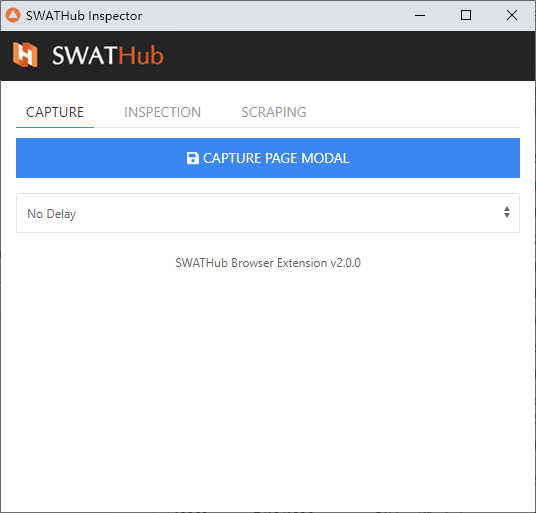

Web浏览器拾取插件
===

SWATHub提供了基于浏览器插件的Web拾取工具「**SWATHub Browser Extension**」1，如下图所示，我们可以使用该插件来获取[Web网页模型文件](../dev/model_web)，生成用于Web系统操作的[Web元素选择器](../dev/sop_webapp#Web元素的选择器)，还可以设计批量获取网页数据的[Web数据抓取规则](../dev/sop_webapp#网页数据抓取)。

?> 1. 插件目前仅支持Chrome、Firefox和Edge浏览器。

插件安装
---

| 浏览器       | 下载信息           | 版本要求 | 扩展设置URL
| ---------- | -----------   | ----------- | -----------
| Google Chrome | [Chrome Web Store](https://chrome.google.com/webstore/detail/swathub-inspector/mgjolppchlcakohembjnblmejhohpjio)  [离线安装包](tools/swathub-inspector_v2.0.0.zip)| Google Chrome 31 以上 | `chrome://extensions`
| Mozilla Firefox | [离线安装包](tools/swathub-inspector_v2.0.0.xpi)| Mozilla Firefox 59 以上 | `about:addons`
| Windows Edge | [离线安装包](tools/swathub-inspector_v2.0.0.zip)| Windows Edge 76 以上 | `edge://extensions`

### 离线包安装步骤

1. 打开浏览器地址栏中输入上述扩展设置URL，进入设置页面。
2. 使用Chrome和Edge时需要在该页面中开启`开发者模式`。
3. 将下载好的离线包直接拖入浏览器窗口即可。

获取网页模型
---

首先在浏览器中导航到所需的页面，然后点击插件图标，激活插件，如上图所示，在「**CAPTURE**」 标签页面上，直接点击`CAPTURE PAGE MODEL`按钮即可。

特别的，对于某些需要鼠标焦点的页面元素，例如鼠标悬浮之后才会显示的菜单，直接点击按钮会导致菜单消失。此时，如下图所示，可以先设置按钮下面的`DELAY`时间，点击按钮之后，使得菜单显示出来，保持当前状态5秒之后，会自动触发并完成模型抓取。

获取Web元素选择器
---

如下图所示，在插件上切换到「**INSPECT**」标签页面，点击`INSPECT ELEMENT`按钮，然后在浏览器当前活跃页面上，选择需要获取选择器的元素，点击之后，即可获取JSON格式的选择器，并直接用于SWATHub设计器中的[Web系统操作](../dev/sop_webapp)。

同时，我们可以手动修改JSON编辑器中的选择器，然后点击`HIGHLIGHT`来验证是否能够正确定位，使得所需元素高亮。

特别的，我们可以设置选择器的生成规则，如下图所示：
* 设置`DELAY`之后，再进行INSPECT和HIGHLIGHT操作，可以顺利定位需要鼠标焦点的页面元素。
* 对于使用动态ID的页面元素，基于ID的选择器会导致执行时无法准确定位。此时，我们可以去掉`Enable ID in Selector`的勾选项，来使用其他属性生成选择器。或者也可以通过设置`ID Exclude Filter`来过滤掉符合某些特定格式的ID属性，例如：对于数字和字母组成的8位动态ID，我们可以设置正则表达式来过滤掉，`[0-9A-Z]{8}`。
* 同样的，我们也可以去掉`Enable Class in Selector`的勾选项，来禁止使用元素的CLASS属性来生成选择器。或者通过设置`Class Exclude Filter`来过滤特定格式的CLASS属性，例如：当鼠标移动到元素上时，会生成临时性的`ui-state-hover`和`ui-state-focus`属性，我们可以通过设置正则表达式`hover|focus`来进行过滤。

获取网页抓取规则
---

当我们需要批量抓取网页上大量数据时，例如针对某个表格，或者某个列表的时候，可以切换到「**SCRAPING**」标签页面进行操作，从而生成数据抓取规则。

如上图所示，操作步骤依次为：
* 点击`DEFINE REGION`，根据提示，先后点击表格中相邻的两个单元项，比如表格中的第一行和第二行，此时会生成整个表格区域的选择器。
* 可以选择点击`PREVIEW`按钮，则会生成JSON数组格式的抓取结果，其中每一个单元包含了某一行的全部文本。我们也可以省略这一步，直接进入下面步骤添加需要的具体属性。
* 点击`ADD ELEMENT`，根据提示，点击表格中某一行的某个单元格，如下图所示，将每一行的第三个单元格的文本值取出来，并命名为`name`。同时，我们也可以选择获取单元格的其他属性，例如`value`或者`href`等。

* 重复上述步骤`ADD ELEMENT`，可以添加一行中所需的所有单元格，此时再点击`PREVIEW`按钮，即可获取到如下所示的JSON数组，其中每一个单元都是一个JSON对象，包含了定义的各个单元格属性。

* 抓取规则同样支持手动修改，然后点击`PREVIEW`来验证是否符合预期效果。