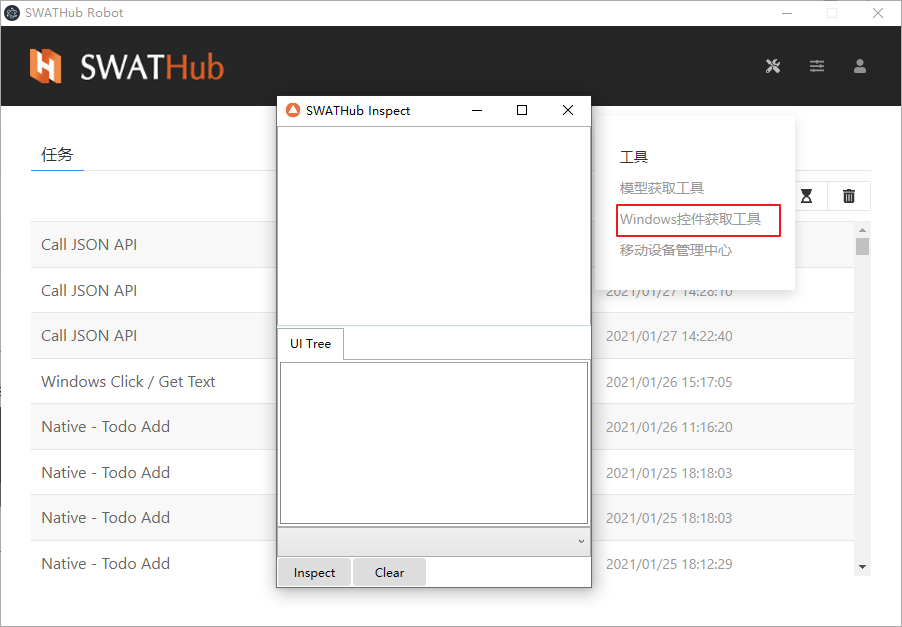

Windows控件获取工具
===

SWATHub Robot客户端工具集成了「Windows控件获取工具」1 2。

?> 1. 工具目前仅支持Windows 10 64位系统，路径位于 `%appdata%\swathub-robot\addons\<version>\system\SWATHubInspect`。

?> 2. 个别系统中可能遇到工具点击之后无法打开的问题，可以尝试安装 [Microsoft Visual C++ Redistributable](https://aka.ms/vs/16/release/vc_redist.x64.exe) 之后重新尝试。

Windows控件的获取
---

Windows控件的选择器获取操作步骤如下：

1.  进入**Windows控件获取工具**界面，点击`Inspect`按钮，进入控件搜索模式，移动鼠标到需要定位的Windows应用程序1的控件，如下图中写字板的菜单按钮。如果控件被正确定位，其周围会出现蓝色边框闪烁，同时工具界面中，上方面板中出现该控件的选择器，下方面板中出现该控件所在的Windows UI树。

2. 点击`Stop`按钮，结束控件搜索模式。此时，可以在上方面板中点击右键`Copy Full JSON`，获取到完整的JSON选择器，加入到SWATHub的系统操作中。

3. 自动生成的JSON可能层次比较多，工具支持手工修改JSON内容，删除其中一些冗余的层级，或者将`name`属性调整为正则表达式，来获得更好的通用性，然后右键点击`Highlight`2，来校验修改内容是否正确。

?> 1. 系统级别的Windows应用程序，如「任务管理器」等，或者使用管理员权限打开的应用程序，如需获取其控件，需用管理员角色打开SWATHub Robot。

?> 2. 如需校验某些通过鼠标点击操作才会出现的控件，比如当前不显示的下拉菜单中的菜单项，可以右键点击`Highlight with Delay`，工具会等待5秒钟，然后再进行校验。