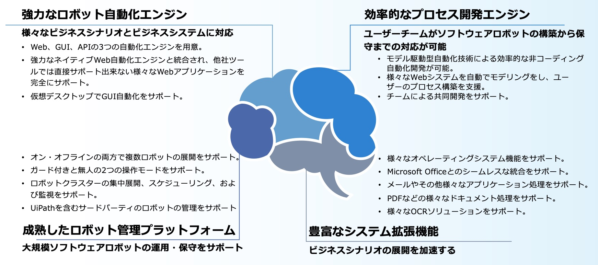

SWATHub概要
===
SWATHubは
、エンタープライズレベルの自動化プラットフォームです。人工知能とインタラクティブなモデリング技術により様々な領域で自動化を構築します。SaaS（Software as a Service）を使用したパブリッククラウド版、またはプライベートプラットフォームで利用するエンタープライズ版、ご利用にーずにあわせたサービスを提供します。

SWATHub自動化プラットフォームには、業務プロセス自動化と[テスト自動化](guide_test_automation.md)という2つの利用形態があります。

SWATHub自動化プラットフォームは、シナリオ/フロー/モデルの3層アーキテクチャを通じて、直感的に分かり易く、簡単で効率的なビジネスオペレーションの自動化が可能です。ユーザーはWeb /モバイル/WindowsOfficeアプリケーション、その他APIオペレーションといったニーズにお応えします。SWATHubはエンタープライズレベルの自動化プロセスの実現と運用の基盤として使用することができます。

SWATHubは、画面上のオペレーションをナレッジベース技術でコンポーネント化し、これらを使って一連のオペレーションを自動化します。自動化プロセスはロボットの監視機能で制御され、クラウドサービスプラットフォームに統合してます。ユーザーはサーバーシステムをインストールしたり、テスト環境を構築したりする必要はありません。自動化のための設計は、ブラウザーのみで完了できます。プロジェクトにおいてチーム間でのコラボレーションにより自動化作業を進めることができます。

急速に変化するビジネスのなかで、生産性の低い企業に対したデジタルトランスフォーメーションは急務です。従来人手で作業していた領域をデジタル化することで劇的に生産性を上げた事例は枚挙にいとまがない状況です。SWATHubはプロセスの自動化領域において、クラウドプラットフォームのSaaSサービス方式により基盤構築のコストを大幅に削減でき、AIとモデリング技術を使いプロセスの自動化を迅速に実現し展開できます。
