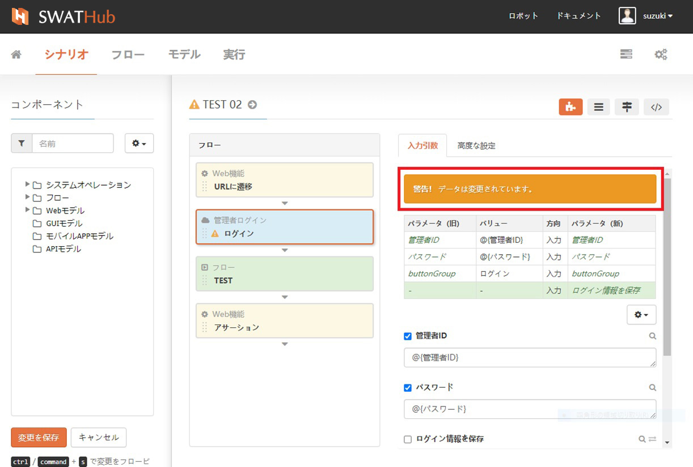
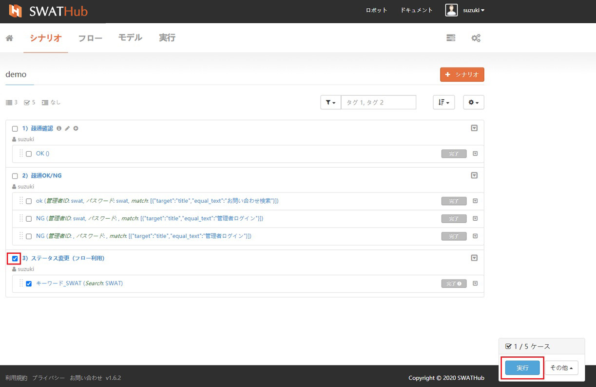
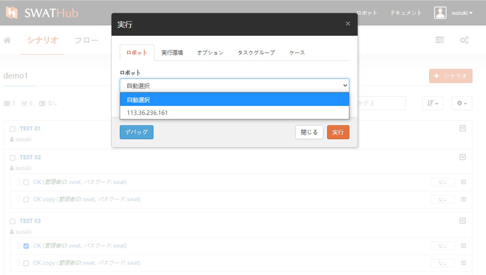
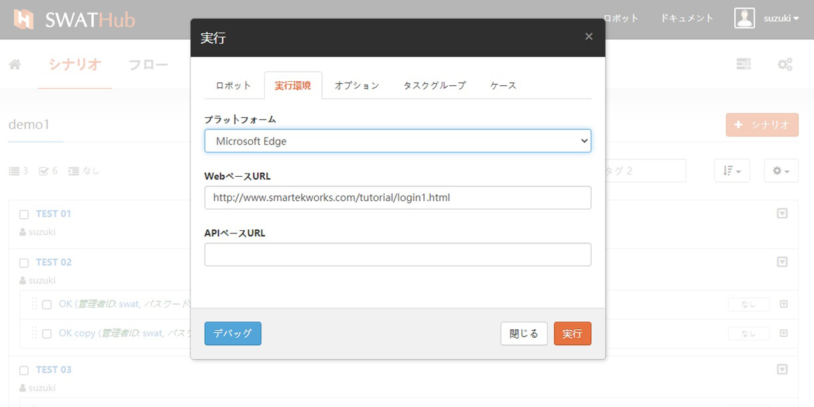
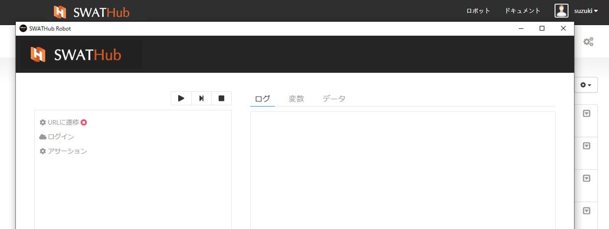
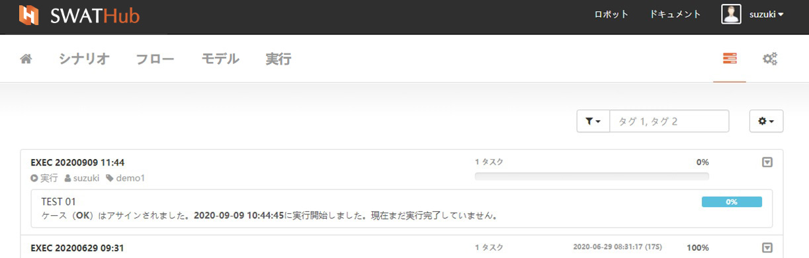
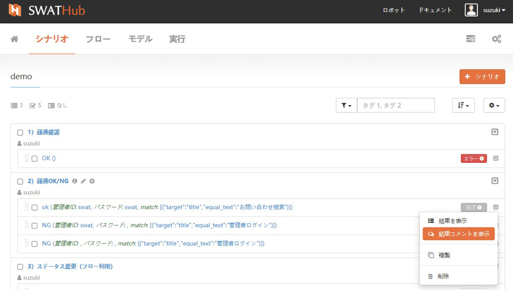

ケース
===

設計者は、シナリオに付加するパラメーター（以後ケースと言ます）を設定することにより、シナリオとケースを制御できます。

基本機能
---

### ケース作成

ケース作成はシナリオリストから追加します。シナリオリストのシナリオ名の横にある<i class="fa fa-plus-circle"></i>記号をクリックし、 ケースを追加します。

### ケース編集

シナリオ名をクリックして、シナリオ編集ページに入ります。各シナリオの入力パラメーターは必要に応じて編集できます。パラメーター名の横にある<i class="fa fa-square-o"></i>チェックボックスにチェックを入れると認識され、チェックを外すと認識されません。認識されないとそのままスルーします。

### ケースの複製

ケースの右端のボタンからドロップダウンメニュの[複製]を選ぶと、複製元のケースの下に複製されたケースが追加されます。複製されたケース名は元のケース名+copyになり、名前とパラメーター値はケースデータをクリックすることで編集ができます。ケースの複製は、そのシナリオでのみとなります。別のシナリオに複製することはできません。

### ケースの削除

使用されなくなったテストケースは直接削除できます。ケースを削除すると、ケースに関連付けられた実行結果も削除されます。削除する場合はこの点を注意してください。

ケースのメンテナンス
---

モデルの変更によりシナリオのメンテナンスが必要な場合、SWATHubは影響するシナリオとケースを検出します。影響するシナリオに対して、<i class="fa fa-warning"></i> **シナリオは更新されたコンポーネントが含まれているため、更新する必要があります。**メッセージが表示されます。警告されたシナリオ名をクリックして、シナリオ編集ページに入り、警告個所のモデルオペレーションとパラメーター（ケース）を確認し、編集が必要なパラメーター（ケース）の処理後、変更を保存することでメンテナンスを完了します。

ケースの実行
---

シナリオの実行は個別に実行することも、バッチで実行することもでき、ユーザーはテストの目的に応じてシナリオを実行することができます。

### 各種設定

実行を開始する前にこれらの実行設定を完了します。

#### ロボットの選択

SWATHubアカウントはローカルロボットサブスクリプションをサポートします。テストケースを実行するロボット設定ではデフォルトでこのアカウントのサブスクリプションに設定されたロボット端末、またはすでにローカルで実行されている他のロボット端末が選択できます。

#### 環境の選択

SWATHubはさまざまなブラウザープラットフォームをサポートしており、このPCにインストールされている各ブラウザーが選択できます。 `WebページのベースURL`と`APIベースのURL`は個別に設定できます。定義されていない場合は、シナリオグループの**デフォルト設定**を使用します。

#### オプション

ステップオプションはステップ実行の振る舞いを制御するJSONマップです。ステップごとに必要なオプションを設定する他に、シナリオもしくはフローレベルでデフォルトのステップオプションを設定することもできます。

#### タスクグループの定義

この実行のタスクグループ名、タグを設定します。特別な設定がない場合、タスクグループ名のデフォルトの形式は`EXEC YYYYMMDD HH：MM`です（図を参照）。

### デバッグ

デバッグ機能はSWATHubプラットフォームでは実行されませんが、タスク実行のロボット側でデバッグタスクを開始します。デバッグ実行は、シングルステップまたはブレークポイント制御で実行できます。詳細については、[自動実行](robot_execution.md)を参照してください。

### シナリオ実行順位

複数シナリオの実行がチェックされている場合、デフォルトでは上から順番に実行します。また、ユーザーは左マウスボタンでシナリオアイテムをドラッグし、好きな位置にドロップできます。シナリオの並べ替えは現在のシナリオに限定されており、シナリオをシナリオ間でドラッグ＆ドロップすることはできません。

### シナリオ実行状態を表示

シナリオの実行が開始されるとタスクグループリストに遷移し、実行の進行状況をリアルタイムで確認できます。シナリオの実行結果にエラーが発生した場合、赤い「**エラー**」のラベルが表示されます。

シナリオの実行結果ラベルの横にある<i class="fa fa-caret-square-o-down"></i>ボタンをクリックし、**すべての結果**を選択して、現在のタスクグループのすべてのテストケースの実行サマリーと結果を表示します。「実行結果」タブをクリックすると、シナリオの実行結果の詳細ページに遷移します。

### コメントの参照

ラベルの横にある<i class="fa fa-caret-square-o-down"></i>ボタンをクリックし、**コメントの参照**を選択して現在のテストケース実行結果のコメントを表示します。

