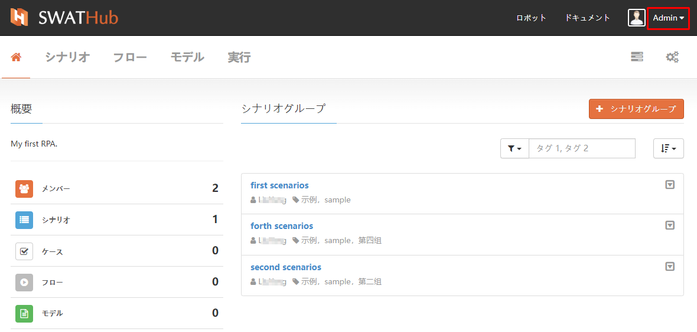
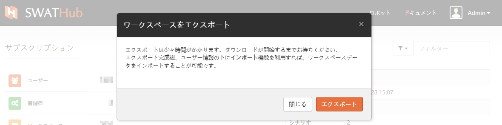
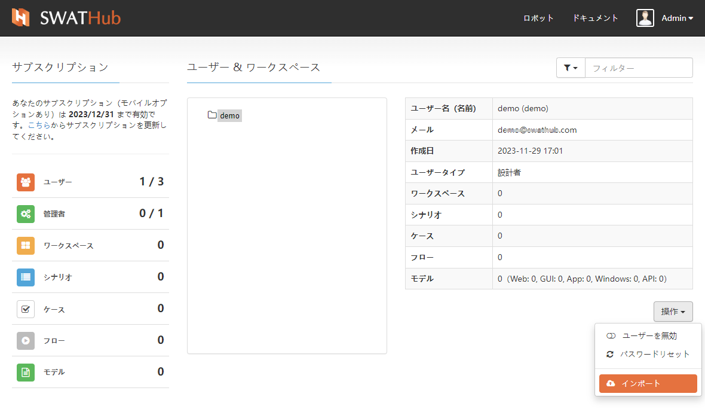
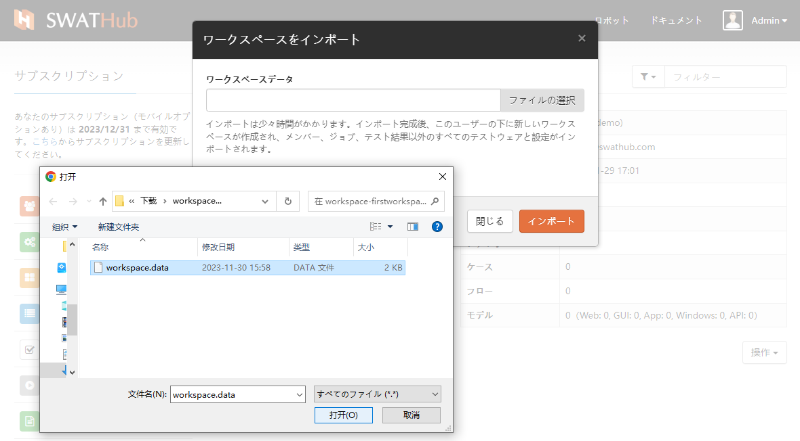
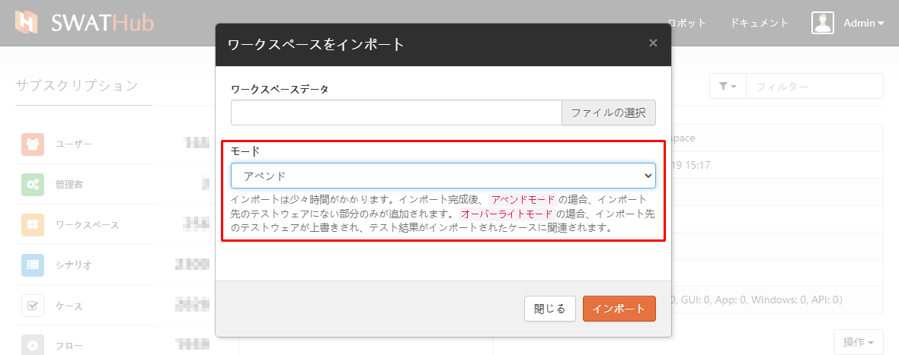
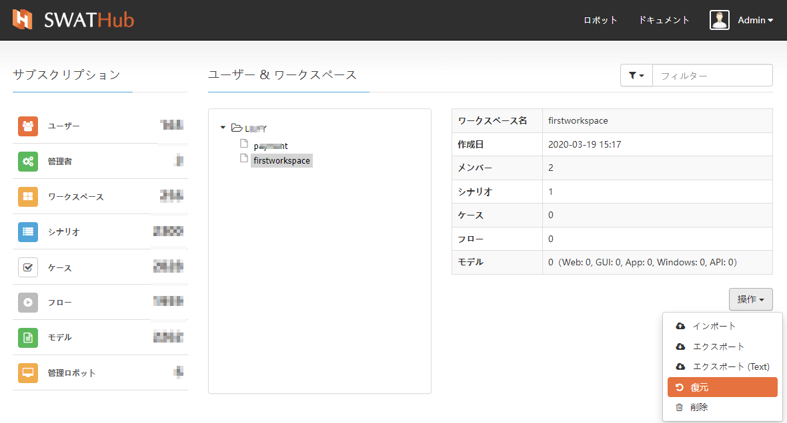

エンタープライズ版管理
===

SWATHubユーザーは `admin`という名前の**管理者**を除き、自分自身でシステム権限を登録します。管理者は管理ダッシュボードにアクセスして、次のタスクを実行できます。

* サブスクリプション管理。
* ユーザーのロック、ユーザーのロック解除、ユーザーワークスペースへのアクセス、ユーザーパスワードのリセットなど、すべてのユーザーを管理します。
* インポート/エクスポート、無効化/有効化など、ワークスペースのメンテナンス操作を実装します。

サブスクリプション管理
---

SWATHubエンタープライズ版サービスを使用するには、有効なサブスクリプションが必要です。サブスクリプションが制限を超えている場合、管理者以外の新しいユーザーを作成することはできません。

1. `http://<HostIP>:<HostPort>`を入力して、ブラウザーでSWATHubエンタープライズ版にアクセスします（Firefox / Chromeを推奨）。
2. `admin`でログインします（初期パスワードは`swathub.com`です）。
3. [サブスクリプションの更新]リンクをクリックし、サブスクリプションコードを入力して、新しいサブスクリプションを適用します1。
4. サブスクリプションコードが正しく更新されている場合、新しいサブスクリプションは管理ダッシュボードで確認できます2。

?> 1. 許可されたライセンス以上のユーザーが既にいる場合は、ユーザーを無効にして、サブスクリプションコードを再度インポートしてください。

?> 2. 有効期間情報の説明の下にある統計領域に、現在のサブスクリプションで利用できる最大使用量と使用量の統計が表示され、管理者は使用状況をリアルタイムで監視できます。

ユーザーとワークスペース管理
---

### ユーザーの役割

**管理者**：ユーザーの管理、ユーザーが属するワークスペースの管理ができます。

**ワークスペースユーザー**：**ワークスペースユーザー**は、ワークスペースにたくさんのメンバーがチームとして作業することができます。ユーザーごとに下記の4種類のロールをアサインすることができます。

 * `オーナー`：ワークスペースの作成者は、このワークスペースのすべてのタスクを実行できます。
 * `管理者`：ワークスペース管理者は、ワークスペースの削除を除くすべてのタスクを実行できます。
 * `ユーザー`：ワークスペースでテスト作業が行えるメンバーは、テストの設計、実行、検証などのテスト関連のタスクのみを実行できますが、ワークスペースの設定にはアクセスできません。
 * `ビジター`：ワークスペースのテストウェアを確認する、実行する権限を持つゲストユーザーです。テストウェアの変更やワークスペースの設定の変更ができません。

### ユーザー管理

ユーザーリストのユーザーを選択すると、そのユーザーの機能権限に対して次の操作を実行できます。

* ユーザーのブロック/アクティブ化：ユーザーをブロックすることにより、ユーザーの使用が制限されます。 ブロックされたユーザーは**フィルター**の**すべてのユーザーを表示**オプションで見つけることができ、[ユーザーのアクティブ化]操作を使用してユーザーの有効なステータスを復元できます。

* パスワードのリセット：ユーザーのパスワードをリセットすると、システムはすぐに8桁の英数字の文字列のセットを生成します。ユーザーは、新しいパスワードでログインした後、パスワードを変更できます。詳細について[ユーザー](design_user.md)を参照してください。

### ワークスペース管理

* ワークスペースへのアクセス：**管理者**によって選択されたユーザーのワークスペースへのアクセスすると、そのシナリオグループリストが表示されます。

* メンバー管理：**管理者**は、ワークスペースメンバーを追加するなど、ワークスペースメンバーの役割を変更することができます。

* ワークスペースのエクスポート：**管理者**は、プラットフォーム内のワークスペースをエクスポートし、 `workspace-ワークスペース名`形式の圧縮パッケージ1としてエクスポートして、デフォルトで現在のブラウザーのダウンロードストレージの場所に保存します。

?> 1. エクスポートされたワークスペースファイルには、ワークスペース内の各シナリオの実行結果記録データが含まれていません。

* ワークスペースのインポート：現在のワークスペースのファイルをインポートする場合は、インポートモードを選択する必要があります。実際の状況に応じて、[追加インポート]または[上書きインポート]を選択してください。

* アーカイブ：**管理者**は、ユーザーのワークスペースを直接アーカイブできます。アーカイブされたアイテムは、エクスポート、インポート、復元、および削除できます。

