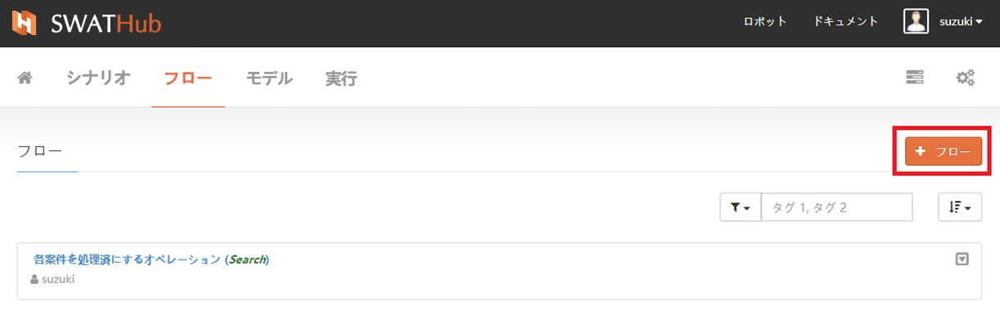
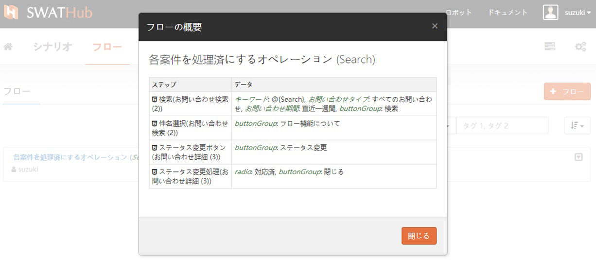
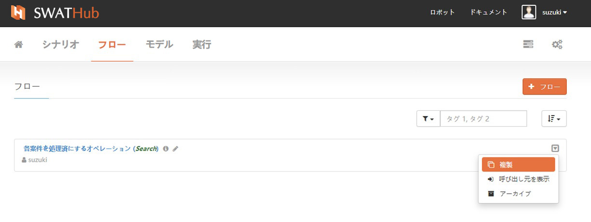
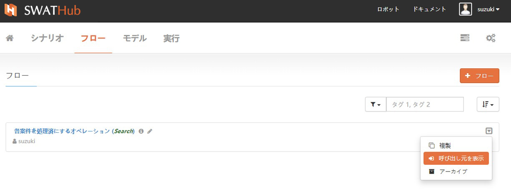
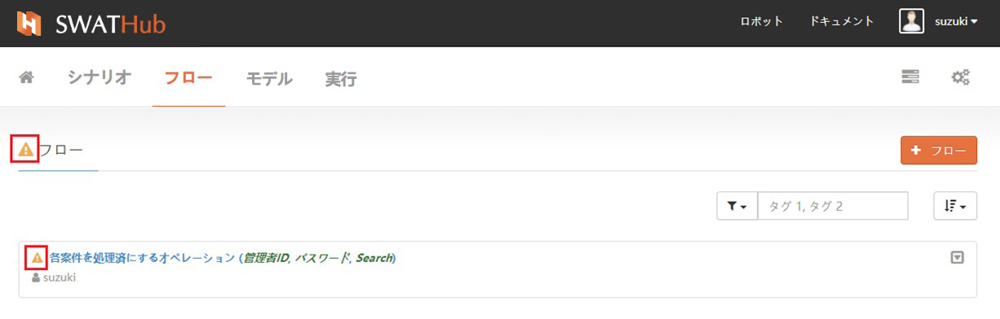
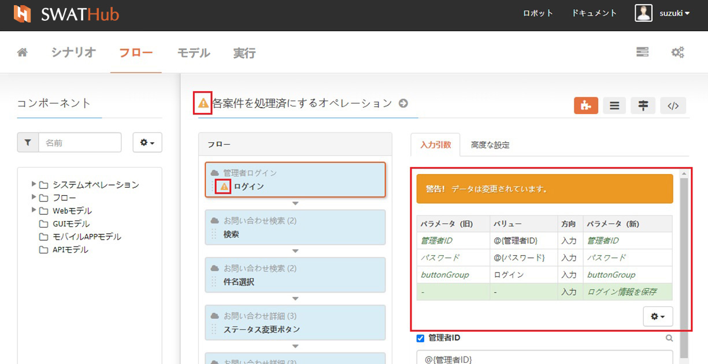

フロー
===

基本機能
---
SWATHubプラットフォームでは、ユーザーが複数のフローを作成してシナリオ作成に役立てることをお勧めします。フローは、プロジェクトのさまざまなシナリオのなかで一つのモデルオペレーションとして使用できます。 フローの基本操作には、作成、変更、コピー、およびファイリングが含まれます。また、フローの概要と関連するシナリオを表示することもできます。

### 新規作成

フロー画面から、画面右側にある<i class="fa fa-plus"></i> **フロー**ボタンをクリックして、新しいフローを作成します1 2。

?> 1. フローの入力および出力パラメータは、ステップデータエリアで設定できます。

?> 2. フローの内部ステップで`@{}`によって使用される変数が定義されていない場合、システムはそれらをフローの入力パラメーターとして自動的に作成します。

### フローの概要

フローの作成が完了後、フロー名の横にある<i class="fa fa-info-circle"></i>記号をクリックすることで、フローのステップとデータアイテムについての概要を参照することができます。

### 変更

フロー名の横の<i class="fa fa-pencil"></i>**プロパティの編集**記号をクリックすると、**名前**、**タグ**について変更することができます。

### 複製

複製機能を使用すると、このフローをそのまま複製することができます。

### 呼び出し元を表示

フローは多くの場合、プロジェクトのさまざまなシナリオのなかで使用されます。**フロー呼び出し元表示**を使用することで、このフローを利用しているシナリオをすばやく見つけることができます。

### アーカイブ

使用されなくなったフローは、**アーカイブ**を使用して隠すことができ、**アーカイブ済み**のフローはリストに表示されなくなります1。復元する必要がある場合は、[**アーカイブを表示**]フィルターでアーカイブされたフローを表示させ、[**復元**]機能で復元することができます。

?> 1. フローがアーカイブされた後、そのフローにより影響を受けるシナリオがあるかどうかに注意する必要があります。

フローのメンテナンス
---

プロジェクトにおいて、モデルオペレーションが変更されると、そのモデルオペレーションを使用して設計したフローを変更する必要があります。モデルオペレーションが変更された後、**フロー**画面のフロー名の横に<i class="fa fa-warning"></i>プロンプトシンボルにより、メンテナンスが必要なフローをすばやく見つけることができます。

フローの作成画面で、<i class="fa fa-warning"></i>プロンプトシンボルを参照して、モデルオペレーションの変更に応じて関連するフローステップに新しい変更を加え、フローメンテナンスを迅速に完了します。フローのメンテナンスが完了したら、シナリオの変更が必要かどうかの確認をする必要があります。

