モデル
===

SWATHubは、モデル駆動型のプロセス自動化プラットフォームです。ユーザーは、設計において必要なモデルをインポートし、そのモデルのモデルオペレーションを使ってシナリオを構築します。 SWATHubは、さまざまな環境下での自動化に応じて、次のモデルタイプをサポートします。

* Webモデル
* GUIモデル
* APPモデル
* APIモデル

基本操作
---

SWATHubの**モデル**画面からモデルの構築と管理を行います。基本の操作は下記になります。

### モデルのインポート

<i class="fa fa-plus"></i> **モデル**ボタンをクリックして、インポートするモデルタイプ（Web、GUI、APP、API）を選択します。 ページソースがインポートされた後、モデルのパッケージ化（モデルオペレーション）が行われます。

### フィルターオプション

フィルターオプションについて、デフォルトは**アクティブ表示**であり、入力ボックスにモデル名キーワードを入力することで、目的のモデルをすばやく見つけることができます。 **アーカイブを表示**を選択すると、アーカイブされたすべてのモデルが表示され、復元する場合はモデルを選択して右隅操作領域の**復元**ボタンをクリックして復元します。

### モデル一覧

選択したモデル配下のモデルオペレーションについて、表示・非表示の指定ができ、不必要なモデルオペレーションを非表示にすることでシナリオ作成作業を効率化します。

#### オペレーション選択

モデルリストの右上にある<i class="fa fa-gear"></i> **オペレーシアクション**より、<i class="fa fa-check-square-o "></i> **全てをチェック**または<i class=" fa fa-square-o "></i> **チェックを外す**の指定で対象のモデルオペレーションの選択もしくは解除をすばやく実施できます。大量のモデルオペレーションが生成された場合有効です。

#### オペレーション非表示

**オペレーシの非表示**について<i class="fa fa-goggle"></i>の<i class="fa fa-toggle-off"></i>**モデルオペレーション**を一覧から非表示にすることで、シナリオ作成において関係しない要素を非表示にします。もとに戻す場合は、<i class=" fa fa-gear "></i> **オペレーシアクション**から<i class="fa fa-goggle"></i>の<i class="fa fa-toggle-on"></i> **オペレーシの表示**を指定することで通常の表示に変更します。

#### 一覧更新

現在の表示が最新の動作ステータスに更新されていない場合は、**更新**を指定し、現在のモデルリストのステータスを最新のステータスに更新します。

### オペレーション基本操作

機種により動作が異なりますが、以下の機能は共通の基本機能です。

#### 名前の変更

モデルのインポート後、選択したモデルリストのモデル名を入力ボックスから名前を変更し、**保存**ボタンをクリックしてモデル名を更新できます。

#### アーカイブ/復元

モデルが不要になったら、図に示すようにモデルリストでモデルを選択し、アーカイブをクリックします。アーカイブされたモデルは、モデルリストに表示されなくなります。また、フィルターオプションから**アーカイブ表示**を使用して、アーカイブされたモデルを見つけることができます。 **アーカイブ表示**でモデルが見つかった場合、右側の**復元**ボタンをクリックすることで復元できます。

#### インポートを取り消す

インポートされたモデルを元に戻すことができます。インポートを取り消す操作をすることで、インポートする前の状態に戻すことができます。

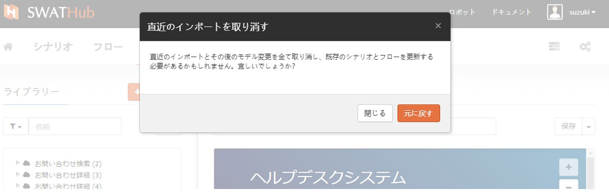

Webモデル
---

Webモデルは、テスト自動化で一般的に使用されるユーザーインターフェースです。Webページファイルをカプセル化し、オペレーション機能をもったモデルを使いシナリオを作成します。

### Webモデル取得

ユーザーが様々な操作を設計する必要がある場合、SWATHubでは**モデルキャプチャツール**でHTMLファイルを取得し、WebページファイルをカプセルかしたWebモデルを使用します。このモデルキャプチャーツールはフレーム構造のWebアプリケーションを処理することでき、リアルタイムのHTMLキャプチャーをサポートします。 ブラウザプラグインまたはクライアント側ツールの2つの方法で提供します。

#### ブラウザプラグイン

| ブラウザ 　       | ダウンロード情報　 | 要求
|--------------| ------------ | ------------
| Google Chrome | [Chrome Web Store](https://chrome.google.com/webstore/detail/swat-page-capture-tool/afipaojpjmlbclndicfpiaaancandbcm)  [オフラインインストーラー](tools/swat-chrome-capture.zip)| Google Chrome 31以上  
| Mozilla Firefox | [Firefox Add-ons Marketplace](https://addons.mozilla.org/addon/new-swathub-page-capture-tool/)  [オフラインインストーラー](tools/new-swat-firefox-capture.zip)| Mozilla Firefox 59以上 
| | [Firefox Add-ons Marketplace](https://addons.mozilla.org/firefox/addon/firefoxswatcapture/)  [オフラインインストーラー](tools/swat-firefox-capture.zip)| Mozilla Firefox 38 ~ 58
| | [オフラインインストーラー](tools/swat-firefox-capture_1.2.1.zip)| Mozilla Firefox 29 ~ 37
| Internet Explorer | [オフラインインストーラー](tools/swat-ie-capture.zip) | Internet Explorer 9以上（32bit版のみ）、[.NET Framework 4.0](http://www.microsoft.com/en-US/download/details.aspx?id=17718)

プラグインが自動的にインストールされると、ブラウザ上部のツールバーに表示されます1。または、ブラウザメニューからページテンプレートを選択し、すべてのファイルをSWATHubのリポジトリにアップロードすることもできます。 対話または操作が必要な各Webページは、ローカルファイルとして取得する必要があることに注意してください。

?> 1. Internet ExplorerでWebキャプチャツールを正しく使うために、管理者権限でInternet Explorerを実行してください。

##### Google Chromeへのインストール手順
1. Chrome Web Storeを経由でのインストールをお勧めですが、インタネットに接続できない場合、オフラインインストーラーをダウンロードしていただいて、次の手順でインストールをお願いします。
2. オフラインインストーラーをインストール先のフォルダー解凍します。このファイルが削除もしくは移動される場合、プラグインが無効になり、再インストールする必要があります。
3. Chromeで**Extensions > Load unpacked extension...**のメニューをクリックして、インストール先のフォルダーを選択します。

##### Mozilla Firefoxへのインストール手順
1. Firefox Marketplaceを経由でのインストールをお勧めですが、インタネットに接続できない場合、オフラインインストーラーをダウンロードしていただいて、次の手順でインストールをお願いします。
2. オフラインインストーラーから`xpi`ファイルを解凍します。Firefoxで**Extensions**メニューをクリックして、`xpi`ファイルをFirefoxにドラッグ＆ドロップします。
3. Firefoxの`29` ~ `37`の場合、オフラインインストーラーのみが利用できます。

##### Internet Explorerへのインストール手順

1. 上記の表のインストールパッケージをダウンロードしてください。
2. zipファイルをターゲットコンピュータのインストールディレクトリに解凍します。
3. 管理者として `cmd.exe`を実行して、DOSプロンプトを開きます。
4. DOSプロンプトで、インストールディレクトリに移動し、`install.bat`を実行します。

場合によって、エラーメッセージ：`Could not load file or assembly or one of its dependencies. Operation is not supported. (Exception from HRESULT: 0x80131515)` が出ます。その場合、次の手順でDLLファイルのブロックを解除し、上記のインストールを手順3からやり直す必要があります。

1. Windowsエクスプローラーのインストールフォルダーを開きます。
2. 右側のDLLファイルのいずれかをクリックして、コンテキストメニューからプロパティを選択します。
3. 表示されたダイアログの右下にあるブロック解除ボタンをクリックします。
4. 他のDLLファイルに同じ操作を行います。

#### クライアントツール

SWATHubロボットクライアントツールはモデルキャプチャツールを統合したもので、このクライアントツールを使用してWebモデルを取得できます。 具体的な手順については、**SWATHubロボット**の[モデルキャプチャーツール](robot_model_capture_tool.md)を参照してください。

### Webモデルインポート

#### 新規インポート

<i class="fa fa-plus"></i> **モデル**ボタンをクリックして**Webモデル**を選択し、キャプチャーツールで取得したWebモデルファイルをアップロード1すると、SWATHubはWebページ上のオペレーションを自動解析し、新たにWebモデルが生成されます。 Webモデルファイルをインポートするときは、モデルファイルに対応するページテンプレートを選択することで最適な解析を行います。SWATHubプラットフォームは、次の形式のページテンプレートを使用して、Webファイルのインポートをサポートしています。

* html5 1.0.0
* openui5 1.0.0
* mdl 1.0.0
* bootstrap 1.0.0
* ionic 1.0.0

Webページを作成したフレームワーク形式に合わせて、一致するテンプレートを選択してください。

?> 1. Webモデルファイルが複数ある場合、インポート時複数モデルファイルを選択して同時にインポートすることができます。

Webモデルファイルのモデルが正常にインポートされると、左側のモデルライブラリに表示されます。 SWATHubは、インポートしたモデルの各コンポーネントについて、その操作タイプを自動的に識別できます。

#### モデル更新

Webページが変更された場合、Webモデルを更新する必要があります。現在のWebモデルを更新するには、新たなWebページファイルを再取得して再インポートするだけです1。SWATHubは、新旧のWebページファイル情報を認識し、ファイル情報が違う場合はインポートサマリーに**アップデート**として識別されインポートします。

?> 1. Webモデルの名前が変更された場合、新しく取得したページファイルの名前を元のモデル名と同じにする必要があります。

### Webモデル機能

Webモデルとして正常にWebページファイルがインポートされたら、モデルライブラリのモデル名の左側にある<i class="fa fa-play"></i>をクリックしてそのモデル配下のモデルオペレーションが表示されます。

SWATHubは、Webモデルのページとオペレーションの設定を変更することができます。

#### Webモデル名の変更

モデルライブラリでインポートされたモデルを選択すると、右側の**Webページ情報**領域にあるページのデフォルト名で表示され、編集ボックスでその名前を変更し、**保存**ボタンでWebモデル名を変更することができます。

#### ページ設定

**保存**ボタンの横にあるドロップダウンメニューから**設定**をクリックして、ページテンプレートに入ります。ページ設定ダイアログボックスには、現在のWebモデルによって適用されるページテンプレートパラメータと設定プレビュー項目が表示されます。

##### ページテンプレート

選択したWebページテンプレートの情報は、インポート時に**ページテンプレート**タブにコードの形式で表示され、現在のページテンプレートとプレビュー設定をブックマークするかどうかを選択できます。

##### プレビュー

* HTMLエンコード：デフォルトは**自動検出**で、実際の状況に応じて**UTF-8**、**GBK**、**Shift_JIS**または**EUC-JP**を選択できますそれらの中の一つ。
* プレビューのベースURL：すべての相対URLは、入力したURLに基​​づいて計算されます。
* プレビューの置換ルール：置換ルールに従って、プレビューHTMLで特定の文字列を置換できます。置換ルールの詳細については、[開発ドキュメント](../dev/rule_web_template.md#プレビュー用置換ルール)を参照してください。

#### テンプレートカスタマイズ

Webモデルのインポート時に選択したWebテンプレートを変更する必要がある場合は、**ページ設定**ダイアログボックスの下部にある青い**テンプレートカスタマイズ**ボタンをクリックして、テンプレートを変更するための編集ページに遷移します。

テンプレート変更ページには、ユーザーがページテンプレートをより便利に変更できるようにするテンプレート変更ツールが用意されています。

  * <i class="fa fa-book"></i> **参照テンプレートライブラリ**
  * <i class="fa fa-undo"></i> **初期状態に戻す**
  * <i class="fa fa-support"></i> **テンプレートのカスタマイズサービスをリクエストする**
  * <i class="fa fa-question"></i> **ドキュメントを見る**

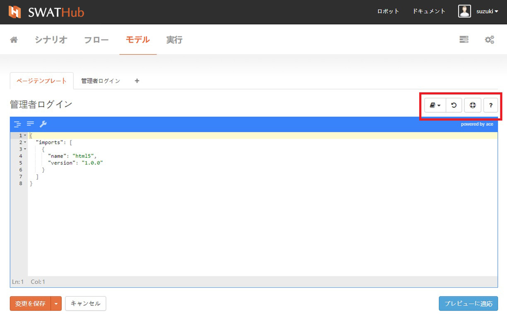

##### 参照テンプレートライブラリ

SWATHubは、次のようなWebページで一般的に使用される5つの標準テンプレートを提供します。
* html5 1.0.0
* openui5 1.0.0   
* mdl 1.0.0
* bootstrap 1.0.0
* ionic 1.0.0   

設計者は、実際のコードに対応するテンプレートとバージョン定義ステートメントをすばやく選択して変更できます。

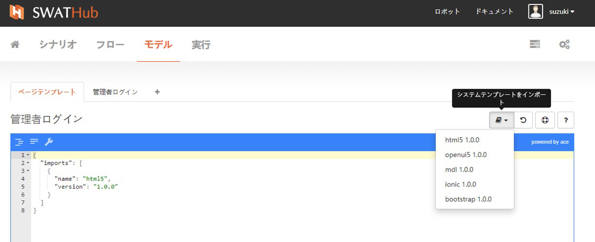

##### 初期状態に戻す

現在のテンプレートをカスタマイズするプロセスで、すべての変更を破棄する必要がある場合は、**初期状態に戻す**を使用できます。1つのボタンを押すと、保存されていない変更手順がすべてクリアされ、ページテンプレートが最後に保存されたときの設定に戻ります。

##### ページテンプレートカスタマイズサービスをリクエスト

標準ページテンプレートやテンプレートライブラリで提供されているテンプレートでもうまくできない場合は、<i class = "fa fa-support"> </i>サービスサポートアプリケーションページを開き、SWATHubの技術スタッフに、カスタマイズするためのページテンプレートを申請します。

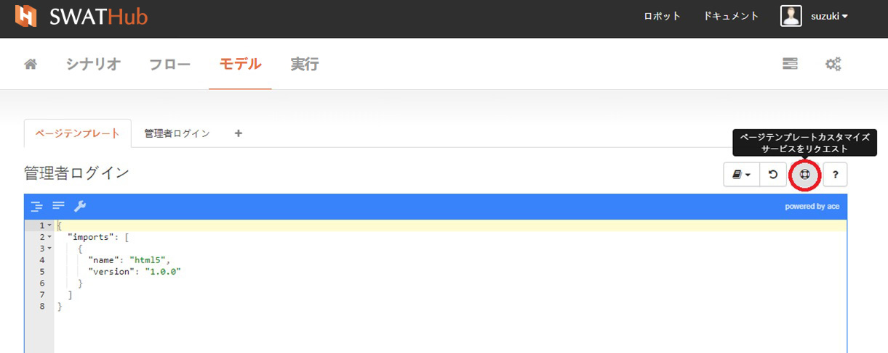

エンタープライズバージョンでは、ユーザーは<i class="fa fa-support"></i> **ページテンプレートカスタマイズサービスのリクエスト**を通じてモデルの診断ファイルをダウンロードし、サポートが必要な場合はそのファイルをメールでご連絡ください。

##### ドキュメントを表示

SWATHubテクニカルサポートドキュメントを開き、関連する詳細な操作手順を問い合わせます。

##### テンプレートの保存と適用

ページテンプレートの変更が完了したら、現在のページの下部にある**変更を保存**ボタンをクリックし現在のページ設定の変更に対する更新を保存します。**変更を保存**ボタンのドロップダウンオプションの**複数のページに適用**を選択すると、このルールを複数ページに適応するためのページ一覧が表示され、複数ページへの適応ができます。

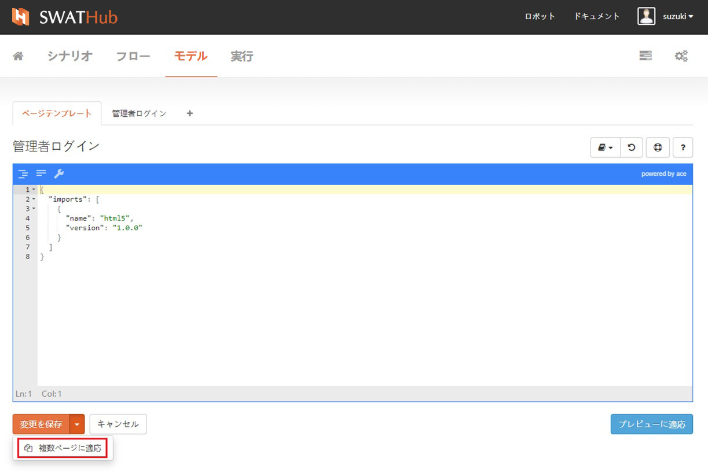

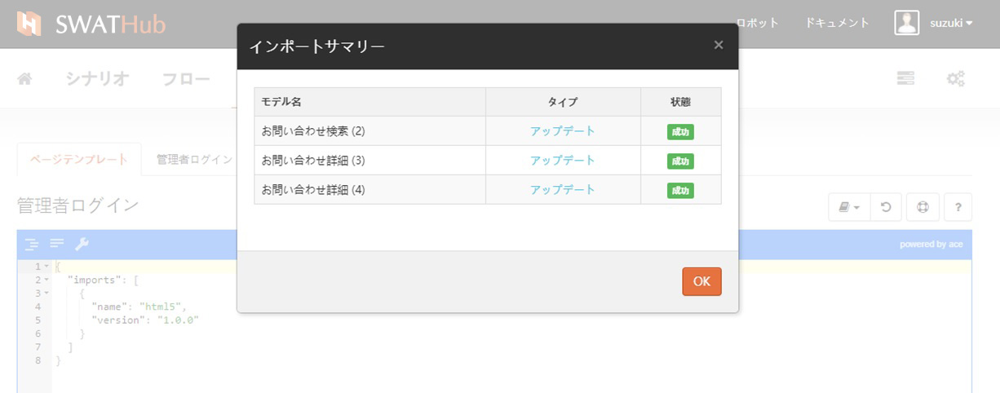

ページテンプレートを変更するには、ページの右下隅にある青い**プレビューに適用**ボタンを使用して、モデルページ設定のプレビューアイテムを同期できます。

### Webオペレーション機能

SWATHubは、Webモデル構築の過程でインポートされたページ情報の変更などに加えて、モデルオペレーションについても修正することができます。

Webモデルオペレーションの変更は、ページの右側の領域に実装されています。この領域の主なコンポーネントは、名前入力ボックス、操作ボタン、およびモデルオペレーションの表示領域です。モデルオペレーションに対して次の操作を実行できます。

#### モデルオペレーション名の変更

モデルオペレーションを選択すると、右側のページ情報に選択したモデルオペレーション名が表示されます。この名前を変更し、右側の**保存**ボタンをクリックします。

#### モデルオペレーションの変更

入力ボックスの右側にあるボタンをドロップダウンして、<i class="fa fa-wrench"></i> **ノードを編集**を選択すると、モデルオペレーションについて詳細情報を表示されます。モデルオペレーションノードが左側に表示され、そのノードに関する情報が右側に表示されます。選択したノードがシステムによって認識されている場合、選択したページノードは緑色の破線の枠で囲まれます。現在のノードに含まれるコンポーネントとすべての子ノードが確認できます。コンポーネントまたはサブエレメントの名前を変更することができます。

#### 設定

入力ボックスの右側にあるボタンをドロップダウンして、<i class="fa fa-gears"></i> **設定**を選択すると、このオペレーションが変更されたときに自動的に他ページにある同様のオペレーションを変更します。このオペレーシの変更では、現在のWebサイトに同じ要素を持つ他のWebモデルをインポートすると、この要素は前のモデルの要素と同じ機能設定を自動的に実行します。

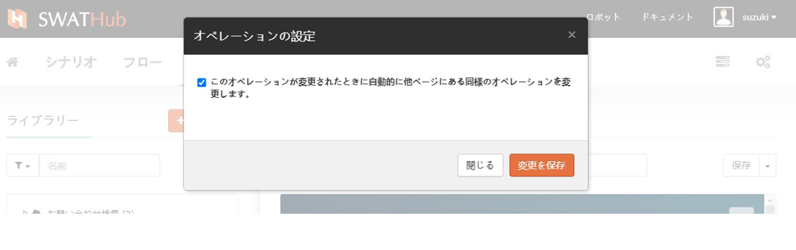

Windowsモデル
---

SWATHubはWindowsアプリケーションをモデル化することができ、これらのモデルの上にウィンド内の操作を定義することで、テスト自動化やRPAなどので、Windowsアプリケーションの自動化を実現できます。

### Windowsモデル取得とインポート

SWATHub Robotの**モデルキャプチャー**を利用すれば、Windowsアプリケーションのモデルを取得できます。詳細について、**SWATHubロボット**[モデルキャプチャーツール](robot_model_capture_tool?id=windowsモデルの取得)を参照してください。

モデルファイルを取得した後に、<i class = "fa fa-plus"></i> **モデル**ボタンをクリックして、**Windowsモデル**を選択すれば、Windowsモデルファイルをアップロードできます1。アップロード成功した後に、左側のモデルツリーに該当モデルが表示されます。

?> 1. 複数モデルをインポートする場合に、キャプチャーツールで複数モデルファイルを取得し、一括アップロードすることができます。

### Windowsモデル機能

#### Windowsモデル名変更

モデルファイルがWindowsモデルとしてインポートされる場合、デフォルトのファイル名はモデル名です。Windows情報の入力ボックスでモデルの名前を変更し、**保存**をクリックすると新しいWindowsモデル名をモデルライブラリに更新します。

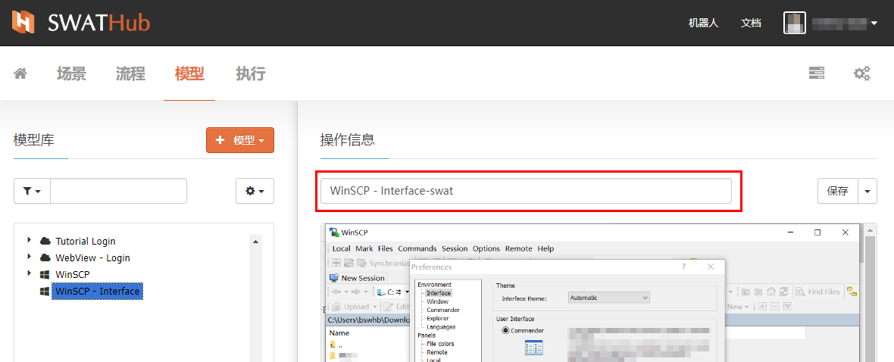

#### オペレーション追加

**保存**メニューのドロップダウンボタンから、オペレーションを追加を選択するとWindowsモデルにオペレーションステップ属性を追加するための画面に遷移します。オペレーションプロパティの作成が完了したら、左下の**変更を保存**をクリックして、モデルオペレーションの定義を確認します。Windowsモデルの属性をカプセル化する操作メソッドは、 <i class = "fa fa-puzzle-piece"></i> **GUIモード**と<i class = "fa fa-code"></i> **コードモード**の２つの方法が使用できます。

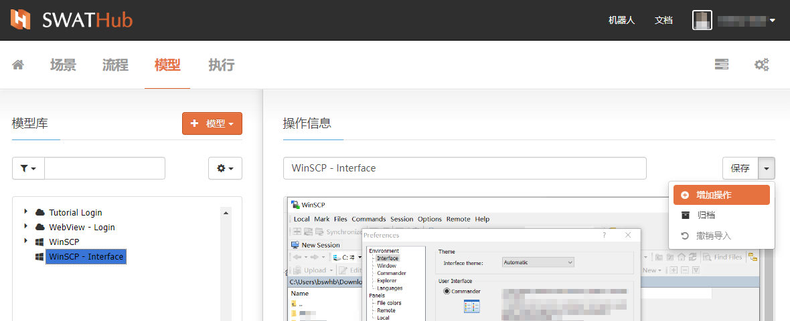

##### GUIモード

 Windowsモデルの属性をカプセル化する方法は、シナリオのプロセスステップを構築する方法と似ています。構築エリアの上隅にある<i class = "fa fa-plus-circle"></i> **コマンドを追加**を選択することにより、 **Windowsコマンド**または**システムコマンド**のどちらかを選び、グラフィカルインターフェイスの操作ステップを作成します1 2。コマンドのパラメーターと使用法については、[開発ドキュメント](../dev/model_windows.md)を参照
 してください。

現在利用できる**Windowsコマンドは**下記になります。

 * <i class = "fa fa-mouse-pointer"></i>  クリック
 * <i class = "fa fa-i-cursor"></i>    タイプ
 * <i class = "fa fa-hand-paper-o "></i>  ホーバー
 * <i class = "fa fa-hand-pointer-o"></i>  フォーカス
 * <i class = "fa fa-font"></i>  テキスト取得

現在利用できる**システムコマンド**包括：

 * <i class = "fa fa-keyboard-o"></i> キータイプ
 * <i class = "fa fa-clipboard"></i> クリップボード読込み

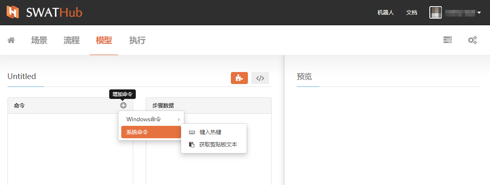

コマンドのターゲットを選択することができます。

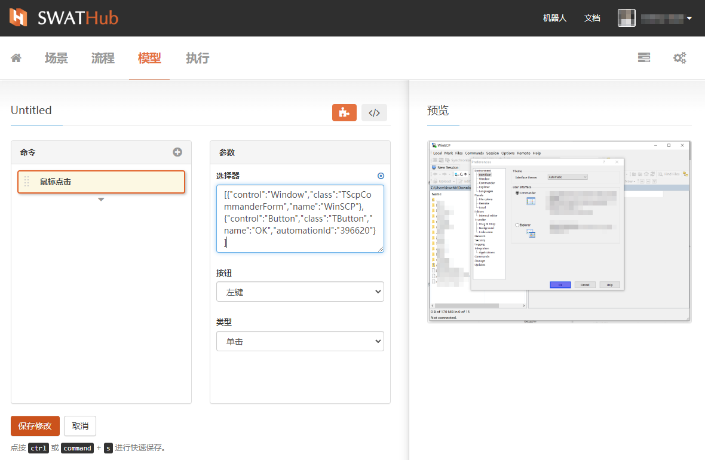

?> 1. コマンドの左側は移動バーです。マウスが<i class="fa fa-arrows"></i>に変わったら、左ボタンを押しながらコマンドをドラッグして上下に移動し、コマンドの順序をすばやく変更します。

?> 2. コマンドの右上隅にある<i class="fa fa-clone"></i>（コピー）および<i class="fa fa-close"></i>（閉じる）を使用してすばやくコピーできます。またはキャンセルします。

##### コードモード

Windowsモデルオペレーションはコードモードでコマンドを編集することができます。大量なコマンドをコピーする場合に非常に効率良いモードです。

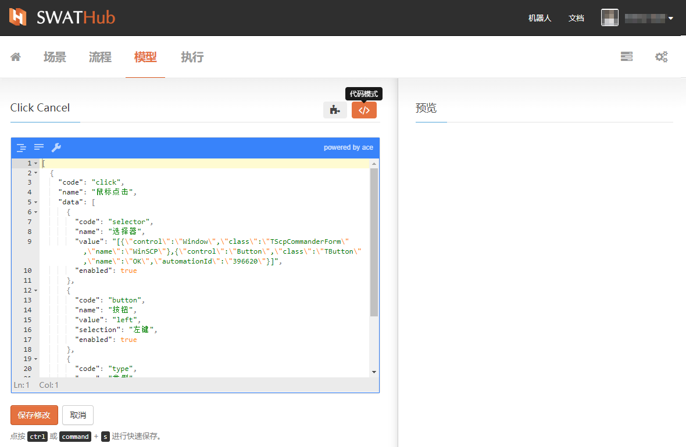

### Windowsオペレーション機能

Windowsモデルオペレーションの名前の変更とGUIモデルの変更を行うこともできます。

#### 名前変更

 Windowsモデルオペレーション名の変更は入力ボックスから直接新しい名前を入力し、**保存**ボタンをクリックして更新できます。

#### オペレーション編集

**保存**ボタンのドロップダウンメニューから**オペレーションを編集**を選び、編集画面に遷移します。必要な編集を終えたら**変更を保存**をクリックします。

GUIモデル
---

グラフィカルユーザーインターフェイス（略してGUI）とは、アイコンやボタンなどを用いて直感的にわかりやすくコンピューターに指令を出せるようにしたユーザーインターフェースです。。SWATHubプラットフォームにおけるGUIモデルは、プロセスの自動操作の対象となるユーザオペレーションインターフェースをグラフィックファイルとしてガイドします。

### GUIモデル取得

キーボードのPrtScを用いてコンピューター画面を取得し、取得した画面イメージを描画ボードまたはその他の描画ソフトウェアを介して.PNG形式で保存します（SWATHubプラットフォームGUIモデルは現在.PNG形式のイメージのみをサポートしています）。複数のステップが必要な場合は、スクリーンショットを取り、各ステップの操作画面を保存してください。

### GUIモデルインポート

<i class="fa fa-plus"></i> **モデル**ボタンをクリックして**GUIモデル**を選択してGUスクリーンインポート画面に入ります。

ファイル選択から、GUIモデルの画像ファイルを選択し、**スクリーンを追加**をクリックする前に、チェックボックスの横にある**変更**ボタンと**削除**ボタンを使用して画像を再度選択できます。GUIモデルのインポートは、スクリーンショット画像ファイルのバッチインポートをサポートします。

### GUIモデル機能

#### GUIモデル名変更

スクリーンショット画像がGUIモデルとしてインポートされる場合、デフォルトの画像名はモデル名です。スクリーン情報の入力ボックスでモデルの名前を変更し、**保存**をクリックすると新しいGUIモデル名をモデルライブラリに更新します。

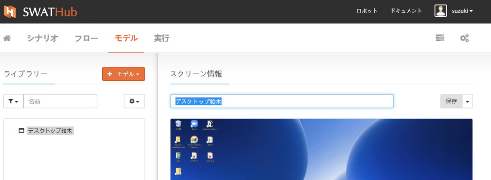

#### オペレーションを追加

**保存**メニューのドロップダウンボタンから、オペレーションを追加を選択するとGUIモデルにオペレーションステップ属性を追加するための画面に遷移します。オペレーションプロパティの作成が完了したら、左下の**変更を保存**をクリックして、モデルオペレーションの定義を確認します。

GUIモデルの属性をカプセル化する操作メソッドは、<i class="fa fa-puzzle-piece"></i> **GUIモード**および<i class="fa fa-code"></i> **コードモード** の２つの方法が使用できます。

##### コマンド構築

GUIモデルの属性をカプセル化する方法は、シナリオのプロセスステップを構築する方法と似ています。構築エリアの上隅にある<i class="fa fa-plus-circle"></i>**コマンドを追加**を選択することにより、 **GUIコマンド**または**システムコマンド**のどちらかを選び、グラフィカルインターフェイスの操作ステップを作成します1 2。コマンドのパラメーターと使用法については、[開発ドキュメント](../dev/model_gui.md)を参照してください。

?> 1. コマンドの左側は移動バーです。マウスが<i class="fa fa-arrows"></i>に変わったら、左ボタンを押しながらコマンドをドラッグして上下に移動し、コマンドの順序をすばやく変更します。

?> 2. コマンドの右上隅にある<i class="fa fa-clone"></i>（コピー）および<i class="fa fa-close"></i>（閉じる）を使用してすばやくコピーできます。またはキャンセルします。

##### コードモード

<i class="fa fa-code"></i>ボタンをクリックして、コードモードインターフェイスにすばやく切り替えます。

##### プレビュー

現在操作されているGUI画像オブジェクトのプレビュー画像を確認できます。

### GUIオペレーション機能

GUIオペレーション情報について、GUIモデルオペレーションをパッケージ化すると、下のプレビューエリアの画像に赤い「step1：」、およびその他の関連するGUIイメージの操作手順が表示されます1。 これらの名前の変更とGUIモデルの変更を行うこともできます。

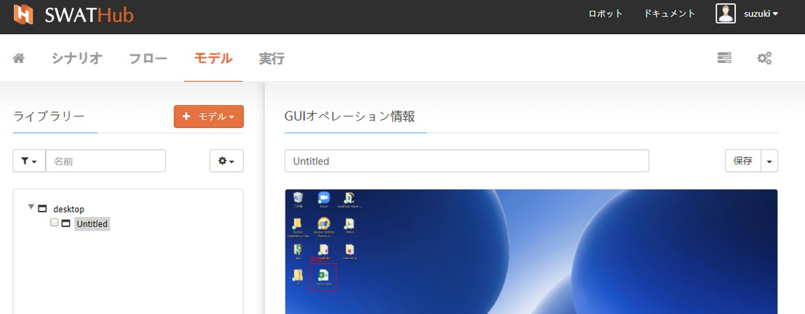

?> 1. GUI画像のステップマークは、テキストの入力などのグラフィック操作に関連するすべてのステップであり、他のコマンドステップはグラフィックステップに表示されません。

#### 名前変更

GUIモデルオペレーション名の変更は入力ボックスから直接新しい名前を入力し、**保存**ボタンをクリックして更新できます。

#### オペレーション編集

**保存**ボタンのドロップダウンメニューから**オペレーションを編集**を選び、編集画面に遷移します。必要な編集を終えたら**変更を保存**をクリックします。

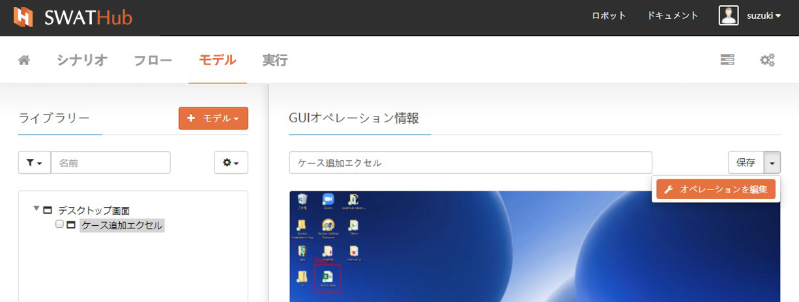

APPモデル
---

SWATHubは、モバイルエミュレーターと実際のデバイスを駆動して、モバイルWebアプリケーションをテストできます。現在のSWATHubAPPモデルとシナリオは、モバイルアプリの自動テストに使用します。

### APPモデル取得

SWATHubロボットクライアントツールはモデルキャプチャツールを統合しており、クライアントツールを使用してモバイルWebプログラムページを取得できます。 APPモデルの取得を開始する前に、まずモバイルプラットフォームをインストールしてセットアップする必要があります。詳しくは、ロボットの[モバイル環境設定](robot_mobile_setup.md)をご覧ください。APPモデル取得ツールの操作手順については、ロボットの[モデルキャプチャーツール](robot_model_capture_tool.md)をご覧ください。

<i class="fa fa-plus"></i> **モデル**ボタンをクリックして**APPモデル**を選択し、取得したモバイルWebプログラムページファイルをインポート1すると、モバイルWebプログラムページが新しいAPPとして追加されますモデル。APPモデルが正常にインポートされると、左側のモデルライブラリに表示されます。

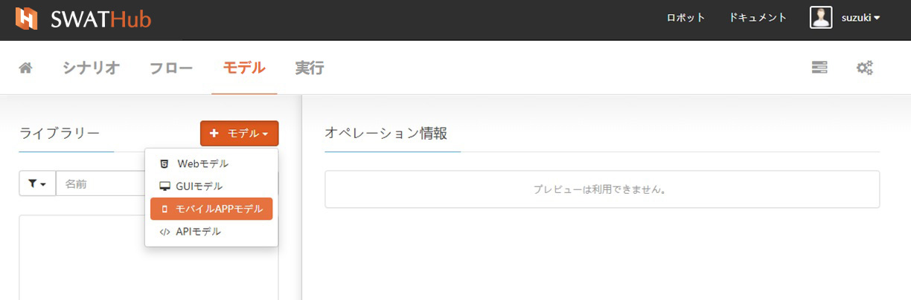

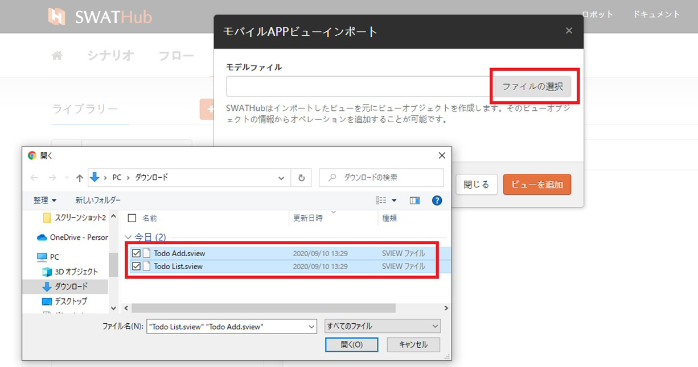

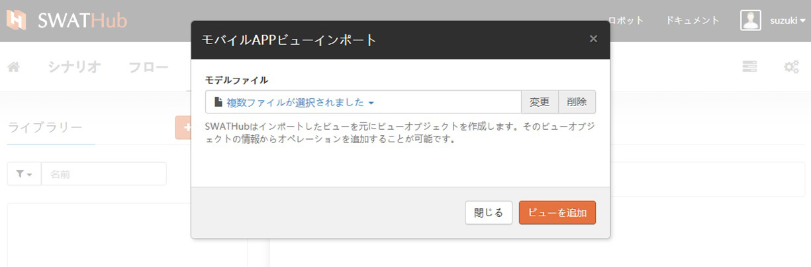

?> 1. 複数のAPPモデルを構築する必要がある場合は、ツールでモバイルWebプログラムページファイルを継続的に取得し、インポートする必要があるすべてのモバイルWebプログラムページファイルを選択して、モデルライブラリをバッチでインポートできます。

### APPモデル機能

#### APPモデル名変更

APPモデルをインポートする場合、システムのデフォルトのファイル名はモデル名です。インターフェース情報領域の入力ボックスでモデルの名前を変更し、**保存**を押してAPPモデル名をモデルライブラリに更新します。

#### オペレーション追加

**保存**メニューのドロップダウンボタンから、APPモデルに操作ステップ属性を追加するためのページに遷移します。オペレーションプロパティの作成が完了したら、左下の**変更を保存**をクリックして、モデルオペレーションの定義を確認します。モデルオペレーションの定義は、<i class="fa fa-puzzle-piece"></i> **GUIモード**と<i class="fa fa-code"></i> **コードモード**にあります2つの編集状態で操作します。

##### GUIモード

APPモデルを追加/変更するための追加コマンドインターフェイスでは、左側がコマンド作成領域です。モバイルアプリケーションコマンドの右上隅は、APPモデルの操作属性をカプセル化するために使用されます。コマンドが作成されたら、左下隅の[保存して変更]ボタンをクリックしてAPPを完了します1。APPモデルにカプセル化できるモバイルアプリケーションコマンドは次のとおりです。

* <i class="fa fa-hand-pointer-o"></i> タップ

* <i class="fa fa-i-cursor"></i> テキストを入力

* <i class="fa fa-exchange"></i> スワイプ

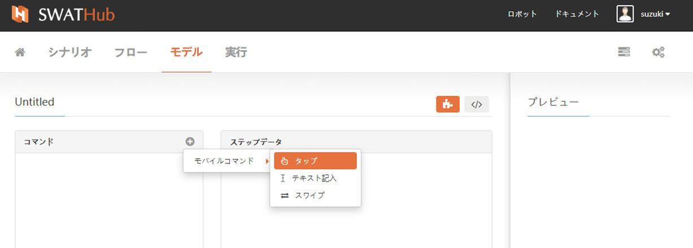

?> 1. コマンドビルドエリアにコマンドを追加すると、ステップデータエリアにコマンドのステップデータが表示されます。ステップデータのパラメーター設定方法については、[開発ドキュメント](../dev/model_mobile.md)を参照してください。

##### コードモード

APPモデルは、コードモードでの操作コマンドの編集をサポートします。特に、多数の操作コマンドステップがコピーされる場合、コードモードはモデルコマンド属性の高速カプセル化を実現できます 。変更されたモデルコードは、左下の**変更を保存**ボタンをクリックして確認します。

### APPオペレーション機能

名前を変更し、APPモデル用にカプセル化されたモバイル操作情報を変更できます。

#### 名前の変更

モデルを選択し、右側の入力ボックスに新しい名前を入力して、右側の**保存**ボタンをクリックします。

#### オペレーションを編集

**保存**ボタンの右側にあるドロップダウンメニューから、**オペレーションを編集**を選択します。既存のモバイルオペレーションを変更する手順は、オペレーションを追加する手順と同じで、GUIモードとコードモードでの2つの編集方法があります。

APIモデル
---

APIモデルは、運用するWebサービスのAPIをモデル化したもので、特定の場所から取得する必要はありません。SWATHubでは、パラメータを設定することで簡単にAPI操作を作成できます。他の操作と同様に、APIを直接作成した後、それをフローエリアにドラッグアンドドロップしシナリオ作成ができます。

### APIモデル機能

1. <i class="fa fa-plus"></i> **モデル**ボタンをクリックしてAPIオペレーションをインポートする画面で、オペレーションを追加します。

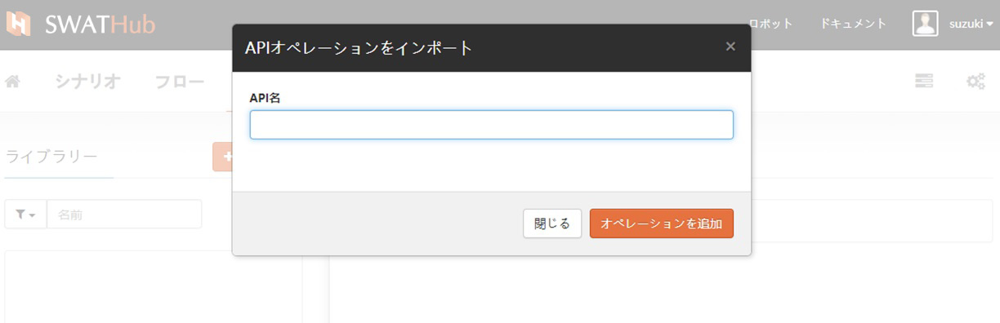

2. API定義には、APIを設定するためのパラメーターが含まれており、3つの属性1を個別に設定する必要があります。

* 一般な属性
* データ属性
* 高度な属性

プロパティのパラメーター設定については、[開発ドキュメント](../dev/model_api.md)を参照してください。