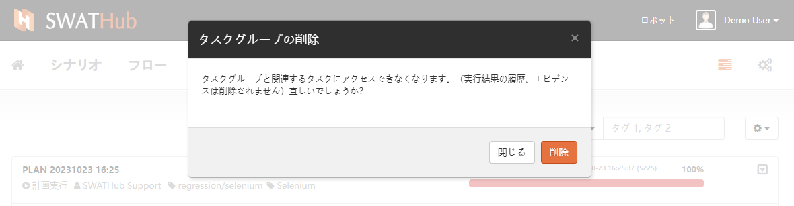

実行プラン
===

基本操作
---
SWATHubデザインプラットフォームは、実行プラン設定機能を提供しており、ユーザーはタスクの実行に必要な要件に基づいて実行プランを作成できます。プランの基本操作には、新規作成、コピー、削除が含まれます。

### 新規作成

実行プラン画面に入り、画面右側の<i class = "fa fa-plus"></i> **実行プラン**ボタンをクリックして、シーン実行プランを新規作成できます。

新しい実行プランを作成するには、**実行プランを編集**して、新しい実行プランを作成する必要があります。

その後、**変更を保存**をクリックして、新しい実行プランの作成を完了します。

### コピー

現在の実行プランをコピーする必要がある場合は、既存の実行プランエントリの右側にあるドロップダウンボタンをクリックして、ドロップダウンメニューを表示し、**コピー**オプションをクリックして、実行プランを迅速にコピーできます。

コピーされた実行プランの名前をクリックすると、**実行プランを編集**画面に入り、実行プランの構成項目を必要に応じて変更できます。

### 削除

不要になった実行プランに対しては、既存の実行プランエントリの右側にあるドロップダウンボタンをクリックして、ドロップダウンメニューを表示し、**削除**オプションをクリックして、実行プランを迅速に削除できます。

実行と表示
---
### 実行

実行プランが作成されたら、実行プランエントリの右側にあるドロップダウンボタンをクリックして、ドロップダウンメニューを表示し、**実行**オプションをクリックして、そのプランを実行できます。

**実行**をクリックした後、**実行プラン**を実行するかどうかを再度確認する必要があります。ダイアログボックスの**実行**ボタンをクリックすると、システムはタスク実行リストに移動し、現在の実行プランの実行状態を確認できます。

この実行プランの実行中に、右側のドロップダウンメニューの**停止**と**開始/再開**ボタンを使用して、実行中のプランを制御できます。

実行プランは**停止**および完了後に、**削除**操作を実行できます。削除操作は、このプランのすべてのサブタスクに対して実行されます。

### 関連タスクの表示

設定された**実行プラン**の実行履歴は、**タスクの表示**を使用して、その実行プランの実行状況をすばやく確認できます。

この実行プランが完了した後、このレコードバーの空白部分をクリックすると、実行プランの詳細リストを開くことができ、この実行プランのすべてのタスクの実行状況を確認できます。再度このレコードバーの空白部分をクリックすると、タスクの詳細を折りたたむことができます。

### 関連レポートの表示

**実行プラン**の詳細レポートは、**レポートの表示**ボタンを使用して、**実行レポート**画面に入って確認できます。

?> **実行プラン**が完了して削除された場合でも、実行レポートエントリは実行レポートリストに残ります。