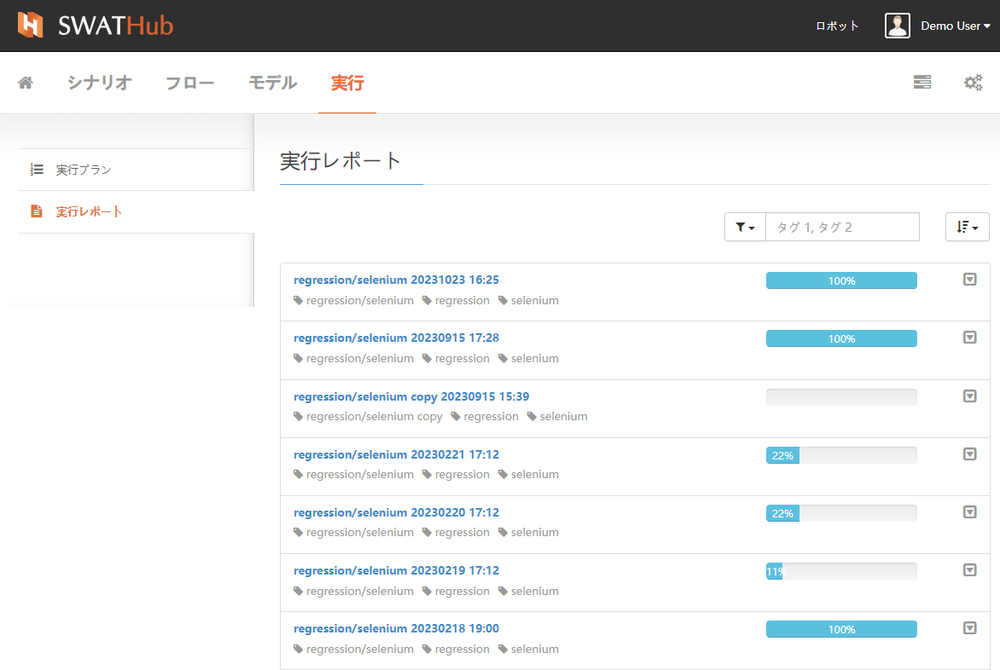
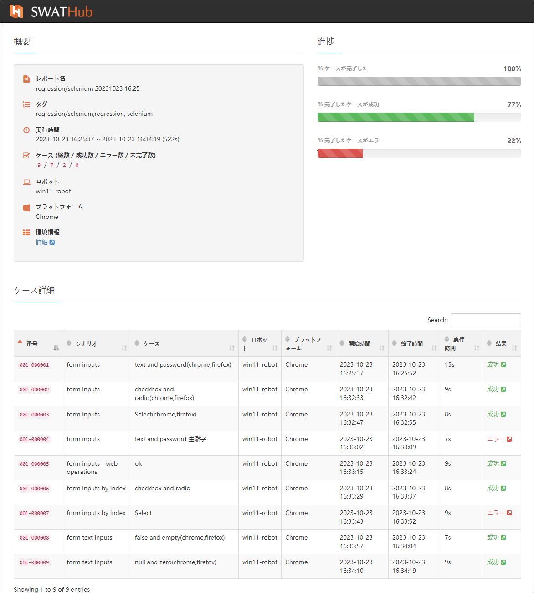
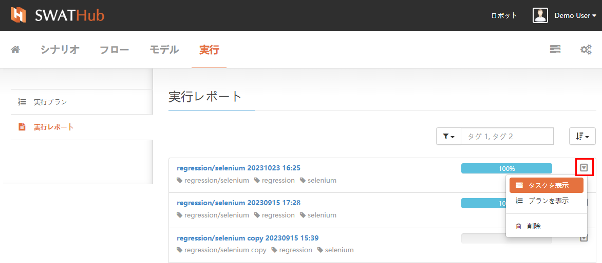
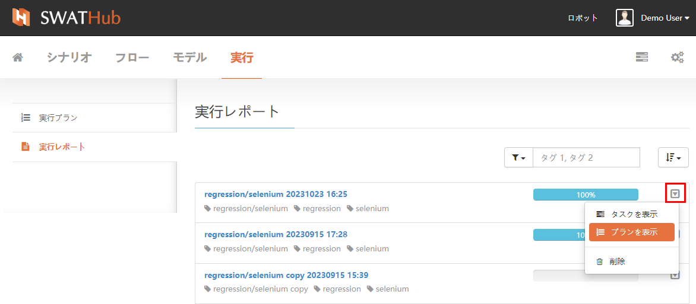
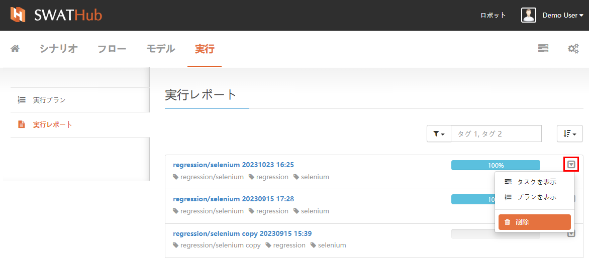
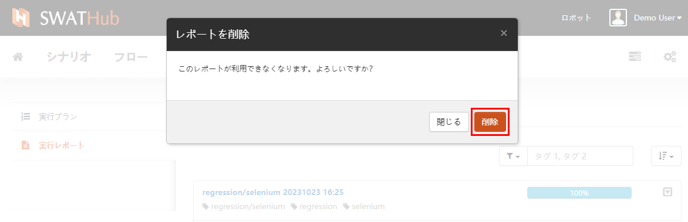

実行レポート
===

**実行レポート**画面に入ると、全ての**実行プラン**が終了した後の実行レポートリストが表示されます。リスト内の単一の実行プランタスクをクリックすると、詳細なレポートページに移動できます。

実行レポートの右側にあるリストから、対応する時間の実行プランタイトルをクリックすると、そのバッチの実行プランの実行結果の詳細な**実行レポート**コンテンツを表示できます。

**実行レポート**リスト内のレポート項目の右側にあるドロップダウンボタンをクリックし、**タスクを表示**を選択すると、そのレポートで実行されたすべてのタスクのリストに移動できます。

**実行レポート**リスト内のレポート項目の右側にあるドロップダウンボタンをクリックし、**プランを表示**を選択すると、そのレポートで実行された**実行プラン**に移動できます。

**実行レポート**リスト内のレポート項目の右側にあるドロップダウンボタンをクリックし、**削除**を選択すると、そのレポートのレコードとその詳細レポートコンテンツが削除されます。

?> 注意：レポートを削除すると、元に戻すことはできません。操作には注意してください。