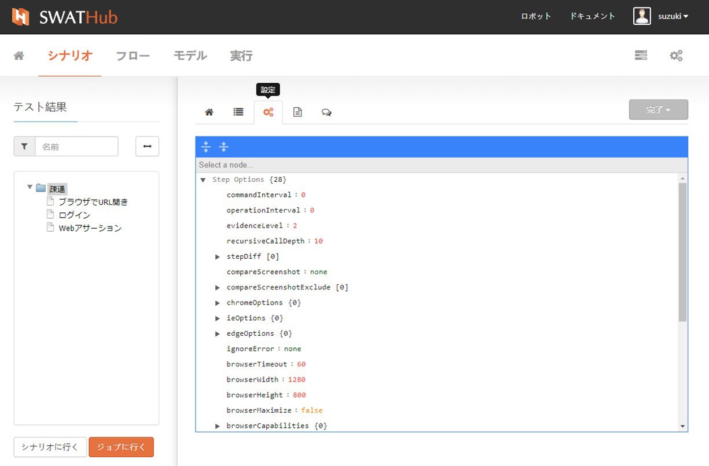
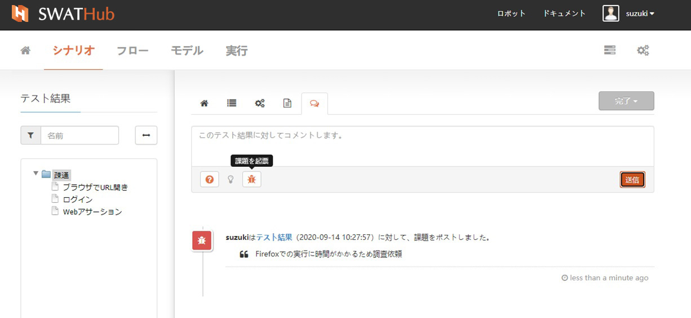
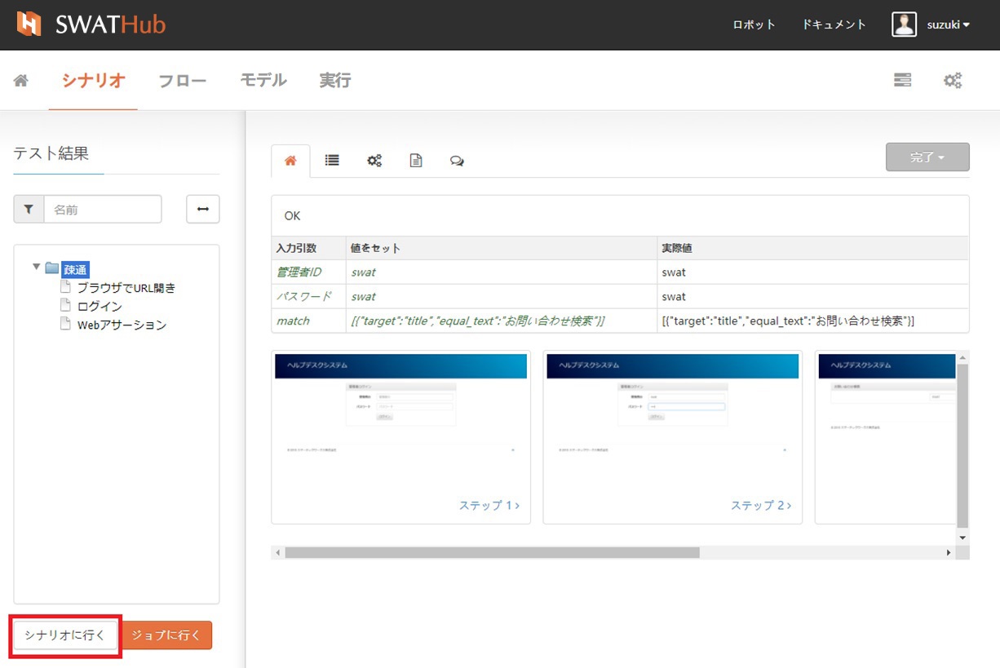
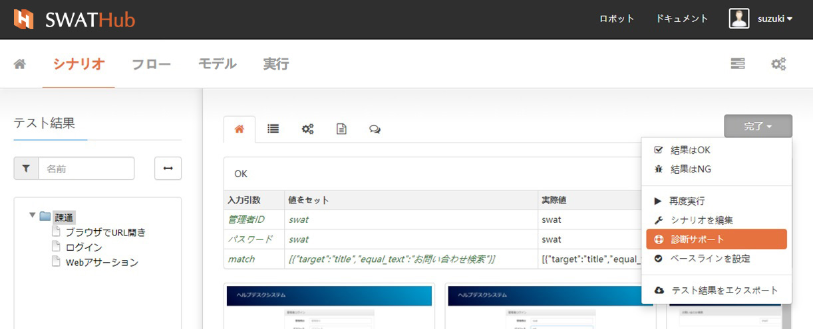
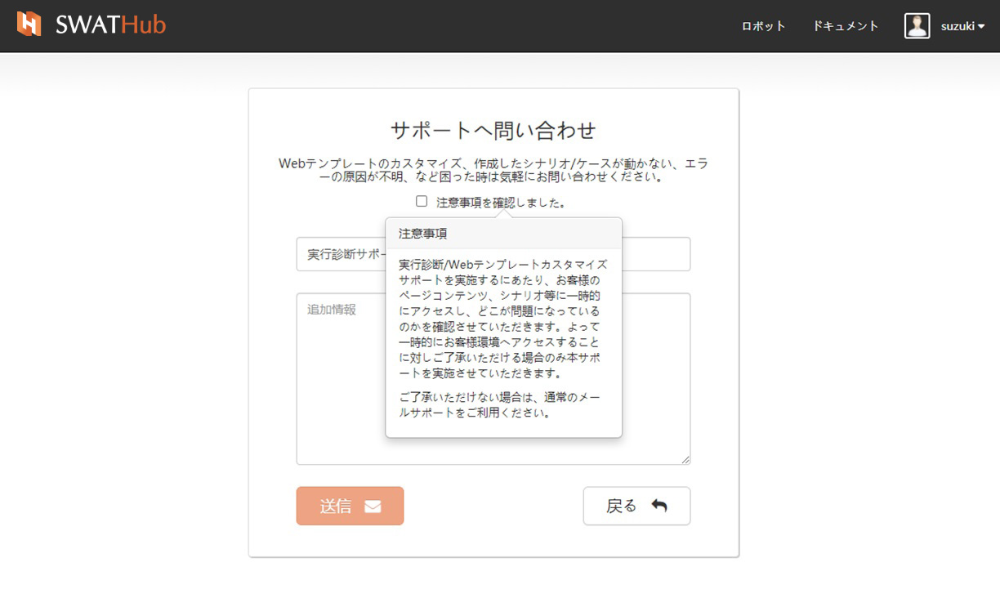

実行結果
===

ケースが実行されると、対応する実行結果のセットが生成されます（タスクラベルに灰色の完了ラベルまたは赤のエラーラベルが表示されます）。対象タスクをクリックするとテスト結果ページに遷移します。タスクが**実行中**（青色の進行状況ラベル）、**停止**（黒色の停止ラベル）、または**待機中**（黄色の待機中ラベル）にある場合、テスト結果ページにアクセスできません。

実行結果の確認
---

実行したケースのシナリオステップがページの左側のリストに表示され1、右側の領域は実行結果の各種レポートが表示されます2。レポートは次のディメンションが含まれます。

* 概要
* 詳細
* 設定
* ログ
* コメント

?> 1. タスク結果については、シナリオステップ毎に表示されます。たとえば、選択したオブジェクトが**シナリオ**の場合は、右側の領域は関連する各種レポートが参照できます。

?> 2. 選択したオブジェクトが**フローオペレーション**レベルの場合、右側の領域の表示レポートには**詳細**レポートがありません。

### ステップ実行結果

タスクの結果はテスト結果ページに一覧表示され、タスクが正常に実行されている場合は、すべてのシナリオステップのフォントが黒く表示されます。タスクの結果がエラーの場合は、シナリオステップの中のモデルオペレーションが赤いフォントで表示されます。

**テスト結果**のタイトルの横に<i class="fa fa-exclamation-circle"></i>プロンプトが表示された場合、現在のテスト結果後にシナリオ、及びケースが修正されているため、再実行が必要なことを示してます。

### 概要

上から順番に各表示内容について説明します。

* 名前（シナリオレベルではシナリオ名が表示され、シナリオステップではモデルオペレーション名が表示されます）
* パラメータリスト（シナリオレベルは現在のシナリオグローバルパラメータを表示し、シナリオステップレベルは現在のステップパラメータを表示します）
* シナリオステップのスクリーンショット（シナリオレベルは現在のシナリオのすべてのステップを示し、ステップレベルは現在のステップのスクリーンショットを示します）

選択したステップはWebモデルと関連している場合、ページのWEBアドレス情報とダウンロードしたHTMLコードファイルが概要の下部に表示されます。

### 詳細

詳細結果には、現在のタスク実行の関連情報が表示されます。これは、シナリオレベルのみ表示されます。

### 設定

現在のレポートの設定は、シナリオの設定時に**詳細設定**の**ステップオプション**の内容を参照します。

### ログ

ログディメンションでは、選択したオブジェクトがシナリオの場合、シナリオ全体の実行ログが表示されます。 選択したオブジェクトが特定のプロセスステップである場合、そのステップの実行ログが表示されます。 実行エラーが発生した場合、ログにはエラーログレコードが赤字で表示されます。

### コメント

コメント機能は、ユーザー自身またはプロジェクトの他のユーザーに公開できます。 コメントのタイプを選択できます：

* <i class="fa fa-question-circle"></i> 質問する
* <i class="fa fa-lightbulb-o"></i> は情報を与える
* <i class="fa fa-bug"></i> バグについて言及する

シナリオレベルとステップレベルの両方のコメントがコメント領域の下に表示され、各コメントのリリース時間がコメントの右下隅に表示されます。
連携サービスに登録すると、コメント結果がサービスプラットフォームのプロジェクトエリアに投稿されます。

基本機能
---

### フィルター

実行結果のフィルタリング機能は、現在のシナリオのステップ用です。入力ボックスにキーワードを入力すると、キーワードに関連付けられたステップが自動的に除外されます。

### ズームインとズームアウト

ズームイン、ズームアウトで実行結果表示領域の大きさを変更でき、表示内容が大きい場合や名前が長い場合は、ズームインして表示領域を拡大し、内容を確認することができます。

### シナリオに行く

テスト結果ページで、**シナリオに行く**ボタンをクリックすると、シナリオグループもしくはフロー一覧ページに遷移します。

### ジョブに行く

テスト結果ページで、**ジョブに行く**ボタンをクリックすると、タスクグループリストページに遷移します。

高度な操作
---

テスト結果ページの右側にある結果ステータスボタンをクリックして、テスト結果の高度な操作メニューに入ります。

### 検証

タスクの実行結果に対して自動で生成される**完了**と**エラー**の2つの状態に加え、ユーザー自身がその結果を判定する、「結果はOK」または「結果はNG」を指定することもできます。

* OKとして検証：自動実行の結果とケースの期待と一致する場合では手動で「結果はOK」にすることができます。

NGとして検証：自動実行の結果とケースの期待と一致しない場合では手動で「結果はNG」にすることができます。

### 再度実行

テスト結果ページでは、**再度実行**操作によって現在のタスクの再実行を直接開始できます。システムは新しいタスクグループを自動的に生成し、設定内容を変えず実行を自動的に開始します。

### シナリオ編集

テスト実行ページでは、**シナリオを編集**操作を介してシナリオフロー作成ページに直接ジャンプし、フローステップデザインを変更またはリセットできます。

### 診断サポート

実行中にエラーが発生し、弊社のサポートを依頼する時に、この機能を使って、サポート通知を作成することができます。我々が原因を調査して、連絡いたします。エンタープライズ版を利用する場合に、この機能で診断ファイルがダウンロードされます。そのファイルを手動に弊社のサポートアドレスに送付する必要があります。

### ベースラインを設定

テスト結果がユーザーの期待を完全に満たしている場合、このテスト結果をベースラインとして設定できます。このタスクを再度実行すると、ベースラインとして設定されている実行結果と自動的に比較されます。完全に一致している場合はタスク結果が完了したと見なされ、矛盾している場合はタスク結果が誤っていると見なされます。

現在のテスト結果を**ベースラインを設定**にした場合、ラベルが緑色に変わり、<i class="fa fa-check-circle-o"></i> **OK**と表示され、**ベースラインをキャンセル**をした場合、緑色のラベルのテキスト表示は**OK**となります。

### テスト結果をエクスポート

SWATHubは実行結果のエクスポートをサポートしており、レポートファイルは現在のテスト結果ページの**テスト結果をエクスポート**操作でエクスポートされます。エクスポートされたファイルの内容には、ケースの実行に関する詳細情報が含まれます。ファイル名の形式は、`シナリオ名-ケース名-自動番号.xlsx`です。

