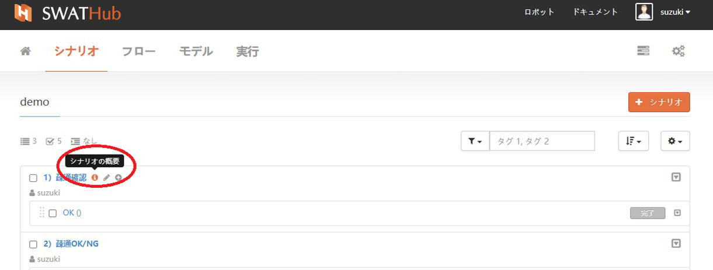
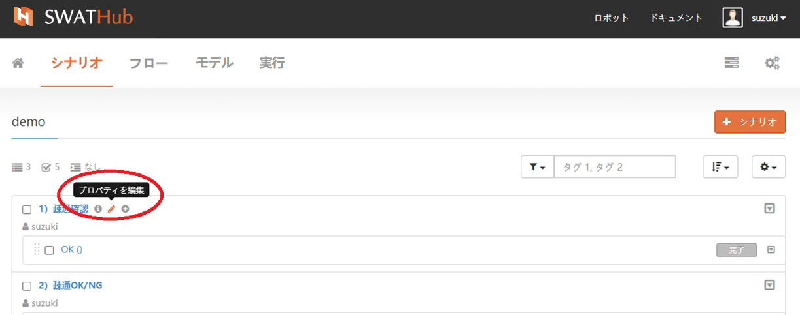
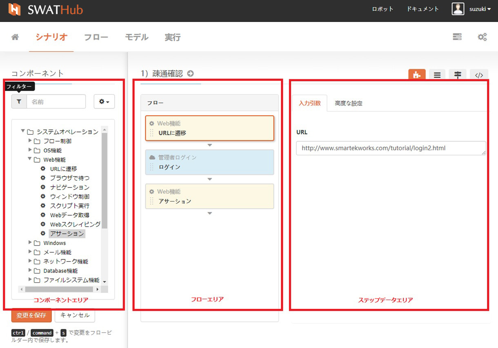
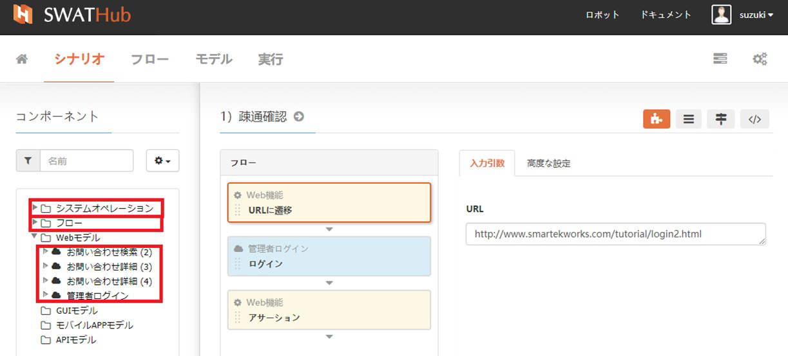
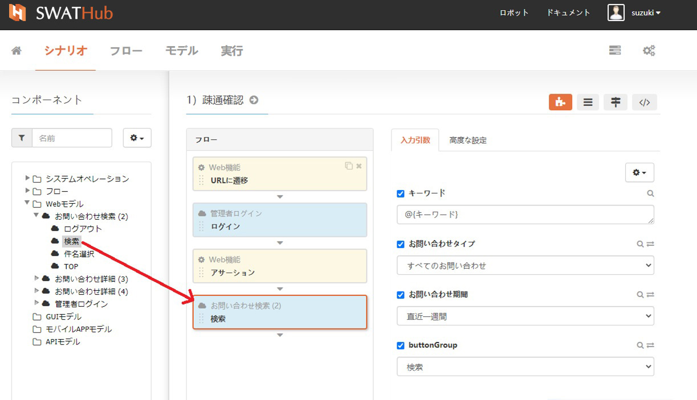
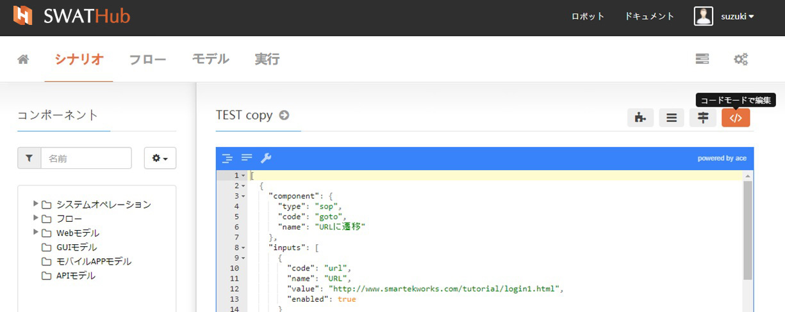

シナリオ
===

基本機能
---

### 新規作成

シナリオグループからシナリオの作成を開始します。<i class="fa fa-plus"></i> **シナリオ**ボタンから、ダイアログボックスで* **名前**、**タグ**キーワードおよびその他の属性を定義し、新しい**シナリオ**を作成します。

### シナリオの概要

シナリオ名の横にある<i class="fa fa-info-circle"></i>**シナリオ概要**をクリックすると現在のシナリオフローが閲覧できます。

### プロパティの編集

シナリオ名の横にある<i class="fa fa-pencil"></i>**プロパティを編集**をクリックすると、**名前**、**タグ**の基本属性が編集できます。

### シナリオの複製

SWATHubプラットフォームでは、シナリオの複製について2つのモードをサポートします。
* 複製：複製機能は、シナリオとケースをそのまま複製します。
* フローにコピー：SWATHubは、共通で利用するシナリオや複数シナリオを一つにまとめたものをフローとして登録できます。**フローにコピー**機能を使うことで既存のシナリオをフローに複製することができます。

### アーカイブ

使用されなくなったシナリオを**アーカイブ**機能で隠すことできます。**アーカイブ**されたシナリオは、シナリオグループのシナリオリストに表示されなくなります。

?> 1. フィルターオプションの**アーカイブを表示**でアーカイブされたシナリオが表示され、**復元**することができます。

### ダウンロード

SWATHubにはシナリオをパッケージとしてダウンロードすることができます。主な利用用途としてはそのシナリオをRPAとして利用する場合SWATHub環境が無くてもロボット単体でシナリオを動かすことができます。

シナリオ構築
---

新しくシナリオ作成をするには、**名前**と**タグ**を設定し追加をクリックすると、シナリオ作成画面に遷移します。 シナリオ作成画面では、**コンポーネントエリア**、**フローエリア**、**ステップデータエリア**で構成されています。

### コンポーネントエリア

コンポーネントエリアは、**フィルター**、**コンポーネントアクション**、**コンポーネントリスト**の3つのグループで構成されてます。

#### フィルター

フィルターのテキストボックスにキーワードを入力することで、コンポーネントリストから目的のコンポーネントを素早く見つけることができます。

#### コンポーネントアクション

コンポーネントアクションでは、**ウィンドウの拡大または縮小**機能が利用でき、**更新**はコンポーネントリストを更新します 。

#### コンポーネントリスト

コンポーネントリストでは、3種類に分けたコンポーネントが含まれます。

* システムオペレーション：SWATHubが用意しているコンポーネントです。シナリオ作成でよく使う数多くのオペレーションを用意してます。ユーザーはシステムオペレーションのコンポーネントをドラッグ＆ドロップでシナリオ作成ができます。
* フロー：フローは業務単位での自動化を作成するうえで有効な機能です。フローをサブシナリオとして理解することもできます。複数のシナリオの1つのフローにカプセル化し、シナリオの中でそれを呼び出して利用することができます。
* モデル：SWATHubプラットフォームでは、さまざまなアプリケーションのテスト自動化をサポートしてます。Web系アプリケーション、Windowsデスクトプアプリケーション、モバイルアプリケーション、APIを使ったテストをサポートしてます。
 *  Webモデル
 *  GUIモデル
 *  APPモデル
 *  APIモデル

### フローエリア

SWATHubでは、**コンポーネントリスト**からモデルオペレーションをフローエリアへドラッグ＆ドロップでシナリオ作成を行います。コンポーネントエリアの下の**変更を保存**ボタンからシナリオを保存します。

### ステップデータエリア：

フロー構築エリアの右側はステップデータエリアです。シナリオステップを構築するうえで、各モデルオペレーションのパラメーターをこのエリアで設定します。

#### 入力引数

ユーザーは、シナリオステップの作成で使用されるモデルオペレーションのパラメーターについて、直接データを設定する、もしくは変数で設定することができます。

#### 高度な設定

ステップタイトルの設定、ステップオプションの設定など、現在のシナリオステップのより詳細な設定を行います。JSONエディターを使用して設定を編集できます。

### 作業モード：

SWATHubのシナリオステップ構築は、4つのモードをサポートします。
* GUIモード
* 引数モード
* コードモード

#### GUIモード

シナリオステップ構築の作業モードは、デフォルトではGUIモードです。この作業モードでは、設計者は、コンポーネントリストにあるすべてのコンポーネント（モデルオペレーションとも言う）をドラッグアンドドロップすることで、シナリオ構築ができます。

#### 引数モード

引数モードでは、現在のシナリオで使用されている入力/出力の引数がリスト形式で配置され、変更が必要な引数をすばやく見つけることができ、引数名を直接クリックして引数の変更ができます。

#### コードモード

シナリオステップがコードで表示され、コードを編集することでシナリオステップをすばやく編集および変更できます。

シナリオメンテナンス
---

### メンテナンス操作

テスト対象システムが変更された場合、シナリオのメンテナンスが必要です。 SWATHubプラットフォームは、モデルの変更が生じた場合、関連するシナリオおよびコンポーネント（モデルオペレーションとも言う）をリアルタイムで検出し、関連するシナリオ、およびコンポーネント（モデルオペレーションとも言う）の名前の横に<i class = "fa fa-warning"> </i>の記号が表示され、更新が必要なことを通知します。影響のあるシナリオを開き、シナリオステップで使用されている影響を受けたコンポーネント（モデルオペレーションとも言う）とパラメーターを確認し変更対応します。

