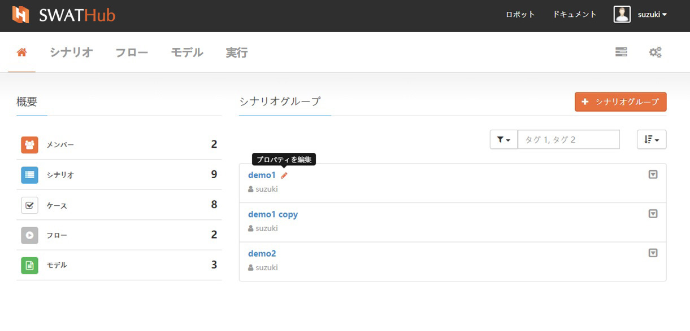
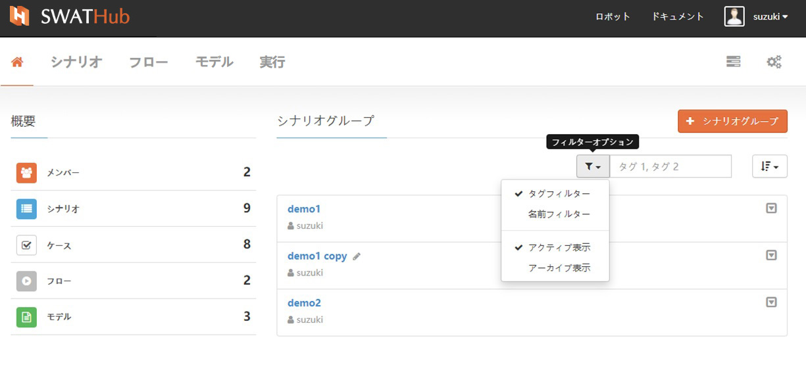
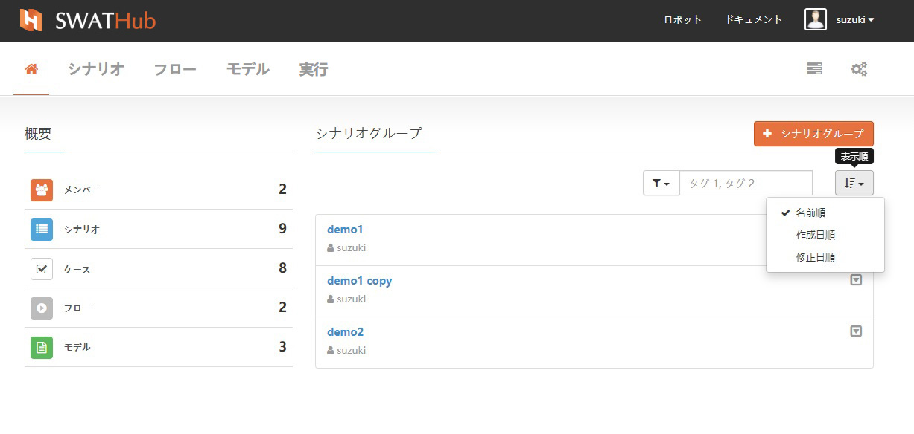
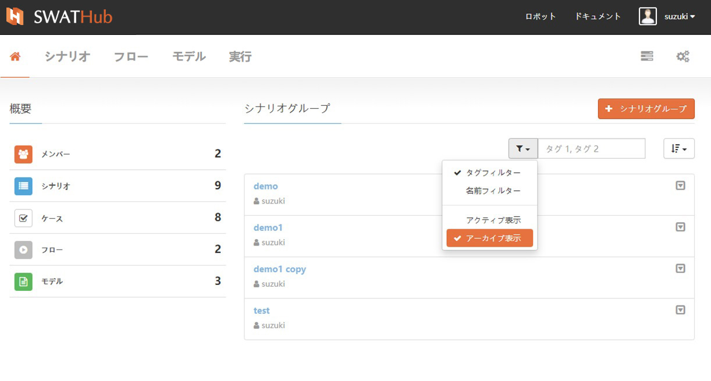
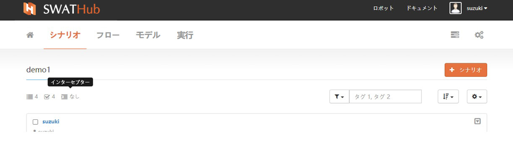
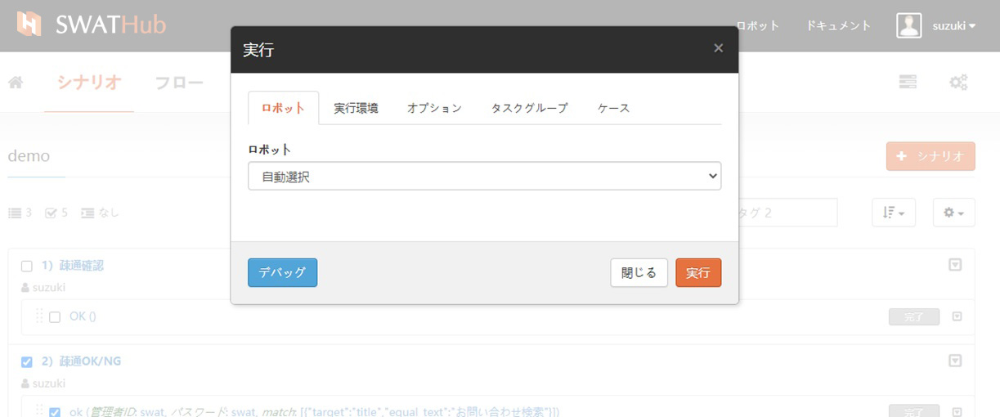
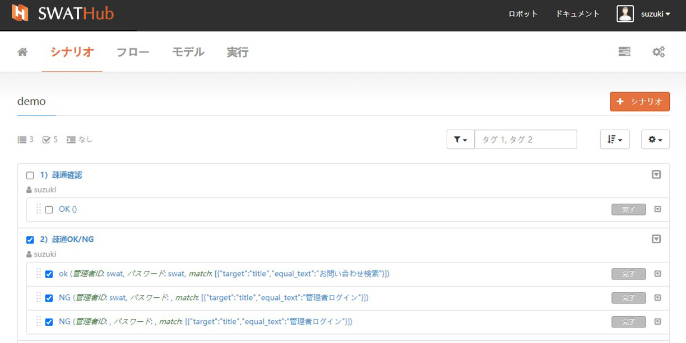

シナリオグループ
===

基本機能
---

### シナリオグループの作成

新規にシナリオグループを作成するには、ユーザーは<i class="fa fa-plus"></i>**シナリオグループ**をクリックし、新しい**シナリオグループ**の**名前**と**タグ**のキーワードを定義します。

### プロパティの変更

シナリオグループの名前とタグは、<i class = "fa fa-pencil"></i>をクリックして**プロパティの編集**から変更できます。

### フィルターオプション

シナリオグループフィルターは属性条件によるフィルタリングをサポートしており、条件は次のように設定できます。

* タグフィルター
* 名前フィルター

シナリオグループフィルターは、シナリオグループのステータス条件によるフィルタリングをサポートしています。ステータス条件は次のとおりです。

* アクティブ表示
* アーカイブを表示

### 表示順

表示順では、さまざまな条件に従って並べ替えができます。

* 名前順
* 作成日順
* 修正日順

### 複製/アーカイブ

シナリオグループの右側にあるドロップダウンメニューから**複製**もしくは**アーカイブ**ができます。

* 複製：シナリオグループとシナリオグループ内のすべてのコンテンツを完全にコピーします。
* アーカイブ：SWATHubプラットフォームは、シナリオグループの物理的な削除機能を提供していません。**アーカイブ**を使用して、未使用のアイテムを論理的に削除します。アーカイブされたアイテムは、シナリオグループに直接表示されなくなり、フィルターオプションから**アーカイブ表示**を選択することでアーカイブ済みシナリオグループを見つることができます。

### リカバリー

アーカイブされたシナリオグループを復元する必要がある場合は、フィルターオプションから**アーカイブを表示**でターゲットシナリオグループを見つけ、**復元**操作を実行することで復元できます。

高度な設定
---

### シナリオリスト表示

**シナリオ**タグを選択すると、現在のシナリオグループとすべてのシナリオグループとを切り替えて表示させることができます。

### 統計表示

シナリオグループを選択すると、左上隅のアイコン+番号は、現在のシナリオグループの概要を表示します。<i class="fa fa-list"></i>は**シナリオ**を表します、<i class="fa fa-check-square-o"></i>は**ケース**、<i class="fa fa-indent"></i>はインターセプターを表し、数値は このシナリオグループのアイテムの総数。

### シナリオグループの設定

SWATHubは、シナリオグループアクションからドロップダウンメニューにより、次の設定機能を提供します。

* インターセプター
* デフォルト設定
* ケースをエクスポート/インポート
* シナリオグループの全てをチェック/チェックを外す
* シナリオグループのケースを全てを展開/隠す

#### インターセプター

インターセプターは、シナリオグループ内のすべてのシナリオの前後に共通的なフローを定義することです。これらのフローをインターセプターと呼びます。前インターセプターはシナリオの前に実行されるフロー、後インターセプターはシナリオ自体が成功したか失敗したか関係なく、シナリオの後に実行されるフローです。インターセプターを使用することで、例えば、ログイン、ログアウトのようなすべてのシナリオで利用される場合に追加すると有効です1 2。

?> 1. シナリオグループ内のインターセプター前とインターセプター後の利用について、プロジェクト全体の設計時に検討します。

?> 2. SWATHubでは、パラメーターの設定が必要なシナリオをインターセプターとして使用することはお勧めしません。このようなシナリオをインターセプターとして使用する必要がある場合、設計者はパラメーターの変更による影響について把握する必要があります。

#### 初期設定

シナリオグループのデフォルト設定について、ベースURL、API URL、およびステップオプションの3つの実行パラメーターを設定します。シナリオグループの動作環境が切り替えられた場合、デフォルト設定でこれら3つのパラメーターの値を変更することにより、シナリオ毎に変更する必要はありません。 **デフォルト設定**の使用の詳細については、[開発ドキュメント](/ja/dev/flow_step_option.md)を参照してください。

#### ケースのエクスポートとインポート

シナリオグループアクションの**ケースをエクスポート**を使用することで、全てシナリオとケース、もしくは指定したシナリオとケースをエクスポートおよびインポートすることができます。ケースをエクスポートとインポート機能では、大量のケースを追加する場合、エクセル上でコピー＆ペーストを使って効率よくケース作成ができます。

* ケースをエクスポート：**ケースのエクスポート**を使用すると、シナリオグループで選択されたシナリオとケースは、ファイル名として「シナリオグループ名+ cases.xlsx」を使用して、設計者のPCに保存されます1。設計者は、この保存されたエクセルファイルを編集することができます2。

?> 1. エクスポートされたシナリオファイルは、必要に応じて特定の場所に保存できます。シナリオファイルの一括追加または一括削除は、シナリオグループと同期する必要があることに注意してください。ファイル名は変更しないでください。

?> 2. エクスポートされたシナリオファイルでは、ケースがシナリオごとに配置され、①領域はシナリオ名としてリストされます。 ②領域は実行情報が表示されます（修正不要）。 ③領域はケース（パラメータ）が表示されます。

* ケースをインポート：エクスポートされたファイルを変更して保存した後、**ケースをインポート**を使用して、ファイル名を同じにした「シナリオグループ名+ cases.xlsx」をアップロードします。アップロードが成功すると、エクセルファイルに追加した内容がシナリオグループに反映します。

#### 選択設定

* 全てをチェック：現在のシナリオグループ内のすべてのシナリオを選択します。
* チェックを外す：現在のシナリオグループで選択したすべてのシナリオをキャンセルします。

#### 表示設定

* 全てを展開：シナリオに追加されたケースすべての表示させます。
* 全てを隠す：シナリオに追加されたケースすべての表示を隠します。

シナリオの一括操作
---

### 基本操作

選択したすべてのシナリオは、複製、フローにコピー、アーカイブなどをサポートしています。
1. シナリオグループ内でシナリオとケースの複製ができます。
2. リオグループのシナリオをアーカイブすることができます。シナリオをアーカイブすると、含まれているすべてのケースもアーカイブされます。
3. フィルターを使用してアーカイブされたシナリオを選択し、復元操作で元にもどすことができます。
4. シナリオグループでは、シナリオのケースのみを削除することができます。

シナリオの詳細な操作については、[シナリオ](design_scenario.md)の章を参照してください。

### ケースの一括実行

シナリオグループでは、複数のシナリオを選択し実行するシナリオとケースが選択できます1。選択した単独または複数のシナリオ（ケースを含む）を実行すると**タスクグループ**に実行状況が表示されます。シナリオグループ画面の右上のタスク<i class="fa fa-tasks"></i>をクリックするとタスクグループリストが表示されます。詳細については、[タスクグループ](design_task.md)を参照してください。実行が完了すると、正しく実行された場合の結果が灰色の**完了**ラベルとして表示されます。実行に失敗した場合、赤い**エラー**ラベルで表示されます。

?> 1. ケースを実行する前にローカルのSWATHubロボットをアクティブにして、現在のアカウントでサインインしてください。SWATHubロボットとアカウントの接続については、ロボットの章の[セットアップ](robot_setup.md)で詳しく説明しています。

### 実行結果をEXCELにエクスポート

シナリオを実行した後、実行結果をEXCEL形式でエクスポートできます。特定のエクスポートファイルは、 `シナリオグループ名+ .report.zip`という名前の圧縮ファイルです。解凍後、フォルダーはシナリオ名に対応します。シナリオ毎の結果を生成します。シナリオ実行結果ドキュメントの説明は[実行結果](design_result.md)を参照してください

