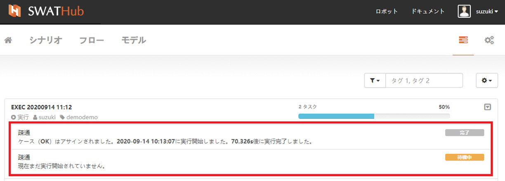
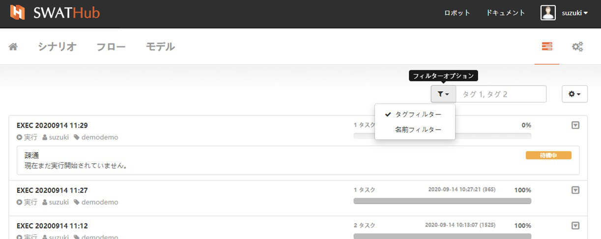

タスクグループ
===

選択した1つまたは複数のシナリオのタスク実行が開始されると画面は自動的に<i class="fa fa-tasks"></i>タスクグループ画面に遷移します。実行中の進行状況が確認できます。

一覧操作
---

<i class="fa fa-play-circle"></i>**ケースの実行**が行われると、タスクグループの各タスクの実行ステータスが、SWATHubプラットフォームとロボットクライアントとが同期し表示されます。

タスクグループ名は、ケース実行時の設定に従って表示されます。<i class="fa fa-user"></i>このタスクグループのユーザー、<i class="fa fa-tag"></i>現在のタスクグループが属するシナリオグループ名を表します。

右側の進行状況バーには、タスクの数と実行の進行状況が表示されます。たとえば、このシナリオグループに2つのタスクがある場合、各タスクが実行され、一つのタスクが完了すると進行状況バーが50％進みます。すべてのタスクが実行されると、進行状況が100％になり、タスクグループの開始時間と合計実行時間が表示されます。

タスクグループ内のタスク一覧は、**ケース**単位で表示されます。各項目は、各シナリオにおけるケースの実行進捗表示です。タスクの実行状況は、左側にテキスト説明の形式で表示され、完了進捗は右のラベルに表示されます。

### フィルター

タスクグループのフィルターオプションには、タグと名前の2つの選択肢があります。ユーザーは、タグのキーワード、または名前のキーワード（たとえば、日付）に基づいて関連するタスクを表示させることができます。

### タスクアクション

タスク画面のタスクアクションでは、**終了したタスクを削除**で不要なタスクを削除し、表示スペースを解放します。

タスクグループ操作
---

タスクグループの右側にある<i class="fa fa-caret-square-o-down"></i>ドロップダウンメニューには、次の3つの操作オプションがあります。
* <i class="fa fa-stop"></i>停止
* <i class="fa fa-play"></i>開始/再開
* <i class="fa fa-trash-o"></i>削除

### 実行の停止

タスクグループが実行状態の場合、すべてのタスクが実行される前に停止操作を使用してタスクの実行を停止できます。タスクグループに複数のタスクがある場合、完了したタスクはグレーのラベル**完了**ステータスを変更せずに維持し、未完了のタスクは黒い**停止**ラベルを表示します。 <i class="fa fa-stop"></i> **停止**操作が利用可能な場合、<i class="fa fa-play"></i> **開始 /再開**操作と<i class="fa fa-trash-o"></i> **削除**操作は使用できません。

* タスクグループが<i class="fa fa-stop"></i> **停止**操作を使用する場合、タスクラベルはブラックマーク**停止**ステータスとして表示され、このとき<i class="fa fa-play"></i> **開始/再開**操作と<i class="fa fa-trash-o"></i> **削除**が利用可能です。
* タスクグループが**停止**状態のときに<i class="fa fa-trash-o"></i> **削除**操作を実行すると、現在のタスクグループが削除され、再開できなくなります。
* タスクグループのすべてのタスクが実行されると、<i class="fa fa-stop"></i> **停止**操作は使用できなくなります。

### 実行の開始/再開

タスクグループの実行が<i class="fa fa-stop"></i> **停止**になった後でのみ、<i class="fa fa-play"></i> **開始/再開**操作を使用できます。 **開始/再開**操作は、**停止**操作のタスクから最初から実行され、完了したタスクは繰り返されません。

* タスクグループのすべてのタスクが実行された後、<i class="fa fa-play"></i> **開始 /再開**操作は使用できません。

### 実行されたタスクの削除

タスクグループの実行が**停止**するか、すべての実行が完了すると、ユーザーは<i class="fa fa-trash-o"></i> **削除**操作を使用できます。

* タスクグループ<i class="fa fa-trash-o"></i> **削除**操作は元に戻せません。注意して操作してください。
