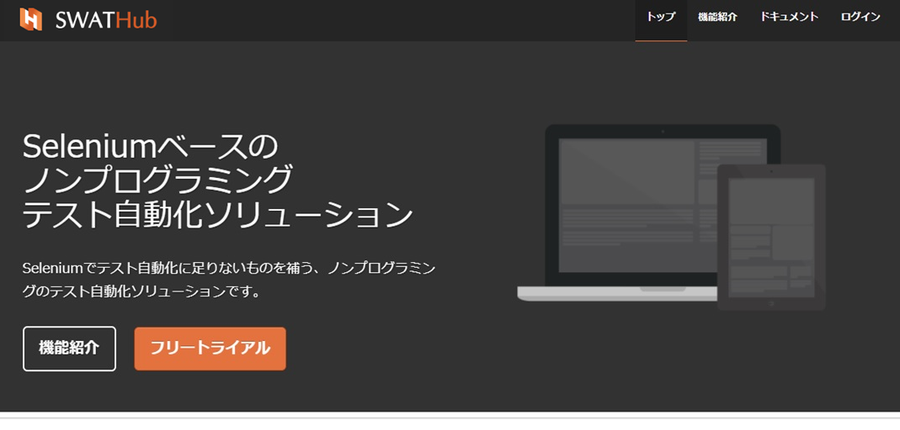
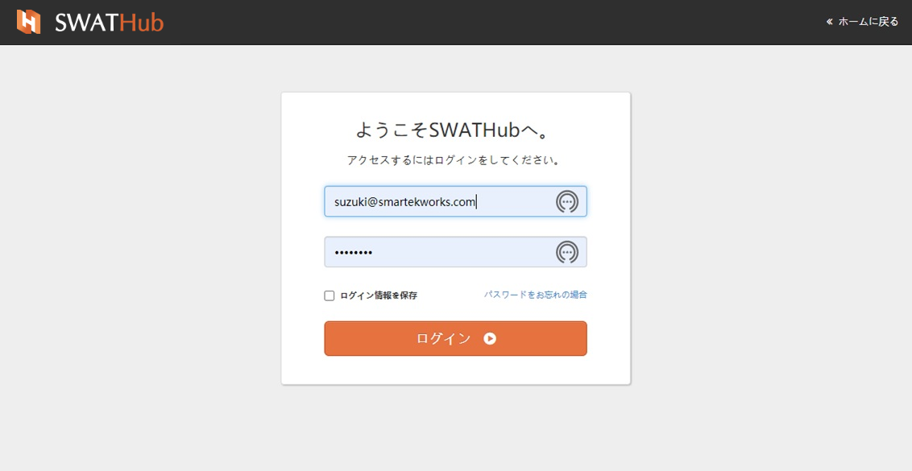
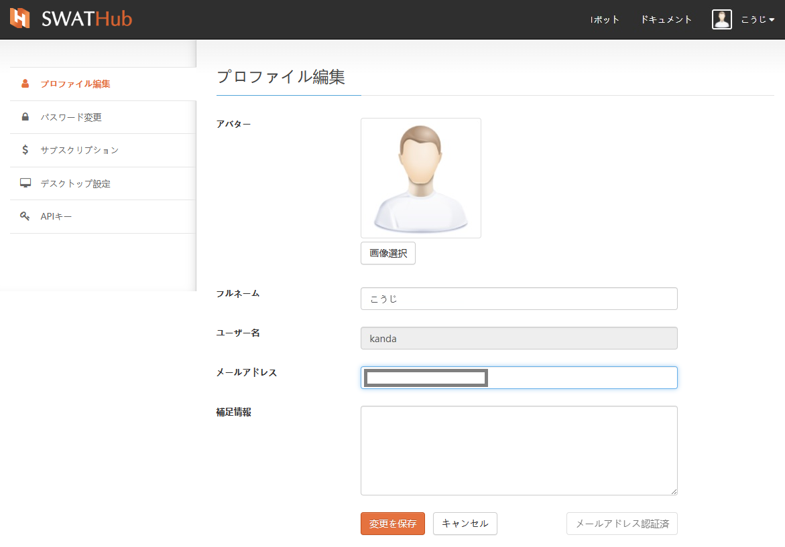
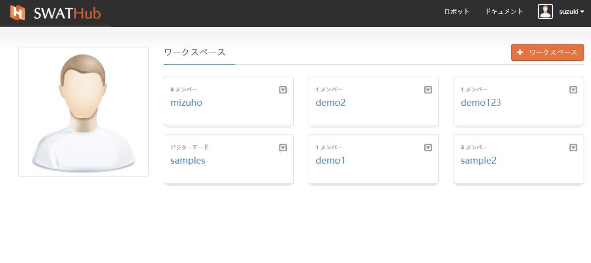
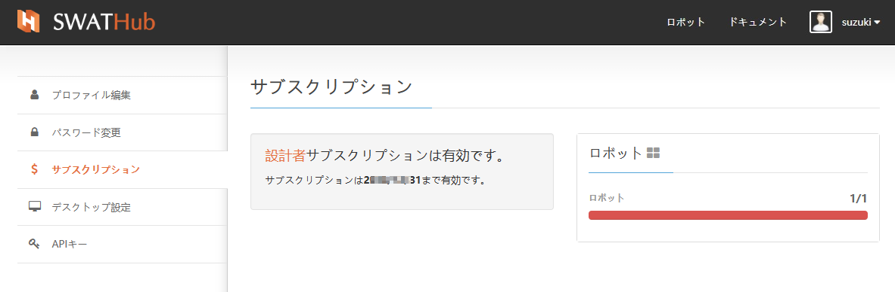
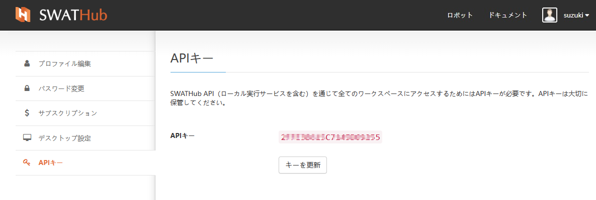
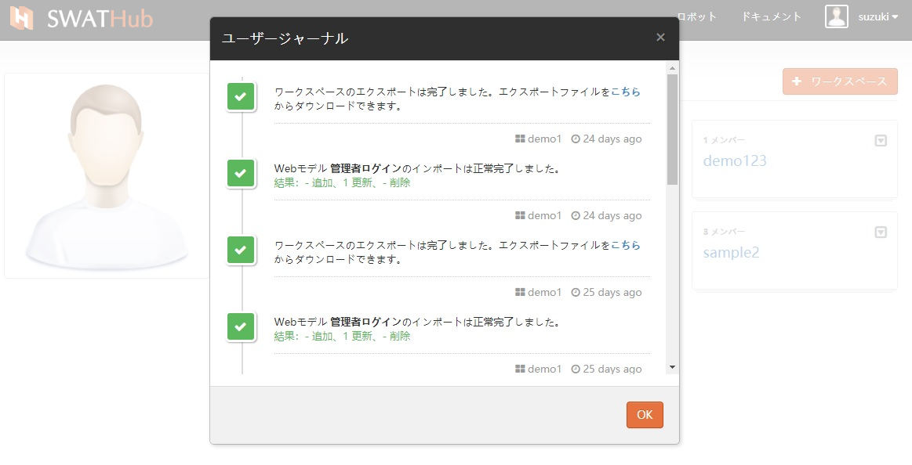

ユーザー
===

基本機能
---

?> パブリッククラウド版ユーザーの登録手順は以下のとおりです。エンタープライズ版ユーザーの登録手順は、[エンタープライズ版管理](design_enterprise_management)をご参照ください。

?> SWATHubサービスをChrome、Edge、Firefox、Safariで利用することを推奨します。それ以外のブラウザの場合、例えばIE、一部画面が正常表示されない可能性があります。

### 登録

#### アカウント作成：

[SWATHubホームページ](http://swathub.com)にアクセスし、**フリートライアル**ボタンをクリックして、フリートライアル画面に入ります。

#### 基本情報の入力：

画面に表示された登録内容へ記入し、**送信**をクリックしてください。その後登録したメールアドレスに案内の返信メールが届きます。

#### アカウントのアクティブ化

受信した電子メールのアクティブ化リンクに従ってSWATHubのトライアルが開始できます。無料アカウントは、デフォルトで登録日から30日間有効であり、パブリッククラウドバージョンのすべての機能を試してみることができます。

### ログイン/ログアウト

#### ログイン：

ログイン確認情報として、ユーザー名または登録メールを使用できます。

#### パスワードリセット：

ログインパスワードを忘れた場合は、**パスワードをお忘れた場合**をクリックし、画面の指示に従って登録メールアドレスを送信し、パスワードリセット手順を返信します。

#### ユーザーのアクティブ化：

プロジェクトを作成する前に、メールリンクからアカウントをアクティブ化する必要があります。トライアルアカウントとパスワードの情報を含むメールを受け取ったときにアクティベーションリンクを介してアカウントをアクティベートしなかった場合、そのユーザーのワークスペース上部に**警告**が表示されます。

引き続きアカウントのアクティベーションを完了して、通常の使用を開始できるようにします。

アカウントがアクティブになると、個人のワークスペースの上部に**成功**というメッセージが表示されます。

#### ロボットのダウンロードとインストール

SWATHubプラットフォームに正常にログインしたら、メニューの**ロボット**をクリックして、利用端末のOSに適した**ロボットクライアント**バージョンを選択し、PCにダウンロードしてインストールしてください。

#### ヘルプ

ユーザーのワークスペースのメニューにある**ドキュメント**で、日本語、中国語のヘルプファイルを参照することができます。

#### サインアウト

**ユーザー**のドロップダウンメニューをクリックすると、**ログアウト**のオプションが表示されます。**ログアウト**をクリックして、作業を終了します。

#### ユーザーホーム

自分が参加しているプロジェクト1のワークスペースが表示されます。各プロジェクトに参加しているユーザーは直接確認でき、ユーザーのワークスペースから直接ターゲットプロジェクトにすばやくアクセスできます。

?> 1. 初めてユーザーのホームにアクセスすると、SWATHubの使い方についてのチュートリアルのサンプルワークスペースが用意されます。

ユーザー設定
---

### プロファイル編集

* フルネーム：中国語、日本語、英語をサポートし、フルネームを使用することをお勧めします。
* ユーザー名：登録完了後は変更できず、登録申請時に登録したメールアドレスに紐付けられます。
* メールアドレス：自分のメールアドレス。
* 補足情報：追記情報等

メール情報を変更したら、**変更を保存**して、**メールアドレス認証済**をクリックして、メールの確認を再度完了してください。

### パスワードを変更する

ユーザー定義のパスワードルールは、英語の大文字と小文字、数字、および "-"に制限されています。6桁以上に設定することをお勧めします。

### サブスクリプション

現在のアカウントの有効期間と使用状況を表示します。ユーザー認証のタイプに応じて、異なるタイプの使用情報が表示されます。

### デスクトップ設定

SWATHubのデスクトップアプリケーションまたはWebアプリケーションを使用してシーンを開くことができます。現在、デスクトップデザイナーがシステムにインストールされていない場合は、Webアプリケーションを使用してください。

### APIキー

* APIキー：SWATHubプラットフォームでAPIを使用する場合、アカウント固有のAPIキーが必要です。
* キーを更新：ユーザーは**キーを更新**を使用してAPIキーを再取得できます。変更後、このAPIキーを呼び出すすべてのプロジェクトのAPIキーパラメータを同期的に変更する必要があります。

ユーザージャーナル
---

アカウントの操作履歴は、遡って確認できるように、**操作履歴**を項目ごとに時系列で記録されます。

