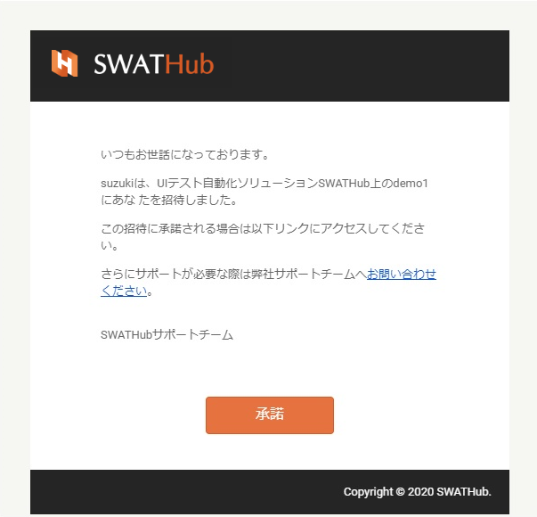
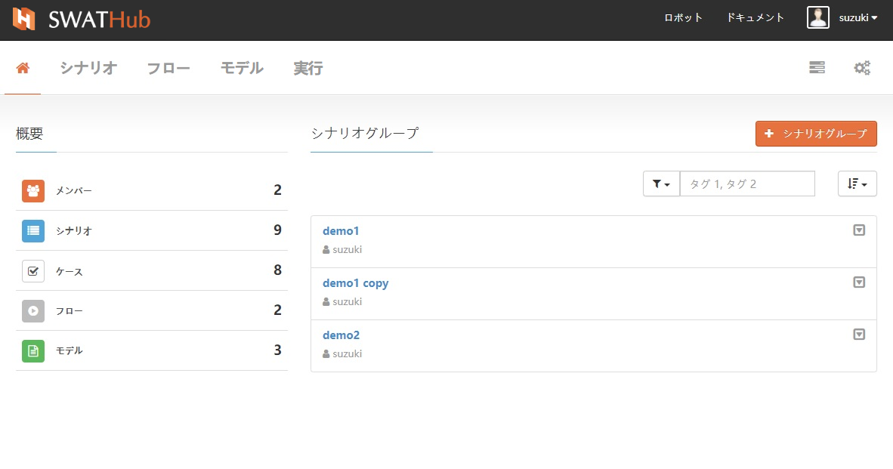
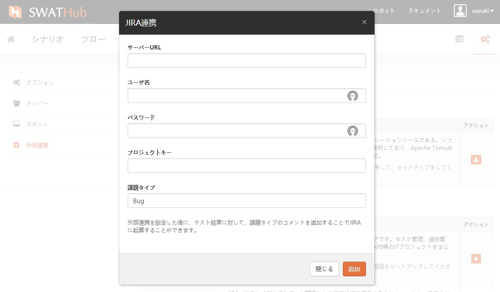

ワークスペース
===

基本機能
---

### ワークスペースの作成

新規にワークスペースを作成するには、最初にワークスペースの名前とワークスペースの説明を追加し、**作成**をクリックしワークスペースを作成します。

### ワークスペースに参加

他のユーザーが作成したワークスペースに直接参加することはできません。ワークスペースの所有者の招待を受け承認することでワークスペースへの参加ができます。

ワークスペースの所有者から招待メールを受信したら、[承諾]ボタンをクリックします。ワークスペース所有者は参加メンバーの権限を設定します。

エンタープライズ版では、管理者がワークスペースのすべてのメンバーの追加と削除についての権限設定を直接管理します。

### ワークスペース参加の終了

ワークスペースを直接削除させることはできません。管理者は、**設定**の**ワークスペースオプション**からワークスペースをエクスポートか削除を選択することができますが、メンバーの場合に、ワークスペースプルダウンの**終了**で該当ワークスペースの参加を終了させます。

ワークスペースホーム
---

SWATHubログイン後のトップ画面では、ワークスペースのホーム画面になります。ホーム画面から特定のワークスペースを選択すると、そのワークスペースの**概要**と**シナリオグループ**が表示され、現在の作業内容の概要と現在のワークスペースのシナリオグループ情報が表示されます。

### 概要情報

ワークスペースの概要情報には、次の情報が表示されます。

* メンバー：現在のワークスペースに参加されているメンバー。 **非メンバーモード**ではパブリックワークスペースにアクセスする場合に、参加メンバー名の情報は表示されません。
* シナリオ：現在のワークスペースに登録されているシナリオの数（複数のシナリオグループで共有されているシナリオまたは単一のシナリオグループで使用されているシナリオを含む）。シナリオ操作手順については、[シナリオ](design_scenario.md)を参照してください。
* ケース：現在のワークスペースに登録されている各シナリオで使用されているケースの数。ケース操作手順については、[ケース](design_case.md)を参照してください。
* フロー：現在のワークスペースに登録されているすべてのフロー数。フロー操作手順については、[フロー](design_flow.md)を参照してください。
* モデル：現在のワークスペースに登録されているすべてのモデルの数。モデルの詳細な操作手順については、[モデル](design_model.md)を参照してください。

### シナリオグループ

ワークスペースに登録されたシナリオグループ情報について、シナリオググループ名、作成者、タグ、およびシナリオググループの基本情報が確認できます。シナリオググループの詳しい操作手順については、[シナリオグループ](design_scenario_gorup.md)を参照してください。

ワークスペース設定
---

ワークスペースホーム画面で自分が参加しているワークスペースの**ワークスペース設定**ボタンをクリックすると、ワークスペース設定画面に遷移しワークスペースについて次の情報設定および参照ができます。

* オプション
* メンバー
* ロボット
* 外部連携

### オプション

オプションでは、以下の情報について参照および変更ができます。

* 名前：ワークスペース名の変更ができます。
* 説明：ワークスペースの説明ができます。
* パブリックワークスペース：デフォルトはパブリックではありません。チェックすると、ワークスペースに誰でもアクセスができます。
* クリーナップ：デフォルトでは[実行結果](design_result)に3件保持されます。実行結果保持量を変更する必要がある場合は、自分で変更できます。
* メンテナンス：ドロップダウンメニューから
  * エクスポート：モデル、フロー、ワークスペースに登録されている設定のエクスポートが含まれますが、実行されたプロジェクトの結果は含まれません。エンタープライズ版はワークスペースのインポートをサポートしています。
  * 削除：ワークスペースの所有者のみが表示されます。ワークスペースが削除されると、元のワークスペースのすべてのメンバーが同時にプロジェクトを離れます。

### メンバー

#### メンバーの権限

SWATHubプラットフォームは、ワークスペースメンバーの役割と権限を次のように設定します。
* 所有者：ワークスペースの作成者はワークスペースの所有者であり、すべての操作権限を持っています。
* 管理者：ワークスペースの所有者を通じて**管理者**権限でワークスペースに参加するよう招待されます。管理者は認証の完了後ワークスペースの削除を除くすべての権限を持ちます。
* ユーザー：ワークスペースオーナーまたは**ユーザー**権限を持つ管理者によってワークスペースへの参加を招待され、認証が完了するとワークスペースへの参加ができます。ワークスペースの開発関連のすべての作業に参加できますが、ワークスペースを制御することはできません。
* ビジター：**ビジター**権限を持つワークスペースオーナーまたは管理者によってワークスペースへの参加を招待されたユーザー。ワークスペースが非公開の場合、ビジター権限でワークスペースにアクセスできますが、ワークスペースへの操作権限はありません。

#### メンバーの招待

* メンバーの招待：ワークスペース管理者は、ユーザー名を入力し、ユーザーIDを定義して「メンバーを招待する」ことで、ワークスペースメンバーの招待ができます。招待を受けた者は、メールで受信した招待リンクを通じてワークスペースへの参加をします。

* メンバーの権限を変更：ワークスペース管理者は、実際のニーズに応じてワークスペースに参加したユーザーの権限を変更できます。変更が成功するとワークスペース内のユーザーの権限は、ユーザーがSWATHubプラットフォームに再度ログオンした直後に有効になります。
* メンバーの削除：ワークスペース管理者は、実際のニーズに応じてワークスペースに参加したユーザーを削除できます。削除が成功するとワークスペース内のユーザーの権限は、ユーザーがSWATHubプラットフォームに再度ログオンした直後に有効になります。

### ロボット：

このワークスペースのロボットリストには、このワークスペースにリンクされているすべてのロボットの情報が表示されます。

### 外部連携

SWATHubプラットフォームは、DevOps、CI、障害管理、その他の外部サービスと連携することができます。

#### Jenkins

DevOpsのなかで、テスト自動化は重要な部分です。CI (Continuous Integration) のサイクルでは、各ビルドによってテスト自動化のステップがアプリケーションを検証するトリガになります。ここでは、一般的なCIプラットフォームJenkinsとの連携機能をセットアップする方法の概要を説明します。

##### SWATHubプラグインのインストール

[SWATHub Execution Plugin](tools/swat-jenkins-execution-v2.0.zip)は、Jenkinsジョブのステップを生成することができます。SWATHub上で自動化テストのバッチを実行し、その後テストレポートが生成されます。[Github](https://github.com/SmartekWorks/swathub-execution-plugin)からプラグインのソースコードを入手することも可能です。

インストールは他のJenkinsプラグインと同じです。 Jenkins管理者としてログインし、**システム管理 > プラグイン管理 > 詳細設定**を選択し、プラグインファイルを選択してJenkinsにアップロードします。プラグインがインストールされた後、以下のようないくつかのグローバル設定が行われ、Jenkinsのジョブのビルドステップ設定で上書することがきます。

* `SWATHub Domain`: SWATHubサーバのドメイン。例えば、`https://swathub.com`です。
* `Workspace Owner's Username`: ワークスペースの所有者のユーザー名（ワークスペースのURLから見つけることができます）
* `Workspace Name`: ワークスペースの名前（ワークスペースのURLから見つけることができます）
* `Username`: ユーザ名
* `API Key`: APIキー
* `Proxy Server` (省略可): JenkinsがSWATHubを接続できるプロキシサーバーのURL。デフォルトは空白です。
* `Proxy Port` (省略可): プロキシサーバのポート。デフォルトは空白です。
* `Proxy Username` (省略可): プロキシサーバによって認証されるユーザ名。デフォルトは空白です。
* `Proxy Password` (省略可): プロキシサーバーによって認証されるパスワード。デフォルトは空白です。

##### SWATHubビルドステップの設定

Jenkinsのジョブでは、ビルドステップリストから**SWATHub Execution Step**を追加して、次の設定1を行うことができます。

* `Test Set ID` (省略可): シナリオグループID (シナリオグループのURLから見つけることができます。) 空白を使用すると、すべてのシナリオグループにわたってケースを実行できます。デフォルトは空白です。
* `Robot Name` (省略可): 実行のためのロボット名。自動選択の場合空白を使用してください。デフォルトは空白です。
* `Browser Code` (省略可): 実行時に利用するブラウザのコード。`IE`, `Chrome`, `Firefox`, `Edge`, `Edge Legacy` と`Safari`はサポートします。空白の場合に、ロボットのデフォルトブラウザを利用します。デフォルトは空白です。
* `Run Cases Sequentially` (省略可): ケースを順番に実行するかどうか。`true`または`false`を使います。デフォルトは `false`です。
* `Test Server URL` (省略可): テストサーバのURL。シナリオグループの設定を継承するには、空白を使用します。デフォルトは空白です。
* `API Server URL` (省略可): APIサーバーのURL。シナリオグループの設定を継承するには、空白を使用します。デフォルトは空白です。
* `Scenario Tags` (省略可): 実行するテストケースをフィルタリングして実行するコンマで区切ったタグ。デフォルトは空白です。
* `Step Options` (省略可): この実行のためのステップオプション。シナリオグループの設定を継承するには、空白を使用します。デフォルトは空白です。
* `Create Issue on Error` (省略可): 実行エラーの時に課題を起票するかどうか。`true`または`false`を使います。デフォルトは `false`です。

ステップの**Advanced**設定を展開すると、このステップでのみ利用するグローバル設定を設定することができます。

?> 1. 上記のパラメーターに`$Var1`や`$my_var_2`とかのような環境変数を利用することが可能です。また変数とテキストを混ぜることも可能です。例えば、`http://$swathub_host:8080`。
変数名を英数字と`_`にする必要があります。

##### JUnitのテスト結果レポート

JUnitのテスト結果レポートを生成するために、Jenkinsジョブのpost-buildステップとして、**Publish JUnit test result report**を追加する必要があります。またtest report (XML)の名前を`swat_result.xml`に設定してください。

#### Redmine

[Redmine](http://www.redmine.org)は、オープンソースのWebベースのプロジェクト管理および問題追跡ツールです。担当者はSWATHubで自動化テストを設計して実行し、SWATHub Redmine連携機能1によるRedmineに障害を報告することができます。

?> 1. 連携機能を有効にするには、Redmine 2.0以降が必要です。

##### Redmineとの連携機能をセットアップ

SWATHubは、既存のITインフラストラクチャを活用してテストの効率を向上させるために、サードパーティのサービスとの連携機能をいくつか提供します。ワークスペースの画面で、**設定>外部連携**を選択し、Redmineの横にある<i class="fa fa-plus"></i>をクリックして、次の設定を行います。

* `Sderver URL`：RedmineサーバーのURL。
* `API Key`：問題を報告するためのAPIキー。
* `Project ID`：問題を報告しているプロジェクトのIDまたはプロジェクトコード（Redmine 3.3以降）。
* `Status ID`：Redmineで定義できる「Open」ステータスのID。デフォルト値は「1」です。
* `Tracker ID`：Redmineで定義できる` issue`タイプのID。デフォルト値は「1」です。

##### テストの課題を報告

Redmineとの連携機能が有効になりましたら、各テスト結果に対してRedmineに課題を報告できます。

* テスト結果画面で、**<i class="fa fa-comments-o"></i>><i class="fa fa-bug"></i>**をクリックし、問題の詳細を記入し登録します。Redmineに新しい課題が作成され、コメント項目にそのリンクが表示されます。
* [Jenkins](#jenkins)を使用し、`Create Issue on Error`を有効な場合、エラーの実行結果に対して、Redmine課題が自動的に起票されます。
* このリンクをクリックすると簡単にRedmineにナビゲートし、すべての説明とリンクされたテスト結果で新しく作成された課題を見つけることができます。
* 登録した問題や質問を確認する場合は、シナリオ画面でエラーになったシナリオのケースを選択し、**<i class ="fa fa-comments-o"></i>コメントの表示**を選択すると日付順にソートされたすべてのコメントと質問を表示します。

#### JIRA

[JIRA](https://www.atlassian.com/software/jira)は、Atlassian社が開発した課題管理ツールです。担当者はSWATHubの自動化テストを設計して実行し、SWATHub JIRAの連携機能1によりJIRAに障害を報告することができます。

?> 1. 連携機能を有効にするには、JIRA 5.0以降が必要です。

##### JIRAとの連携機能をセットアップ

ワークスペースの画面で、**設定>外部連携**を選択し、JIRAの横にある<i class = "fa fa-plus"></i>をクリックして、次の設定を構成します。

* `Server URL`：JIRAサーバーのURL。
* `Username`：JIRAサーバーにアクセスするためのユーザー名。
* `Password`：JIRAサーバーにアクセスするユーザーのパスワード。
* `Project Key`：問題を報告するプロジェクトのユニークキー。
* `Issue Type`：JIRAで定義できる課題のタイプ。例えばbug

##### テストの課題を報告

JIRAとの連携機能が有効になりましたら、各テスト結果に対してJIRAに課題を報告できます。

* テスト結果画面で、**<i class="fa fa-comments-o"></i>><i class="fa fa-bug"></i>**をクリックし、問題の詳細を記入し登録します。JIRAに新しい課題が作成され、コメント項目にそのリンクが表示されます。
* [Jenkins](#jenkins)を使用し、`Create Issue on Error`を有効にすると、エラーの実行結果に対して、JIRA課題が自動的に起票されます。
* このリンクをクリックすると簡単にJIRAにナビゲートし、すべての説明とリンクされたテスト結果で新しく作成された課題を見つけることができます。
* 登録した問題や質問を確認する場合は、シナリオ画面でエラーになったシナリオのケースを選択し、**<i class="fa fa-comments-o"></i>コメントの表示**を選択すると日付順にソートされたすべてのコメントと質問を表示します。
