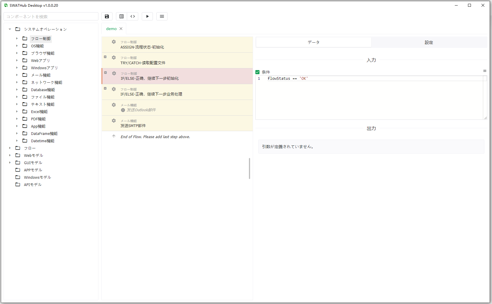
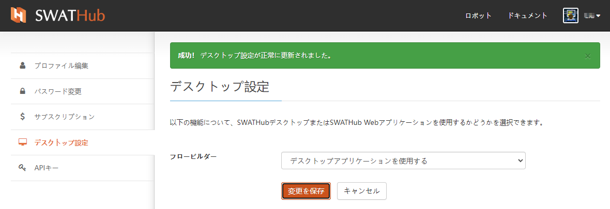
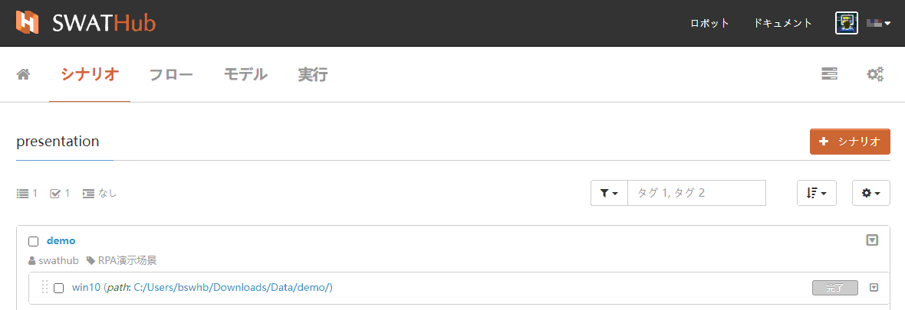
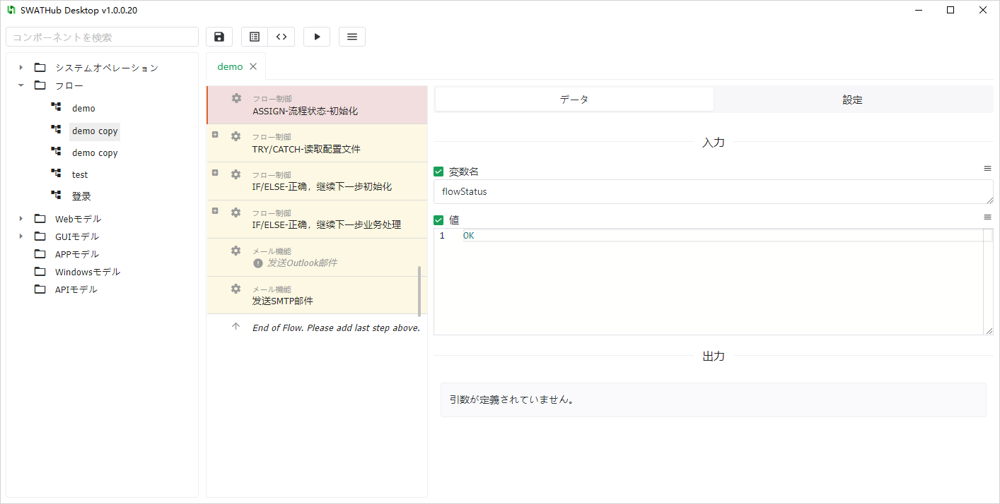
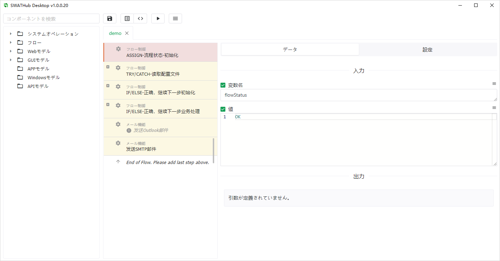
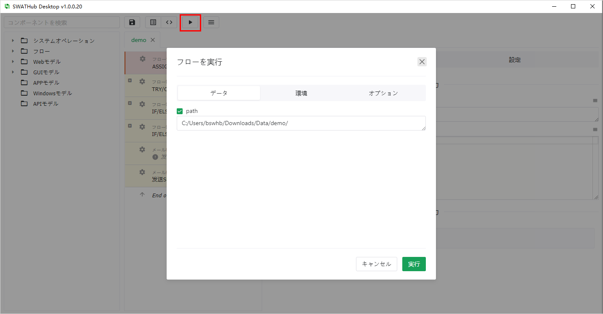
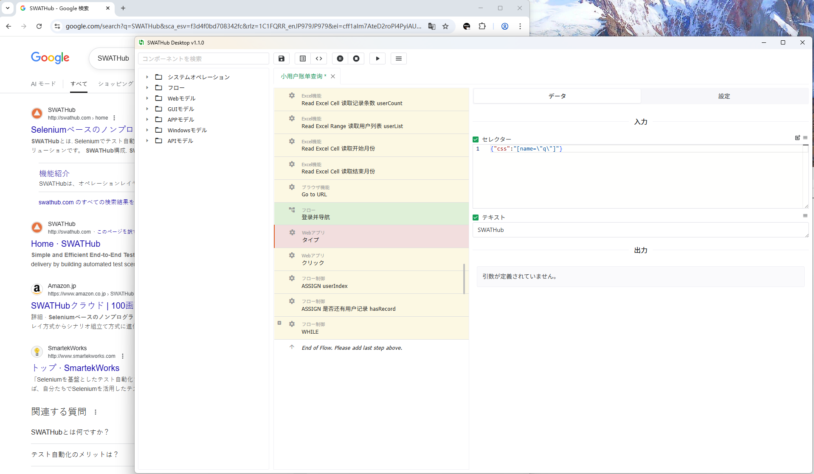

デスクトップフロービルダー
===

SWATHubはデスクトップフロービルダーを提供しており、ユーザーはブラウザを開かずにSWATHubサーバーにアクセスせずに、ロボット側でフローの設計、デバッグ、および実行を完了することができます。

インストール設定
---

1. SWATHubデスクトップフロービルダーのインストールパッケージをダウンロードするには、[ロボットのインストール](robot_setup#インストール手順)を参照してください。 たとえば、 `swathub-desktop-v1.0.0-x64.zip`。
2. SWATHubエディターのインストールパッケージをインストールディレクトリに解凍します。

3. SWATHubのWebページの**ユーザー設定画面**にログインし、**デスクトップアプリケーション**を使用に変更します。

フローの選択
---

1. デスクトップフロービルダーで編集する必要のあるSWATHub作業プロジェクトのシナリオまたはフローを選択して、エディター画面に移動します。

2. **デスクトップアプリケーション**を開くと、その作業プロジェクトのシナリオまたはフローの編集操作画面に入ることができます。デスクトップアプリケーションは、同じ作業プロジェクト内の複数のシナリオまたはフローを同時に開くことができます。

フローの構築
---

デスクトップフロービルダーの操作画面は、[Web画面](design_scenario)と基本的に同じです。 ユーザーは、左側のコンポーネント選択エリアから、システム操作、フロー操作、およびモデル操作などの各種の操作を、ドラッグアンドドロップで中央のフロー構築エリアに追加し、右側のステップ属性エリアで、必要な入力および出力パラメーターを設定することができます

ユーザーは、ツールバーの<i class = "fa fa-save"></i>ボタンをクリックして、編集した内容を保存することもできます。ツールバーの<i class = "fa fa-list"></i>ボタンまたは<i class = "fa fa-code"></i>ボタンをクリックして、`パラメータモード`または`コードモード`に切り替えることもできます。

フローの実行
---

ユーザーは、ツールバーの<i class = "fa fa-play"></i>ボタンをクリックして、現在設計されているフローを実行できます1。 Web画面と同様に、ポップアップされた実行ダイアログで、ユーザーは対応する入力パラメーター、実行プラットフォーム、および必要なステップオプションを設定する必要があります。注意すべきは、フローの実行時に、シーングループの前/後インターセプター設定、デフォルトのステップオプション、およびその他の実行設定もインポートされる点です。

?> 1. フローの実行には、SWATHubロボットのバージョンv1.8.0以上が必要です。プロジェクトの設計と実行をデスクトップフロービルダーで行う場合は、対応するバージョンのロボットクライアントが起動されていることを確認してください。

フローの録画
---

ユーザーはツールバーの <i class = "fa fa-plus"></i> ボタンをクリックして Web 録画モードに入ることができます1。このモードでは、ブラウザ上での操作が自動的に SWATHub のフローステップとして保存されます。

1. 録画モードに初めて入る場合は、まず [SWATHub Recorder](https://chrome.google.com/webstore/detail/swathub-recorder/gidimbkiadpbkmmikbibpgicnaomlaki) ブラウザ拡張をインストールし、インストール後にブラウザを閉じてください。
1. 次に [Recorder Helper](tools/swathub-recorder-helper_v1.1.0.zip) パッケージをダウンロードし、ユーザーのローカルディレクトリに解凍します。例:
    * Windows：`%appdata%\swathub-desktop\recorder`
    * macOS：`/Users/<username>/Library/Application Support/swathub-desktop/recorder`
1. コマンドラインを開き、上記ディレクトリで該当のスクリプトを実行します:
    * Windows：`setup.bat`
    * macOS：`./setup.sh`
1. 録画ボタンを再度クリックすると、エディターは自動で新しいブラウザウィンドウを開き、Web 録画モードに入ります。ツールバーには <i class = "fa fa-pause"></i> / <i class = "fa fa-stop"></i> ボタンが表示されます。
1. 録画を始める前にエディター内で任意のステップをクリックして選択しておく必要があります。その後ブラウザで行った操作は、選択されたステップの後に自動的に追加されます。
1. ユーザーは録画する操作を選択するために <i class = "fa fa-pause"></i> / <i class = "fa fa-play"></i> ボタンを切り替えることができます。<i class = "fa fa-stop"></i> ボタンをクリックすると録画モードが終了し、ブラウザは自動で閉じます。

?> 1. 現在は Chrome ブラウザのみサポートしています。