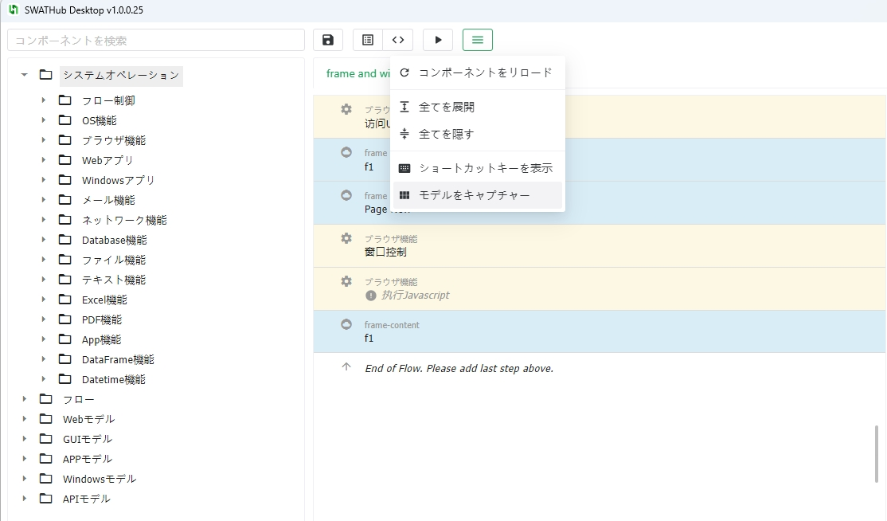
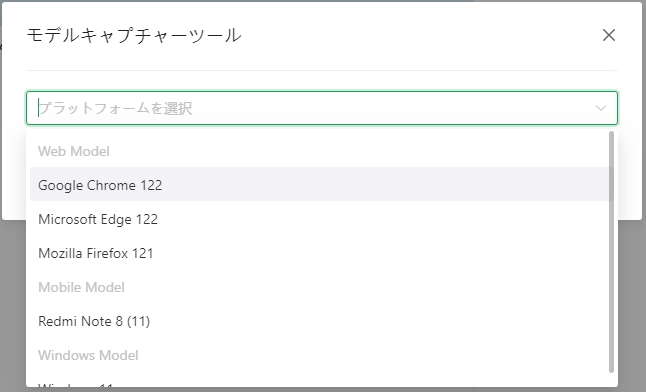
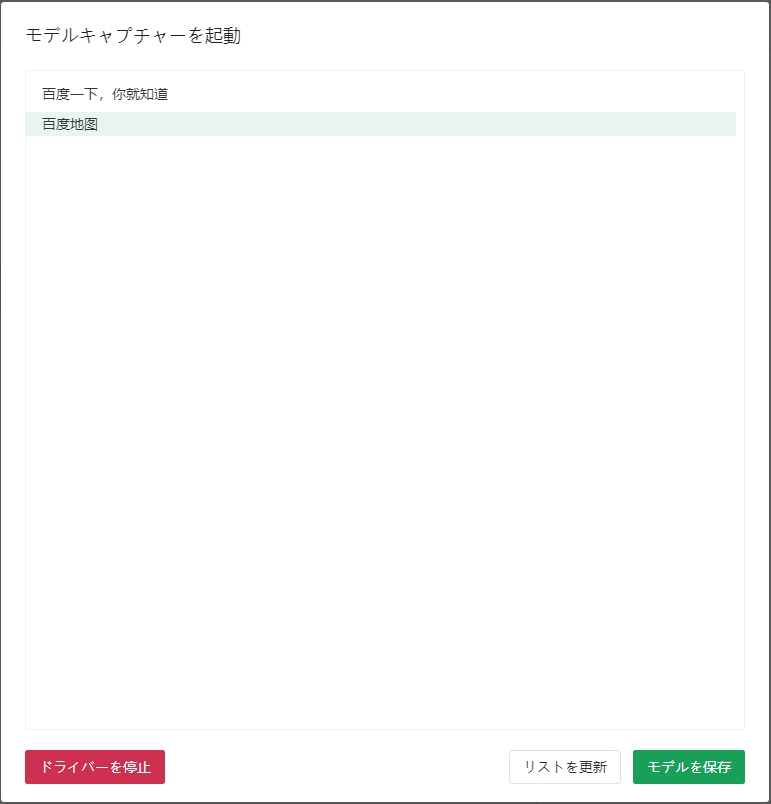
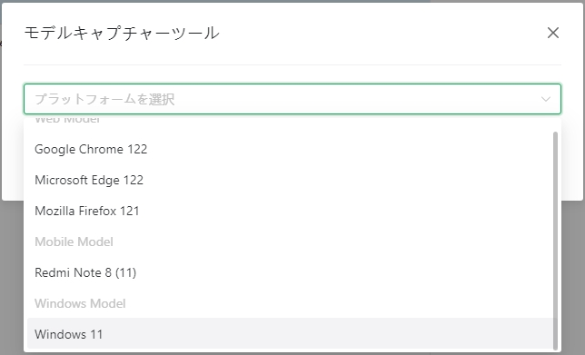
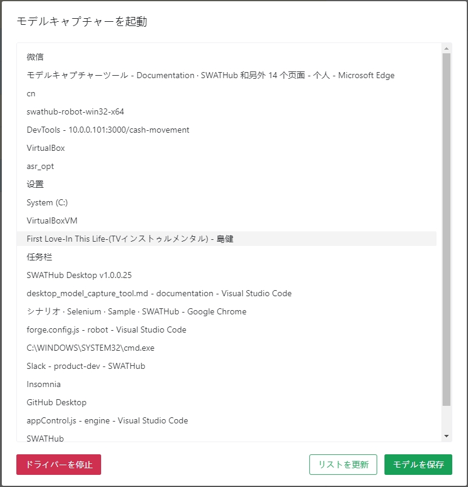
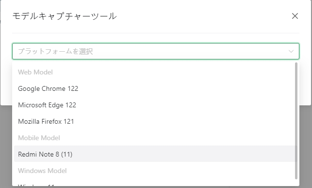
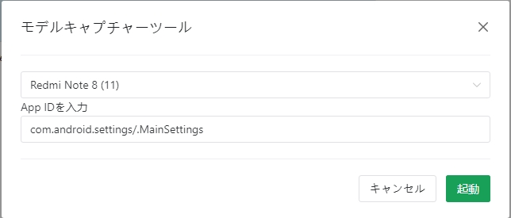

モデルキャプチャーツール
===

SWATHubデスクトップ版には「モデル取得ツール」が統合されており、デスクトップツールを使用してWebモデルとAPPモデルを取得することができます。デスクトップ版の **ツール** メニューから **モデル取得ツール** 画面に進み、モデルファイルの取得カテゴリを選択し、取得操作を開始します1。

?> 1. モデル取得ツールを起動する前に、**SWATHubロボット**が既に起動していることを確認してください。

Webモデルの取得
---

Webモデルの取得操作は以下の通りです：

1. **モデル取得ツール** 画面に進み、Webファイルを取得するために使用するブラウザを選択します1。

2. **起動** ボタンをクリックすると、選択したブラウザが自動的に開き、目的のWebサイトのURLを入力してWebページを開くことができます。

3. **更新** ボタンをクリックすると、すべての開いているページのリストを取得することができます。以下の図を参照してください：

4. **保存** ボタンをクリックすると、保存したWebページファイルを[オブジェクトモデル](design_model.md#Webモデル)の操作方法でモデル機能操作を行うことができます。

?> 1. SWATHubロボットは自動的に現在のマシンにインストールされているブラウザを取得し、リストに表示します。

Windowsモデルの取得
---

1. **モデル取得ツール** 画面に進み、現在のWindowsオペレーティングシステムを選択します。

2. **更新** ボタンをクリックすると、すべての開いているアプリケーションのリストを取得することができます。以下の図を参照してください：

3. **保存** ボタンをクリックすると、保存したWebページファイルを[オブジェクトモデル](design_model.md#Windowsモデル)の操作方法でモデル機能操作を行うことができます。

APPモデルの取得
---

1. **モデル取得ツール** 画面に進み、APPを起動するために必要なデバイス名を選択します。

2. APP IDを入力し、**起動** ボタンをクリックします。

3. APPが成功して起動した後、モデルページに進み、**更新** ボタンをクリックすると、現在のAPPのリストを取得することができます。以下の図を参照してください：

4. 保存したAPPページファイルは、[オブジェクトモデル](design_model.md#APPモデル)の操作方法でモデル機能操作を行うことができます。

* NATIVE_APP：`sview`ファイルとして保存され、原生コードを表し、モバイルモデルとしてインポートされます。
* WebView_1：`shtml`ファイルとして保存され、WebViewのHTMLコードを表し、Webページモデルとしてインポートされます。