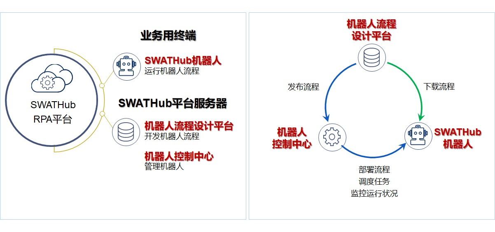
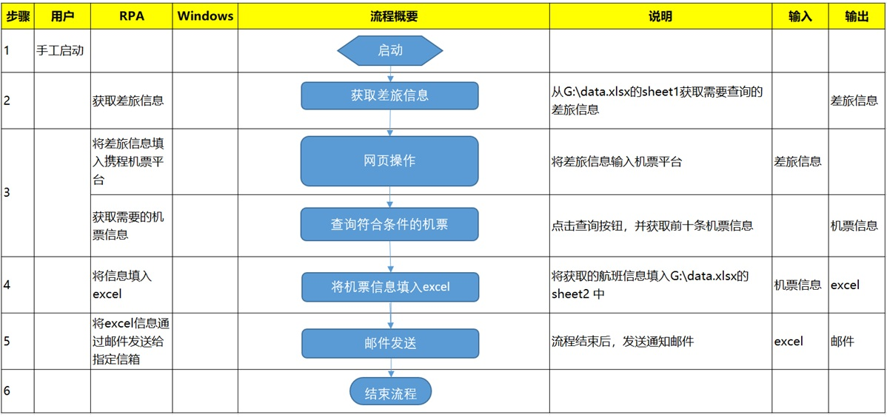

SWATHub的业务自动化（RPA）
===

SWATHubプラットフォームのモデリング技術と使い易い実装方法により、プロセスの自動化が簡単に実現可能です。また、弊社独自で開発したSWATHubは国際対応しており、日本国内に限らず海外展開されている企業様に対して安定したプロダクトの提供、また、お客様の特別な要求に対してカスタマイズ等の柔軟な対応でサポートします。

ビジネスの自動化とは
---

ビジネスの自動化、つまりRobotic Process Automation（RPA）は、ソフトウェアロボットを使用してビジネスの処理手順を自動化することを指します。ソフトウェアロボットは人間を模倣し、表示されたコンテンツの確認や複数のアプリケーションまたはビジネスシステムでのコンテンツ入力など、一連のオペレーションを実行できます。


ソフトウェアロボットは、手動で実行する場合と比較して、反復的なオペレーションを迅速、正確、かつ高速に実行できるという利点があります。 RPAは、単純で退屈な反復作業から多くの人々を解放し、人間と機械のコラボレーションを通じてより多くの価値を生み出します。

SWATHubアーキテクチャ
---

SWATHub RPAプラットフォームは、SWATHubプラットフォームサーバーとビジネスターミナルで実行されるSWATHubロボットの2つの部分に分かれています。



### SWATHubロボット

SWATHubロボットは、ユーザーのコンピューターにインストールされたRPAプロセス実行プログラムであり、SWATHubプラットフォームによって設計されたシナリオパッケージまたはスケジュールされた作業タスクを実行します。

### SWATHubプラットフォーム

SWATHubプラットフォームサーバーには、ロボットプロセス設計プラットフォームとロボットコントロールセンターの2つのサブプラットフォームが含まれています。これらは、ロボットプロセスの設計とロボットの管理をするために使用されます。

次に、SWATHub RPAについて説明します。

SWATHub RPAのクイックスタート
---

SWATHubの使用方法についてチュートリアルを以下に説明します。[Ctripチケット注文プラットフォーム](https://www.ctrip.com)チケットお問い合わせ・チケット情報の入手についてのシナリオは、特定の領域での使用方法としてを紹介してます。

### 準備

#### ユーザー
* 最初に、[SWATHubホームページ](http://swathub.com/signup)でSWATHubユーザーアカウントの作成が必要。
* カスタマーサービススタッフから電子メールで通知が届き、その後のユーザー登録が完了。

#### ワークスペース
* すべてのRPAプロセスとデータを管理するワークスペース<sup>1</sup>を作成する必要があります。これにより、チームが共同でRPA作業を実施することができます。
*　管理者はワークスペースに係る人を招待します。RPAプログラムを作成するには、次の手順に従ってください。

?> 1. ワークスペースを作成するには、メールアドレスを確認する必要があります。

### RPAシナリオの作成

1. チュートリアルのビジネスプロセスは、出張が必要な​​同僚のために航空券を手配する管理スタッフの業務であり、指定された旅行日/出発/到着場所で最適なフライト情報を提供する必要があります。
2. ビジネスオペレーションの概要：
  * [Ctripフライトページ](http://flights.ctrip.com)へ行き、国内航空券のチェックボックスにチェックを入れます。
  * 旅行の種類、出発/目的地、出発日を入力し、クリックしてチケットを検索します。
  * 出発時刻/着陸時刻/フライト会社/フライト番号/出発、到着空港などのフライト情報をExcelフォームに入力して、ローカルに保存します。
  * 保存されたフライト情報を含むExcelを指定のメール宛に送信します。
3. プロセス検証：ロボットはCtrip.comでチケット情報を取得し、管理スタッフの指示に従って指定されたメール宛に電子メールを送信します。主な操作はビデオを参照ください。



ビジネスの各サブプロセスを定義したら、自動化プロセスの構築である次のステップに進みます。

<video width="720" controls> 
  <source src="cn/assets/video/guide-rpa-01.mp4" type="video/mp4">
  The browser does not support video.</video>


###自動化プロセスの構築

1. 自動化されたビジネスプロセスのシナリオを作成するには、最初にシナリオグループを追加し、作成したシナリオグループにシナリオを追加する必要があります。
2. SWATHub RPAツールでは、コンポーネントで自動化されたプロセスを構築できます。ビデオのプロンプトに従って、4つのサブプロセスを構築します。：** Excel入力** / ** Ctrip Webサイト** / ** Excel出力** / ** Mail Send **を操作し、これらの4つのサブプロセスをシナリオ画面で作成します。
3. 2番目のサブプロセス（** Ctrip Webページ操作**）を構築中に、次の手順を完了する必要があります。
  * 最初のステップとして**URLに遷移**のシステムオペレーションをドラッグアンドドロップします。
  * [SWATHubロボット](robot_setup.md)をダウンロードして起動し、[モデルキャプチャーツール](robot_model_capture_tool)でWebページのソースファイルをキャプチャして、ローカルに保存します。
  * 作成したプロジェクトのモデルページへ遷移し、**モデル**ボタンをクリックし、ローカルに保存したファイルを**Webモデル**を選択してインポートします。ファイルがインポートされたら、ビデオの手順に従って、RPAプロセスで使用される**モデルオペレーション**の**モデル名**を適切な名前に変更し、不要な**モデル**を確認し、**オペレーションアクション**の**オペレーションを非表示**ボタンを使用して、モデルライブラリから削除します<sup>1</sup>。
  * **モデルキャプチャーツール**の操作でページ分析を通じて取得した次のcssコマンドを入力して、フライト情報データを取得します。

```json
{
  "opts": {
    "flights": {
      "listItem": ".searchresult_content .search_box",
      "data": {
        "info": ".flight_logo",
        "from_time": ".right .time",
        "from_airport": ".right .airport",
        "to_time": ".left .time",
        "to_airport": ".left .airport",
        "price": ".base_price02"
      }
    }
  }
}
```
4. 3番目のサブプロセス**Excel出力**では、次の2つのステップを完了する必要があります。
  * カウント変数`count`を割り当て、この変数を使用して、whileステートメントを`count <5`で5回実行します
  * 前のプロセスで取得した配列型変数 `list`の値を`data`に割り当て、それをExcelに書き込みます。`data`を割り当てるコマンドは次のとおりです。

```javascript
[
  [
    list.flights[count].info,
    list.flights[count].from_time,
    list.flights[count].from_airport,
    list.flights[count].to_time,
    list.flights[count].to_airport,
    list.flights[count].price
  ]
]
```

?> 1. ビジネスシステムがアップグレードされ、画面上のオペレーション要素が変更された場合、再度対象画面をキャプチャしモデルをアップデートする必要があります。モデルをアップデートすると既存のシナリオに対して変更を促す通知があり、変更箇所をアップデートすることで通知が消えます。

### オンラインデバッグ

1. SWATHubは、RPAビジネスロボットのデバッグ/操作およびメンテナンスのためのツールセットを提供します。最初に、RPAのセットアップが完了したら、実行端末でオンラインデバッグが実行できます。オンラインデバッグが完了したら、RPAプログラムを実行端末で実行します。ロボットが稼働を開始するとすべてのログが記録されます。
2. ロボットをプロジェクトに接続するには、最初にダウンロードした[SWATHubロボット](robot_setup.md)を起動し、実行するシナリオのプロジェクトにロボットを接続する必要があります。
3. プロセス全体を**デバッグ/実行**する前に、まず各サブプロセスの**デバッグ**と**実行**を完了することをお勧めします。サブプロセスの実行中に、各サブプロセスを段階的に調整する必要が出る場合があります。
  * **実行**モードはシナリオのオンライン実行です。このモードでは、実行の進行状況と完了後の**実行結果**が表示されます。
  * **デバッグ**モードは、シナリオのオンラインデバッグです。このモードでは、シナリオの実行だけでなく、シナリオの現在のプロセスステップも表示されます。
  * **入力**と**出力**はサブプロセスで循環する変数であり、サブプロセスでの作業に必要です。

<video width="720" controls> 
  <source src="cn/assets/video/guide-rpa-03.mp4" type="video/mp4">
  The browser does not support video.</video>

### RPAロボットのオフラインデプロイ

1. シナリオ画面の右端にあるドロップダウンメニューの**ダウンロード**ボタンをクリックすると、自動的にpkgファイルをダウンロードします。ロボットログストレージディレクトリの下の`spkg`ディレクトリにファイルを保存し、新しいシナリオファイルを作成更新ボタンをクリックして、一連のロボットプロセスファイル`input.json`と`scenario.json`を自動的に生成します。
2. `input.json`ファイルを編集し、シナリオのケースに元々入力されていた内容を入力して、変更を保存します。
3. オフライン自動化プロセスを実行するには、ロボットウィンドウの下の関連シナリオの実行ボタンをクリックして実行します。

<video width="720" controls>
<source src="cn/assets/video/guide-rpa-04.mp4" type="video/mp4">
  The browser does not support video.</video>
