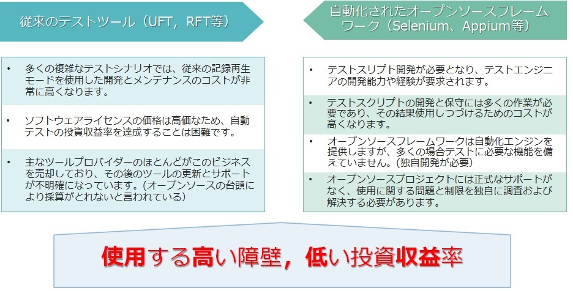
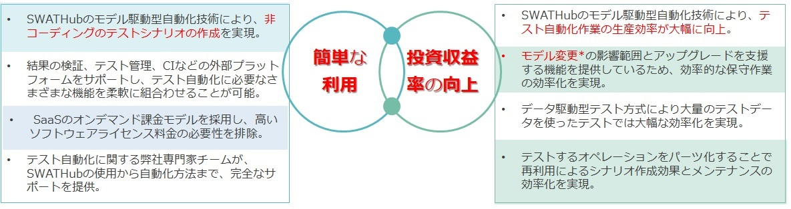
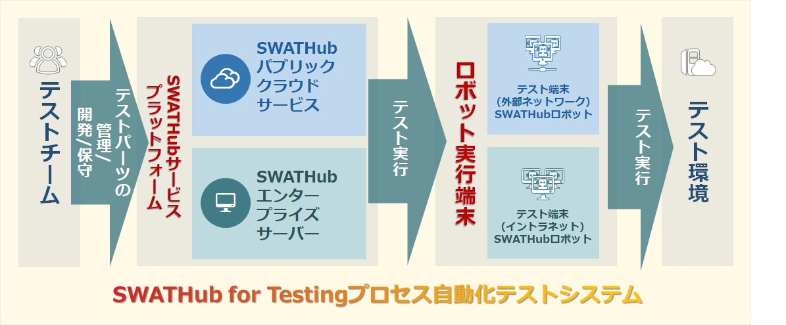

SWATHubテストの自動化
===

SWATHubプラットフォームでのテスト自動化では、ユーザはコードなしでシナリオ作成ができます。実行においては、シナリオを実行するロボットを複数台で構築することで並行実行を可能とし、より大量のシナリオを高速で処理することができます。また大規模な利用において、クラウド版の利用では環境構築を行うことなく、ロケーションの違う開発チーム、テストチームがコラボレーションで作業を行うことが簡単にできます。

従来のテスト自動化の問題点
---

従来の自動テストツールの主な問題点は次のとおりです。
1. 投資対効果を出すのが難しい：テストスクリプト作成に相当な時間を要するため、新規開発、保守開発において手間がかかり手作業と比較しても時間短縮が図られない。
2.利用に対する高い障壁：商用バージョンはより高価ですが、オープンソースバージョンはテストエンジニアに対して技術面でより高い要件があります。
3.自動化ツールの進化が遅い：従来の自動化ツールは新しい技術（例えば、動的なリッチな画面など）へのサポートが不十分であったり、Web系とモバイル系を一緒に利用することができない、といった問題があります。

手動テストと比較すると、従来の自動テストツールでは効果が出ないこともあり、その普及率はとても低い状況。ユーザーは上記の問題のために大変で時間がかかるテスト作業を完全に自動化できません。

SWATHubテスト自動化の利点
---
当社の製品の主な利点
1. 利用コストの削減：SaaSによるサブスクリプションモデルを採用し、月額課金により最小限の投資で始めることができます。
2. 利用に対する難しさを排除：モデル駆動型技術によりテストスクリプトを無くし開発経験が浅い技術者でも利用することができます。
3. SWATHubは常に進化：Web系アプリでは動的なリッチな技術をはじめ、モバイルではネイティブアプリ、ハイブリッドアプリへの対応、その他Windows系アプリやAPIなど、様々なアプリのテスト自動化を実現。

プラットフォーム構成
---

SWATHubテスト自動化プラットフォームは、SWATHubプラットフォームサーバーとPCで実行されるSWATHubロボットの2つの部分に分かれています。

### SWATHubロボット

SWATHubロボットは、ユーザーのPCにインストールされたテスト自動化実行プログラムで、SWATHubプラットフォームサーバーによって設計されたシナリオを実行します。

### SWATHubプラットフォーム

SWATHubプラットフォームでは、シナリオ/フロー/モデルの3層アーキテクチャーで構成されており、対象アプリのオペレーションを自動でモデル化、このモデルを使ってシナリオを構築、そのなかで共通で活用できるシナリオはフローに登録し、シナリオ構築においてこのフローを呼び出して効率的に作成することができます。直感的で分かり易いUIにより、特別なトレーニングなしにすぐ利用することができます。
SWATHubテスト自動化では、パブリッククラウドバージョンとオンプレミスのエンタープライズバージョンの2つの方式で提供しております。

次に、SWATHubテスト自動化について詳しく説明します。

クイックスタート
---

SWATHubの基本利用方法をご理解いただくためにチュートリアル1を用意してます。デモアプリ（仮想のWebアプリ）に対してSWATHubでのWebオペレーション準備、シナリオ作成・実行・検証、Webオペレーションのカスタマイズをこのデモアプリを使って試すことができます。

?> 1. 本チュートリアルのご利用にあたり、お客様のSWATHubエンタープライズ版か、もしくはSWATHubクラウド版のユーザーアカウントが必要です。

### デモアプリについて

本チュートリアルで利用していただきますデモアプリ(ヘルプデスクシステム)を下記URLよりアクセスして下さい。

* [管理者ログイン](http://www.smartekworks.com/tutorial/login1.html)
 * `swat/swat`でログインすると、**問い合わせ検索**に遷移されます。
* [問い合わせ検索](http://www.smartekworks.com/tutorial/search.html?v=1)
 * **検索**ボタンをクリックして、検索結果のリンクから**問い合わせ検索詳細**に遷移されます。
* [問い合わせ検索詳細](http://www.smartekworks.com/tutorial/inquiry.html?no=010103&v=1)
 * **ステータス変更**ボタンをクリックして、該当問い合わせのステータスを変更することができます。

### 事前準備

1. SWATHubサービスへアクセス1し、ログインを行います。
2. **ユーザートップ**画面から、**<i class="fa fa-plus"></i> ワークスペース**ボタンで、`Tutorial`の名前で、チュートリアル用のワークスペースを作成します。
3. モデルライブラリを構築するための[Webキャプチャツール](design_model.md#webモデル取得)をインストールします。
 1. 上記のリンクからWebキャプチャツールをインストールしてください。
 2. Webキャプチャツールをインストールすると、ブラウザの拡張機能バーにSWATのアイコンが出ます。
4. 自分の端末のブラウザを自動実行させるための[SWATHubロボット](robot_setup.md)をインストールします。
 1. 上記のリンクの手順に従って、ロボットをダウンロードします。
 2. `Tutorial`のワークスペースの`server`、`username`、`apiKey`を`config.json`に設定します。
 3. startRobot.bat か startRobot.sh を実行して、ロボットをスタートし、**ワークスペース設定 > ロボット**でロボット接続を確認してください。

<video width="720" controls>
	<source src="ja/assets/video/t01.webm" type="video/webm">
	<source src="ja/assets/video/t01.mp4" type="video/mp4">
	The browser does not support video.</video>

?> 1. SWATHubがサポートしているブラウザ（Chrome、Firefox、Internet Explorer 11、Edge、Safari）でのアクセスをお願いします。

### モデルライブラリ構築

1. [Webキャプチャツール](design_model.md#webモデル取得)がブラウザに正しくインストールされていることを確認します。
2. [デモアプリ](http://www.smartekworks.com/tutorial/login1.html)にアクセスし、画面遷移を進めながら、**Webキャプチャツール**のボタンで**管理者ログイン**、**問い合わせ検索**（一覧が表示された状態）、**問い合わせ検索詳細**（ステータス変更ダイアログが表示された状態）のページソースを一通りキャプチャします。
3. SWATHubの`Tutorial`のワークスペースの**モデルライブラリ**画面から、**<i class="fa fa-plus"></i> モデル**ボタンをクリックして三つのページソースをアップロードします。
 * `CTRL`もしくは`SHIFT`キーを押しながら、複数画面を選択して、一括にアップロードが可能です。
 * 設定のところにデフォルトの`html5 1.0.0`のページテンプレートを利用します。
 * 画面追加の確認をして、解析のジョブに三つの画面の解析のタスクの進捗が確認できます。
4. 解析が全て完了した後に、**モデルライブラリ**画面に戻り、三つの画面エントリーとそれぞれ配下のオペレーションの確認ができます。

<video width="720" controls>
	<source src="ja/assets/video/t02.webm" type="video/webm">
	<source src="ja/assets/video/t02.mp4" type="video/mp4">
	The browser does not support video.</video>

?> ここではモデルライブラリ構築の基本を説明します。モデルライブラリを更に分かり易くするために、[モデルライブラリ構築（上級編）](#モデルライブラリ構築（上級編）)を実施してみてください。

### シナリオ作成

#### シナリオグループの設定
1. **ワークスペース**画面の**<i class="fa fa-plus"></i> シナリオグループ** ボタンをクリックして`チュートリアル`の名前でシナリオグループを追加します。
1. シナリオグループの**シナリオ一覧**画面の**<i class="fa fa-gear"></i>**をクリックして、**設定**メニューを選び、**デフォルトテストサーバー**にデモアプリのURL`http://www.smartekworks.com/tutorial/login1.html`を記入して、保存します。

#### シナリオ作成
2. **シナリオ一覧**画面の**<i class="fa fa-plus"></i> シナリオ**ボタンをクリックして`お問い合わせ検索`の名前でシナリオを追加します。
3. **フロービルダー**画面で、左側の画面コンポーネントから**システムオペレーション**を開き、その配下の**URLへ遷移**システムオペレーションを**フロー**エリアにドラッグ＆ドロップします。**URL**パラメータを空白にします。
4. 左側の画面コンポーネントから**管理者ログイン**を開き、その配下の**ログイン**オペレーションをフローエリアにドラッグ＆ドロップします。パラメータが自動的に変数化されますので、そのままにします。
5. 同じように、**お問い合わせ検索**配下の**検索**オペレーションをドラッグ＆ドロップします。ステップデータの「お問い合わせタイプ」のセレクトに「その他のお問い合わせ」、「お問い合わせ期間」のセレクトに「直近三ヶ月」をセットします。

#### ケース作成
6. シナリオを保存して、シナリオの名前にマウスカーソルを移動させ、＋マーク（ケースを追加）**<i class="fa fa-plus-circle"></i>**をクリックして、ケース作成を行います。
7. 正常系のテストデータをセットします。`OK`の名前で、ケースデータを先ほど変数化した項目にセットします。**管理者ID**に`swat`、パスワードに`swat`、キーワードに`Demo`を記入して、ケースデータを保存します。
7. 次に異常系のテストデータをセットします。ケースデータの右端あるプルダウンメニュー**<i class="fa fa-caret-square-o-down"></i>**をクリックして、**複製**メニューを選び、`OK copy`ケースが作成されます。その名前をクリックして、名前を`NG`に変更し、パスワードのみを空白にします。

<video width="720" controls>
	<source src="ja/assets/video/t03.webm" type="video/webm">
	<source src="ja/assets/video/t03.mp4" type="video/mp4">
	The browser does not support video.</video>

?> ここではシナリオの作成の基本を説明します。少し複雑なシナリオを作成するために、[シナリオ作成_上級編](#シナリオ作成（上級編）)を実施してみてください。

### ケース実行

1. [SWATHubロボット](robot_setup.md)がインストールされ、SWATHubに正しく接続されていることを確認します。
2. **シナリオ一覧**画面のテストケースの前にあるチェックボックスを選択するか、シナリオを選択します。
3. 画面の一番下の**ケース実行**ボタンをクリックし、使用可能なロボットとプラットフォームを選択します。(特別な設定の必要がないChromeを最初の試行にはお勧めします)。
4. ロボットがインストールされているローカルマシンのブラウザが起動し、シナリオが自動的に実行されます。
5. **完了**もしくは**エラー**ステータスが表示されたら、**ジョブ**画面のタスク項目をクリックして、**テスト結果**画面にアクセスできます。
6. **テスト結果**画面からスクリーンショットや実行の他の情報を参照することができます。右上の**完了**ボタンをクリックして、**テスト結果をエクスポート**メニューを選び、画面キャプチャーを貼付けたEXCEL結果書を自動出力します。

<video width="720" controls>
	<source src="ja/assets/video/t04.webm" type="video/webm">
	<source src="ja/assets/video/t04.mp4" type="video/mp4">
	The browser does not support video.</video>

?> 詳細なガイドとビデオについては、[自動実行](robot_execution.md)を参照してください。

### モデルライブラリ構築（上級編）

1. ワークスペースの**モデルライブラリ**画面の左側の**管理者ログイン**を開き、**トップに戻る**を選びます。右側の名前を`Top`にに変えて、「保存」をクリックします。**管理者ログイン**の**トップへ戻る**Webオペレーションのタイトルを**Top**に変更したことを確認します。
2. 上記の操作で**お問い合わせ検索**と**お問い合わせ詳細**にある**トップに戻る**も**Top**に変わったことを確認します。そのようにWebアプリの共通部品の名前変更が簡単にできます。
2. 同じ手順で、**お問い合わせ検索**の**フロー機能について..**を**お問い合わせ一覧**に変更して、**お問い合わせ詳細**の**閉じる**を**ステータス変更ダイアログ**に変更します。
3. **お問い合わせ詳細**を開き、**サンプルメールアドレス**と**×**のチェックボックスにチェックを入れ、上の**<i class="fa fa-gear"></i>**をクリックして、**オペレーションの非表示**メニューを選びます。そのように、不要なオペレーションをシナリオを組み立てる時に隠せます。

<video width="720" controls>
	<source src="ja/assets/video/t05.webm" type="video/webm">
	<source src="ja/assets/video/t05.mp4" type="video/mp4">
	The browser does not support video.</video>

?> 詳細なガイドとビデオについては、[モデル](design_model.md)を参照してください。

### フロー構築

1. ワークスペースの**フロー一覧**画面の**<i class="fa fa-plus"></i> フロー**ボタンをクリックして`ログイン`の名前でフローを追加します。
2. **フロービルダー**画面で、左側の画面コンポーネントから**システムオペレーション**を開き、その配下の**URLへ遷移**システムオペレーションを**フロー**エリアにドラッグアンドドロップします。**URL**パラメータを空白にします。
3. 左側の画面コンポーネントから**管理者ログイン**を開き、その配下の**ログイン**オペレーションをフロー図にドラッグ＆ドロップします。パラメータが自動的に変数化されますので、そのままにします。

<video width="720" controls>
	<source src="ja/assets/video/t06.webm" type="video/webm">
	<source src="ja/assets/video/t06.mp4" type="video/mp4">
	The browser does not support video.</video>

?> 詳細なガイドについては、[フロー](design_flow.md)を参照してください。

### シナリオ作成（上級編）

1. **シナリオ一覧**画面の**<i class="fa fa-plus"></i> シナリオ**ボタンをクリックして`お問い合わせステータス変更`の名前でシナリオを追加します。
2. **フロービルダー**画面で、左側の画面コンポーネントから**フロー**を開き、その配下の**ログイン**を**フロー**エリアにドラッグ＆ドロップします。フローのパラメータの**管理者ID**と**パスワード**に`swat`を入れます。
3. **お問い合わせ検索**配下の**検索**オペレーションをドラッグ＆ドロップします。ステップデータの**キーワード**に`Demo`を記入し、**お問い合わせタイプ**のセレクトの右側にある**<i class="fa fa-exchange"></i>**ボタンを二回クリック（インデックスクエリー）し、`2`をセットします。インデクスモードで２番目のオプションを選ぶことを示します。**お問い合わせ期間**のセレクトの後ろにある**<i class="fa fa-exchange"></i>**ボタンを一回クリック（テキストクエリー）し、`一年`をセットします。マッチ用文字列モードで「一年」が入った最初のオプションを選ぶことを示します。
4. **お問い合わせ検索**配下の**お問い合わせ一覧**オペレーションをドラッグ＆ドロップします。ステップデータの**buttonGroup**をテキストクエリーにして、`@{お問い合わせキーワード}`の変数を記入します。
5. **お問い合わせ詳細**配下の**ステータス変更..**オペレーションをドラッグ＆ドロップします。
6. **お問い合わせ詳細**配下の**ステータス変更ダイアログ**オペレーションをドラッグ＆ドロップします。ステップデータの**radio**のセレクトに`対応済み`を選び、**buttonGroup**のセレクトに`保存`を選びます。該当お問い合わせのステータスを「対応済み」に変更します。
7. シナリオを保存して、シナリオの名前にマウスカーソルを移動させ、＋マーク（ケースを追加）**<i class="fa fa-plus-circle"></i>**をクリックして、`フロー機能について`の名前で、ケースデータを追加します。**管理者ID**に`フロー機能について`を記入して、ケースデータを保存します。（一度実行してみてください。）

<video width="720" controls>
	<source src="ja/assets/video/t07.webm" type="video/webm">
	<source src="ja/assets/video/t07.mp4" type="video/mp4">
	The browser does not support video.</video>

?> 詳細なガイドとビデオについては、[シナリオ](design_scenario.md)を参照してください。
