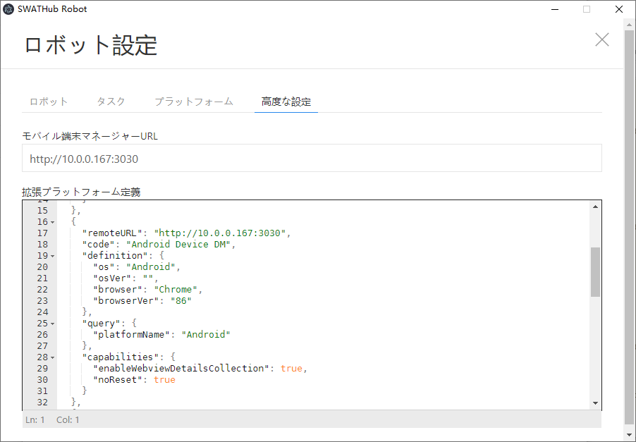
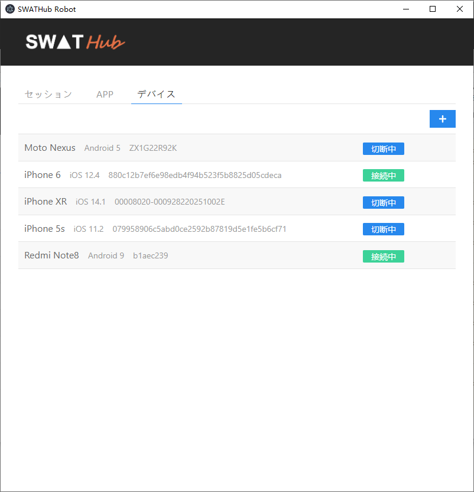
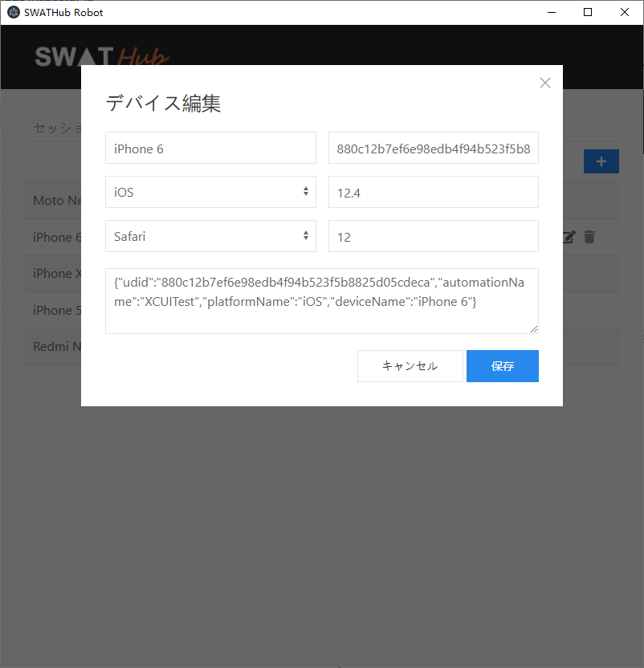
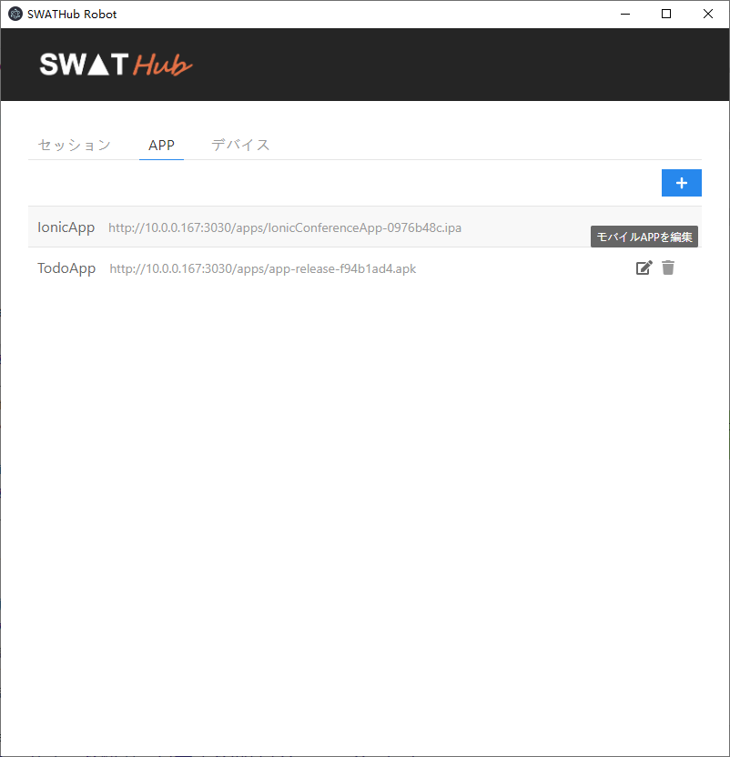
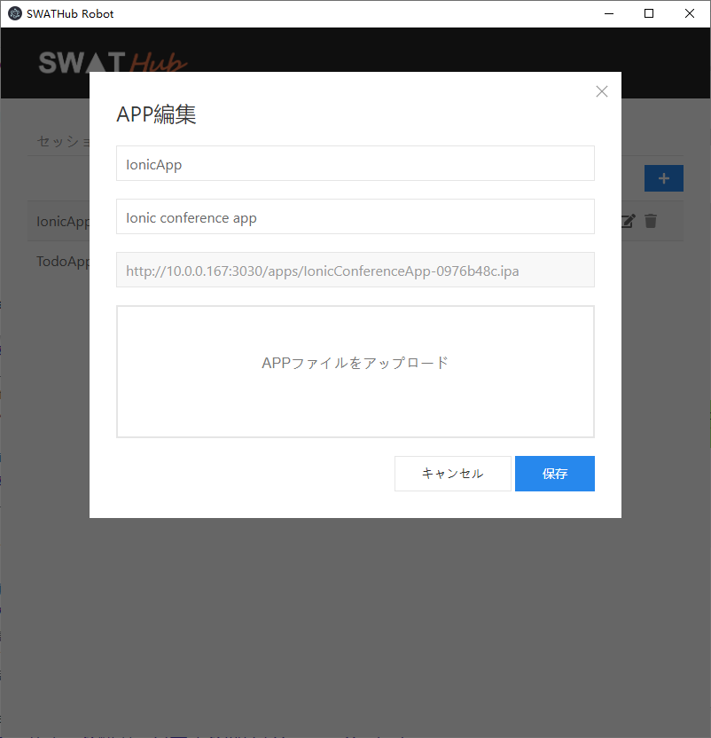
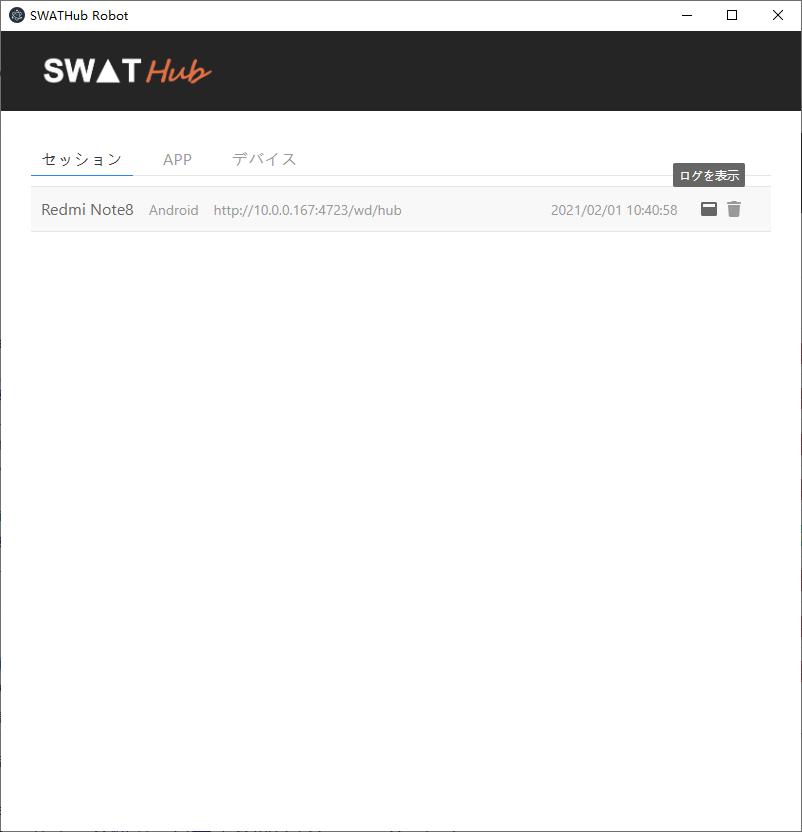
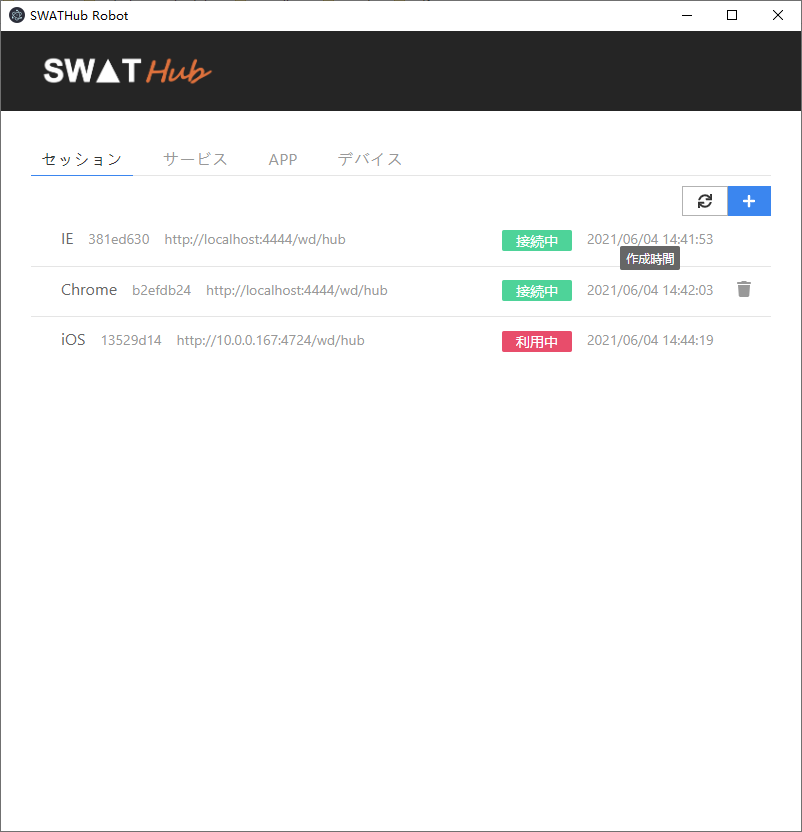
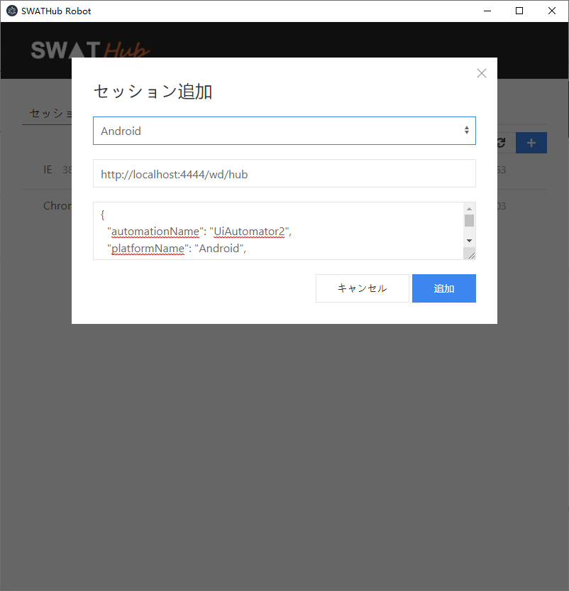

モバイル端末管理
===

SWATHubロボットからUSBケーブルが接続した一台もしくは複数台のモバイル端末を直接自動化することができますが、ロボットの端末ごとに複雑な環境要件を満たす必要がありますし、面倒な設定も必要なので、かなり不便になります。

その問題を解決するために、SWATHubはモバイルAPPの自動化を行う顧客にモバイル端末を一元管理するモバイル端末マネージャーのソフトを提供します。一台のモバイル端末マネージャーとそれに接続するiOSとAndroid端末さえあれば、ロボット側に拡張プラットフォーム経由でリモートで一台もしくは複数台のモバイル端末を駆動することはできます。

インストール
---

### 動作環境

| 項目     | 必要条件
| ------- | -----------
| CPU     | 2.2 GHz (Single Core) 以上
| メモリ  | 8GB (最小) 16GB (推奨)
| OS      | Windows 7 以上、Mac OS X 10.6 以上<sup>1</sup>
| ソフト| [Node.js](https://nodejs.org/) 14 以上
| USB | 産業用USB Hubを推奨、外部電源でポート毎に給電、サージ保護機能
| モバイル端末 | Android 5以上、iOS 9.3以上


?> 1. Windowsの場合に、Androidのみ対応されます。Mac OS Xの場合に、AndroidとiOS両方は対応されます。

### 手順

1. SWATHubモバイル端末マネージャーのインストールパッケージ、例えば`robot-manager-v1.0.0.zip`をダウンロードします。
1. インストールパッケージをインストールフォルダーに解凍します。
1. 所在端末のネットワークに合わせて、`config/default.json`の`host`和`port`と指定し、SWATHubロボットからアクセスするサービスのホストとポートを定義します。
1. コマンドラインでインストールフォルダーに入って、`npm start`コマンドでサービスを起動します。

サービスを起動後に、モバイル端末からの接続が必要で、OS毎に説明します。

### Windows設定

#### 環境設定

[モバイル環境設定](robot_mobile_setup.md#Androidプラットフォーム)を参考して、Android用のソフトをインストールします。

* [Android Studio](https://developer.android.com/studio)<sup>1</sup>
* [JDK8](https://www.oracle.com/java/technologies/javase/javase-jdk8-downloads.html)<sup>2</sup>
* [Chromedriver](http://chromedriver.chromium.org/downloads)<sup>3</sup>

?> 1. 環境変数の`ANDROID_HOME`をSDK Toolsのフォルダーに設定する必要があります。

?> 2. 環境変数の`JAVA_HOME`をJDKのフォルダーに設定する必要があります。

?> 3. スマートフォンのWebViewバージョンまたはChromeバージョンに応じて、対応するバージョンをダウンロードする必要があります。複数Androidバージョンの端末を接続する場合に、インストールフォルダーの配下にバージョン毎にフォルダーを作成し（例えば`chromedrivers/86`、`chromedrivers/87`）、ドライバーをそこにコピーしてください。

#### 端末接続

1. Android端末を直接もしくはUSB Hub経由でモバイル端末マネージャーに接続し、開発者オプションを設定した上で、下記のコマンドで、接続に問題がないかを確認します。
```batch
adb devices
```
1. モバイル端末マネージャーのコマンドライン出力に接続した端末のUDIDが確認できます。

#### 環境設定

#### 環境設定

Windowsと同様にAndroid環境を構築し、[モバイル環境設定](robot_mobile_setup.md#iOSプラットフォーム)を参考して、iOS用のソフトをインストールします。

* xCode最新版
* [Homebrew](https://brew.sh/)
```batch
/usr/bin/ruby -e "$(curl -fsSL https://raw.githubusercontent.com/Homebrew/install/master/install)"
```
* [ios-webkit-debug-proxy最新版](https://github.com/google/ios-webkit-debug-proxy)
```batch
brew install --HEAD usbmuxd
brew install --HEAD libimobiledevice
brew install --HEAD ios-webkit-debug-proxy
brew install carthage
```

#### 端末接続

1. iOS端末を直接もしくはUSB Hub経由でモバイル端末マネージャーに接続し、開発者オプションを設定した上で、XCodeを開き、`Window - Devices and Simulators`から端末のUDIDが確認できます。
1. Appiumの[Full manual configuration](http://appium.io/docs/en/drivers/ios-xcuitest-real-devices/)を参考し、IWDPをコンパイルして、設定に問題がないと確認します。WebDriverAgentのインストールパスを下記のモバイル端末マネージャーの配下にする必要があります。
```batch
cd path/to/install/DeviceManager/node_modules/appium/node_modules/appium-webdriveragent
```
1. モバイル端末マネージャーのコマンドライン出力に接続した端末のUDIDが確認できます。

サービス管理
---

### 事前設定

SWATHubロボットの「モバイル端末管理」のUIから「モバイル端末マネージャー」の機能をアクセスすることができます。

利用する前に、モバイル端末マネージャーのURLを設定する必要があります。ロボットの**設定**ダイアログの**高度な設定**タブにモバイル端末マネージャーのURLを記入してください。



正しく設定したら、ロボットの**ツール - モバイル端末管理**メニューを選べば、「モバイル端末管理」のUIに入ります。そこで、
「セッション」、「APP」、「デバイス」三つの機能があります。



### デバイス管理

「デバイス」タブの配下にモバイル端末マネージャーに接続した全ての端末及びそれぞれの状態が管理できます。<i class = "fa fa-plus"></i>をクリックして、新しいデバイスを追加したり、既存のデバイスを編集と削除が可能です。デバイスには下記の属性があります。

* `デバイス名`：デバイスの名前、通常メーカー名＋モデル名を利用します。
* `UDID`：デバイスの唯一の識別ID。
* `プラットフォーム`：`Android`か`iOS`を選択してください。
* `プラットフォームバージョン`：プラットフォームのバージョン。
* `ブラウザ`：プラットフォームのブラウザ、`Chrome`か`Safari`を選択してください。
* `ブラウザーバージョン`：ブラウザのバージョン。
* `モバイルデバイス機能属性`：デバイスを駆動する際に設定できるAppiumのCapabilities。下記は必須の属性例です。
```json
{
  "udid": "880c12b7ef6e98edb4f94b523f5b8825d05cdeca",
  "automationName": "XCUITest",
  "platformName": "iOS",
  "deviceName": "iPhone 6"
}
```



### APP管理

「APP」タブの配下に自動化するためのモバイルAPPが管理できます。<i class = "fa fa-plus"></i>をクリックして、新しいAPPを追加したり、既存のAPPを編集と削除が可能です。



APPファイルをアップロードした後に、システムは自動的にURLを生成します。それを「APPを起動」システムオペレーションの引数で利用できます。



### サービス管理

「サービス」タブの配下に自動化するためのモバイルサービスが管理できます。モバイル端末マネージャーの上に自動化実行中のサービスが自動的に表示されます。それぞれのサービスが関連しているデバイスや、ログなども表示されます。



### セッション管理

「セッション」タブの配下に現在終了されていないモバイルAPPのセッションはリストされます。セッションごとに、関連するプラットフォームや、セッションID、AppiumサービスのURL、セッション状態が表示されます。また、手動でセッションを終了させることも可能です。



<i class = "fa fa-sync"></i> をクリックして、セッション一覧の状態をリロードすることができます。また、<i class = "fa fa-plus"></i> をクリックすると新しいセッションを追加することも可能です。



サービス利用
---

モバイル端末マネージャーの端末やAPPを利用するために、ロボットの**設定**ダイアログの**高度な設定**タブの[拡張プラットフォーム定義](robot_mobile_setup#拡張プラットフォーム定義)にモバイル端末マネージャーを定義する必要があります。定義する際に下記の二つの属性を下記のように記入する必要があります。

* `remoteURL`: モバイル端末マネージャーのURL
* `query`：該当プラットフォームのデバイスの選択条件
  * `deviceName`：デバイスの名前、通常メーカー名＋モデル名を利用します。
  * `udid`：デバイスの唯一の識別ID。
  * `platformName`：`Android`か`iOS`を記入。
  * `platformVersion`：プラットフォームのバージョン。
  * `browserName`：プラットフォームのブラウザ、`Chrome`か`Safari`を記入。
  * `browserVersion`：ブラウザのバージョン。

下記は任意のAndroid端末を使う例です。
```json
{
  "remoteURL": "http://10.0.0.167:3030",
  "code": "Ad-hoc Android Device",
  "definition": {
    "os": "Android",
    "osVer": "",
    "browser": "Chrome",
    "browserVer": ""
  },
  "query": {
    "platformName": "Android"
  },
  "capabilities": {
    "enableWebviewDetailsCollection": true,
    "noReset": true
  }
}
```
