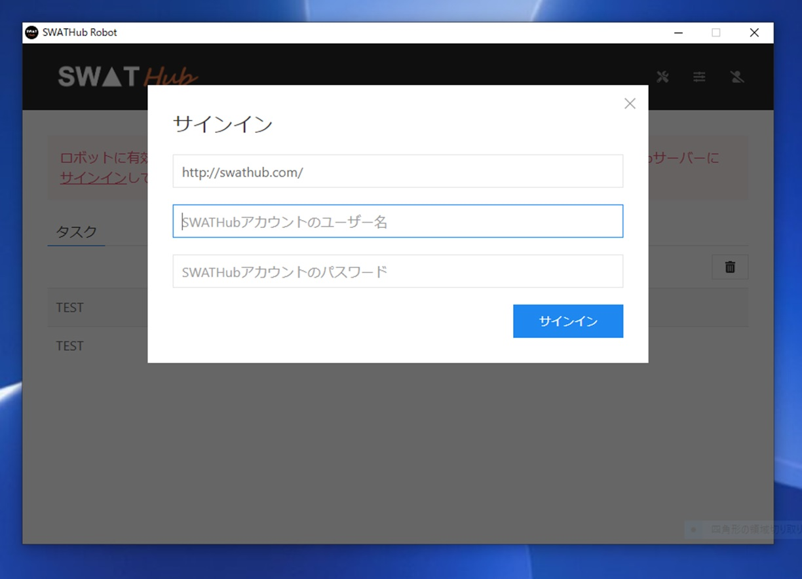
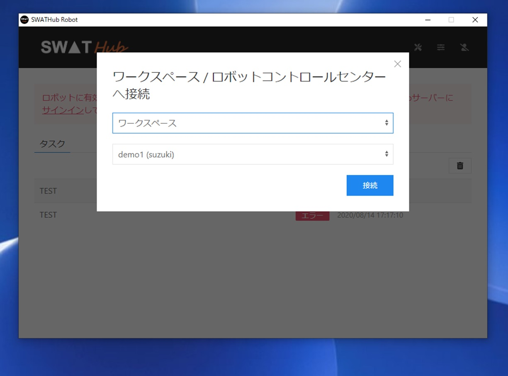
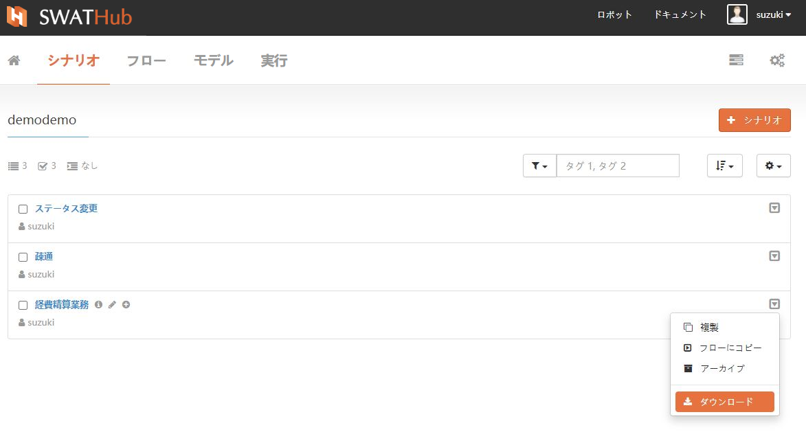
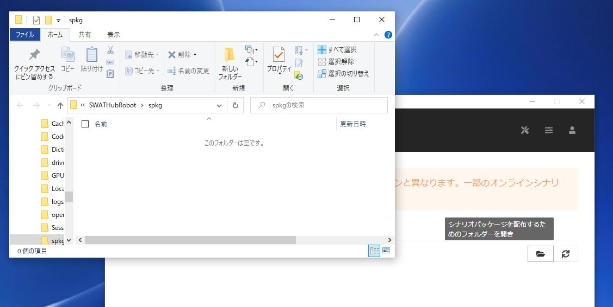
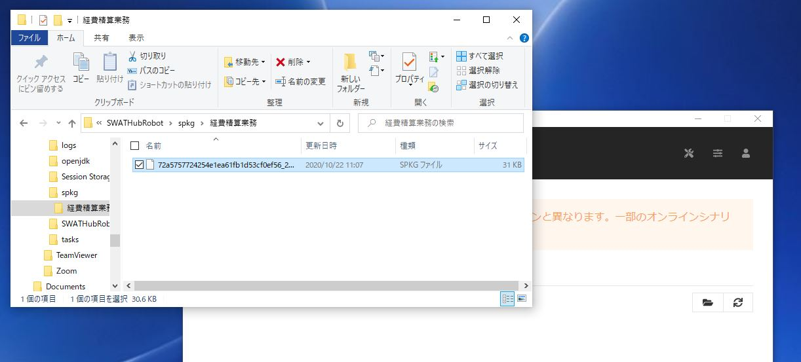
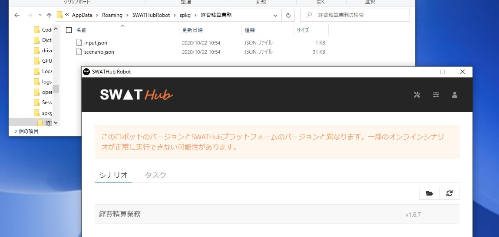
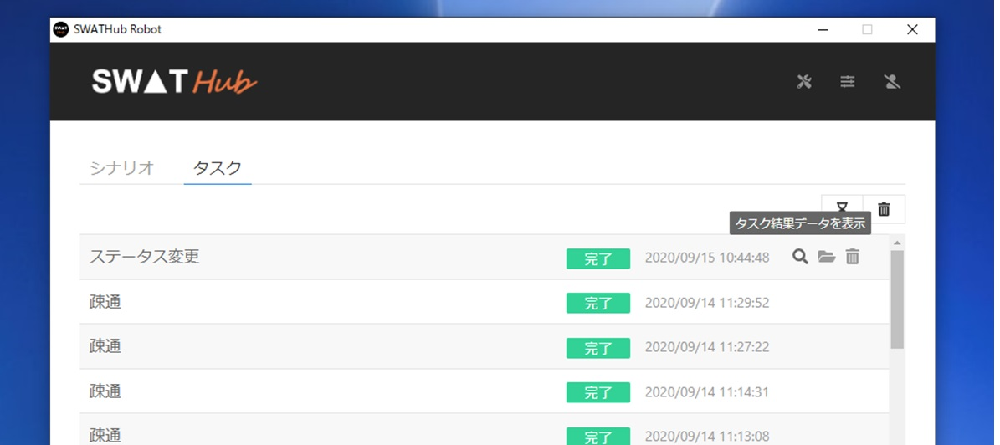
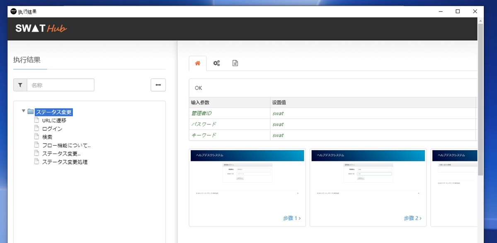

自動実行
===

SWATHubロボットは下記の三つの実行モードがあります。

* オフライン端末モード
* オンライン設計モード
* オンライン管理モード

オンライン設計モード
---

SWATHubロボットがSWATHub設計プラットフォームに接続されている場合、設計プラットフォームを通じて自動化プロセスを直接呼び出して実行できます。この場合に、SWATHubロボットは追加のロボットサブスクリプションなしで設計プラットフォームユーザーのサブスクリプションを共有します。この実行モードは、自動化プロセスを開発するときのプロセスのデバッグ、または自動テストに適しています。


### ワークスペースとの接続

SWATHubロボットは次の手順でSWATHub設計プラットフォーム<sup>1</sup>にログインし、特定のワークスペースに接続します。

1. SWATHubロボットの**オフライン>ログイン**メニューをクリックして、**ログイン**ダイアログボックスを開きます。
2. `https：//swathub.com`や`http：//10.0.0.2：8080`など、ログインが必要な設計プラットフォームのルートURLを入力します。
3. 設計プラットフォームに設計アカウント<sup>1</sup>のユーザー名とパスワードを入力し、**ログイン**ボタンをクリックしてサーバーにログインします。



4. ログインに成功すると、**ワークスペース / ロボットコントロールセンターへ接続**ダイアログボックスが自動的にポップアップします。
5. ワークスペース 、ロボットコントロールセンターのどちらかを選択、ワークスペース選択時はどのワークスペースかを選び**接続**ボタンをクリックして接続します。



6. SWATHubロボットが正常に接続されると、接続先のワークスペースの**設定>ロボット**にロボットの状態が表示されます。

?> 1. SWATHubロボットがSWATHub設計プラットフォームにログインするには該当ユーザーのアカウントに余るオンラインロボットの利用数が必要です。

### シナリオの実行

オンライン設計モードでは、接続されたSWATHubロボットを呼び出して、SWATHubプラットフォームの指定したシナリオケースを実行できます。

オフライン端末モード
---

SWATHubロボットがSWATHubプラットフォームに接続されていない場合、ローカルにデプロイされたシナリオを実行できます。現時点で、SWATHubロボットは**オフライン端末ロボットサブスクリプション**を正常にアクティブ化する必要があります。この実行モードは、小規模の自動化に適しています。

### シナリオパッケージのデポロイ

SWATHubロボットに有効な**オフライン端末ロボットサブスクリプション**がある場合、ユーザーはロボットにデプロイされたシナリオパッケージをオフラインで実行できます。 以下にその手順を説明します。

1. SWATHubのシナリオグループから必要なシナリオを指定し、パッケージファイル（`.spkg`）としてダウンロードしてします。



2. SWATHubロボットの**シナリオ**タブにある**タスク格納フォルダーを開く**ボタンをクリックして、シナリオファイルを開きます。



3. spkgフォルダーに新たなフォルダーを作成し(例えば、「経費精算業務」)、そのフォルダー配下にダウンロードしたシナリオファイル(`.spkg`)を格納します。



4. SWATHubロボットの**シナリオ**タブにある**更新**ボタンをクリックします。
5. 新たに作成したフォルダー名（「経費精算業務」）がSWATHubロボットの**シナリオ**タブの下のシナリオパッケージリストに表示され、実行ボタンをクリックしてシナリオを実行できます。
6. シナリオパッケージデータファイル `input.json`はシナリオパッケージディレクトリに自動的に生成され、<sup>1</sup>のデータは必要に応じて変更できます。



?> 1. `input.json`ファイルに中国語、日本語、韓国語などのUnicode文字が含まれている場合、Unicodeをサポートするテキストエディターを使用することをお勧めします。Windows付属のメモ帳でjson形式のエラーが発生する場合があります。

### シナリオパッケージの実行

SWATHubロボットの有効な**オフライン端末ロボットサブスクリプション**がある場合、デプロイされたすべてのローカルシナリオパッケージがSWATHubロボットの**シナリオ**タブに表示されます。シナリオパッケージを指定し実行ボタンをクリックして、手動でシナリオを開始します。 特定のシナリオパッケージの自動開始（スケジュールされた開始など）にツールまたはシステムを使用する必要がある場合は、提供されているコマンドラインツールが使用できます。

たとえば、ロボットは「Sample Task」という名前のローカルシナリオパッケージをデプロイし、<i class="fa fa-play-circle"></i>をクリックしてシナリオを実行します。

### シナリオパッケージのデータ編集

シナリオパッケージパッケージのフォルダーは以下の`input.json`を編集することで、シナリオの入力データ、ステップオプション、環境情報の定義が可能です。

`input.json`の例です。
```json
{
  "data": {
    "Firstname": "Alice",
    "Lastname": "Bob"
  },
  "stepOptions": {
    "operationInterval": 1000
  },
  "environment": {
    "apiURL": "http://api.com",
    "baseURL": "http://mysite.com",
    "browserCode": "IE",
  }
}
```

データファイルは下記の構成のJSONマップです。

* `data`：タスクの入力データ（JSONマップ）です。
* `stepOptions`：タスクのステップオプション。シナリオグループに定義したデフォルトステップオプションの優先度より高いです。ステップ毎のステップオプションより低いです。
* `environment`：タスクの環境情報の定義です。下記の属性があります。
  * `apiURL`：APIオペレーションで使うベースURL。
  * `baseURL`：ブラウザオペレーションで使うベースURL。
  * `browserCode`：タスクで利用するブラウザ。`IE`、`Chrome`、`Firefox`、`Edge`、`Edge Legacy`、`Safari`のどっちかを利用します。

### ローカルシナリオパッケージのアップグレード

SWATHubプラットフォームでシナリオを変更した場合、その変更を反映させるには、ローカルシナリオパッケージをアップグレードする必要があります。 ローカルシナリオパッケージをアップグレードするには、以下その手順を説明します。

1. SWATHubプラットフォームから、変更したシナリオパッケージファイル（`.spkg`）をダウンロードします。
2. SWATHubロボットの**シナリオ**タブにある**タスク格納フォルダーを開く**ボタンをクリックして、シナリオファイルを開きます。
3. 対応するシナリオパッケージディレクトリ（`.spkg`）を見つけ、新しいシナリオパッケージをこのディレクトリに移動します。
4. SWATHubロボットの**シナリオ**タブにある**更新**ボタンをクリックすると、シナリオパッケージが自動的にアップグレードされます。
5. シナリオパッケージディレクトリのシナリオパッケージデータファイル `input.json`は自動的にアップグレードされ、このファイルのデータは必要に応じて変更できます。

### ローカルシーンパッケージのアンインストール

ローカルシナリオパッケージが不要な場合は、シナリオパッケージディレクトリを削除し、SWATHubロボットの**シナリオ**ラベルの下にある**更新**ボタンをクリックします。

オンライン管理モード
---

SWATHub管理プラットフォームに接続されているSWATHubロボットは、管理プラットフォームからSWATHubロボットを呼び出し実行します。この場合に、SWATHubロボットは追加のロボットサブスクリプションなしで管理プラットフォームのサブスクリプションを共有します。この実行モードは、大規模の自動化に適しています。

### コントールセンターとの接続

SWATHubロボットは次の手順でSWATHub管理プラットフォーム<sup>1</sup>にログインし、特定のコントロールセンターに接続します。

1. SWATHubロボットの**オフライン>サインイン**メニューをクリックして、**サインイン**ダイアログボックスを開きます。
1. ログインするSWATHubプラットフォームのルートURL（`https://swathub.com` や `http://10.0.0.2:8080` など） を入力します。
1. SWATHubプラットフォームにユーザー名とパスワードを入力し、**サインイン**ボタンをクリックしてサーバーにログインします。
1. ログインに成功すると、ワークスペース / ロボットコントロールセンターへ接続するダイアログボックスが自動的にポップアップします。
1. [コントロールセンター]と接続するコントロールセンターの名前を選択し、**接続**ボタンをクリックしてコントロールセンターに接続します。
1. SWATHubロボットが正常に接続されると、ロボットの状態がSWATHubプラットフォームの**設定>ロボット**ページに表示されます。

?> 1. SWATHubロボットがSWATHubプラットフォームにサインインするために使用するユーザーアカウントには、オンライン管理できるロボットの割当てが必要です。

### シナリオの実行

オンライン管理モードでは、SWATHubコントロールセンターのジョブ定義によって、自動的にSWATHubロボットを呼び出し、特定なタスクを実行することになります。

タスクリスト
---

オンラインのシナリオもしくは、ローカルシナリオパッケージを実行するとき、それを**実行タスク**と呼びます。現在のタスク実行の進捗状況、ステータス、結果を**タスクリスト**で確認できます。タスクの実行が終了すると、タスク実行エントリーは次の操作を実行できます。

* タスクの実行結果を閲覧します。
* タスクが配置されているディレクトリを開きます。
* このタスクを削除します。



右上隅にある<i class="fa fa-trash"></i>ボタンの機能は、タスクリストをクリアにします。

実行結果ビューア
---

タスクタスクリストのタスク実行エントリーで、<i class="fa fa-search"></i>操作結果ビューアーをクリックして、タスク実行結果を参照できます。タスクの実行中のステップと実行結果のスクリーンショットについて詳細情報を表示します。実行結果の機能については、[実行結果](design_result.md)を参照してください。


