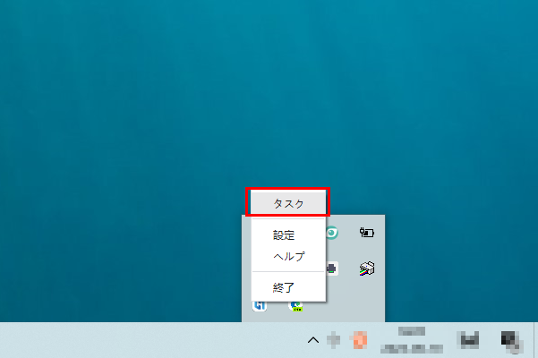
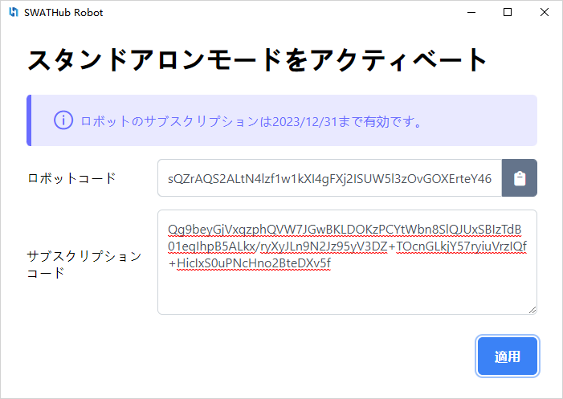
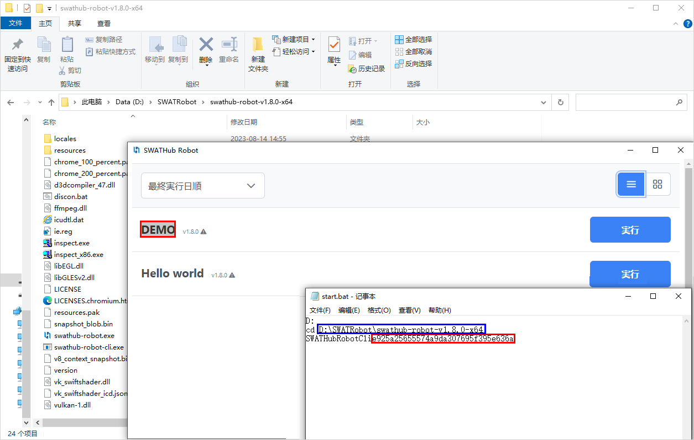

自動実行
===

SWATHubロボットには、3つの異なる実行モードがあります。 `swathub-robot.exe`をダブルクリックしてSWATHubロボットを起動し、ステータスバーでアイコンを選択して右クリックし、ポップアップメニューから**設定**オプションを選択して、ロボットの実行モードを選択します。

* 開発モード
* スタンドアロンモード
* グリッドモード

開発モードでの実行
---
上図のようなロボット設定画面で**開発モード**を選択すると、SWATHubロボットは**開発モード**に入ります。 SWATHubロボットは、**開発モード**で実行されるため、追加のロボットサブスクリプションは必要ありません。

### フローの実行

**開発モード**では、SWATHub-Desktop**デスクトップフローエディタ**で自動化フローを開発したり、自動化テストを実行したりするために使用されます。ユーザーは、ツールバーの<i class = "fa fa-play"></i>ボタンをクリックして、現在設計されているフローを実行できます。表示される実行ダイアログボックスで、対応する入力パラメータ、実行プラットフォーム、および必要に応じて必要なステップオプションを設定した後、**実行**ボタンをクリックすると、自動化タスクがSWATHubロボットクライアントに自動的に送信されます。

SWATHubロボットは、デフォルトでバックグラウンドで実行されます。タスクリスト、ログなどの情報を表示するには、ステータスバーでアイコンを選択して右クリックし、ポップアップメニューから**タスク**を選択し、SWATHubロボットクライアント画面で確認できます。

スタンドアロンモードでの実行
---

SWATHubロボットが**デスクトップフローエディタ**、**SWATHubデザインプラットフォーム**、**ロボットコントロールセンター**に接続していない場合、**スタンドアロンモード**で実行できます。この場合、SWATHubロボットは**オフライン端末ロボットサブスクリプション**を正常にアクティブ化する必要があります。

現在のサブスクリプションが期限切れの場合は、SWATHubロボットメニューのシステムステータスバーで**サブスクリプション**オプションを右クリックし、新しい認証サブスクリプションコードを入力する入力ボックスに入力し、**適用**をクリックして新しいサブスクリプション有効期間をアクティブ化できます。

サブスクリプションをアクティブ化した後、SWATHubロボットクライアントがある端末にローカルフローをデプロイします。この実行モードは、実際の使用における小規模なビジネスシナリオの自動化に適しています。

### ローカルシナリオパッケージのデプロイ

SWATHubロボットに有効なサブスクリプション期間がある場合、ユーザーはロボットのインターフェースを使用して、そのロボットにデプロイされたシナリオパッケージを実行できます。ローカルシナリオパッケージをデプロイするには、次の手順を実行する必要があります。

1. システムステータスバーでSWATHubロボットメニューの右クリックメニューから**シナリオ管理**オプションを選択し、必要なシナリオパッケージファイル（拡張子`.spkg`）を追加します。

2. アップロードに成功したシナリオは、シナリオ管理画面の左側のリストに表示され、シナリオ名をクリックすると、右側の**一般**および**高度**タブでそのシナリオの設定を変更できます。その後、変更を保存して有効にします。

3. シナリオ管理画面の右側のリスト下部のボタンは、**シナリオの削除**（シナリオパッケージのアンインストール）、**シナリオの追加**、および**シナリオの更新**（シナリオパッケージのアップグレード）機能操作に対応しています。

### ローカルシナリオパッケージの実行

SWATHubロボットに有効な**オフライン端末ロボットサブスクリプション**がある場合、システムステータスバーでSWATHubロボットのアイコンを右クリックし、ポップアップメニューから**シナリオの実行**オプションを選択すると、シナリオの実行画面に移動し、デプロイされたシナリオタスクは、リスト形式またはモジュール形式で表示できます。順序を選択できます**シナリオ名で並べ替える**および**実行時間で並べ替える**。手動でシナリオエントリの**実行**ボタンをクリックすると、対応するシナリオパッケージタスクが実行されます。

SWATHubロボットの**シナリオ**タブのシナリオパッケージリストには、そのシナリオパッケージの名前とバージョンが表示されます。特定のシナリオパッケージをツールまたはシステムを使用して自動的に起動する必要がある場合（定期的に起動する場合など）、提供されるコマンドラインツールを使用できます。

### 無人実行
---

タスクを自動実行するには、Windowsタスクスケジューラに`start.bat`ファイルを追加して、Windowsタスクスケジューラに追加する必要があります。

`start.bat`ファイルの作成方法は次のとおりです。

*メモ帳を開き、下図の青い枠内にクライアントのインストールパスを入力し、赤い枠内にシナリオタスク名を入力します。

* Windowsタスクスケジューラで起動時間を設定します。

* Windowsオペレーティングシステムのタスクスケジュール設定項目を変更します。

    ①このタスクを実行するためにコンピューターを起動するように設定します。
    
    ②ユーザーがログインしているかどうかにかかわらず実行する必要があります。

グリッドモードの実行
---

SWATHubロボットが**SWATHubデザインプラットフォーム**または**SWATHub管理プラットフォーム**に接続されている場合、**設定**画面から**グリッドモード**を選択して実行できます。この場合、SWATHubロボットは**デザインプラットフォーム**または**管理プラットフォーム**の制御ロボットサブスクリプションを占有し、追加のロボットサブスクリプションは必要ありません。
### デザインプラットフォームに接続する

以下の手順で、SWATHubロボットがSWATHubデザインプラットフォーム1にログインし、特定のフロー設計プロジェクトに接続できます。

1. SWATHubロボットのアイコンをシステムステータスバーで右クリックし、ポップアップメニューから**接続**メニューを選択して**SWATHubに接続**ダイアログを開きます。

2. ログインするデザインプラットフォームのルートURL、例えば`https://swathub.com`または`http://10.0.0.2:8080`を入力します。
3. デザインプラットフォームのデザインアカウント1のユーザー名とパスワードを入力し、**ログイン**ボタンをクリックしてサーバーにログインします。

4. ログインに成功すると、自動的に**SWATHubに接続**ダイアログが表示されます。

5. `ターゲットプロジェクト`と接続するプロジェクト名を選択し、**接続**ボタンをクリックしてプロジェクトに接続します。

6. SWATHubロボットが接続すると、SWATHubデザインプラットフォームに接続されたシーンプロジェクトの**設定 > ロボット**ページにそのロボットのエントリが表示されます。

?> 1. SWATHubロボットがSWATHubデザインプラットフォームにログインする際に使用するユーザーアカウントは、1つの端末でのみ使用できます。

### 管理プラットフォームに接続する

以下の手順で、SWATHubロボットがSWATHub管理プラットフォーム1にログインし、特定のコントロールセンターに接続できます。管理プラットフォームを介して自動化フローを実行することができます。この実行モードは、大規模なロボット管理クラスターに適しています。

1. SWATHubロボットのアイコンをシステムステータスバーで右クリックし、ポップアップメニューから**接続**メニューを選択して**SWATHubに接続**ダイアログを開きます。

2. ログイン画面の左下にある**設定**ボタンをクリックして、現在のSWATHubロボットノードの関連パラメータを設定します。

* **ロボット名**: SWATHubデザインプラットフォームに接続するときに、このロボットに対応する名前。入力されていない場合、現在のIPが名前として使用されます。
* **プロキシサーバー**: HTTPプロキシサーバーを介してSWATHubデザインプラットフォームに接続する場合のサーバーアドレス。
* **プロキシポート**: HTTPプロキシサーバーを介してSWATHubデザインプラットフォームに接続する場合のサーバーポート。
* **プロキシユーザー名**: HTTPプロキシサーバーを介してSWATHubデザインプラットフォームに接続する場合のユーザー名。
* **プロキシパスワード**: HTTPプロキシサーバーを介してSWATHubデザインプラットフォームに接続する場合のパスワード。

3. 管理プラットフォームのルートURL、例えば`https://swathub.com`または`http://10.0.0.2:8080`、およびSWATHubコントロールセンターの管理アカウント1のユーザー名とパスワードを入力し、**ログイン**ボタンをクリックしてサーバーにログインします。

4. ログインに成功すると、自動的に**SWATHubに接続**ダイアログが表示されます。

5. `ターゲットプロジェクト`と接続する管理プラットフォーム名を選択し、**接続**ボタンをクリックしてコントロールセンターに接続します。接続に成功すると、システムからメッセージが送信されます。

6. SWATHubロボットが接続すると、SWATHubコントロールセンターの**設定 > ロボット**ページにそのロボットのエントリが表示されます。

?> 1. SWATHubロボットがSWATHub管理プラットフォームにログインする際に使用するユーザーアカウントには、オンライン制御ロボットの余剰枠が必要です。

### フローを実行する

オンライン制御モードでは、SWATHubサービスプラットフォームのコントロールセンターのワーク定義を使用して、SWATHubロボットを自動的に呼び出してタスクを実行できます。

タスクリスト
---

1. SWATHubロボットが**開発モード**、**単一モード**、**ノードモード**で実行されている場合、システムステータスバーのSWATHubロボットメニューの**タスク**オプションを右クリックして、ローカルロボットの**タスクリスト**を開くことができます。ここでは、ローカルロボットが実行したすべてのシーンパッケージのタスクの完了状況を詳しく確認できます。

2. オンラインシーンまたはローカルシーンパッケージを実行する場合、これを**タスクを実行**と呼びます。現在のタスクの進行状況、ステータス、および結果を**タスクリスト**で詳しく確認できます。タスクが完了すると、進行状況バーは**灰色**になり、完了したタスクは**赤色**の進行状況バーになります。タスク実行エントリの右側にある**操作**バーのボタンをクリックすると、以下の操作を実行できます。

* タスクがあるディレクトリを開く；
* タスクの実行結果を閲覧する；
* 今回のタスクを削除する。

3. 画面右上のブラシボタンをクリックすると、すべての完了したタスクを一括で**削除**できます。

実行結果ビューア
---

タスクリストのタスク実行エントリの**操作**ボタンのポップアップメニューで、<i class = "fa fa-search"></i> **結果を表示**実行結果ビューアをクリックして、タスクの実行結果を閲覧できます。タスクの実行中に撮影されたステップスクリーンショット、実行結果などの情報を詳しく確認できます。関連するタスクの実行結果については、[実行結果](design_result.md)を参照してください。

