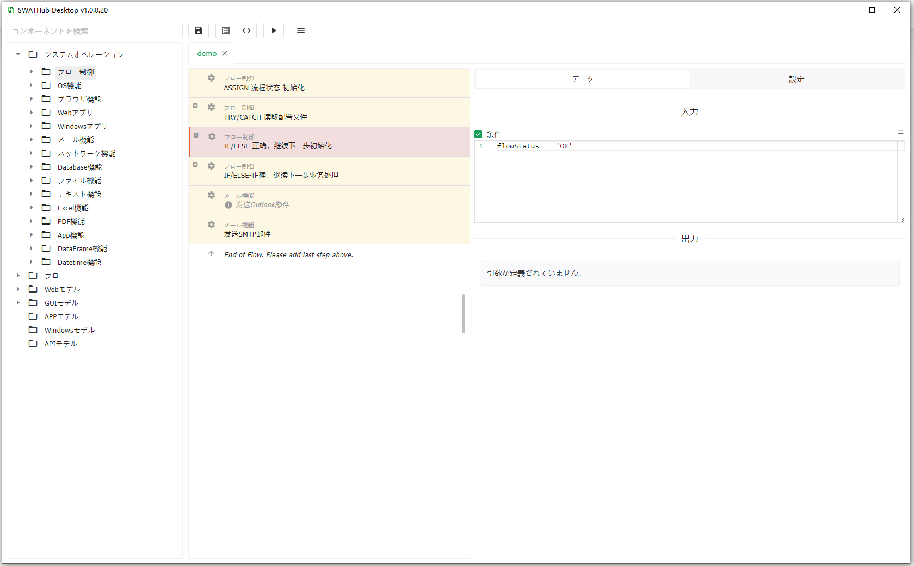
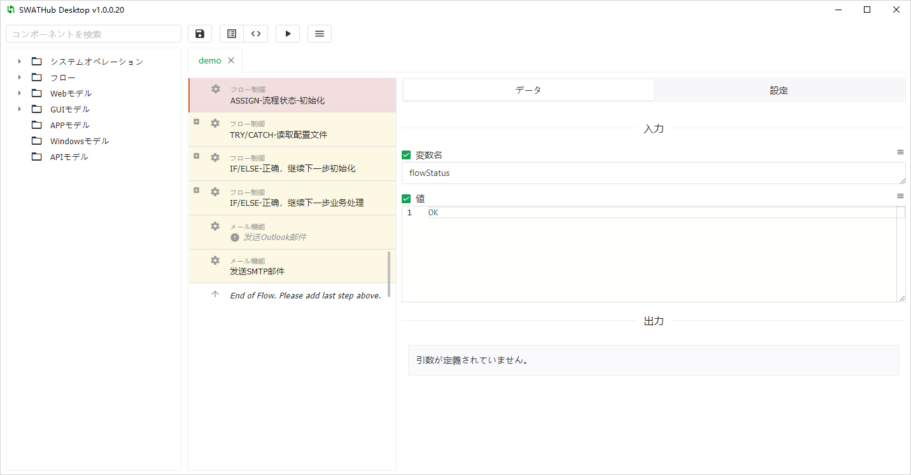
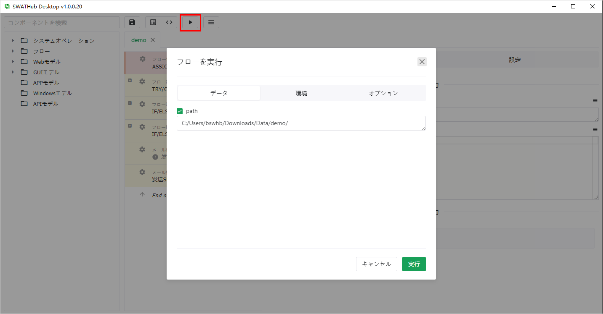

デスクトップフロービルダー
===

SWATHubはデスクトップフローエディターを提供しており、ユーザーはブラウザを開かずにSWATHubサーバーにアクセスせずに、ロボット側でフローの設計、デバッグ、および実行を完了することができます。

インストール設定
---

1. SWATHubデスクトップフローエディターのインストールパッケージをダウンロードするには、デスクトップフローエディターとロボットのダウンロードとインストールを参照してください。 たとえば、 swathub-desktop-v1.0.0-x64.zip
2. SWATHubエディターのインストールパッケージをインストールディレクトリに解凍します。

3. SWATHubのWebページの**ユーザー設定画面**にログインし、**デスクトップアプリケーション**を使用に変更します。

フローの選択
---

1. デスクトップフローエディターで編集する必要のあるSWATHub作業プロジェクトのシナリオまたはフローを選択して、エディター画面に移動します。

2. **デスクトップアプリケーション**を開くと、その作業プロジェクトのシナリオまたはフローの編集操作画面に入ることができます。デスクトップアプリケーションは、同じ作業プロジェクト内の複数のシナリオまたはフローを同時に開くことができます。

フローの構築
---

デスクトップフローエディターの操作画面は、[Web画面](design_scenario)と基本的に同じです。 ユーザーは、左側のコンポーネント選択エリアから、システム操作、フロー操作、およびモデル操作などの各種の操作を、ドラッグアンドドロップで中央のフロー構築エリアに追加し、右側のステップ属性エリアで、必要な入力および出力パラメーターを設定することができます

ユーザーは、ツールバーの<i class = "fa fa-save"></i>ボタンをクリックして、編集した内容を保存することもできます。ツールバーの<i class = "fa fa-list"></i>ボタンまたは<i class = "fa fa-code"></i>ボタンをクリックして、`パラメータモード`または`コードモード`に切り替えることもできます。

フローの実行
---

ユーザーは、ツールバーの<i class = "fa fa-play"></i>ボタンをクリックして、現在設計されているフローを実行できます1。 Web画面と同様に、ポップアップされた実行ダイアログで、ユーザーは対応する入力パラメーター、実行プラットフォーム、および必要なステップオプションを設定する必要があります。注意すべきは、フローの実行時に、シーングループの前/後インターセプター設定、デフォルトのステップオプション、およびその他の実行設定もインポートされる点です。

?> 1. フローの実行には、SWATHubロボットのバージョンv1.8.0以上が必要です。プロジェクトの設計と実行をデスクトップフローエディターで行う場合は、対応するバージョンのロボットクライアントが起動されていることを確認してください。

