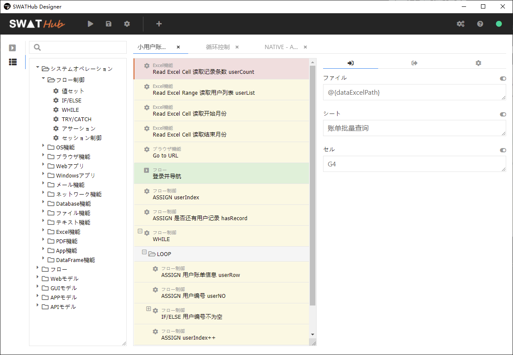
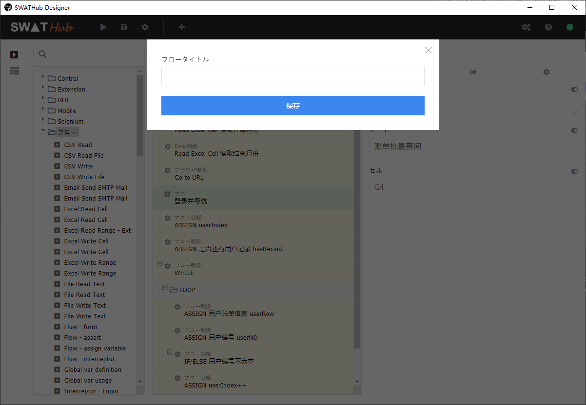
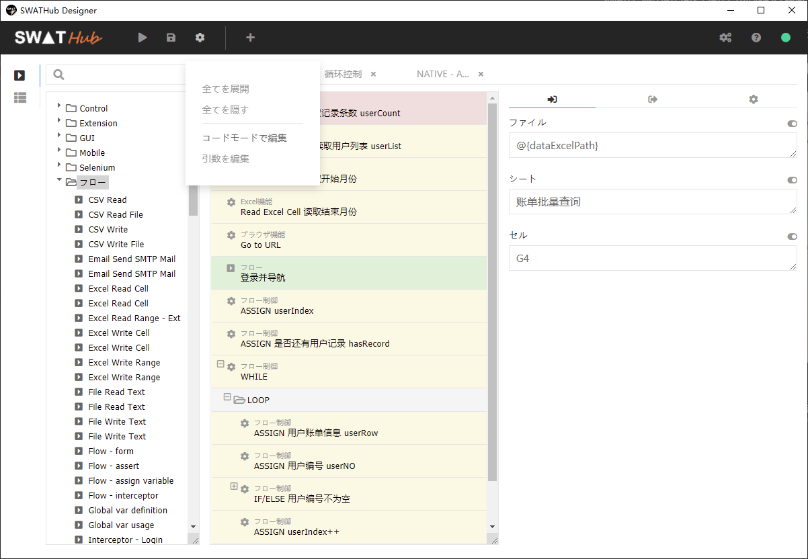
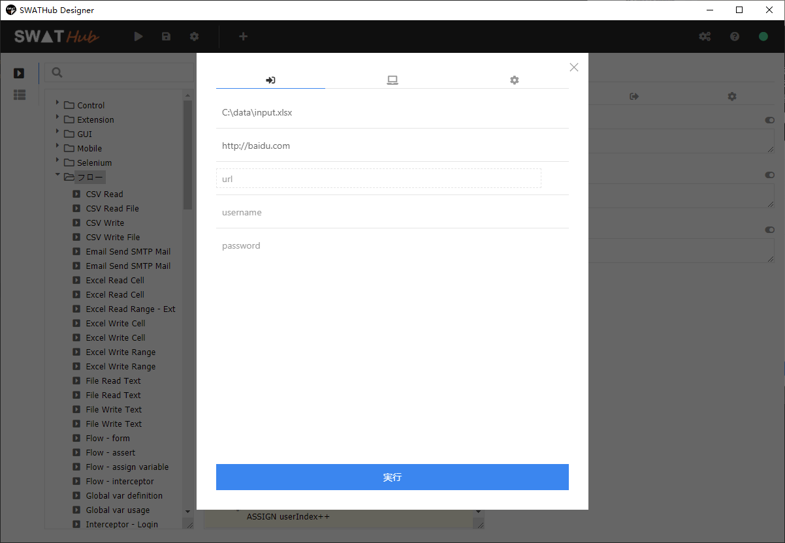

フロービルダー
===

SWATHubサービスの他に、デスクトップアプリのロボットにシナリオとフローを編集するフロービルダーも提要しています。実行端末に直接シナリオやフローを編集や、デバッグなどが可能です。

?> 1. フロービルダーを利用するために、ロボットはオンラインモードになる必要があります。

フロー選択
---

ロボットは正しくワークスペースに接続した状態で、ナビゲーションバーの<i class = "fa fa-pencil-ruler"></i> をクリックして、フローやシナリオを選択するダイアログを開ます。ワークスペースにあるシナリオや、フローを選択して、編集することも可能ですし、新しいシナリオや、フローを作成することも可能です。

フロー組み立て
---

ロボット側のフロービルダーのUIは[SWATHubサービスのフロービルダー](design_scenario)と基本的に同じです。左側のコンポーネントを中央のフロー組み立てエリアにドラッグ＆ドロップして、右側のデータ部に必要なデータを追加しながら、フローを組み立てられます。

また、ツールバーの<i class = "fa fa-cog"></i>のプルダウンメニューから**コードモード**や**引数編集**にアクセスすることが可能です。

フロー実行
---

ツールバーの<i class = "fa fa-play"></i>ボタンで現在設計したフローを速やかに実行することが可能です。実	行ダイアログに必要なデータを記入するところ以外はSWATHubサービスのケース実行と同じ設定になっています。また、シナリオを実行する場合に、所在したシナリオグループの設定、例えばインターセプターとかは実行に影響しますので、ご注意してください。

